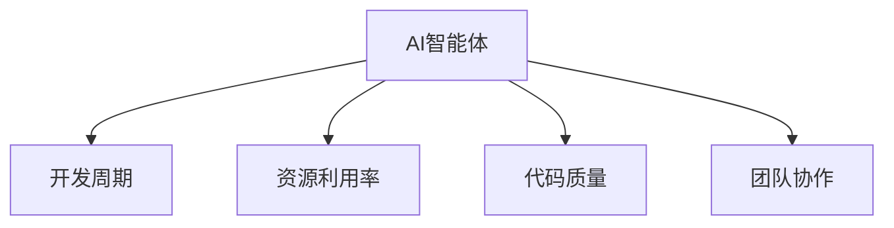
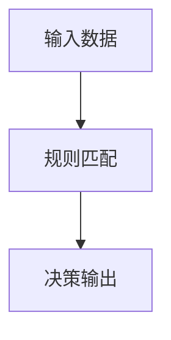
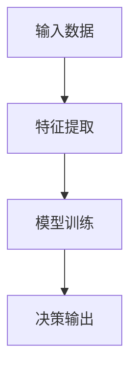
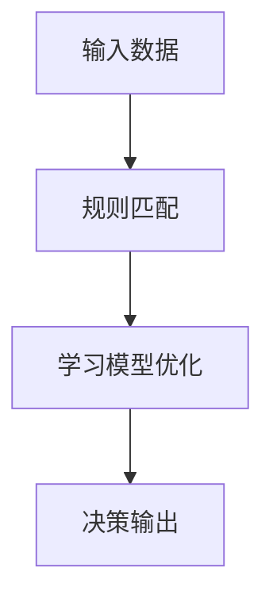
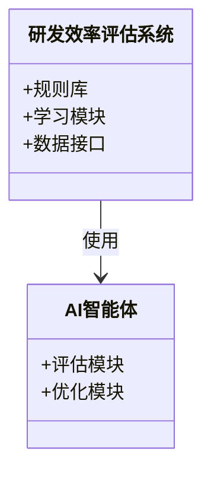
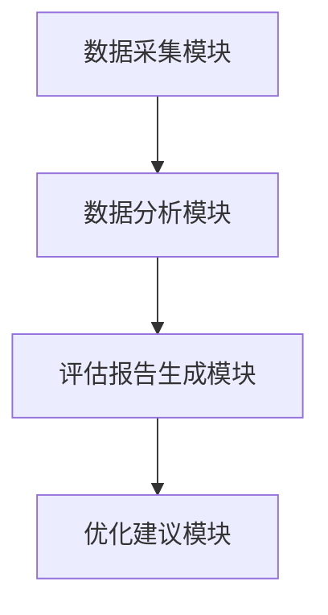
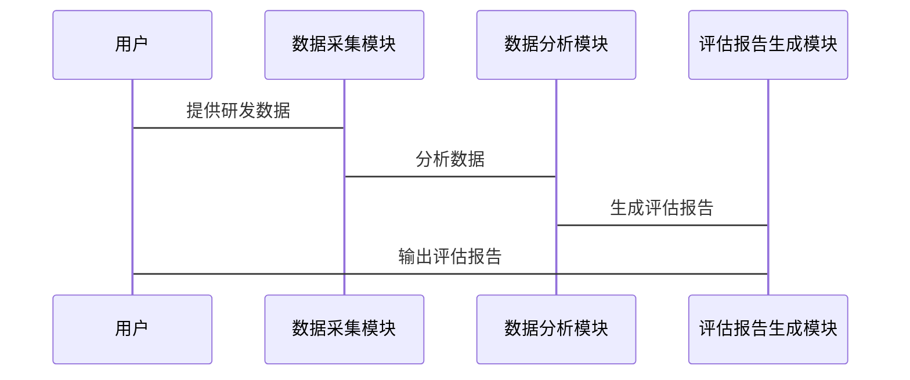

                 


# AI智能体在评估公司研发效率中的作用

> 关键词：AI智能体、研发效率、算法原理、系统架构、项目实战、技术博客

> 摘要：本文详细探讨了AI智能体在公司研发效率评估中的应用。通过分析AI智能体的核心概念、算法原理、系统架构及项目实战，本文为读者提供了从理论到实践的全面解读。结合实际案例和最佳实践，本文旨在帮助公司优化研发效率评估流程。

---

# 第一部分: AI智能体在公司研发效率评估中的背景与基础

# 第1章: AI智能体与研发效率概述

## 1.1 问题背景与问题描述

### 1.1.1 研发效率评估的挑战

现代企业面临着日益复杂的研发效率评估问题。传统的方法依赖人工统计和分析，存在耗时长、准确性低、难以量化等问题。如何在海量数据中提取有价值的信息，并快速生成评估结果，成为企业面临的重要挑战。

此外，研发效率评估需要考虑的因素众多，包括开发周期、资源分配、代码质量、团队协作等。这些因素相互关联，使得评估过程变得更加复杂。

### 1.1.2 AI智能体在研发效率评估中的作用

AI智能体是一种能够自主感知环境、分析数据并做出决策的智能系统。在研发效率评估中，AI智能体可以实时监控研发过程中的关键指标，自动分析数据并生成评估报告。例如，AI智能体可以通过自然语言处理技术分析团队的沟通记录，识别潜在的协作障碍；通过机器学习模型预测项目进度，优化资源分配。

AI智能体的引入能够显著提高评估的准确性和效率，同时降低人工成本。

### 1.1.3 问题的边界与外延

研发效率评估的边界包括研发过程中的具体指标，如代码提交频率、任务完成时间、代码质量等。而外延则涉及企业外部环境，如市场需求变化、行业趋势等。

## 1.2 核心概念与概念结构

### 1.2.1 AI智能体的定义与特征

AI智能体是一种能够感知环境、自主决策并执行任务的智能系统。其核心特征包括：

- **自主性**：能够自主决策，无需人工干预。
- **反应性**：能够实时感知环境变化并做出响应。
- **学习能力**：能够通过数据不断优化自身的决策能力。

### 1.2.2 研发效率评估的核心要素

研发效率评估的核心要素包括：

- **开发周期**：项目从启动到交付的时间。
- **资源利用率**：开发过程中的人力、时间和资金的使用效率。
- **代码质量**：代码的可维护性、可读性和安全性。
- **团队协作**：团队成员之间的沟通效率和协作能力。

### 1.2.3 概念结构与核心要素的联系

通过构建ER实体关系图，我们可以清晰地看到AI智能体如何与研发效率评估的核心要素相互作用。



## 1.3 本章小结

本章介绍了AI智能体在研发效率评估中的重要性，分析了研发效率评估的核心要素，并通过ER图展示了AI智能体与各要素之间的关系。

---

# 第二部分: AI智能体的核心原理与系统架构

# 第2章: AI智能体的核心原理

## 2.1 AI智能体的原理与算法

### 2.1.1 基于规则的AI智能体算法

基于规则的AI智能体通过预定义的规则来决策。例如，当某个指标达到预设阈值时，触发相应的操作。

#### 算法流程



### 2.1.2 基于学习的AI智能体算法

基于学习的AI智能体通过机器学习模型不断优化决策能力。常用的算法包括随机森林、神经网络等。

#### 算法流程



### 2.1.3 混合型AI智能体算法

混合型AI智能体结合了基于规则和基于学习的优点，通过规则和学习模型共同决策。

#### 算法流程



## 2.2 算法原理的数学模型与公式

### 2.2.1 基于规则的算法模型

基于规则的算法模型通过预定义的规则进行决策。例如：

$$ \text{如果 } A > B \text{，则输出 } C $$

### 2.2.2 基于学习的算法模型

基于学习的算法模型通常使用分类或回归模型。例如，线性回归模型：

$$ y = \beta_0 + \beta_1x + \epsilon $$

### 2.2.3 混合型算法模型

混合型算法模型结合了规则和学习模型。例如，先通过规则筛选数据，再通过学习模型进行预测。

## 2.3 算法原理的对比分析

通过对比分析表格，我们可以清晰地看到不同算法的优缺点。

| 算法类型   | 优点                     | 缺点                     |
|------------|--------------------------|--------------------------|
| 基于规则   | 实现简单，可解释性高       | 需要手动维护规则         |
| 基于学习   | 自动优化，适应性强         | 黑箱问题，可解释性差       |
| 混合型      | 结合了规则和学习的优点     | 实现复杂                 |

---

# 第3章: AI智能体的系统架构

## 3.1 系统功能设计

### 3.1.1 领域模型设计

领域模型设计是系统功能设计的基础。通过构建领域模型，我们可以清晰地看到系统的各个功能模块及其之间的关系。



### 3.1.2 功能模块设计

功能模块设计包括数据采集、数据分析、评估报告生成等模块。

## 3.2 系统架构设计

### 3.2.1 系统架构图

系统架构图展示了各个模块之间的关系。



## 3.3 系统接口设计

系统接口设计包括数据输入接口、评估结果输出接口等。

## 3.4 系统交互设计

系统交互设计通过序列图展示了用户与系统的交互过程。



---

# 第三部分: AI智能体的项目实战

# 第4章: 项目实战

## 4.1 项目背景与目标

本项目旨在通过AI智能体评估某公司的研发效率，优化资源配置。

## 4.2 项目环境与工具

项目环境包括Python编程语言、TensorFlow机器学习框架、Jupyter Notebook等。

## 4.3 项目核心实现

### 4.3.1 数据采集模块

```python
def collect_data():
    # 从数据库中采集数据
    pass
```

### 4.3.2 数据分析模块

```python
def analyze_data():
    # 使用机器学习模型进行数据分析
    pass
```

### 4.3.3 评估报告生成模块

```python
def generate_report():
    # 生成评估报告
    pass
```

## 4.4 项目小结

通过本项目，我们验证了AI智能体在研发效率评估中的有效性，并提出了优化建议。

---

# 第四部分: 总结与展望

# 第5章: 总结

## 5.1 本章小结

本文详细探讨了AI智能体在公司研发效率评估中的应用，从理论到实践，为读者提供了全面的解读。

## 5.2 未来展望

未来，随着AI技术的不断发展，AI智能体在研发效率评估中的应用将更加广泛和深入。

---

# 作者

作者：AI天才研究院/AI Genius Institute & 禅与计算机程序设计艺术 /Zen And The Art of Computer Programming

