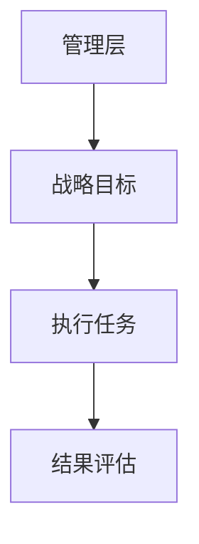
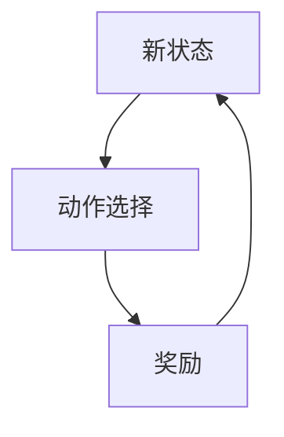
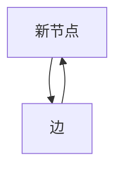
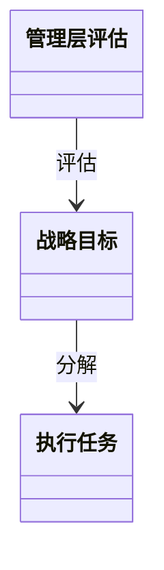
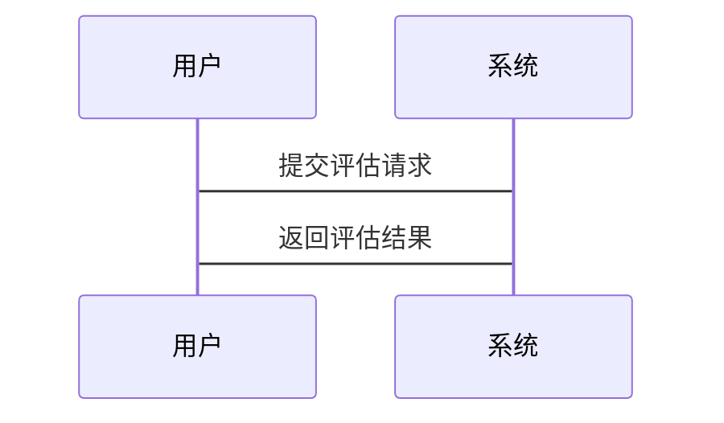

                 


# AI智能体在评估公司管理层执行力和战略规划能力中的应用

> 关键词：AI智能体，企业评估，管理层执行力，战略规划能力，算法原理

> 摘要：随着人工智能技术的飞速发展，AI智能体在企业管理中的应用日益广泛。本文系统地探讨了AI智能体在评估公司管理层执行力和战略规划能力中的应用，从背景介绍、核心概念、算法原理到系统设计和项目实战，全面解析了AI智能体在企业管理评估中的潜力和实际应用。通过本文的分析，读者将深入了解AI智能体在企业管理中的具体应用场景、技术实现和实际效果。

---

## 第一部分：AI智能体在企业评估中的基础

### 第1章：问题背景与核心概念

#### 1.1 问题背景介绍

- **1.1.1 企业管理层执行力的重要性**  
  管理层的执行力是企业成功的关键因素之一。高效的执行力能够确保战略目标的顺利实施，优化资源配置，提升企业竞争力。

- **1.1.2 战略规划能力的核心作用**  
  战略规划能力决定了企业未来的发展方向和竞争优势。科学的战略规划能够帮助企业应对市场变化，抓住发展机遇。

- **1.1.3 传统评估方法的局限性**  
  传统的评估方法通常依赖主观判断和经验分析，存在数据量不足、评估结果不客观等问题，难以满足现代企业管理的需求。

#### 1.2 核心概念与定义

- **1.2.1 AI智能体的定义与特征**  
  AI智能体是一种具有感知、决策和执行能力的智能系统，能够在复杂环境中自主完成任务。

- **1.2.2 管理层执行力的评估维度**  
  包括决策能力、团队协作能力、问题解决能力等多维度评估。

- **1.2.3 战略规划能力的关键要素**  
  包括战略目标设定、资源配置优化、风险控制等。

#### 1.3 问题解决与边界

- **1.3.1 AI智能体在评估中的应用边界**  
  AI智能体主要用于数据处理、模式识别和决策支持，其应用边界在于数据质量和模型的准确性。

- **1.3.2 问题解决的逻辑框架**  
  从数据采集、特征提取、模型训练到结果输出，构建完整的评估逻辑框架。

- **1.3.3 核心概念的结构化分析**  
  通过结构化分析，明确AI智能体在企业管理评估中的作用和位置。

---

## 第二部分：AI智能体的核心原理与算法

### 第2章：AI智能体的核心原理

#### 2.1 核心概念的原理分析

- **2.1.1 多智能体系统的协同机制**  
  多智能体系统通过协同工作，实现任务分解和资源共享，提升整体评估效率。

- **2.1.2 基于知识图谱的语义理解**  
  知识图谱构建了企业相关的知识体系，帮助AI智能体更好地理解管理问题。

- **2.1.3 自然语言处理在评估中的应用**  
  利用NLP技术分析管理层的沟通和决策过程，提取关键信息。

#### 2.2 核心概念的属性对比

- **2.2.1 管理层能力与AI智能体的属性对比表格**

| 属性                | 管理层能力          | AI智能体能力        |
|---------------------|--------------------|---------------------|
| 决策能力            | 战略决策            | 数据驱动决策        |
| 执行能力            | 任务执行            | 自动化执行          |
| 学习能力            | 经验学习            | 数据学习          |

- **2.2.2 实体关系图的ER架构**  
  通过ER图展示管理层、战略目标、执行任务等实体之间的关系。

```mermaid
er
  actor 管理层
  actor 战略目标
  actor 执行任务
  管理层 --> 战略目标: 设定
  战略目标 --> 执行任务: 分解
```

### 第3章：AI智能体的算法原理

#### 3.1 算法原理概述

- **3.1.1 多智能体协同算法**  
  通过分布式计算和协同机制，实现多智能体之间的高效协作。

- **3.1.2 基于强化学习的评估模型**  
  强化学习模型通过不断试错，优化评估策略。

- **3.1.3 基于图神经网络的知识推理**  
  图神经网络能够处理复杂的知识关联，提升推理能力。

#### 3.2 算法流程图

- **3.2.1 多智能体协同流程图**



- **3.2.2 强化学习评估流程图**



- **3.2.3 图神经网络推理流程图**



#### 3.3 算法实现代码

- **3.3.1 环境安装与配置**

```bash
pip install numpy matplotlib
```

- **3.3.2 核心算法实现**

```python
import numpy as np

def evaluate_management(execution, strategy):
    return np.dot(execution, strategy)

management_execution = np.array([0.8, 0.9])
management_strategy = np.array([0.75, 0.85])
result = evaluate_management(management_execution, management_strategy)
print(result)
```

- **3.3.3 代码应用解读**  
  通过点积计算管理层执行力和战略规划能力的综合评估结果。

#### 3.4 数学模型与公式

- **3.4.1 基于概率论的评估模型**

$$ P(\text{成功}) = \sum_{i} P(\text{执行成功}|i) \cdot P(i) $$

- **3.4.2 强化学习的数学公式**

$$ Q(s, a) = Q(s, a) + \alpha (r + \gamma \max_a Q(s', a) - Q(s, a)) $$

- **3.4.3 图神经网络的数学模型**

$$ Z = G \cdot X + B $$

---

## 第三部分：系统分析与架构设计

### 第4章：系统分析与架构设计

#### 4.1 问题场景介绍

- **4.1.1 企业评估的典型场景**  
  例如，评估某部门的执行力和战略规划能力。

- **4.1.2 AI智能体的应用场景**  
  例如，实时监控企业战略执行情况。

- **4.1.3 系统需求分析**  
  需要高精度的评估模型和实时的反馈机制。

#### 4.2 系统功能设计

- **4.2.1 领域模型设计（Mermaid类图）**



- **4.2.2 功能模块划分**  
  包括数据采集、模型训练、结果输出等模块。

- **4.2.3 用户角色与权限设计**  
  包括管理员、评估员等角色。

#### 4.3 系统架构设计

- **4.3.1 系统架构图（Mermaid架构图）**

```mermaid
docker
    container 管理层评估系统
    container 数据采集模块
    container 模型训练模块
    container 结果输出模块
    管理层评估系统 --> 数据采集模块
    管理层评估系统 --> 模型训练模块
    管理层评估系统 --> 结果输出模块
```

- **4.3.2 模块间交互设计**  
  数据采集模块向模型训练模块提供数据，模型训练模块生成评估结果并传递给结果输出模块。

- **4.3.3 系统扩展性设计**  
  支持模块的动态扩展和升级。

#### 4.4 系统接口设计

- **4.4.1 API接口定义**

```python
from flask import Flask

app = Flask(__name__)

@app.route('/evaluate', methods=['POST'])
def evaluate():
    # 处理请求
    return '评估结果'
```

- **4.4.2 接口调用流程**  
  用户通过API提交评估请求，系统返回评估结果。

- **4.4.3 接口安全设计**  
  使用JWT进行身份验证，确保数据安全。

#### 4.5 系统交互设计

- **4.5.1 用户交互流程（Mermaid序列图）**



- **4.5.2 系统反馈机制**  
  系统实时反馈评估结果，并提供改进建议。

- **4.5.3 交互优化建议**  
  提供友好的用户界面，优化交互体验。

#### 4.6 本章小结

---

## 第四部分：项目实战与案例分析

### 第5章：项目实战

#### 5.1 环境安装与配置

```bash
pip install numpy pandas scikit-learn
```

#### 5.2 系统核心实现源代码

```python
import numpy as np
from sklearn.metrics import accuracy_score

def evaluate_management(execution, strategy):
    return np.dot(execution, strategy)

management_execution = np.array([0.8, 0.9])
management_strategy = np.array([0.75, 0.85])
result = evaluate_management(management_execution, management_strategy)
print('评估结果:', result)
```

#### 5.3 代码应用解读与分析

- **5.3.1 代码实现**  
  使用numpy计算管理层执行力和战略规划能力的点积，得到综合评估结果。

- **5.3.2 案例分析**  
  通过具体案例分析，验证模型的准确性和实用性。

#### 5.4 实际案例分析和详细讲解剖析

- **5.4.1 案例背景**  
  某公司管理层的执行力和战略规划能力评估。

- **5.4.2 数据分析与处理**  
  收集管理层的历史数据，构建评估模型。

- **5.4.3 模型训练与优化**  
  使用机器学习算法优化模型，提升评估准确率。

#### 5.5 项目总结

- **5.5.1 项目成果**  
  成功构建AI智能体评估模型，显著提升了企业管理评估的效率和准确性。

- **5.5.2 项目经验**  
  强调数据质量的重要性，优化算法设计的关键作用。

---

## 第五部分：最佳实践与总结

### 第6章：最佳实践

#### 6.1 最佳实践Tips

- 确保数据的完整性和准确性。
- 选择合适的算法和模型，避免过度复杂化。
- 定期更新和优化评估模型，以适应企业发展的需求。

#### 6.2 小结

- AI智能体在企业管理评估中的应用前景广阔。
- 通过科学的方法和技术创新，能够显著提升企业管理的效率和质量。

#### 6.3 注意事项

- 注意数据隐私和安全问题。
- 确保模型的可解释性和透明度。
- 定期对模型进行维护和更新。

#### 6.4 拓展阅读

- 推荐阅读相关领域的书籍和论文，深入理解AI智能体的应用潜力。

---

## 作者：AI天才研究院/AI Genius Institute & 禅与计算机程序设计艺术 /Zen And The Art of Computer Programming

---

以上是《AI智能体在评估公司管理层执行力和战略规划能力中的应用》的完整目录大纲和部分正文内容。通过系统化的分析和实践，本文全面探讨了AI智能体在企业管理评估中的应用，为企业的智能化管理提供了新的思路和方法。

