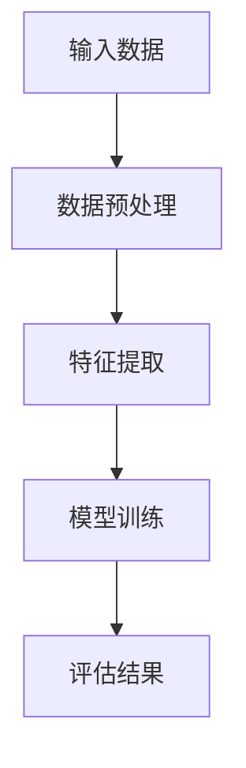
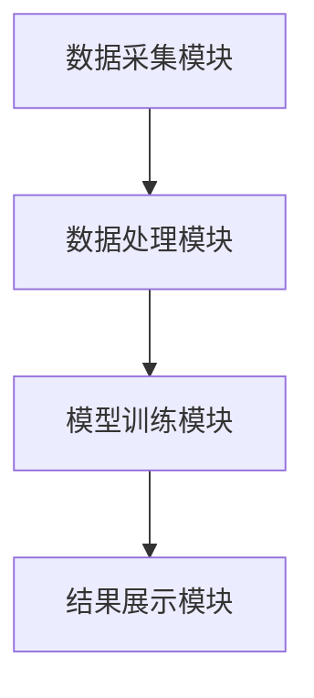
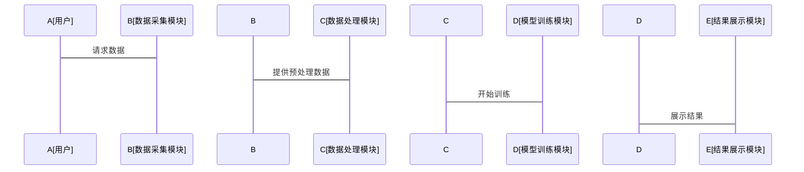

                 


# AI智能体在评估公司长期盈利能力和增长潜力中的应用

## 关键词：AI智能体、财务评估、长期盈利能力、公司增长潜力、机器学习、数据分析、智能预测

## 摘要：  
本文探讨AI智能体在评估公司长期盈利能力和增长潜力中的应用，通过分析传统财务评估方法的局限性，介绍AI智能体的核心概念、算法原理、系统架构及项目实战，展示其在提升财务分析效率和准确性方面的优势。结合实际案例，总结AI智能体在财务评估中的最佳实践和未来发展方向。

---

## 第一部分: AI智能体在公司财务评估中的应用背景

### 第1章: 问题背景与核心概念

#### 1.1 问题背景
##### 1.1.1 公司长期盈利能力与增长潜力的重要性
公司在市场中的生存与发展离不开持续的盈利能力。传统财务指标如净利润率、ROE（净资产收益率）等只能反映短期表现，而公司未来的盈利能力受市场环境、管理决策、技术创新等多方面因素影响。企业需要更全面的方法来评估长期盈利能力。增长潜力是衡量公司能否在市场中持续扩张的关键指标，涉及市场份额、产品创新、成本控制等因素。

##### 1.1.2 传统财务评估方法的局限性
传统财务分析方法依赖财务报表数据，如利润表、资产负债表和现金流量表，主要基于历史数据进行分析，难以预测未来趋势。这种方法往往忽视了非财务因素（如市场趋势、竞争环境）对公司的潜在影响，也无法实时更新分析结果。此外，传统方法通常需要大量人工参与，效率较低。

##### 1.1.3 AI智能体在财务评估中的应用必要性
AI智能体能够处理大量非结构化数据，如新闻、社交媒体评论和行业报告，通过自然语言处理（NLP）提取相关信息，从而提供更全面的分析。AI智能体还能实时更新分析结果，帮助公司及时应对市场变化。此外，AI技术可以提高预测的准确性，为管理层提供更可靠的决策支持。

#### 1.2 AI智能体的定义与特点
##### 1.2.1 AI智能体的核心定义
AI智能体是一种能够感知环境、处理信息并采取行动的智能系统。在财务评估中，AI智能体通过收集和分析多源数据，生成对公司盈利能力和发展潜力的评估结果。

##### 1.2.2 AI智能体的关键属性特征
- **实时性**：能够实时获取和分析数据，提供最新的评估结果。
- **适应性**：能够根据市场变化自动调整分析模型。
- **多维度分析**：结合财务和非财务数据，进行综合评估。

##### 1.2.3 AI智能体与传统财务分析工具的对比
| 特性 | 传统财务分析工具 | AI智能体 |
|------|------------------|----------|
| 数据来源 | 财务报表为主     | 多源数据 |
| 分析深度 | 单维度分析为主   | 多维度分析 |
| 分析效率 | 低效             | 高效     |

#### 1.3 AI智能体在公司评估中的应用范围
##### 1.3.1 长期盈利能力的评估维度
- 市场需求预测
- 成本控制能力
- 产品生命周期

##### 1.3.2 公司增长潜力的关键指标
- 市场份额
- 研发投入
- 管理团队稳定性

##### 1.3.3 AI智能体在评估中的边界与外延
AI智能体的评估结果依赖于数据质量和模型准确性，因此需要谨慎处理边界条件，如数据缺失或模型偏差。

#### 1.4 本章小结
本章介绍了公司长期盈利能力和增长潜力的重要性，分析了传统财务评估方法的局限性，并详细阐述了AI智能体的核心概念和特点，为后续章节的深入分析奠定了基础。

---

## 第二部分: AI智能体的核心原理与算法

### 第2章: AI智能体的核心概念与原理

#### 2.1 AI智能体的结构与功能
##### 2.1.1 输入模块: 数据获取与预处理
AI智能体需要整合多源数据，包括财务数据、市场数据、行业报告等。预处理步骤包括数据清洗和特征提取。

##### 2.1.2 处理模块: 智能体的分析逻辑
AI智能体通过机器学习模型（如随机森林、神经网络）对数据进行分析，生成评估结果。

##### 2.1.3 输出模块: 评估结果与反馈机制
评估结果以可视化形式呈现，并通过反馈机制优化模型。

#### 2.2 AI智能体与传统财务分析的结合
##### 2.2.1 数据来源的对比
AI智能体结合了财务数据和非财务数据，提供更全面的分析。

##### 2.2.2 分析逻辑的差异
AI智能体能够处理非结构化数据，提供更精准的预测。

##### 2.2.3 结果呈现的融合方式
将AI分析结果与传统财务指标相结合，提供综合评估。

#### 2.3 AI智能体的核心算法原理
##### 2.3.1 算法流程图



##### 2.3.2 机器学习模型
随机森林和神经网络是常用的模型。

##### 2.3.3 深度学习模型
使用神经网络进行复杂模式识别。

#### 2.4 核心概念属性对比表

| 属性 | 传统财务分析 | AI智能体分析 |
|------|--------------|-------------|
| 数据来源 | 财务报表为主 | 多维度数据 |
| 分析深度 | 定量分析为主 | 定量+定性分析 |
| 结果呈现 | 单维度指标 | 多维度综合评估 |

#### 2.5 本章小结
本章详细阐述了AI智能体的结构、功能和算法原理，展示了其在财务评估中的优势。

---

## 第三部分: AI智能体的数学模型与算法实现

### 第3章: AI智能体的数学模型

#### 3.1 评估模型的构建
##### 3.1.1 回归分析模型
用于预测公司未来盈利能力。

##### 3.1.2 机器学习模型
随机森林用于分类，神经网络用于回归。

##### 3.1.3 深度学习模型
使用LSTM进行时间序列分析。

#### 3.2 数学模型公式
##### 3.2.1 回归分析公式
$$ y = \beta_0 + \beta_1x_1 + \beta_2x_2 + ... + \beta_nx_n + \epsilon $$

##### 3.2.2 机器学习模型公式
$$ f(x) = \sum_{i=1}^{n} w_i x_i + b $$

##### 3.2.3 深度学习模型公式
$$ f(x) = \sigma(w x + b) $$

#### 3.3 算法实现流程
##### 3.3.1 数据预处理
处理缺失值和异常值。

##### 3.3.2 特征工程
提取关键特征。

##### 3.3.3 模型训练
训练机器学习或深度学习模型。

##### 3.3.4 模型调优
优化超参数。

#### 3.4 本章小结
本章详细介绍了AI智能体的数学模型和算法实现，为后续章节的系统设计奠定了基础。

---

## 第四部分: 系统架构与项目实战

### 第4章: 系统架构设计

#### 4.1 系统模块划分
##### 4.1.1 数据采集模块
从多源数据中获取信息。

##### 4.1.2 数据处理模块
清洗和预处理数据。

##### 4.1.3 模型训练模块
训练机器学习模型。

##### 4.1.4 结果展示模块
以可视化形式呈现评估结果。

#### 4.2 系统架构图



#### 4.3 系统接口设计
##### 4.3.1 数据接口
定义数据输入格式。

##### 4.3.2 模型接口
定义模型调用接口。

#### 4.4 系统交互流程



#### 4.5 本章小结
本章详细描述了系统的架构设计和接口设计，为项目的实施提供了指导。

---

## 第五部分: 项目实战

### 第5章: 项目实战

#### 5.1 项目介绍
本项目旨在开发一个AI智能体，评估公司长期盈利能力和增长潜力。

#### 5.2 环境搭建
安装Python、TensorFlow、Scikit-learn等工具。

#### 5.3 核心实现代码
##### 5.3.1 数据预处理

```python
import pandas as pd
data = pd.read_csv('company_data.csv')
data = data.dropna()
```

##### 5.3.2 特征工程

```python
from sklearn.preprocessing import StandardScaler
scaler = StandardScaler()
X_scaled = scaler.fit_transform(X)
```

##### 5.3.3 模型训练

```python
from sklearn.ensemble import RandomForestRegressor
model = RandomForestRegressor()
model.fit(X_scaled, y)
```

##### 5.3.4 结果分析

```python
importances = model.feature_importances_
print(importances)
```

#### 5.4 案例分析
以某公司为例，展示AI智能体的评估结果。

#### 5.5 本章小结
本章通过实际案例展示了AI智能体的实现过程和应用效果。

---

## 第六部分: 总结与展望

### 第6章: 总结与展望

#### 6.1 总结
AI智能体在公司长期盈利能力和发展潜力评估中具有显著优势，能够提高分析效率和准确性。

#### 6.2 注意事项
模型的准确性和数据质量密切相关，需要谨慎处理数据偏差。

#### 6.3 未来展望
未来可以结合区块链技术，提高数据可信度，或者开发更复杂的模型，如强化学习。

#### 6.4 本章小结
本章总结了AI智能体的应用价值，并展望了未来的发展方向。

---

## 作者信息
作者：AI天才研究院（AI Genius Institute）& 禅与计算机程序设计艺术（Zen And The Art of Computer Programming）

---

通过以上结构，文章详细阐述了AI智能体在公司长期盈利能力和增长潜力评估中的应用，从背景、原理、系统架构到项目实战，为读者提供了全面的技术指导。

