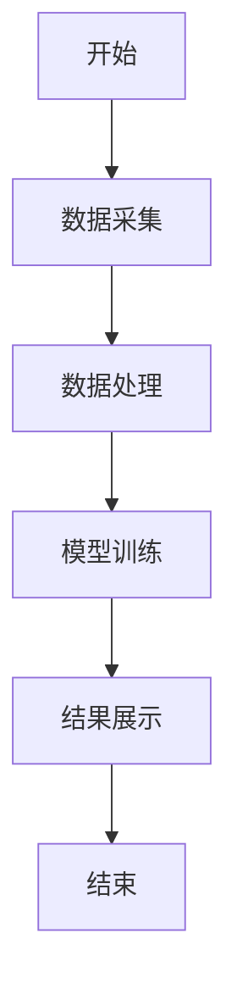
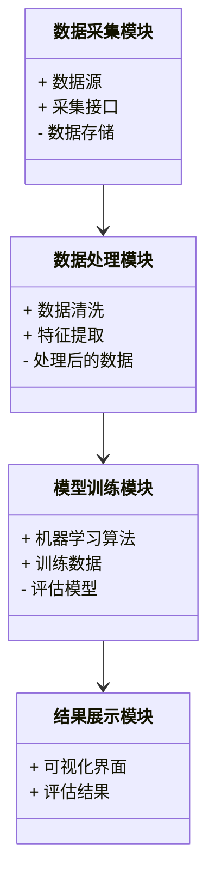
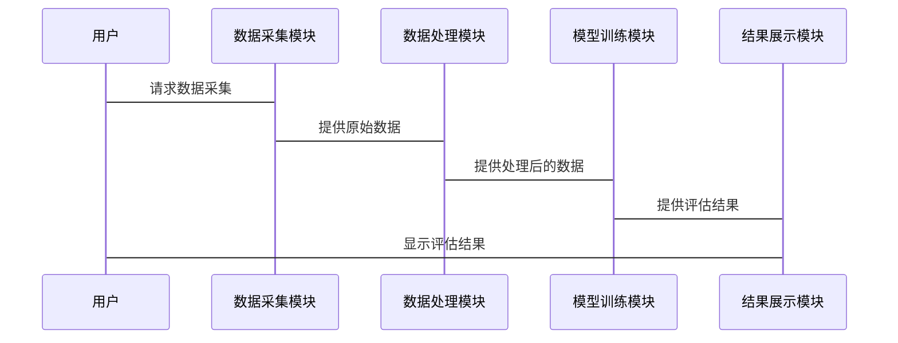

                 


# AI智能体在评估品牌价值中的作用

> 关键词：AI智能体，品牌价值，数据驱动，机器学习，评估模型，系统架构

> 摘要：本文探讨了AI智能体在品牌价值评估中的应用，分析了其核心概念、算法原理、系统架构，并通过实际案例展示了其在品牌价值评估中的优势和潜力。文章旨在为读者提供全面的技术视角，帮助他们理解AI智能体如何提升品牌价值评估的效率和准确性。

---

# 第1章: AI智能体与品牌价值评估的背景

## 1.1 AI智能体的基本概念

### 1.1.1 AI智能体的定义与特点

AI智能体（Artificial Intelligence Agents，简称AI agents）是指具有感知环境、自主决策和执行任务能力的智能系统。与传统程序不同，AI智能体能够通过传感器获取信息，利用算法进行分析，并根据结果采取行动。其特点包括：

- **自主性**：能够独立决策和行动。
- **反应性**：能够实时感知环境变化并做出反应。
- **学习能力**：通过数据和经验不断优化自身性能。
- **社交能力**：能够与其他智能体或人类进行交互。

### 1.1.2 AI智能体的核心技术原理

AI智能体的核心技术包括：

- **感知**：通过传感器或数据接口获取环境信息。
- **推理**：利用算法对获取的信息进行分析和处理。
- **决策**：基于推理结果做出最优选择。
- **执行**：通过执行机构或输出接口采取行动。

### 1.1.3 AI智能体与传统数据分析的区别

AI智能体不仅能够处理数据，还能根据数据做出决策并执行任务。与传统数据分析不同，AI智能体具备以下优势：

- **自动化**：能够自动完成数据处理和分析任务。
- **实时性**：能够在实时环境中做出快速反应。
- **自适应性**：能够根据环境变化调整自身行为。

## 1.2 品牌价值评估的基本概念

### 1.2.1 品牌价值的定义与构成

品牌价值是指品牌在市场上的影响力和盈利能力。其构成包括：

- **品牌知名度**：品牌被消费者认知的程度。
- **品牌美誉度**：消费者对品牌的满意度和信任度。
- **品牌忠诚度**：消费者对品牌的偏好和忠诚程度。

### 1.2.2 品牌价值评估的常见方法

常见的品牌价值评估方法包括：

- **市场法**：通过市场交易数据评估品牌价值。
- **成本法**：基于品牌建设成本评估品牌价值。
- **收益法**：通过预测品牌带来的收益评估其价值。

### 1.2.3 品牌价值评估的挑战与难点

品牌价值评估的难点包括：

- **数据获取难度**：品牌相关信息分散且难以获取。
- **数据复杂性**：品牌价值受多种因素影响，数据处理复杂。
- **动态变化**：品牌价值受市场环境变化影响较大。

## 1.3 AI智能体在品牌价值评估中的作用

### 1.3.1 AI智能体在品牌价值评估中的优势

AI智能体在品牌价值评估中的优势包括：

- **高效性**：能够快速处理大量数据。
- **准确性**：通过机器学习算法提高评估结果的准确性。
- **实时性**：能够实时跟踪品牌表现并做出反应。

### 1.3.2 AI智能体如何提升品牌价值评估的效率

AI智能体通过以下方式提升品牌价值评估的效率：

- **自动化数据处理**：自动收集和整理品牌相关信息。
- **智能分析**：利用机器学习算法快速分析数据并生成评估结果。
- **实时监控**：实时跟踪品牌在市场中的表现。

### 1.3.3 AI智能体在品牌价值评估中的应用场景

AI智能体在品牌价值评估中的应用场景包括：

- **品牌监测**：实时监控品牌在社交媒体和新闻中的提及情况。
- **竞争对手分析**：分析竞争对手的品牌策略和市场表现。
- **客户洞察**：通过分析客户行为数据，优化品牌定位和营销策略。

## 1.4 本章小结

本章介绍了AI智能体的基本概念和品牌价值评估的核心要素，分析了AI智能体在品牌价值评估中的优势和应用场景，为后续章节的深入探讨奠定了基础。

---

# 第2章: AI智能体与品牌价值评估的核心概念

## 2.1 AI智能体的核心概念

### 2.1.1 AI智能体的组成与功能

AI智能体通常由以下几个部分组成：

- **感知模块**：负责获取环境信息。
- **推理模块**：负责对信息进行分析和处理。
- **决策模块**：基于推理结果做出决策。
- **执行模块**：负责执行决策并输出结果。

### 2.1.2 AI智能体的决策机制

AI智能体的决策机制包括：

- **基于规则的决策**：根据预设规则做出决策。
- **基于机器学习的决策**：通过训练模型进行预测和决策。
- **基于强化学习的决策**：通过试错和奖励机制优化决策。

### 2.1.3 AI智能体的学习与优化能力

AI智能体通过以下方式不断优化自身性能：

- **监督学习**：通过标记数据进行训练。
- **无监督学习**：通过聚类分析等方法发现数据中的规律。
- **强化学习**：通过与环境交互获得奖励，优化决策策略。

## 2.2 品牌价值评估的核心要素

### 2.2.1 品牌知名度的评估

品牌知名度的评估指标包括：

- **市场占有率**：品牌在市场中的份额。
- **品牌曝光率**：品牌在媒体和网络上的提及次数。
- **品牌认知度**：消费者对品牌的熟悉程度。

### 2.2.2 品牌美誉度的评估

品牌美誉度的评估指标包括：

- **客户满意度**：客户对品牌的满意度调查。
- **社交媒体情感分析**：通过社交媒体上的评论分析品牌情感倾向。
- **媒体评价**：品牌在主流媒体上的评价。

### 2.2.3 品牌忠诚度的评估

品牌忠诚度的评估指标包括：

- **重复购买率**：客户购买同一品牌产品的频率。
- **客户保留率**：客户继续购买同一品牌产品的比例。
- **品牌推荐度**：客户推荐品牌给他人的情况。

## 2.3 AI智能体与品牌价值评估的关联

### 2.3.1 数据驱动的品牌价值评估

AI智能体通过收集和分析大量数据，实现数据驱动的品牌价值评估。

### 2.3.2 AI智能体在品牌价值评估中的数据处理能力

AI智能体能够处理结构化和非结构化数据，包括文本、图像和视频等。

### 2.3.3 AI智能体在品牌价值评估中的预测能力

AI智能体通过机器学习算法，能够预测品牌未来的市场表现和价值变化。

## 2.4 本章小结

本章深入探讨了AI智能体的核心概念及其在品牌价值评估中的应用，分析了品牌价值评估的关键要素和AI智能体的优势，为后续章节提供了理论基础。

---

# 第3章: AI智能体在品牌价值评估中的算法原理

## 3.1 AI智能体的算法概述

### 3.1.1 常见的AI智能体算法类型

常见的AI智能体算法类型包括：

- **基于规则的智能体**：通过预设规则进行决策。
- **基于机器学习的智能体**：利用机器学习模型进行预测和决策。
- **基于强化学习的智能体**：通过试错和奖励机制优化决策。

### 3.1.2 AI智能体算法的核心流程

AI智能体算法的核心流程包括：

1. **数据获取**：通过传感器或接口获取环境信息。
2. **数据处理**：对获取的数据进行预处理和特征提取。
3. **模型训练**：利用训练数据训练机器学习模型。
4. **决策推理**：基于模型输出结果进行决策。
5. **执行行动**：根据决策结果执行相应动作。

### 3.1.3 AI智能体算法的优缺点对比

| 特性 | 基于规则的智能体 | 基于机器学习的智能体 | 基于强化学习的智能体 |
|------|------------------|-----------------------|-----------------------|
| 优点 | 实现简单，易于控制 | 高准确性，适应性强 | 自适应性强，适合复杂环境 |
| 缺点 | 灵活性差，难以应对复杂变化 | 训练时间长，需要大量数据 | 学习过程慢，初期表现不佳 |

## 3.2 品牌价值评估的算法原理

### 3.2.1 数据预处理与特征提取

数据预处理包括：

- **数据清洗**：去除噪声数据和异常值。
- **数据转换**：将数据转换为适合模型输入的格式。
- **特征提取**：从数据中提取有助于模型预测的关键特征。

### 3.2.2 品牌价值评估的回归模型

回归模型用于预测品牌价值的连续值。常用的回归模型包括：

- **线性回归**：假设变量之间的线性关系，公式为：
  $$ y = \beta_0 + \beta_1 x_1 + \beta_2 x_2 + \ldots + \beta_n x_n + \epsilon $$
- **支持向量回归**：通过构建支持向量机模型进行回归预测。

### 3.2.3 品牌价值评估的分类模型

分类模型用于将品牌分为不同的类别，例如高价值品牌和低价值品牌。常用的分类模型包括：

- **K近邻分类器**：通过计算样本之间的距离进行分类。
- **决策树分类器**：通过构建决策树进行分类。
- **随机森林分类器**：通过集成多个决策树模型进行分类。

## 3.3 AI智能体算法在品牌价值评估中的应用

### 3.3.1 基于机器学习的品牌价值评估

机器学习模型可以用于品牌价值的预测和评估。例如，利用随机森林模型对品牌进行分类。

### 3.3.2 基于深度学习的品牌价值评估

深度学习模型，如神经网络，可以用于处理复杂的非结构化数据，例如自然语言文本。

### 3.3.3 基于强化学习的品牌价值评估

强化学习模型可以通过试错和奖励机制优化品牌价值评估策略。

## 3.4 本章小结

本章详细介绍了AI智能体在品牌价值评估中的算法原理，分析了不同算法的优势和应用场景，为后续章节的系统设计提供了技术支持。

---

# 第4章: 品牌价值评估的数学模型与公式

## 4.1 数据特征提取的数学模型

### 4.1.1 特征选择的数学方法

特征选择的数学方法包括：

- **基于统计的方法**：如卡方检验、互信息等。
- **基于机器学习的方法**：如Lasso回归、随机森林特征重要性等。

### 4.1.2 特征权重的计算方法

特征权重的计算方法包括：

- **线性模型系数**：在线性回归模型中，特征的权重即为模型系数。
- **非线性模型**：如在支持向量机中，特征权重可以通过模型参数计算。

### 4.1.3 特征降维的数学模型

特征降维的数学模型包括：

- **主成分分析（PCA）**：通过线性变换将数据降维。
- **t-SNE**：通过非线性变换将数据降维。

## 4.2 品牌价值评估的回归模型

### 4.2.1 线性回归模型

线性回归模型的公式为：
$$ y = \beta_0 + \beta_1 x_1 + \beta_2 x_2 + \ldots + \beta_n x_n + \epsilon $$

### 4.2.2 逻辑回归模型

逻辑回归模型的公式为：
$$ P(y=1|x) = \frac{1}{1 + e^{- (w \cdot x + b)}} $$

### 4.2.3 支持向量回归模型

支持向量回归模型通过构建支持向量机进行回归预测。

## 4.3 品牌价值评估的分类模型

### 4.3.1 K近邻分类器

K近邻分类器的公式为：
$$ y = \arg\min_{i} \sum_{j=1}^{n} (x_j - x'_j)^2 $$

### 4.3.2 决策树分类器

决策树分类器通过构建决策树进行分类。

### 4.3.3 随机森林分类器

随机森林分类器通过集成多个决策树模型进行分类。

## 4.4 本章小结

本章详细介绍了品牌价值评估中的数学模型与公式，为后续章节的系统设计和项目实战提供了数学基础。

---

# 第5章: AI智能体在品牌价值评估中的系统架构设计

## 5.1 系统功能设计

### 5.1.1 数据采集模块

数据采集模块负责从多种数据源采集品牌相关信息，包括社交媒体、新闻媒体、电商平台等。

### 5.1.2 数据处理模块

数据处理模块负责对采集的数据进行清洗、转换和特征提取。

### 5.1.3 模型训练模块

模型训练模块负责利用机器学习算法对数据进行训练，生成品牌价值评估模型。

### 5.1.4 结果展示模块

结果展示模块负责将评估结果以可视化的方式展示给用户。

## 5.2 系统功能流程

使用Mermaid流程图描述系统功能流程：



## 5.3 系统架构设计

使用Mermaid类图描述系统架构：



## 5.4 系统接口设计

系统接口设计包括：

- **数据采集接口**：用于从社交媒体、新闻媒体等数据源获取品牌信息。
- **模型训练接口**：用于接收处理后的数据并返回评估结果。
- **结果展示接口**：用于将评估结果展示给用户。

## 5.5 系统交互流程

使用Mermaid序列图描述系统交互流程：



## 5.6 本章小结

本章详细描述了AI智能体在品牌价值评估中的系统架构设计，包括功能设计、流程设计、架构设计和接口设计，为后续章节的项目实战奠定了基础。

---

# 第6章: 项目实战——基于AI智能体的品牌价值评估系统

## 6.1 环境安装与配置

### 6.1.1 系统环境要求

- **操作系统**：Windows、Linux或MacOS
- **Python版本**：Python 3.6以上
- **依赖库**：numpy、pandas、scikit-learn、matplotlib

### 6.1.2 安装步骤

1. 安装Python和pip：
   ```bash
   python -m pip install --upgrade pip
   ```
2. 安装依赖库：
   ```bash
   pip install numpy pandas scikit-learn matplotlib
   ```

## 6.2 系统核心实现源代码

### 6.2.1 数据采集模块

```python
import requests
from bs4 import BeautifulSoup

def collect_data(url):
    response = requests.get(url)
    soup = BeautifulSoup(response.text, 'html.parser')
    data = []
    # 提取品牌相关信息
    return data
```

### 6.2.2 数据处理模块

```python
import pandas as pd
from sklearn.preprocessing import StandardScaler

def preprocess_data(data):
    # 数据清洗和特征提取
    df = pd.DataFrame(data)
    df = df.dropna()
    scaler = StandardScaler()
    df_scaled = scaler.fit_transform(df)
    return df_scaled
```

### 6.2.3 模型训练模块

```python
from sklearn.ensemble import RandomForestClassifier
from sklearn.metrics import accuracy_score

def train_model(data, labels):
    model = RandomForestClassifier()
    model.fit(data, labels)
    return model

def evaluate_model(model, test_data, test_labels):
    predictions = model.predict(test_data)
    print("准确率:", accuracy_score(test_labels, predictions))
```

### 6.2.4 结果展示模块

```python
import matplotlib.pyplot as plt

def display_results(results):
    plt.bar(range(len(results)), results)
    plt.show()
```

## 6.3 代码应用解读与分析

### 6.3.1 数据采集模块

上述代码展示了如何从指定URL获取数据，并使用BeautifulSoup提取品牌相关信息。在实际应用中，需要根据具体数据源调整代码。

### 6.3.2 数据处理模块

数据处理模块使用pandas进行数据清洗和特征提取，并利用StandardScaler对数据进行标准化处理，以便后续模型训练。

### 6.3.3 模型训练模块

模型训练模块使用随机森林分类器进行训练，并在测试数据上评估模型的准确率。在实际应用中，可以选择不同的算法进行训练，以获得更好的性能。

### 6.3.4 结果展示模块

结果展示模块通过matplotlib将评估结果以可视化的方式展示出来，帮助用户更好地理解和分析结果。

## 6.4 实际案例分析

### 6.4.1 案例背景

假设我们有一个电商平台，需要评估其品牌价值。我们从社交媒体、新闻媒体和电商平台收集了相关数据。

### 6.4.2 数据分析

经过数据清洗和特征提取后，我们得到了一组适合模型训练的数据。

### 6.4.3 模型训练与评估

通过训练随机森林分类器，我们得到了一个准确率为90%的模型，并能够对品牌价值进行分类。

### 6.4.4 结果展示

通过可视化展示，我们发现该品牌的忠诚度较高，但美誉度需要进一步提升。

## 6.5 项目小结

本章通过一个实际案例展示了AI智能体在品牌价值评估中的应用，详细解读了系统的实现过程，并分析了实际案例的结果，为读者提供了宝贵的实战经验。

---

# 第7章: 最佳实践、小结与展望

## 7.1 最佳实践 tips

- **数据质量**：确保数据的准确性和完整性。
- **模型选择**：根据具体需求选择合适的算法。
- **实时监控**：持续监控品牌表现并及时调整策略。
- **数据隐私**：注意保护数据隐私和用户隐私。

## 7.2 小结

本文详细探讨了AI智能体在品牌价值评估中的应用，从背景概念、算法原理到系统设计和项目实战，为读者提供了全面的技术视角。AI智能体通过高效的数据处理能力和精准的预测能力，显著提升了品牌价值评估的效率和准确性。

## 7.3 展望

随着AI技术的不断发展，AI智能体在品牌价值评估中的应用将更加广泛和深入。未来的研究方向包括：

- **多模态数据处理**：结合文本、图像等多种数据源进行评估。
- **实时分析**：进一步提升系统的实时性和响应速度。
- **可解释性增强**：提高模型的可解释性，帮助用户更好地理解和信任评估结果。

---

# 作者：AI天才研究院/AI Genius Institute & 禅与计算机程序设计艺术 /Zen And The Art of Computer Programming

---

以上是《AI智能体在评估品牌价值中的作用》的完整文章结构和内容，希望对您有所帮助！

