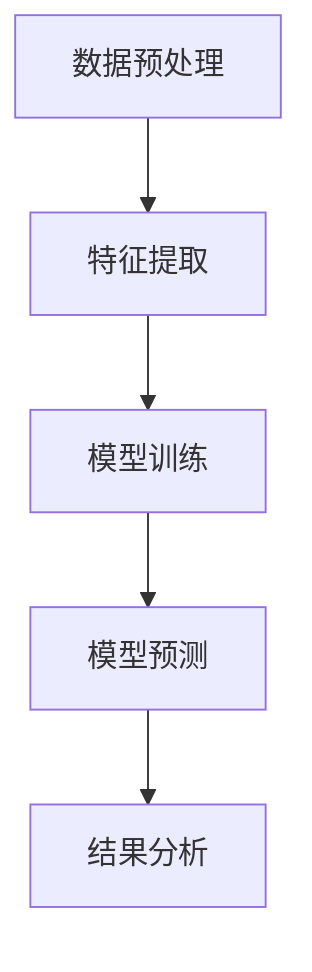
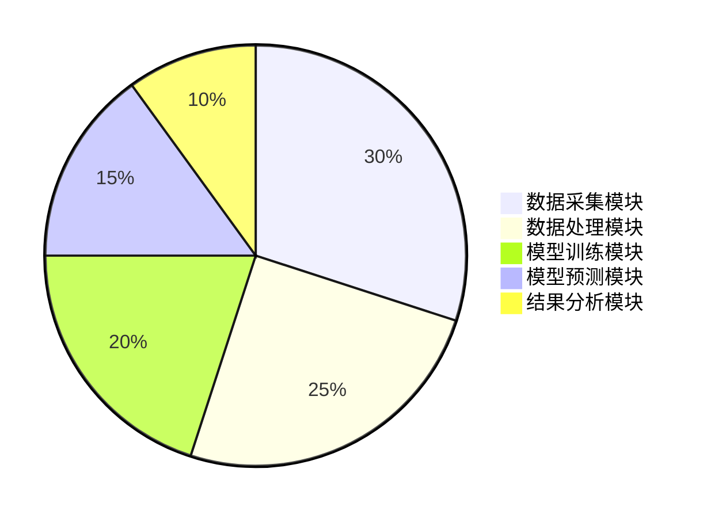

                 


# AI智能体在评估品牌忠诚度中的作用

> 关键词：AI智能体，品牌忠诚度，机器学习，自然语言处理，客户行为分析

> 摘要：本文探讨了AI智能体在品牌忠诚度评估中的应用，分析了AI智能体的核心概念、算法原理及系统架构，通过实际案例展示了AI技术如何提升品牌忠诚度评估的准确性和效率。文章最后提出了最佳实践建议，为读者提供了全面的理论和实践指导。

---

## 第1章: AI智能体与品牌忠诚度概述

### 1.1 问题背景与重要性

#### 1.1.1 品牌忠诚度的定义与影响

品牌忠诚度是指客户对某一品牌产品或服务的偏好和持续购买行为。高忠诚度的客户通常会忽略价格波动、广告宣传或其他品牌的影响，始终坚持选择某一品牌。品牌忠诚度是企业市场竞争力的重要指标，直接影响企业的市场份额、客户 retention 和长期盈利能力。

#### 1.1.2 AI智能体在现代商业中的角色

AI智能体是一种能够模拟人类智能并执行特定任务的计算机系统。它通过机器学习、自然语言处理、计算机视觉等技术，能够分析大量数据、识别模式、做出决策并执行操作。在现代商业中，AI智能体被广泛应用于客户行为分析、市场预测、产品推荐等领域，成为企业提升竞争力的重要工具。

#### 1.1.3 品牌忠诚度评估的挑战与机遇

传统品牌忠诚度评估方法通常依赖于问卷调查、客户访谈等方式，存在数据量小、主观性强、成本高等问题。随着大数据和AI技术的发展，企业可以利用AI智能体分析海量客户数据，实时评估客户忠诚度，从而实现精准营销和客户管理。

---

### 1.2 问题描述与解决方法

#### 1.2.1 品牌忠诚度评估的传统方法及其局限性

传统方法通常依赖于客户满意度调查、购买记录分析等手段。这些方法虽然简单，但存在以下问题：

1. 数据量有限：传统方法通常只能收集到部分客户的行为数据，无法覆盖所有潜在客户。
2. 分析时间长：手动分析客户数据需要大量时间和资源。
3. 主观性较强：客户满意度调查结果可能受到客户情绪、问卷设计等因素的影响。

#### 1.2.2 AI智能体在品牌忠诚度评估中的优势

AI智能体可以通过以下方式提升品牌忠诚度评估的效率和准确性：

1. **数据处理能力**：AI智能体能够处理海量数据，包括社交媒体评论、购买记录、点击流数据等，提取有价值的客户行为特征。
2. **实时分析**：AI智能体可以实时分析客户行为，快速识别忠诚客户和潜在流失客户。
3. **精准预测**：通过机器学习算法，AI智能体能够预测客户忠诚度的变化趋势，帮助企业提前制定应对策略。

#### 1.2.3 问题解决的边界与外延

在利用AI智能体评估品牌忠诚度时，需要注意以下几点：

1. **数据隐私问题**：在处理客户数据时，必须遵守相关法律法规，保护客户隐私。
2. **模型准确性**：AI模型的预测结果可能受到训练数据质量和算法选择的影响，需要定期更新和优化。
3. **客户行为多样性**：不同客户群体的行为特征可能差异较大，需要设计灵活的模型来适应不同场景。

---

## 第2章: AI智能体的核心概念与原理

### 2.1 AI智能体的定义与特征

AI智能体是一种能够感知环境、做出决策并采取行动的智能系统。其主要特征包括：

1. **自主性**：AI智能体能够在没有外部干预的情况下自主运行。
2. **反应性**：能够实时感知环境变化并做出相应的反应。
3. **目标导向**：具备明确的目标，并通过行为选择来实现目标。

#### AI智能体与品牌忠诚度评估的关系

AI智能体可以通过分析客户的购买记录、社交媒体评论、在线行为数据等，识别客户对品牌的偏好和忠诚度。例如，可以通过自然语言处理技术分析客户的文本评论，提取情感倾向和关键词，评估客户对品牌的满意度和忠诚度。

---

### 2.2 品牌忠诚度评估的核心要素

#### 2.2.1 品牌忠诚度的构成要素

品牌忠诚度的构成要素主要包括：

1. **客户满意度**：客户对产品或服务的满意度越高，忠诚度通常越高。
2. **客户参与度**：客户积极参与品牌活动、社交媒体互动等，表明对品牌的高度关注。
3. **重复购买行为**：客户多次购买同一品牌的产品或服务。
4. **品牌认知度**：客户对品牌认知的深度和广度，影响其忠诚度。

#### 2.2.2 不同客户群体的忠诚度特征

不同客户群体的忠诚度特征可能有所不同。例如，高端客户可能更注重产品的质量和服务，而价格敏感型客户可能更关注产品的价格。AI智能体可以通过聚类分析等方法，识别不同客户群体的特征，制定个性化的忠诚度评估策略。

#### 2.2.3 品牌忠诚度评估的维度分析

品牌忠诚度评估可以从以下几个维度进行：

1. **情感忠诚度**：客户对品牌的情感倾向，通常通过客户评论和反馈分析得出。
2. **行为忠诚度**：客户的实际购买行为，包括购买频率、购买金额等。
3. **认知忠诚度**：客户对品牌的认知和理解程度，可以通过市场调研和问卷调查获得。

---

## 第3章: AI智能体评估品牌忠诚度的算法原理

### 3.1 算法原理概述

AI智能体评估品牌忠诚度的核心在于数据的处理和分析。以下是几种常用的算法原理：

#### 3.1.1 基于机器学习的忠诚度评估模型

机器学习模型可以通过训练数据，学习客户行为特征，预测客户忠诚度。常用的算法包括逻辑回归、支持向量机（SVM）、随机森林等。

#### 3.1.2 基于自然语言处理的客户反馈分析

自然语言处理技术可以分析客户的文本评论，提取情感倾向和关键词，评估客户对品牌的满意度。

#### 3.1.3 基于强化学习的客户行为预测

强化学习可以通过模拟客户行为，预测客户忠诚度的变化趋势。

### 3.2 算法流程图

以下是一个基于机器学习的品牌忠诚度评估算法的流程图：



### 3.3 算法实现代码

以下是一个基于随机森林算法的品牌忠诚度评估示例代码：

```python
import pandas as pd
from sklearn.model_selection import train_test_split
from sklearn.ensemble import RandomForestClassifier
from sklearn.metrics import accuracy_score

# 数据加载与预处理
data = pd.read_csv('customer_data.csv')
X = data[['购买频率', '满意度评分', '参与活动次数']]
y = data['忠诚度标签']

# 数据分割
X_train, X_test, y_train, y_test = train_test_split(X, y, test_size=0.2, random_state=42)

# 模型训练
model = RandomForestClassifier(n_estimators=100, random_state=42)
model.fit(X_train, y_train)

# 模型预测
y_pred = model.predict(X_test)

# 模型评估
print('准确率:', accuracy_score(y_test, y_pred))
```

---

## 第4章: 系统分析与架构设计方案

### 4.1 项目场景介绍

假设我们正在开发一个基于AI智能体的品牌忠诚度评估系统，目标是通过分析客户的购买记录、社交媒体评论等数据，评估客户的忠诚度，并为企业提供优化建议。

### 4.2 系统功能设计

以下是系统的功能模块设计：

1. **数据采集模块**：负责采集客户数据，包括购买记录、社交媒体评论、问卷调查结果等。
2. **数据处理模块**：对采集到的数据进行清洗、转换和特征提取。
3. **模型训练模块**：利用机器学习算法训练忠诚度评估模型。
4. **模型预测模块**：根据实时数据，预测客户的忠诚度。
5. **结果分析模块**：分析模型预测结果，生成可视化报告。

### 4.3 系统架构设计

以下是系统的架构图：



### 4.4 系统接口设计

以下是系统的主要接口设计：

1. **数据接口**：提供API接口，用于数据采集模块与数据处理模块之间的数据传输。
2. **模型接口**：提供API接口，用于模型训练模块与模型预测模块之间的交互。
3. **报告接口**：提供API接口，用于结果分析模块生成报告并返回给用户。

---

## 第5章: 项目实战

### 5.1 环境安装

需要安装以下环境和工具：

1. **Python**：建议使用Python 3.8及以上版本。
2. **Pandas**：用于数据处理。
3. **Scikit-learn**：用于机器学习算法。
4. **Mermaid**：用于绘制流程图。

### 5.2 系统核心实现源代码

以下是系统的核心代码：

```python
import pandas as pd
from sklearn.ensemble import RandomForestClassifier
from sklearn.metrics import accuracy_score

# 数据加载与预处理
data = pd.read_csv('customer_data.csv')
X = data[['购买频率', '满意度评分', '参与活动次数']]
y = data['忠诚度标签']

# 数据分割
X_train, X_test, y_train, y_test = train_test_split(X, y, test_size=0.2, random_state=42)

# 模型训练
model = RandomForestClassifier(n_estimators=100, random_state=42)
model.fit(X_train, y_train)

# 模型预测
y_pred = model.predict(X_test)

# 模型评估
print('准确率:', accuracy_score(y_test, y_pred))
```

### 5.3 代码应用解读与分析

上述代码实现了基于随机森林算法的品牌忠诚度评估模型。首先，加载数据并进行预处理，然后将数据分割为训练集和测试集。接着，训练随机森林模型，并利用测试集数据进行预测。最后，评估模型的准确率并输出结果。

---

## 第6章: 总结与最佳实践

### 6.1 总结

本文详细探讨了AI智能体在品牌忠诚度评估中的应用，分析了AI智能体的核心概念、算法原理及系统架构，并通过实际案例展示了AI技术如何提升品牌忠诚度评估的准确性和效率。

### 6.2 最佳实践 tips

1. **数据质量**：确保数据的准确性和完整性，避免噪声数据对模型的影响。
2. **模型选择**：根据具体场景选择合适的算法，避免盲目使用复杂模型。
3. **持续优化**：定期更新模型，确保模型的预测结果与实际业务需求保持一致。

---

## 作者

作者：AI天才研究院/AI Genius Institute & 禅与计算机程序设计艺术 /Zen And The Art of Computer Programming

---

以上是文章的详细内容，希望对您有所帮助！如果需要进一步修改或补充，请随时告知。

