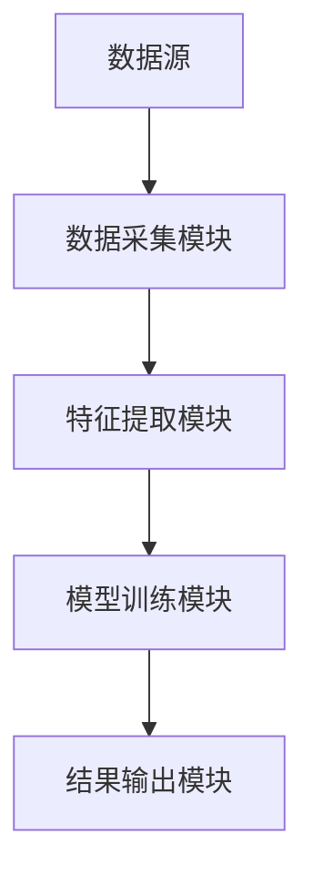

                 


```markdown
# AI智能体在评估无形资产价值中的作用

## 关键词：
AI智能体, 无形资产, 资产评估, 人工智能, 价值评估

## 摘要：
本文探讨AI智能体在评估无形资产价值中的作用。通过分析无形资产的特点和传统评估的挑战，结合AI智能体的核心原理和算法，提出基于机器学习的评估模型，并通过实际案例展示其应用效果。文章内容涵盖背景介绍、核心概念、算法原理、系统设计、项目实战等，为读者提供全面的技术视角。

---

## 第一部分：无形资产与AI智能体概述

### 第1章：无形资产的定义与特征

#### 1.1 无形资产的定义
无形资产是指企业拥有或控制的，没有实物形态，但能够为企业带来长期经济利益的资源。常见的无形资产包括专利权、商标权、版权、商誉等。

#### 1.2 无形资产的特征
| 特征 | 描述 |
|------|------|
| 非实物性 | 无具体物理形态 |
| 长期性 | 使用寿命较长 |
| 价值波动性 | 受市场因素影响较大 |
| 难评估性 | 传统评估方法存在局限 |

#### 1.3 无形资产与传统评估方法
传统评估方法依赖于财务数据和专家经验，存在主观性强、数据不足等问题。AI智能体通过大数据分析和机器学习模型，提供更客观、精确的评估手段。

### 第2章：AI智能体的核心概念

#### 2.1 AI智能体的定义
AI智能体是一种能够感知环境、自主决策并执行任务的智能系统，具备学习、推理和自适应能力。

#### 2.2 AI智能体的特点
| 特点 | 描述 |
|------|------|
| 智能性 | 能够理解并处理复杂信息 |
| 自主性 | 可以独立执行任务 |
| 适应性 | 能够根据环境变化调整行为 |

#### 2.3 AI智能体与无形资产评估的关系
AI智能体通过分析历史数据、市场趋势和企业绩效，帮助评估无形资产的价值，提升评估效率和准确性。

---

## 第二部分：AI智能体在无形资产评估中的应用

### 第3章：AI智能体的数学模型与算法原理

#### 3.1 评估模型的数学
$$ V = \beta_0 + \beta_1x_1 + \beta_2x_2 + ... + \beta_nx_n $$
其中，$V$ 是无形资产的价值，$x_i$ 是影响价值的特征变量，$\beta_i$ 是回归系数。

#### 3.2 算法原理
使用机器学习算法，如随机森林或神经网络，训练模型以预测无形资产价值。以下是随机森林算法的伪代码示例：

```python
from sklearn.ensemble import RandomForestRegressor

# 训练数据
X_train, y_train = prepare_data()

# 创建模型
model = RandomForestRegressor(n_estimators=100)

# 训练
model.fit(X_train, y_train)

# 预测
y_pred = model.predict(X_test)
```

### 第4章：系统分析与架构设计

#### 4.1 系统功能设计
- 数据采集模块：收集相关数据，如企业财务数据、市场信息等。
- 特征提取模块：从数据中提取影响无形资产价值的特征。
- 模型训练模块：训练机器学习模型，预测资产价值。
- 结果输出模块：展示评估结果。

#### 4.2 系统架构设计


### 第5章：项目实战

#### 5.1 项目环境安装
```bash
pip install numpy pandas scikit-learn
```

#### 5.2 核心代码实现
```python
import pandas as pd
from sklearn.model import model

# 数据加载
data = pd.read_csv('assets.csv')

# 数据预处理
X = data[['feature1', 'feature2']]
y = data['value']

# 模型训练
model.fit(X, y)

# 预测
print(model.predict([[new_feature1, new_feature2]]))
```

#### 5.3 实际案例分析
以专利评估为例，通过训练模型，准确预测专利的市场价值，提升企业的决策效率。

### 第6章：总结与展望

#### 6.1 总结
AI智能体在无形资产评估中的应用显著提升了评估的准确性和效率，克服了传统方法的局限性。

#### 6.2 展望
未来，随着AI技术的发展，AI智能体在无形资产评估中的应用将更加广泛，评估模型将更加复杂和精准。

---

## 作者：
AI天才研究院/AI Genius Institute & 禅与计算机程序设计艺术 /Zen And The Art of Computer Programming
```

