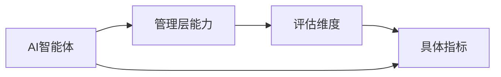
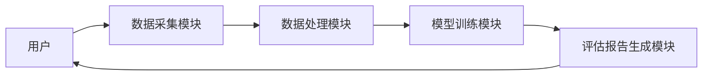

                 


# AI智能体在评估管理层能力中的作用

> 关键词：AI智能体，管理层能力评估，管理决策，机器学习，数据分析，组织行为学，领导力

> 摘要：随着人工智能技术的飞速发展，AI智能体在企业管理中的应用日益广泛。本文探讨了AI智能体在评估管理层能力中的作用，分析了其在管理决策、数据分析和组织行为学中的潜力。通过详细的技术分析，结合实际案例，本文展示了如何利用AI智能体提升管理层能力评估的效率和准确性。

---

# 第一部分: AI智能体在评估管理层能力中的作用概述

## 第1章: 背景介绍与核心概念

### 1.1 问题背景与描述

#### 1.1.1 管理层能力评估的现状与挑战
在企业中，管理层的能力直接关系到组织的绩效和目标实现。传统的管理层能力评估方法通常依赖于主观的观察和经验判断，存在耗时长、成本高、结果不一致等问题。此外，随着企业规模的扩大和业务复杂性的增加，传统的评估方法难以满足现代企业的需求。

#### 1.1.2 AI智能体在管理评估中的应用潜力
AI智能体（AI Agents）具有强大的数据处理能力、学习能力和决策能力。通过AI智能体，企业可以实时收集和分析大量数据，快速生成评估结果，从而提高评估的效率和准确性。此外，AI智能体还可以根据历史数据和实时反馈，动态调整评估策略，为管理层提供更精准的决策支持。

#### 1.1.3 问题解决的必要性与目标
通过引入AI智能体，企业可以解决传统评估方法中的低效和不准确问题。本文的目标是探讨AI智能体在管理层能力评估中的具体应用，分析其优势和挑战，并提出可行的解决方案。

### 1.2 核心概念与定义

#### 1.2.1 AI智能体的定义与特征
AI智能体是指具有感知环境、理解任务、做出决策并执行操作的智能系统。AI智能体的核心特征包括：
- **自主性**：能够在没有外部干预的情况下完成任务。
- **反应性**：能够根据环境变化实时调整行为。
- **学习性**：能够通过数据和经验不断优化自身能力。

#### 1.2.2 管理层能力评估的维度
管理层能力评估通常包括以下几个维度：
- **领导力**：包括目标设定、团队激励、决策能力等。
- **战略思维**：包括战略规划、市场分析、风险评估等。
- **沟通能力**：包括团队沟通、跨部门协作、外部关系维护等。
- **创新能力**：包括问题解决能力、产品开发、流程优化等。

#### 1.2.3 二者的关联与外延
AI智能体通过数据驱动的方法，能够全面、客观地评估管理层的多种能力。例如，AI智能体可以通过分析团队成员的绩效数据，评估领导力；通过分析市场数据，评估战略思维能力；通过分析沟通记录，评估沟通能力。

### 1.3 概念结构与核心要素

#### 1.3.1 AI智能体的组成要素
AI智能体通常包括以下组成要素：
- **感知模块**：用于收集环境数据（如市场数据、团队数据等）。
- **决策模块**：基于感知数据进行分析和决策。
- **执行模块**：根据决策结果执行操作（如生成评估报告）。
- **学习模块**：通过反馈不断优化自身的决策模型。

#### 1.3.2 管理层能力评估的核心维度
管理层能力评估的核心维度包括：
- **目标设定能力**：能否设定清晰、可行的目标。
- **决策能力**：能否在复杂情况下做出合理决策。
- **团队协作能力**：能否有效协调团队成员的工作。
- **创新能力**：能否提出创新的解决方案。

#### 1.3.3 二者的交互关系与系统架构
AI智能体与管理层能力评估的交互关系可以用以下ER图表示：



---

## 第2章: AI智能体与管理层能力评估的核心原理

### 2.1 核心概念原理

#### 2.1.1 AI智能体的感知与决策机制
AI智能体通过感知模块收集数据，利用决策模块进行分析，生成评估结果。例如，AI智能体可以通过分析团队成员的绩效数据，评估领导力。

#### 2.1.2 管理层能力评估的指标体系
管理层能力评估的指标体系通常包括领导力、战略思维、沟通能力和创新能力等多个维度。AI智能体可以通过数据驱动的方法，全面、客观地评估这些能力。

#### 2.1.3 二者的结合与协同作用
AI智能体通过数据驱动的方法，能够全面、客观地评估管理层的多种能力。例如，AI智能体可以通过分析市场数据，评估战略思维能力；通过分析沟通记录，评估沟通能力。

### 2.2 概念属性特征对比

#### 2.2.1 AI智能体的属性特征
| 属性 | 特征 |
|------|------|
| 自主性 | 能够在没有外部干预的情况下完成任务 |
| 反应性 | 能够根据环境变化实时调整行为 |
| 学习性 | 能够通过数据和经验不断优化自身能力 |

#### 2.2.2 管理层能力评估的属性特征
| 属性 | 特征 |
|------|------|
| 目标设定能力 | 能否设定清晰、可行的目标 |
| 决策能力 | 能否在复杂情况下做出合理决策 |
| 团队协作能力 | 能否有效协调团队成员的工作 |
| 创新能力 | 能否提出创新的解决方案 |

#### 2.2.3 对比分析与表格总结
通过对比分析，可以看出AI智能体和管理层能力评估在多个维度上有较强的关联性。例如，AI智能体的学习性可以支持管理层能力的动态评估；管理层的创新能力可以为AI智能体提供新的数据输入。

### 2.3 ER实体关系图


---

## 第3章: 评估模型的算法原理

### 3.1 算法原理概述

#### 3.1.1 特征提取与选择
特征提取是AI智能体评估管理层能力的第一步。例如，可以通过分析团队成员的绩效数据、市场数据、沟通记录等，提取相关的特征。

#### 3.1.2 分类与回归算法
常用的分类算法包括决策树、随机森林、支持向量机（SVM）等；常用的回归算法包括线性回归、逻辑回归等。例如，可以通过决策树算法，将管理层能力分为优秀、良好、一般三个类别。

#### 3.1.3 模型训练与优化
通过训练数据集对模型进行训练，利用交叉验证等方法优化模型参数，提高模型的准确性和泛化能力。

### 3.2 算法流程图


### 3.3 数学模型与公式

#### 3.3.1 特征权重计算公式
$$ w_i = \frac{f_i}{\sum_{j=1}^{n} f_j} $$
其中，$w_i$ 表示第 $i$ 个特征的权重，$f_i$ 表示该特征的特征值。

#### 3.3.2 分类模型的损失函数
$$ L = -\sum_{i=1}^{m} y_i \log p(y_i) + (1 - y_i) \log (1 - p(y_i)) $$
其中，$y_i$ 表示真实标签，$p(y_i)$ 表示预测概率。

---

## 第4章: 算法实现与优化

### 4.1 算法实现步骤

#### 4.1.1 数据预处理
- 数据清洗：处理缺失值、异常值等。
- 特征工程：提取特征、归一化、降维等。

#### 4.1.2 模型训练
- 选择合适的算法（如决策树、随机森林等）。
- 设置模型参数（如树的深度、分裂条件等）。
- 训练模型并保存模型。

#### 4.1.3 模型评估与优化
- 使用测试数据集评估模型性能（如准确率、召回率、F1值等）。
- 调整模型参数，优化模型性能。

### 4.2 优化策略

#### 4.2.1 参数调节
- 调整决策树的分裂条件、树的深度等参数。

#### 4.2.2 模型集成
- 使用集成学习（如随机森林、梯度提升树等）提高模型的准确性和稳定性。

#### 4.2.3 超参数优化
- 使用网格搜索（Grid Search）或随机搜索（Random Search）优化模型的超参数。

---

## 第5章: 系统架构与设计

### 5.1 系统功能设计

#### 5.1.1 系统功能模块
- 数据采集模块：收集管理层的相关数据（如绩效数据、市场数据等）。
- 数据处理模块：对数据进行清洗、特征提取、归一化等处理。
- 模型训练模块：训练AI智能体的评估模型。
- 评估报告生成模块：根据评估结果生成报告。

#### 5.1.2 系统功能流程图


### 5.2 系统架构设计

#### 5.2.1 系统架构图


#### 5.2.2 系统接口设计
- 数据接口：与企业数据系统对接，获取管理层数据。
- 报告接口：生成评估报告，并输出到企业管理系统。

#### 5.2.3 系统交互图



---

## 第6章: 项目实战

### 6.1 环境安装

#### 6.1.1 安装Python
```bash
python --version
pip install --upgrade pip
```

#### 6.1.2 安装必要的库
```bash
pip install numpy pandas scikit-learn matplotlib
```

### 6.2 核心代码实现

#### 6.2.1 数据预处理
```python
import pandas as pd
import numpy as np

# 加载数据
data = pd.read_csv('manager_data.csv')

# 数据清洗
data = data.dropna()
data = data.replace([np.inf, -np.inf], np.nan).dropna()

# 特征提取
X = data[['performance', 'market_share', 'communication']]
y = data['leadership_skill']

# 数据标准化
from sklearn.preprocessing import StandardScaler
scaler = StandardScaler()
X_scaled = scaler.fit_transform(X)
```

#### 6.2.2 模型训练
```python
from sklearn.tree import DecisionTreeClassifier
from sklearn.metrics import accuracy_score, classification_report

# 训练模型
model = DecisionTreeClassifier()
model.fit(X_scaled, y)

# 预测
y_pred = model.predict(X_scaled)

# 评估
print(accuracy_score(y, y_pred))
print(classification_report(y, y_pred))
```

### 6.3 案例分析与解读

#### 6.3.1 案例背景
某公司希望评估其管理层的领导力、战略思维和创新能力。通过AI智能体，该公司可以实时收集和分析团队成员的绩效数据、市场数据和沟通记录。

#### 6.3.2 数据分析与解读
通过模型训练，AI智能体可以生成评估报告，显示管理层在各个维度上的表现。例如，某位管理层在领导力方面得分较高，但在创新能力方面得分较低。

### 6.4 项目小结
通过本项目，我们可以看到AI智能体在评估管理层能力中的巨大潜力。通过数据驱动的方法，AI智能体可以全面、客观地评估管理层的能力，为企业提供有力的决策支持。

---

## 第7章: 总结与展望

### 7.1 最佳实践 tips
- 在实际应用中，建议企业结合自身的业务特点，选择合适的AI智能体模型。
- 数据的质量和数量直接影响评估结果，因此需要确保数据的准确性和完整性。
- 在实际应用中，建议企业结合自身的业务特点，选择合适的AI智能体模型。

### 7.2 小结
本文详细探讨了AI智能体在评估管理层能力中的作用，分析了其在管理决策、数据分析和组织行为学中的潜力。通过实际案例和详细的技术分析，展示了如何利用AI智能体提升管理层能力评估的效率和准确性。

### 7.3 注意事项
- 数据隐私和安全问题需要高度重视。
- 在实际应用中，建议企业结合自身的业务特点，选择合适的AI智能体模型。
- 数据的质量和数量直接影响评估结果，因此需要确保数据的准确性和完整性。

### 7.4 拓展阅读
- 《机器学习实战》
- 《数据挖掘导论》
- 《人工智能：一种现代的方法》

---

# 作者：AI天才研究院/AI Genius Institute & 禅与计算机程序设计艺术 /Zen And The Art of Computer Programming

---

**说明：** 以上内容为《AI智能体在评估管理层能力中的作用》技术博客文章的详细大纲，具体内容可以根据实际需要进行调整和补充。

