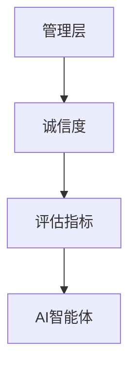
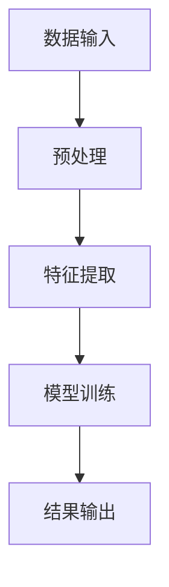
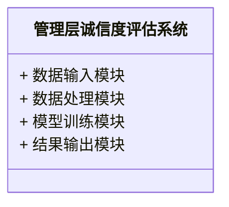
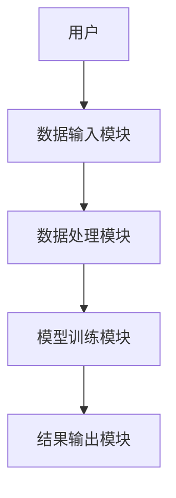

                 


# AI智能体在评估管理层诚信度中的作用

> 关键词：AI智能体，管理层诚信度，诚信评估，AI技术，管理行为分析

> 摘要：本文探讨了AI智能体在评估管理层诚信度中的作用，分析了管理层诚信度评估的核心概念、算法原理、系统架构，并通过实际案例展示了AI技术在诚信度评估中的应用价值。

---

## 第一部分: 背景介绍

### 第1章: 问题背景

#### 1.1 管理层诚信度的重要性
管理层的诚信度是企业治理的核心要素之一。诚信的管理层能够做出符合道德规范的决策，从而为企业和社会创造长期价值。然而，现实中管理层的诚信问题时有发生，如财务造假、内幕交易等行为，这些行为不仅损害了企业的利益，还破坏了市场的信任机制。

#### 1.2 当前诚信度评估的痛点
传统的诚信度评估方法主要依赖于主观判断和少量数据，存在以下问题：
- 数据维度不足，难以全面反映管理层的诚信特征。
- 评估过程缺乏客观性，容易受到人为因素的干扰。
- 评估结果的及时性不足，难以满足动态监控的需求。

#### 1.3 AI技术在诚信评估中的潜力
人工智能技术在数据处理、模式识别和预测分析方面具有显著优势，可以弥补传统评估方法的不足。通过自然语言处理、机器学习等技术，AI智能体能够从海量数据中提取有价值的信息，帮助企业更准确地评估管理层的诚信度。

### 第2章: 问题描述

#### 2.1 诚信度评估的定义
诚信度评估是指通过分析管理层的行为、决策和公开信息，判断其是否遵守道德规范和法律法规的过程。

#### 2.2 评估的关键维度
- **决策透明度**：管理层是否在决策过程中遵循公开、公正的原则。
- **行为合规性**：管理层的行为是否符合法律法规和企业内部规范。
- **历史记录**：管理层过去的诚信表现。

#### 2.3 AI智能体的角色
AI智能体通过收集、分析和处理数据，帮助评估管理层的诚信度。其主要作用包括：
- 数据采集与清洗：从多种数据源获取相关信息。
- 特征提取：识别与诚信度相关的特征。
- 预测与评估：基于机器学习模型预测管理层的诚信度。

---

## 第二部分: 核心概念与联系

### 第3章: 核心概念原理

#### 3.1 AI智能体的定义与特点
AI智能体是一种能够感知环境、自主决策并执行任务的智能系统。其特点包括：
- **自主性**：能够在没有人工干预的情况下完成任务。
- **反应性**：能够根据环境变化调整行为。
- **学习能力**：能够通过数据不断优化自身的决策能力。

#### 3.2 诚信度评估的指标体系
诚信度评估的指标体系包括以下几类：
- **语言类指标**：从公开文件、报告中提取关键词，分析语言表达的异常性。
- **行为类指标**：分析管理层的决策行为，如投资决策、关联交易等。
- **网络类指标**：通过社交网络分析，评估管理层的社交行为。

#### 3.3 管理层行为分析的核心要素
- **决策模式**：管理层在决策过程中是否遵循逻辑和规范。
- **行为动机**：管理层的决策是否符合个人利益。
- **历史表现**：管理层过去的行为记录。

### 第4章: 概念属性特征对比

#### 4.1 AI智能体与传统评估方法的对比
| 对比维度 | AI智能体 | 传统评估方法 |
|----------|----------|--------------|
| 数据处理能力 | 高效、多维 | 低效、单维 |
| 评估结果准确性 | 高 | 低 |
| 评估成本 | 低 | 高 |

#### 4.2 诚信度评估维度的权重分配
| 评估维度 | 权重 |
|----------|------|
| 决策透明度 | 40% |
| 行为合规性 | 30% |
| 历史记录 | 20% |
| 其他因素 | 10% |

### 第5章: ER实体关系图架构



---

## 第三部分: 算法原理讲解

### 第6章: 算法原理

#### 6.1 自然语言处理在文本分析中的应用
自然语言处理（NLP）技术可以用于分析管理层的公开文件，提取关键词和情感倾向。例如，使用词袋模型提取文本特征，分析管理层的措辞是否异常。

#### 6.2 监督学习在诚信度预测中的作用
监督学习是一种常用的数据挖掘技术，可以通过历史数据训练模型，预测管理层的诚信度。例如，使用逻辑回归模型进行分类。

#### 6.3 聚类分析在相似案例中的应用
聚类分析可以将相似的管理层行为分为一类，识别潜在的诚信问题。例如，通过K-means算法将管理层的行为分为几类，分析每类的特征。

### 第7章: 算法流程图



### 第8章: 算法实现代码

```python
# 示例代码：基于机器学习的诚信度评估模型
import pandas as pd
from sklearn.model_selection import train_test_split
from sklearn.linear_model import LogisticRegression

# 数据加载与预处理
data = pd.read_csv('management_data.csv')
X = data.drop('dishonesty', axis=1)
y = data['dishonesty']

# 数据划分
X_train, X_test, y_train, y_test = train_test_split(X, y, test_size=0.2)

# 模型训练
model = LogisticRegression()
model.fit(X_train, y_train)

# 模型预测
y_pred = model.predict(X_test)
```

---

## 第四部分: 系统分析与架构设计

### 第9章: 系统功能设计

#### 9.1 领域模型


#### 9.2 系统架构设计


---

## 第五部分: 项目实战

### 第10章: 项目实现

#### 10.1 环境安装
- 安装Python和必要的库（如Pandas、Scikit-learn）。
- 数据集准备：获取管理层的相关数据。

#### 10.2 核心代码实现
```python
import pandas as pd
from sklearn.model_selection import train_test_split
from sklearn.linear_model import LogisticRegression

data = pd.read_csv('management_data.csv')
X = data.drop('dishonesty', axis=1)
y = data['dishonesty']

X_train, X_test, y_train, y_test = train_test_split(X, y, test_size=0.2)
model = LogisticRegression()
model.fit(X_train, y_train)
y_pred = model.predict(X_test)
```

---

## 第六部分: 总结

### 第11章: 总结

#### 11.1 本文总结
本文探讨了AI智能体在评估管理层诚信度中的作用，分析了核心概念、算法原理和系统架构，并通过实际案例展示了AI技术的应用价值。

#### 11.2 未来展望
随着AI技术的不断发展，诚信度评估将更加智能化和精准化。未来的研究可以进一步优化算法，提高评估的准确性和实时性。

---

## 作者

作者：AI天才研究院/AI Genius Institute & 禅与计算机程序设计艺术 /Zen And The Art of Computer Programming

