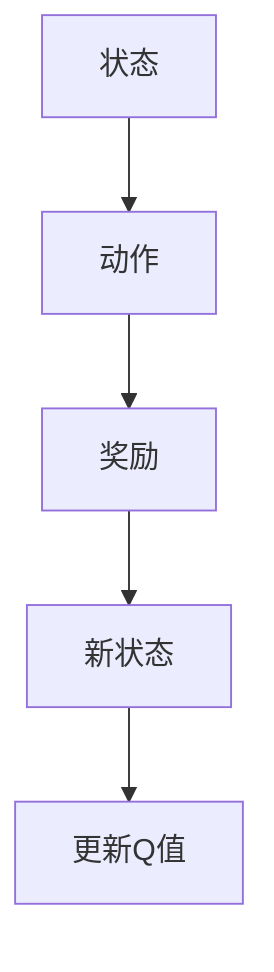
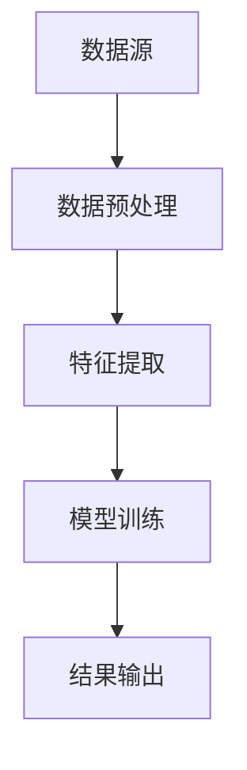
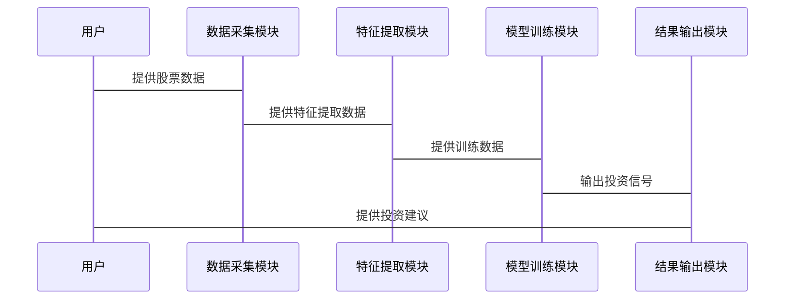

                 


# AI智能体在识别价值投资机会的最佳进入时机中的应用

> 关键词：AI智能体、价值投资、最佳进入时机、强化学习、时间序列分析、金融投资、系统架构

> 摘要：本文探讨了AI智能体在识别价值投资机会中的最佳进入时机的应用，结合强化学习和时间序列分析等技术，详细分析了系统的架构设计、算法原理和项目实现，通过实际案例展示了AI在金融投资中的潜力。

---

# 第一部分: 背景与基础

## 第1章: 价值投资与AI智能体的结合

### 1.1 价值投资的核心概念

#### 1.1.1 价值投资的定义
价值投资是一种投资策略，旨在通过分析企业的基本面，寻找被市场低估的投资标的，长期持有以获得超额收益。

#### 1.1.2 投资机会识别的挑战
- 市场波动性高，信息不透明
- 数据量大，复杂性高
- 需要实时决策，机会稍纵即逝

#### 1.1.3 最佳进入时机的重要性
- 把握最佳时机可以最大化收益
- 避免高位进场，减少风险

### 1.2 AI技术在金融领域的应用现状

#### 1.2.1 AI在金融分析中的应用
- 股票价格预测
- 风险评估与管理
- 市场情绪分析

#### 1.2.2 AI在投资决策中的优势
- 高速计算与数据分析能力
- 模式识别与预测能力
- 自适应学习能力

#### 1.2.3 当前AI在金融领域的挑战
- 数据质量与完整性
- 模型的可解释性
- 市场环境的复杂性

### 1.3 AI智能体的基本概念

#### 1.3.1 AI智能体的定义
AI智能体是指能够感知环境并采取行动以实现目标的智能系统，具备学习、推理和自适应能力。

#### 1.3.2 智能体的分类与特点
- 分类：基于感知、行动、学习能力
- 特点：自主性、反应性、目标导向

#### 1.3.3 智能体在金融领域的应用潜力
- 自动化交易
- 风险管理
- 投资策略优化

---

# 第二部分: 核心算法与数学模型

## 第2章: 强化学习算法在投资决策中的应用

### 2.1 强化学习的基本原理

#### 2.1.1 强化学习的定义与核心要素
- 状态（State）
- 动作（Action）
- 奖励（Reward）
- 策略（Policy）
- 值函数（Value Function）

#### 2.1.2 Q-learning算法的数学模型
$$Q(s, a) = \max_{a'} Q(s', a') + \alpha (r + \gamma Q(s', a'))$$

### 2.2 时间序列分析与预测

#### 2.2.1 时间序列的基本特征
- 趋势
- 季节性
- 周期性
- 随机性

#### 2.2.2 ARIMA模型的数学公式
$$ARIMA(p, d, q)$$

### 2.3 高频交易中的强化学习策略

#### 2.3.1 高频交易的特点
- 高速交易
- 算法驱动
- 低延迟

#### 2.3.2 强化学习在高频交易中的应用
- 快速决策
- 动态调整策略
- 自适应市场变化

#### 2.3.3 算法流程图（Mermaid）


---

# 第三部分: 系统设计与实现

## 第3章: 价值投资机会识别系统的架构设计

### 3.1 系统功能需求分析

#### 3.1.1 数据采集模块
- 数据来源：股票市场数据、新闻、社交媒体
- 数据预处理：清洗、归一化

#### 3.1.2 特征提取模块
- 基本特征：市盈率、市净率、ROE
- 技术指标：MA、MACD、RSI

#### 3.1.3 模型训练模块
- 训练数据：历史股价、市场情绪
- 模型选择：强化学习模型、时间序列模型

#### 3.1.4 结果输出模块
- 买入信号
- 卖出信号
- 最佳进入时机

### 3.2 系统架构设计

#### 3.2.1 分层架构图（Mermaid）


### 3.3 系统接口设计

#### 3.3.1 输入接口
- 数据接口：接收股票数据
- 参数接口：配置模型参数

#### 3.3.2 输出接口
- 信号接口：输出买入/卖出信号
- 报告接口：生成分析报告

### 3.4 系统交互流程图（Mermaid）



---

## 第4章: 项目实战与代码实现

### 4.1 环境安装

#### 4.1.1 安装Python
```bash
python --version
pip install --upgrade pip
```

#### 4.1.2 安装依赖库
```bash
pip install numpy pandas scikit-learn tensorflow
```

### 4.2 核心代码实现

#### 4.2.1 数据预处理
```python
import pandas as pd
import numpy as np

data = pd.read_csv('stock_data.csv')
data = data.dropna()
data['date'] = pd.to_datetime(data['date'])
data.set_index('date', inplace=True)
```

#### 4.2.2 强化学习模型实现
```python
class Agent:
    def __init__(self, state_dim, action_dim):
        self.state_dim = state_dim
        self.action_dim = action_dim
        self.Q = np.zeros((state_dim, action_dim))
    
    def act(self, state):
        return np.argmax(self.Q[state, :])
    
    def update(self, state, action, reward, next_state):
        alpha = 0.1
        gamma = 0.9
        self.Q[state, action] += alpha * (reward + gamma * np.max(self.Q[next_state, :]) - self.Q[state, action])
```

#### 4.2.3 时间序列预测
```python
from statsmodels.tsa.arima_model import ARIMA

model = ARIMA(train_data, order=(5, 1, 0))
model_fit = model.fit()
forecast, stderr, conf_int = model_fit.forecast()
```

### 4.3 实际案例分析

#### 4.3.1 股票数据案例
- 数据来源：某股票的历史股价数据
- 模型训练：使用强化学习和ARIMA模型
- 预测结果：预测最佳买入时机

#### 4.3.2 案例分析报告
- 数据分析：股价趋势、市场情绪
- 模型表现：预测准确率、收益对比
- 投资建议：最佳进入时机、风险提示

### 4.4 本章小结
通过实际案例分析，展示了AI智能体在识别价值投资机会中的应用，验证了模型的有效性和实用性。

---

## 第5章: 最佳实践与总结

### 5.1 最佳实践 tips
- 数据质量是关键
- 模型选择要结合实际场景
- 定期优化和更新模型

### 5.2 小结
AI智能体在识别价值投资机会的最佳进入时机中具有巨大潜力，通过结合强化学习和时间序列分析，可以显著提高投资决策的准确性和效率。

### 5.3 注意事项
- 数据隐私与合规性
- 模型的可解释性
- 风险管理与控制

### 5.4 拓展阅读
- 《算法交易： predictors and systems》
- 《机器学习实战》
- 《时间序列分析》

---

# 结语

通过本文的详细讲解，读者可以深入了解AI智能体在识别价值投资机会中的最佳进入时机的应用，掌握相关的算法原理和系统设计方法，并通过实际案例分析提升对AI在金融投资中的理解与应用能力。

---

# 作者：AI天才研究院 & 禅与计算机程序设计艺术

---

**注**：以上目录结构和内容仅为示例，实际文章内容需要根据具体需求进行调整和补充，确保每部分内容详细、逻辑清晰、技术原理剖析到位。

