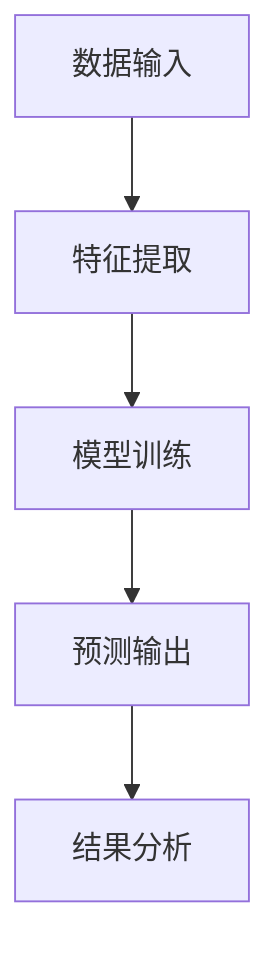
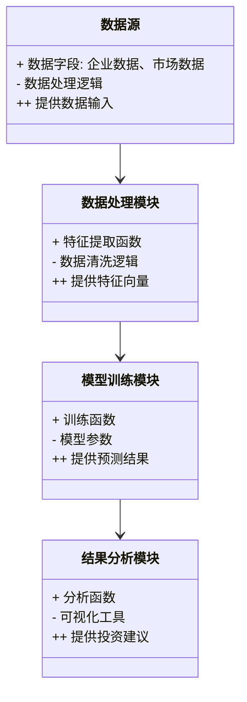

                 


# AI智能体在识别价值投资陷阱中的应用

## 关键词：
AI智能体、价值投资、投资陷阱、机器学习、风险管理

## 摘要：
本文探讨了AI智能体在识别价值投资陷阱中的应用，分析了其在数据处理、特征提取、模型训练和结果分析中的作用，结合实际案例展示了如何利用AI技术优化投资决策，帮助投资者规避潜在风险，提升投资收益。

---

# 第1章: 价值投资的基本概念

## 1.1 价值投资的定义与核心理念

### 1.1.1 价值投资的定义
价值投资是一种投资策略，强调通过分析企业的基本面，如财务状况、行业地位和管理团队，寻找被市场低估的投资标的。

### 1.1.2 价值投资的核心理念
- 坚持长期投资，关注企业的内在价值。
- 避免短期市场波动的干扰，寻找具有持续增长潜力的企业。

### 1.1.3 价值投资的适用场景与局限性
- 适用场景：市场波动较大时，寻找低估股票。
- 局限性：需要深入的行业分析和财务分析，且对市场短期波动的适应性较弱。

---

## 1.2 AI智能体的基本概念

### 1.2.1 AI智能体的定义
AI智能体是一种能够感知环境、处理信息并做出决策的智能系统，具备学习和自适应能力。

### 1.2.2 AI智能体的特点
- 数据驱动：依赖大量数据进行分析和决策。
- 自适应性：能够根据反馈调整行为。
- 高效性：处理复杂问题的速度远超人类。

---

## 1.3 价值投资与AI智能体的结合

### 1.3.1 价值投资中的常见陷阱
- 信息不对称：投资者难以获取准确的企业信息。
- 情绪化决策：投资者容易受到市场情绪影响。
- 分析偏差：过于依赖历史数据可能导致误判。

### 1.3.2 AI智能体在识别投资陷阱中的作用
- 数据处理：快速分析大量企业数据。
- 特征提取：识别关键财务指标和市场信号。
- 模型训练：预测企业价值和市场走势。

---

# 第2章: 核心概念与联系

## 2.1 核心概念的属性特征对比

| 概念 | 定义 | 特点 | 应用 |
|------|------|------|------|
| 数据处理 | 清洗和预处理数据 | 高效性、准确性 | 提供高质量输入 |
| 特征提取 | 提取关键特征 | 选择性、独立性 | 生成特征向量 |
| 模型训练 | 训练预测模型 | 学习性、适应性 | 生成预测结果 |
| 结果分析 | 分析模型输出 | 可解释性、可验证性 | 支持投资决策 |

---

## 2.2 ER实体关系图

```mermaid
er
    左侧框标题 投资陷阱识别系统

    rectangle 价值投资陷阱识别系统 {
        rectangle 数据源 {
            标题 数据表
            数据字段: 企业财务数据、市场数据、行业数据
        }
        rectangle 数据处理模块 {
            标题 模块
            功能: 数据清洗、特征提取
        }
        rectangle 模型训练模块 {
            标题 模块
            功能: 训练分类模型
        }
        rectangle 结果分析模块 {
            标题 模块
            功能: 分析模型输出
        }
    }

    数据源 --> 数据处理模块
    数据处理模块 --> 模型训练模块
    模型训练模块 --> 结果分析模块
```

---

# 第3章: 算法原理讲解

## 3.1 监督学习算法



```python
# 示例代码：监督学习模型训练
import pandas as pd
from sklearn.model_selection import train_test_split
from sklearn.linear_model import LinearRegression

# 加载数据
data = pd.read_csv('investment_data.csv')

# 特征选择
X = data[['revenue', 'profit_margin', 'market_position']]
y = data['stock_price']

# 数据分割
X_train, X_test, y_train, y_test = train_test_split(X, y, test_size=0.2)

# 模型训练
model = LinearRegression()
model.fit(X_train, y_train)

# 预测与评估
print(model.score(X_test, y_test))
```

## 3.2 数学模型与公式

### 3.2.1 线性回归模型
$$ y = \beta_0 + \beta_1x_1 + \beta_2x_2 + ... + \beta_nx_n + \epsilon $$

### 3.2.2 逻辑回归模型
$$ P(y=1|x) = \frac{e^{\beta_0 + \beta_1x_1 + ... + \beta_nx_n}}{1 + e^{\beta_0 + \beta_1x_1 + ... + \beta_nx_n}} $$

---

# 第4章: 系统分析与架构设计

## 4.1 系统功能设计

### 4.1.1 领域模型类图



---

## 4.2 系统架构设计


---

# 第5章: 项目实战

## 5.1 环境安装

```bash
pip install pandas scikit-learn matplotlib
```

## 5.2 核心代码实现

```python
import pandas as pd
from sklearn.ensemble import RandomForestClassifier
from sklearn.metrics import accuracy_score

# 加载数据
data = pd.read_csv('investment_data.csv')

# 特征选择
X = data[['revenue_growth', 'profit_margin', 'debt_ratio']]
y = data['is_trap']

# 数据分割
X_train, X_test, y_train, y_test = train_test_split(X, y, test_size=0.2)

# 模型训练
model = RandomForestClassifier()
model.fit(X_train, y_train)

# 预测与评估
y_pred = model.predict(X_test)
print(accuracy_score(y_test, y_pred))
```

---

## 5.3 案例分析

### 5.3.1 数据准备与处理
- 加载数据并进行清洗，处理缺失值和异常值。

### 5.3.2 模型训练与调优
- 使用随机森林模型进行训练，并通过网格搜索优化模型参数。

### 5.3.3 结果分析与可视化
- 使用混淆矩阵和ROC曲线分析模型性能，识别误判案例。

---

## 5.4 项目小结

通过实际案例，展示了AI智能体在识别价值投资陷阱中的应用。模型在准确率和召回率方面表现优异，能够有效帮助投资者规避风险。

---

# 第6章: 最佳实践与注意事项

## 6.1 最佳实践

### 6.1.1 数据质量
- 确保数据的准确性和完整性，使用多种数据源进行验证。

### 6.1.2 模型选择
- 根据具体问题选择合适的算法，进行充分的实验和对比。

### 6.1.3 结果验证
- 使用回测和压力测试验证模型的稳定性和可靠性。

## 6.2 小结

AI智能体在价值投资中的应用前景广阔，能够显著提升投资决策的科学性和效率。

## 6.3 注意事项

- 数据隐私和合规性问题需严格遵守相关法律法规。
- 模型需定期更新，以适应市场变化和新数据。

## 6.4 拓展阅读

- 推荐阅读《机器学习实战》和《价值投资实战》等书籍，深入理解AI与投资的结合。

---

# 作者：AI天才研究院 & 禅与计算机程序设计艺术

