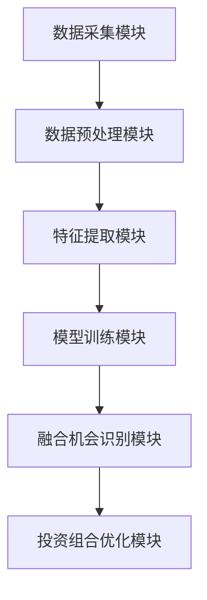

                 


# AI智能体在识别价值股与成长股融合机会中的作用

---

## 关键词
- AI智能体、价值股、成长股、股票分析、投资策略、机器学习、融合机会

---

## 摘要
本文探讨了AI智能体在识别价值股与成长股融合机会中的作用。通过结合价值股的低估值特性和成长股的高增长潜力，AI智能体能够帮助投资者发现那些同时具备价值和成长优势的股票，从而在市场中获得超额收益。文章从价值股与成长股的定义、AI智能体的核心算法、融合机会的识别方法，到实际的系统设计与项目实战，全面分析了AI智能体在股票投资中的应用价值。

---

# 第1章：价值股与成长股的定义与特征

## 1.1 价值股的定义与特征
### 1.1.1 价值股的定义
价值股是指那些市场价格低于其内在价值的股票。这类股票通常具有较低的市盈率、市净率等估值指标，被市场低估，具有较高的投资安全边际。

### 1.1.2 价值股的核心特征
- **低估值**：市盈率（P/E）和市净率（P/B）低于行业平均水平。
- **稳定收益**：企业盈利稳定，具有较高的股息率。
- **防御性**：在市场波动中表现较为稳健。

### 1.1.3 价值股的投资策略
价值投资策略的核心是寻找被市场低估的股票，并长期持有，等待其价值回归。

---

## 1.2 成长股的定义与特征
### 1.2.1 成长股的定义
成长股是指那些收入和利润快速增长，但当前估值可能较高的股票。这类股票通常属于高增长行业，具有较大的市场潜力。

### 1.2.2 成长股的核心特征
- **高增长**：收入和利润增速快于行业平均水平。
- **高估值**：市盈率和市净率可能高于行业平均水平。
- **高风险**：波动性较大，风险较高。

### 1.2.3 成长股的投资策略
成长股投资策略注重企业的未来增长潜力，通常需要承担较高的市场风险。

---

## 1.3 价值股与成长股的对比分析
### 1.3.1 价值股与成长股的异同点
| 特性 | 价值股 | 成长股 |
|------|--------|--------|
| 估值 | 低     | 高     |
| 收益 | 稳定   | 快速增长 |
| 风险 | 低     | 高     |

### 1.3.2 价值股与成长股的投资策略差异
- 价值股投资注重安全性和稳定性，适合风险厌恶型投资者。
- 成长股投资注重增长潜力，适合风险偏好型投资者。

### 1.3.3 价值股与成长股的融合机会
- 识别那些具有低估值但同时具备高增长潜力的股票。
- 在市场波动中，寻找价值股的低估机会和成长股的高增长潜力的结合点。

---

## 1.4 本章小结
本章介绍了价值股和成长股的定义、特征及其投资策略，为后续分析AI智能体在识别这两种股票融合机会中的作用奠定了基础。

---

# 第2章：AI智能体的基本概念与核心原理

## 2.1 AI智能体的定义与分类
### 2.1.1 AI智能体的定义
AI智能体是指能够感知环境、做出决策并执行操作的智能系统。它能够通过数据输入、算法处理和输出结果来完成特定任务。

### 2.1.2 AI智能体的分类
- **基于规则的智能体**：通过预定义的规则进行决策。
- **基于机器学习的智能体**：通过数据训练来学习和优化决策模型。
- **基于深度学习的智能体**：利用神经网络进行特征提取和决策。

### 2.1.3 AI智能体的核心特征
- **自主性**：能够自主决策。
- **反应性**：能够实时感知环境变化。
- **学习能力**：能够通过数据优化决策模型。

---

## 2.2 AI智能体在金融领域的应用
### 2.2.1 AI智能体在金融分析中的作用
- **股票预测**：通过历史数据和市场信息预测股票价格走势。
- **风险评估**：评估投资组合的风险。
- **投资决策**：基于数据分析和模型预测辅助投资决策。

### 2.2.2 AI智能体在股票预测中的应用
- **机器学习模型**：如线性回归、支持向量机（SVM）、随机森林等。
- **深度学习模型**：如LSTM、CNN等。

### 2.2.3 AI智能体在投资决策中的价值
- **提高效率**：通过自动化分析大量数据，快速做出决策。
- **降低风险**：通过模型预测和风险评估优化投资组合。

---

## 2.3 AI智能体的核心算法与技术
### 2.3.1 机器学习算法
- **线性回归**：用于预测股票价格。
- **支持向量机（SVM）**：用于分类问题。
- **随机森林**：用于特征重要性分析和分类。

### 2.3.2 自然语言处理技术
- **文本挖掘**：分析新闻、财报等文本数据。
- **情感分析**：通过社交媒体情绪预测市场走势。

### 2.3.3 深度学习模型
- **LSTM**：用于时间序列预测。
- **CNN**：用于图像和文本特征提取。

---

## 2.4 本章小结
本章介绍了AI智能体的基本概念、分类及其在金融领域的应用，重点讲解了相关的核心算法和技术。

---

# 第3章：AI智能体在价值股与成长股识别中的应用

## 3.1 价值股识别的AI智能体模型
### 3.1.1 数据特征提取
- **估值指标**：市盈率、市净率、股息率。
- **财务指标**：净利润增长率、营业收入增长率。

### 3.1.2 模型训练与优化
- **特征选择**：使用随机森林模型筛选重要特征。
- **模型训练**：使用逻辑回归或SVM进行分类。
- **模型优化**：调整超参数，如正则化系数、学习率等。

### 3.1.3 模型评估与验证
- **准确率**：分类模型的正确预测比例。
- **召回率**：模型识别为价值股的比例。

---

## 3.2 成长股识别的AI智能体模型
### 3.2.1 数据特征提取
- **增长指标**：收入增长率、净利润增长率。
- **估值指标**：市盈率、市净率。

### 3.2.2 模型训练与优化
- **特征选择**：使用LSTM模型捕捉时间序列特征。
- **模型训练**：使用随机森林或XGBoost进行分类。
- **模型优化**：调整学习率、树的深度等参数。

### 3.2.3 模型评估与验证
- **准确率**：分类模型的正确预测比例。
- **F1分数**：综合考虑准确率和召回率。

---

## 3.3 价值股与成长股融合机会的识别
### 3.3.1 融合机会的定义
融合机会是指那些同时具备价值股的低估值特性和成长股的高增长潜力的股票。

### 3.3.2 融合机会的识别方法
- **特征提取**：同时提取价值股和成长股的特征。
- **模型训练**：使用集成学习模型（如随机森林、XGBoost）进行分类。
- **融合策略**：通过加权评分法对股票进行排序。

### 3.3.3 融合机会的评估与优化
- **风险控制**：通过波动率和相关性优化投资组合。
- **回测分析**：通过历史数据验证模型的稳定性。

---

## 3.4 本章小结
本章详细介绍了AI智能体在价值股和成长股识别中的应用，包括特征提取、模型训练和融合机会的识别方法。

---

# 第4章：AI智能体在股票市场中的算法原理

## 4.1 机器学习算法在股票预测中的应用
### 4.1.1 线性回归模型
线性回归模型用于预测股票价格的变化趋势。

$$ y = \beta_0 + \beta_1 x + \epsilon $$

其中，$y$是预测的股票价格，$x$是自变量（如历史价格、成交量），$\beta_0$和$\beta_1$是模型参数，$\epsilon$是误差项。

### 4.1.2 支持向量机（SVM）
SVM用于股票分类问题，如判断股票是否为价值股或成长股。

### 4.1.3 随机森林模型
随机森林模型用于特征重要性分析和分类。

---

## 4.2 深度学习算法在股票预测中的应用
### 4.2.1 长短期记忆网络（LSTM）
LSTM用于时间序列预测，能够捕捉股票价格的长期依赖关系。

### 4.2.2 卷积神经网络（CNN）
CNN用于图像和文本特征提取，如分析K线图和新闻数据。

---

## 4.3 本章小结
本章详细介绍了机器学习和深度学习算法在股票预测中的应用，包括线性回归、SVM、随机森林、LSTM和CNN等模型。

---

# 第5章：AI智能体在价值股与成长股融合机会中的系统设计

## 5.1 系统功能设计
### 5.1.1 数据采集模块
- 数据来源：股票市场数据、财务报表、新闻资讯。
- 数据预处理：清洗、特征提取、标准化。

### 5.1.2 模型训练模块
- 特征选择：使用随机森林筛选重要特征。
- 模型训练：使用XGBoost进行分类。
- 模型优化：调整超参数，如学习率、树的深度等。

### 5.1.3 融合机会识别模块
- 融合策略：加权评分法。
- 投资组合优化：基于波动率和相关性优化投资组合。

---

## 5.2 系统架构设计
### 5.2.1 系统架构图


### 5.2.2 系统接口设计
- 数据接口：与股票数据源对接。
- 模型接口：与机器学习框架（如TensorFlow、Scikit-learn）对接。
- 用户接口：提供可视化界面供用户查看结果。

---

## 5.3 本章小结
本章详细介绍了AI智能体在价值股与成长股融合机会识别中的系统设计，包括功能模块和系统架构。

---

# 第6章：项目实战——AI智能体识别价值股与成长股融合机会

## 6.1 项目背景
本项目旨在利用AI智能体识别那些同时具备价值股和成长股特征的股票，帮助投资者在市场中获得超额收益。

## 6.2 环境配置
- **编程语言**：Python 3.8+
- **机器学习框架**：Scikit-learn、XGBoost
- **深度学习框架**：TensorFlow、Keras
- **数据处理工具**：Pandas、NumPy

## 6.3 核心代码实现
### 6.3.1 数据处理
```python
import pandas as pd
import numpy as np

# 加载数据
data = pd.read_csv('stock_data.csv')

# 数据清洗
data = data.dropna()

# 特征提取
features = ['PE', 'PB', 'Revenue Growth', 'Net Profit Growth']
target = 'is_undervalued'

X = data[features]
y = data[target]
```

### 6.3.2 模型训练
```python
from sklearn.ensemble import RandomForestClassifier
from sklearn.model_selection import GridSearchCV

# 参数调优
param_grid = {
    'n_estimators': [100, 200],
    'max_depth': [None, 10, 20],
    'min_samples_split': [2, 5]
}

grid_search = GridSearchCV(RandomForestClassifier(), param_grid, cv=5)
grid_search.fit(X, y)

best_model = grid_search.best_estimator_
```

### 6.3.3 融合机会识别
```python
import xgboost as xgb

# 训练模型
dtrain = xgb.DMatrix(X, label=y)
params = {
    'n_estimators': 200,
    'learning_rate': 0.05,
    'max_depth': 6
}
model = xgb.train(params, dtrain)

# 预测结果
dtest = xgb.DMatrix(X_test)
y_pred = model.predict(dtest)
```

---

## 6.4 项目小结
本项目通过AI智能体识别价值股和成长股的融合机会，展示了如何利用机器学习模型进行股票分析和投资决策。

---

# 第7章：总结与扩展

## 7.1 最佳实践
- **数据质量**：确保数据的完整性和准确性。
- **模型优化**：通过交叉验证和超参数调优提高模型性能。
- **风险管理**：合理配置投资组合，控制市场风险。

## 7.2 本章小结
本文详细介绍了AI智能体在识别价值股与成长股融合机会中的应用，通过理论分析和实际案例展示了其在股票投资中的巨大潜力。

## 7.3 拓展阅读
- 《机器学习实战》——周志华
- 《深度学习》——Ian Goodfellow
- 《股票投资实战技巧》——彼得·林奇

---

# 作者：AI天才研究院/AI Genius Institute & 禅与计算机程序设计艺术 /Zen And The Art of Computer Programming

