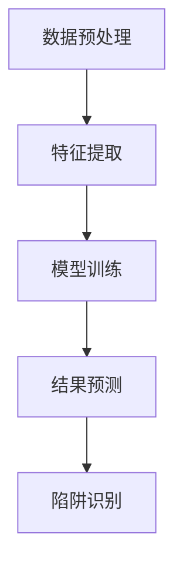
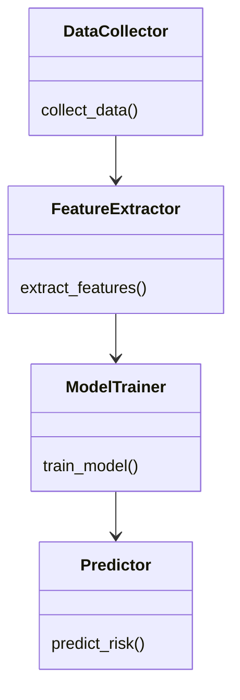
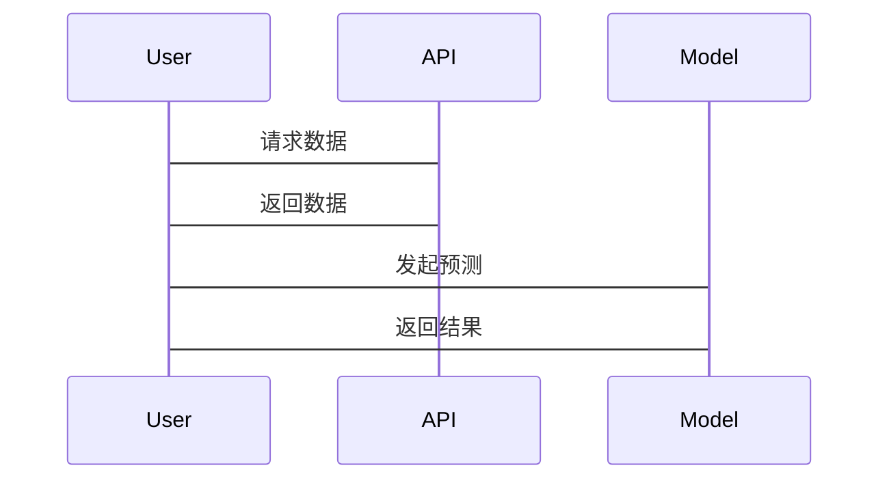

                 


# AI智能体在识别价值陷阱中的应用

## 关键词：
AI智能体, 价值陷阱, 机器学习, 监督学习, 强化学习, 数据分析, 系统架构

## 摘要：
本文探讨AI智能体在识别价值陷阱中的应用，分析其在金融、投资和风险管理中的重要性。通过详细讲解核心概念、算法原理、系统架构和实战案例，展示AI如何帮助识别隐藏风险，提升决策效率。

---

## 第三章：算法原理讲解

### 3.1 基于监督学习的陷阱识别算法

#### 3.1.1 算法流程图


#### 3.1.2 Python实现示例
```python
import pandas as pd
from sklearn.model_selection import train_test_split
from sklearn.linear_model import LogisticRegression

# 数据加载与预处理
data = pd.read_csv('data.csv')
X = data[['feature1', 'feature2', ...]]
y = data['target']

# 数据分割
X_train, X_test, y_train, y_test = train_test_split(X, y, test_size=0.2)

# 模型训练
model = LogisticRegression()
model.fit(X_train, y_train)

# 预测与评估
accuracy = model.score(X_test, y_test)
print(f'模型准确率：{accuracy}')
```

#### 3.1.3 数学模型与公式
模型的损失函数可以表示为：
$$ L = -\frac{1}{m} \sum_{i=1}^{m} [y_i \log(h(x_i)) + (1 - y_i) \log(1 - h(x_i))] $$
其中，$h(x) = \frac{1}{1 + e^{-\beta x}}$ 是sigmoid函数，$\beta$ 是模型参数。

---

## 第四章：系统分析与架构设计方案

### 4.1 项目背景与目标
本项目旨在开发一个AI智能体，用于识别金融市场中的价值陷阱。系统将实时分析市场数据，识别潜在风险，辅助投资者做出明智决策。

### 4.2 系统功能设计

#### 4.2.1 领域模型（类图）


#### 4.2.2 系统架构图
```mermaid
container DataSource {
    API接口
}
container ProcessingLayer {
    数据预处理模块
}
container ModelLayer {
    AI智能体模型
}
container ResultLayer {
    结果展示模块
}
DataSource --> ProcessingLayer
ProcessingLayer --> ModelLayer
ModelLayer --> ResultLayer
```

#### 4.2.3 接口设计与交互流程


---

## 第五章：项目实战

### 5.1 环境安装与配置
需要安装Python、TensorFlow、Scikit-learn等库，确保环境配置正确。

### 5.2 核心系统实现

#### 5.2.1 数据准备
```python
import pandas as pd
data = pd.read_csv('data.csv')
print(data.head())
```

#### 5.2.2 模型实现
```python
from tensorflow.keras import layers
model = tf.keras.Sequential([
    layers.Dense(64, activation='relu'),
    layers.Dense(1, activation='sigmoid')
])
model.compile(optimizer='adam', loss='binary_crossentropy', metrics=['accuracy'])
model.fit(X_train, y_train, epochs=10, batch_size=32)
```

#### 5.2.3 结果分析
```python
y_pred = model.predict(X_test)
print(classification_report(y_test, y_pred))
```

### 5.3 案例分析与解读
通过具体案例，展示AI智能体如何识别价值陷阱，分析预测结果并总结经验。

---

## 第六章：最佳实践与总结

### 6.1 小结与注意事项
- 数据质量直接影响模型性能。
- 模型的可解释性在金融领域尤为重要。
- 定期更新模型以适应市场变化。

### 6.2 未来趋势与扩展阅读
- 深度学习在复杂场景中的应用。
- 结合自然语言处理（NLP）进行文本数据分析。

---

## 作者
作者：AI天才研究院 & 禅与计算机程序设计艺术

---

以上是《AI智能体在识别价值陷阱中的应用》的完整目录和内容概要，涵盖了从基础概念到实战应用的各个方面，旨在为读者提供全面而深入的指导。

