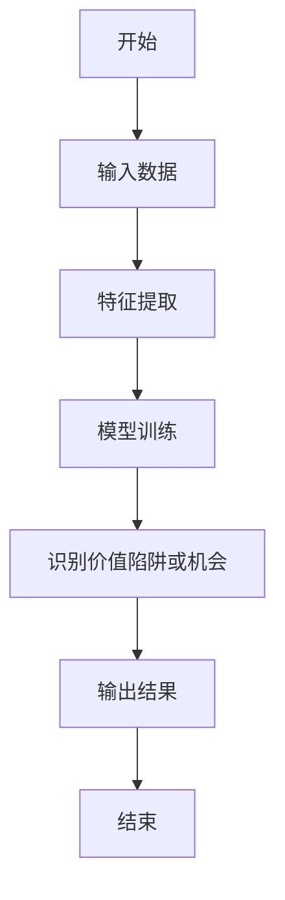
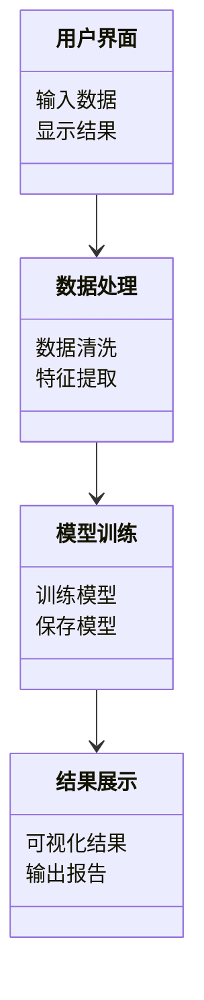
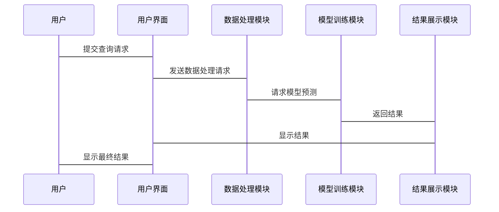

                 


# AI智能体在识别价值陷阱和价值机会中的作用

## 关键词：
- AI智能体、价值陷阱、价值机会、风险管理、价值识别、算法原理、系统架构

## 摘要：
AI智能体在识别价值陷阱和价值机会中扮演着越来越重要的角色。随着人工智能技术的快速发展，AI智能体能够通过复杂的数据分析和模式识别，帮助企业和个人有效识别潜在的价值陷阱和机会。本文详细探讨了AI智能体的核心概念、算法原理、系统架构，以及在实际应用中的案例分析，旨在为企业和研究者提供理论支持和实践指导。

---

## 目录

1. **背景介绍**
   - 1.1 问题背景
   - 1.2 问题描述
   - 1.3 问题解决
   - 1.4 边界与外延

2. **核心概念与联系**
   - 2.1 核心概念原理
   - 2.2 概念属性特征对比
   - 2.3 ER实体关系图

3. **算法原理讲解**
   - 3.1 算法流程图
   - 3.2 数学模型与公式

4. **系统分析与架构设计**
   - 4.1 问题场景介绍
   - 4.2 项目介绍
   - 4.3 系统功能设计
   - 4.4 系统架构设计
   - 4.5 系统接口设计
   - 4.6 系统交互设计

5. **项目实战**
   - 5.1 环境安装
   - 5.2 核心实现
   - 5.3 案例分析

6. **小结与展望**
   - 6.1 最佳实践
   - 6.2 小结
   - 6.3 注意事项
   - 6.4 拓展阅读

---

## 1. 背景介绍

### 1.1 问题背景
- **价值识别的挑战**：在商业和投资领域，识别价值陷阱和机会至关重要。价值陷阱是指表面上看似有价值但实际上存在重大缺陷或风险的项目或资产。价值机会则是指具有潜在增长潜力和竞争优势的项目或资产。然而，识别这些陷阱和机会往往面临数据复杂、信息不全、市场波动大等挑战。
- **问题描述**：传统的人工分析方法效率低下，容易受到主观因素和经验限制。因此，引入AI智能体来自动化识别价值陷阱和机会成为必然趋势。
- **问题解决**：AI智能体通过大数据分析、机器学习和自然语言处理等技术，能够快速识别潜在的价值陷阱和机会。
- **边界与外延**：本文主要聚焦于AI智能体在金融投资和商业决策中的应用，未来可扩展至其他领域，如市场营销和风险管理。

### 1.2 核心概念
- **AI智能体**：具备自主学习和决策能力的智能系统，能够通过数据输入输出与环境交互。
- **价值陷阱**：表面上具有吸引力但实际存在重大缺陷或风险的项目或资产。
- **价值机会**：具有潜在增长潜力和竞争优势的项目或资产。

---

## 2. 核心概念与联系

### 2.1 核心概念原理
- **AI智能体的工作原理**：通过数据采集、特征提取、模型训练和结果输出，帮助识别价值陷阱和机会。
- **价值识别的数学模型**：基于机器学习的分类模型，如支持向量机（SVM）和随机森林（Random Forest）。
- **价值陷阱与机会的区分机制**：通过特征工程和模型调优，优化分类效果。

### 2.2 概念属性特征对比
| 属性 | 价值陷阱 | 价值机会 |
|------|----------|----------|
| 特征1 | 表现不佳 | 表现优异 |
| 特征2 | 风险较高 | 风险较低 |
| 特征3 | 市场反应 | 市场认可 |

### 2.3 ER实体关系图
```mermaid
erd
    entity AI智能体 {
        id
        类型
        功能
    }
    entity 价值陷阱 {
        id
        特征
        类型
    }
    entity 价值机会 {
        id
        特征
        类型
    }
    AI智能体 --> 价值陷阱: 识别
    AI智能体 --> 价值机会: 识别
```

---

## 3. 算法原理讲解

### 3.1 算法流程图


### 3.2 数学模型与公式
- **价值识别的数学模型**：使用随机森林模型进行分类。
  $$
  y = \text{ RandomForestClassifier}(X)
  $$
  其中，$X$ 是输入特征向量，$y$ 是分类结果（1表示价值机会，0表示价值陷阱）。
- **特征重要性计算**：通过特征重要性排序，找出影响价值识别的关键特征。

---

## 4. 系统分析与架构设计

### 4.1 问题场景介绍
- 在金融投资中，投资者需要快速识别价值陷阱和机会。传统的分析方法耗时且效率低下，容易受到主观因素影响。通过AI智能体，投资者可以实时获取分析结果，辅助决策。

### 4.2 项目介绍
- 开发一个基于机器学习的AI智能体，用于识别股票市场中的价值陷阱和机会。

### 4.3 系统功能设计
- **领域模型**：设计用户界面、数据处理、模型训练和结果展示模块。


### 4.4 系统架构设计


### 4.5 系统接口设计
- **API接口**：提供RESTful API，供其他系统调用识别结果。

### 4.6 系统交互设计


---

## 5. 项目实战

### 5.1 环境安装
- 安装Python、NumPy、Pandas、Scikit-learn和Plotly。

### 5.2 核心实现
```python
import pandas as pd
from sklearn.ensemble import RandomForestClassifier
from sklearn.metrics import accuracy_score

# 数据加载
data = pd.read_csv('value_data.csv')

# 特征提取
X = data.drop('target', axis=1)
y = data['target']

# 模型训练
model = RandomForestClassifier()
model.fit(X, y)

# 模型预测
y_pred = model.predict(X)
print("准确率:", accuracy_score(y, y_pred))
```

### 5.3 案例分析
- 使用上述代码对股票数据进行分析，识别价值陷阱和机会。通过特征重要性分析，找出影响价值识别的关键因素。

---

## 6. 小结与展望

### 6.1 最佳实践
- 数据预处理是关键，确保数据质量。
- 模型调优可以提高分类准确率。

### 6.2 小结
本文详细探讨了AI智能体在识别价值陷阱和机会中的应用，介绍了核心概念、算法原理和系统架构，并通过案例分析展示了实际应用。

### 6.3 注意事项
- 数据隐私和模型解释性是未来研究的重点。

### 6.4 拓展阅读
- 推荐阅读《Python机器学习实战》和《深入理解机器学习》。

---

## 作者：AI天才研究院/AI Genius Institute & 禅与计算机程序设计艺术 /Zen And The Art of Computer Programming

---

希望这篇文章能够为您提供有价值的信息和启发！

