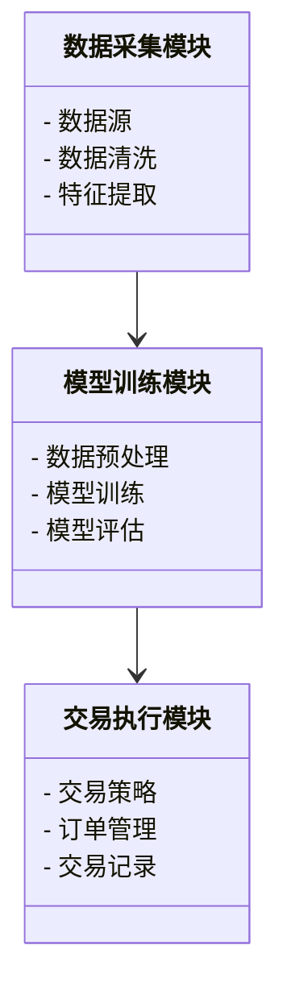
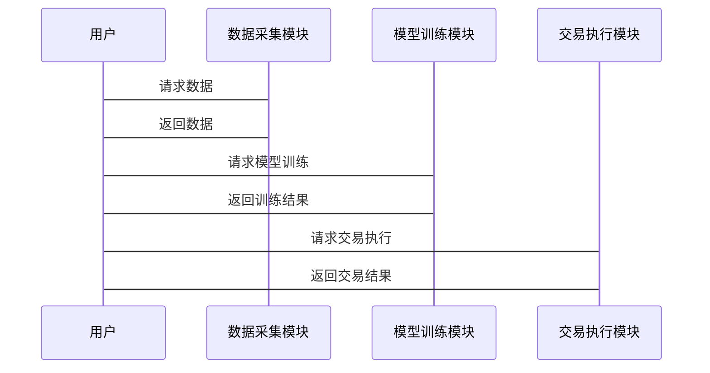

                 


# AI智能体在识别优质成长股中的应用

> 关键词：AI智能体，优质成长股，量化投资，强化学习，算法交易

> 摘要：本文探讨了AI智能体在识别优质成长股中的应用，详细介绍了AI智能体的核心概念、算法原理、系统架构设计以及实际项目案例。通过结合强化学习、监督学习等算法，分析了AI智能体如何在股票市场中进行高效的投资决策，并展示了如何通过系统设计实现智能化的股票筛选与交易策略。

---

## 第1章：AI智能体与成长股识别的背景介绍

### 1.1 AI智能体的基本概念与特点

AI智能体（Artificial Intelligence Agent）是指具备感知环境、做出决策并执行行动能力的智能系统。它能够通过数据输入和环境反馈，自主学习和优化策略。AI智能体的核心特点包括：

1. **自主性**：能够在没有外部干预的情况下独立运行。
2. **反应性**：能够实时感知环境变化并做出响应。
3. **目标导向性**：通过设定目标来指导行为和决策。

### 1.2 量化投资的背景与发展

量化投资是一种基于数学模型和算法的投资策略，通过大量历史数据和统计分析来寻找投资机会。随着计算能力的提升和数据量的增加，量化投资逐渐成为金融领域的重要方法。AI技术的引入，进一步提升了量化投资的效率和准确性。

### 1.3 成长股的定义与识别标准

成长股是指那些收入和利润持续增长，具有较高成长潜力的公司股票。识别成长股的关键指标包括：

1. **收入增长率**：公司过去几年的收入增长率是否稳定且高于行业平均水平。
2. **净利润增长率**：公司净利润的持续增长情况。
3. **ROE（净资产收益率）**：衡量公司盈利能力的重要指标。
4. **行业地位**：公司在行业中的竞争地位和市场影响力。

### 1.4 AI智能体在成长股识别中的应用前景

AI智能体通过分析海量数据，能够快速识别具有成长潜力的公司。其在成长股识别中的优势包括：

1. **数据处理能力**：能够处理和分析大量的历史和实时数据。
2. **模式识别能力**：通过机器学习算法发现数据中的潜在规律。
3. **动态调整能力**：根据市场变化实时优化投资策略。

---

## 第2章：AI智能体的感知机制

### 2.1 数据采集与特征提取

#### 2.1.1 金融数据的多维度采集

AI智能体需要采集包括股票价格、成交量、财务报表数据、新闻资讯等多维度的金融数据。这些数据可以来自不同的来源，如股票交易所、财经网站和社交媒体等。

#### 2.1.2 关键特征的识别与提取

在数据采集后，需要进行特征提取，将原始数据转化为能够反映公司成长潜力的特征。例如，计算市盈率、市净率、ROE等指标。

#### 2.1.3 数据预处理与清洗

为了确保数据的质量，需要进行数据清洗，包括处理缺失值、异常值和重复数据等。

### 2.2 市场情绪分析

#### 2.2.1 自然语言处理在情绪分析中的应用

通过自然语言处理技术，分析新闻、社交媒体等文本数据，评估市场情绪。例如，使用情感分析模型判断新闻标题是正面、中性还是负面。

#### 2.2.2 基于新闻和社交媒体的市场情绪监控

实时监控市场情绪变化，帮助识别市场趋势和潜在的投资机会。

### 2.3 市场趋势预测

#### 2.3.1 时间序列分析的基本原理

时间序列分析是一种通过历史数据预测未来趋势的方法。常用的方法包括ARIMA、LSTM等。

#### 2.3.2 基于AI的市场趋势预测模型

使用深度学习模型，如LSTM，进行时间序列预测，提升市场趋势预测的准确性。

---

## 第3章：AI智能体的决策机制

### 3.1 强化学习在投资决策中的应用

#### 3.1.1 强化学习的基本原理

强化学习是一种通过试错机制来优化决策的算法。AI智能体会通过与环境的交互，学习最优策略。

#### 3.1.2 在股票交易中的策略优化

通过强化学习，优化交易策略，如买卖时机的选择和仓位管理。

### 3.2 监督学习与非监督学习的应用

#### 3.2.1 监督学习在分类与回归中的应用

监督学习可以用于股票价格预测和分类问题，如判断股票是否为成长股。

#### 3.2.2 非监督学习在聚类分析中的应用

非监督学习可以用于将股票分为不同的类别，帮助识别具有相似特征的股票。

### 3.3 组合优化与风险控制

#### 3.3.1 基于AI的资产配置优化

通过AI算法优化投资组合，平衡风险与收益。

#### 3.3.2 风险管理与止损策略的智能化

智能化的风险管理能够实时监控投资组合的风险，动态调整止损点。

---

## 第4章：AI智能体的行动机制

### 4.1 自动化交易系统的设计

#### 4.1.1 交易策略的自动化执行

通过自动化交易系统，AI智能体能够实时执行交易策略。

#### 4.1.2 系统化的订单管理与执行

自动化订单管理能够优化交易成本和执行效率。

### 4.2 动态调整与反馈机制

#### 4.2.1 实时数据反馈对策略的影响

根据实时市场数据，动态调整交易策略。

#### 4.2.2 策略的动态优化与调整

通过反馈机制，不断优化交易策略，提升盈利能力。

### 4.3 交易成本与效率的平衡

#### 4.3.1 交易成本的最小化策略

通过优化交易频率和订单类型，降低交易成本。

#### 4.3.2 交易效率的提升方法

通过技术手段提高交易执行速度和准确性。

---

## 第5章：系统分析与架构设计方案

### 5.1 问题场景介绍

AI智能体需要在复杂的金融市场环境中，实时分析数据并做出决策。系统设计需要考虑数据处理、模型训练和交易执行等多个方面。

### 5.2 项目介绍

本项目旨在开发一个基于AI智能体的股票交易系统，能够自动识别优质成长股并执行交易。

### 5.3 系统功能设计

#### 5.3.1 领域模型设计（Mermaid类图）



### 5.4 系统架构设计（Mermaid架构图）

```mermaid
browser
    --> HTTP 请求
    --- 接口层
    ---- 服务层
        --- 数据层
            ---- 数据库
```

### 5.5 系统接口设计

系统需要设计数据接口和交易接口，确保各模块之间的数据传输和交易执行。

### 5.6 系统交互设计（Mermaid序列图）



---

## 第6章：项目实战

### 6.1 环境安装

需要安装Python、TensorFlow、Keras等工具，并配置股票数据接口。

### 6.2 系统核心实现源代码

以下是一个简单的股票筛选算法示例：

```python
import pandas as pd
import numpy as np

# 加载数据
data = pd.read_csv('stock_data.csv')

# 特征提取
data['增长率'] = data['收盘价'].pct_change()

# 模型训练
from sklearn.linear_model import LinearRegression
model = LinearRegression()
model.fit(data[['增长率']], data['收盘价'])

# 预测
predictions = model.predict(data[['增长率']])
```

### 6.3 代码应用解读与分析

上述代码展示了如何使用线性回归模型进行股票价格预测。通过特征提取和模型训练，可以预测股票价格的变化趋势。

### 6.4 实际案例分析

以某成长股为例，分析其历史数据和模型预测结果，评估模型的准确性和实用性。

### 6.5 项目小结

通过实际案例分析，验证了AI智能体在成长股识别中的有效性，并总结了项目实施的关键点。

---

## 第7章：最佳实践与小结

### 7.1 最佳实践 tips

1. 数据质量是关键，确保数据的准确性和完整性。
2. 算法选择要根据具体问题，结合数据特点和业务需求。
3. 系统设计要注重可扩展性和可维护性。

### 7.2 小结

AI智能体在识别优质成长股中的应用，展现了人工智能在金融领域的巨大潜力。通过科学的系统设计和算法优化，可以显著提升投资决策的效率和准确性。

### 7.3 注意事项

1. 风险控制是投资的核心，AI模型需要结合实际市场情况动态调整。
2. 数据隐私和安全问题需要高度重视。

### 7.4 拓展阅读

推荐阅读《机器学习实战》、《深度学习》等书籍，深入学习相关算法和应用。

---

## 作者：AI天才研究院 & 禅与计算机程序设计艺术

通过本文的详细讲解，希望读者能够深入了解AI智能体在识别优质成长股中的应用，并能够在实际投资中灵活运用这些技术。

