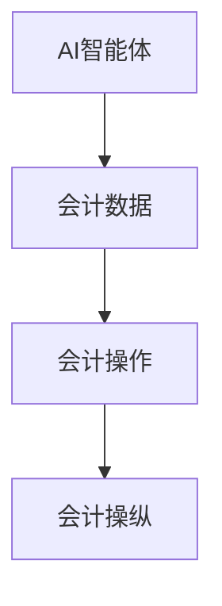
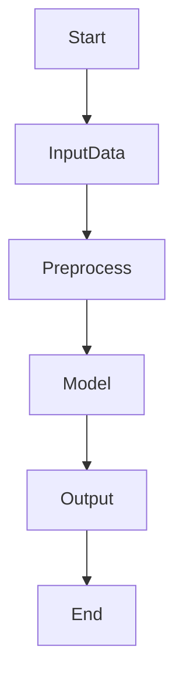
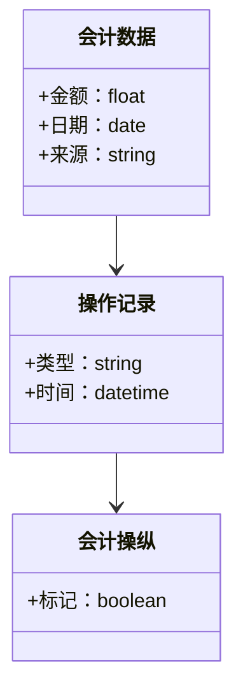
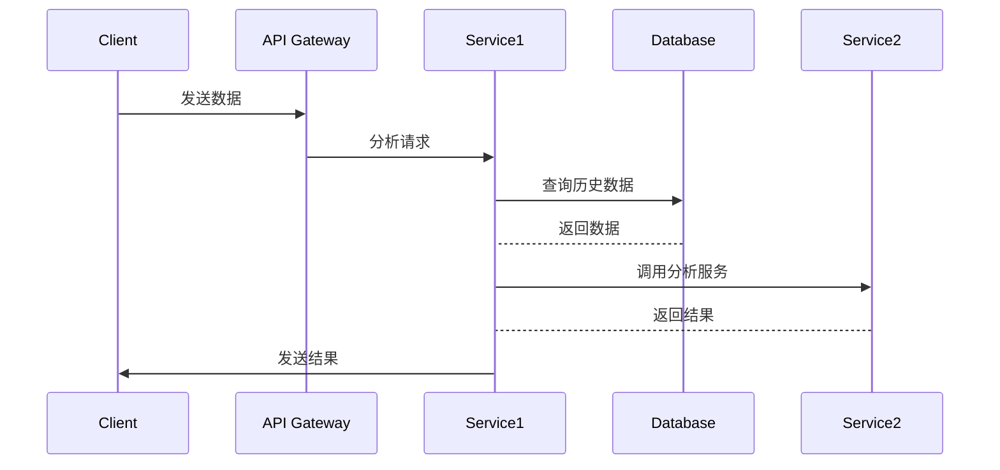

                 


# AI智能体在识别会计操纵中的应用

## 关键词：
AI智能体，会计操纵，识别，机器学习，金融欺诈

## 摘要：
本文探讨AI智能体在识别会计操纵中的应用，从概念、算法、系统设计到项目实战，系统阐述如何利用AI技术提升会计数据真实性，防范财务欺诈。

# 第1章 AI智能体与会计操纵概述

## 1.1 AI智能体的基本概念
### 1.1.1 AI智能体的定义
AI智能体是具备感知环境、决策并执行任务的智能系统，能根据反馈不断优化行为。

### 1.1.2 AI智能体的核心特点
- **自主性**：无需外部干预
- **反应性**：实时感知环境
- **目标导向**：有明确的目标
- **学习能力**：通过经验改进

### 1.1.3 AI智能体与传统AI的区别
传统AI依赖预设规则，AI智能体具备自主决策能力，能动态调整策略。

## 1.2 会计操纵的定义与特点
### 1.2.1 会计操纵的定义
会计操纵指通过操控会计数据，提供虚假财务信息的行为。

### 1.2.2 会计操纵的主要形式
- **虚构收入**：虚增收入
- **隐藏成本**：隐瞒支出
- **资产虚增**：夸大资产价值

### 1.2.3 会计操纵的识别难点
- 数据复杂性
- 方法隐蔽性
- 需专业判断

## 1.3 AI智能体在会计操纵识别中的应用前景
### 1.3.1 会计操纵识别的潜在应用领域
- 企业内部审计
- 第三方审计机构
- 金融监管机构

### 1.3.2 AI智能体在会计操纵识别中的优势
- **高效性**：快速处理大量数据
- **准确性**：减少人为错误
- **实时性**：实时监控数据变化

### 1.3.3 会计操纵识别中的挑战与机遇
- **挑战**：数据隐私、模型泛化能力
- **机遇**：技术创新、数据驱动

## 1.4 本章小结
本章介绍了AI智能体和会计操纵的基本概念，分析了AI技术在会计欺诈识别中的潜力和挑战。

# 第2章 AI智能体与会计操纵的核心概念

## 2.1 AI智能体识别会计操纵的背景介绍
### 2.1.1 问题背景
随着企业数据化，会计欺诈手段日益复杂，传统方法难以应对。

### 2.1.2 问题描述
会计数据真实性对企业决策至关重要，欺诈行为可能导致严重后果。

### 2.1.3 问题解决
利用AI技术建立智能识别系统，提升欺诈检测能力。

### 2.1.4 边界与外延
明确会计操纵的边界，如区分合法调整与恶意欺诈。

### 2.1.5 概念结构与核心要素组成
- **输入**：会计数据
- **处理**：AI分析
- **输出**：欺诈标记

## 2.2 AI智能体与会计操纵的核心概念对比
### 2.2.1 核心概念原理
| 概念 | 定义 | 特性 |
|------|------|------|
| AI智能体 | 智能系统 | 自主、反应、目标导向 |
| 会计操纵 | 欺诈行为 | 隐蔽、复杂 |

### 2.2.2 ER实体关系图架构


## 2.3 本章小结
通过对比分析，明确了AI智能体在会计操纵识别中的核心作用。

# 第3章 算法原理与数学模型

## 3.1 算法原理
### 3.1.1 AI智能体识别会计操纵的算法选择
- **监督学习**：分类任务
- **非监督学习**：异常检测
- **强化学习**：策略优化

### 3.1.2 监督学习算法的原理
以随机森林为例，训练模型识别欺诈标记。

### 3.1.3 非监督学习算法的原理
使用聚类算法，发现异常交易模式。

### 3.1.4 强化学习算法的原理
通过试错，优化决策策略。

## 3.2 算法流程图


## 3.3 算法实现代码示例
```python
# 示例代码：监督学习算法实现
def preprocess_data(data):
    # 数据预处理
    pass

def train_model(train_data, train_labels):
    # 模型训练
    pass

def evaluate_model(model, test_data, test_labels):
    pass

# 数学模型
$$y = \sum_{i=1}^{n} w_i x_i + b$$
```

## 3.4 本章小结
详细讲解了AI智能体识别会计操纵的算法原理，结合代码示例和数学模型，展示了技术实现路径。

# 第4章 系统分析与架构设计方案

## 4.1 系统分析
### 4.1.1 问题场景介绍
企业财务数据复杂，需要实时监控。

### 4.1.2 项目介绍
开发AI智能体识别会计操纵系统，提升审计效率。

## 4.2 系统功能设计
### 4.2.1 领域模型


### 4.2.2 系统架构设计
```mermaid
graph TD
    Client --> API Gateway
    API Gateway --> Service1
    Service1 --> Database
    Service2 --> Database
    Database --> Service3
```

### 4.2.3 系统接口设计
- **输入接口**：接收会计数据
- **输出接口**：返回欺诈标记

### 4.2.4 系统交互设计


## 4.3 本章小结
详细描述了系统的架构设计，展示了各模块之间的交互关系。

# 第5章 项目实战

## 5.1 环境安装
### 5.1.1 安装Python
```
# 安装Python和pip
sudo apt-get install python3 python3-pip
```

### 5.1.2 安装依赖库
```
pip install numpy pandas scikit-learn
```

## 5.2 系统核心实现源代码
```python
import numpy as np
import pandas as pd
from sklearn.ensemble import RandomForestClassifier
from sklearn.model_selection import train_test_split
from sklearn.metrics import accuracy_score

# 数据预处理
def preprocess_data(data):
    # 假设data是包含会计数据的DataFrame
    return data

# 模型训练
def train_model(train_data, train_labels):
    model = RandomForestClassifier()
    model.fit(train_data, train_labels)
    return model

# 模型评估
def evaluate_model(model, test_data, test_labels):
    predictions = model.predict(test_data)
    print(f'Accuracy: {accuracy_score(test_labels, predictions)}')

# 示例代码：训练数据集的使用
data = pd.DataFrame({
    '金额': [100, 200, 300, 400],
    '日期': ['2023-01-01', '2023-01-02', '2023-01-03', '2023-01-04'],
    '来源': ['销售', '采购', '投资', '其他']
})

labels = pd.Series([0, 0, 1, 1])  # 0代表正常，1代表欺诈

train_data, test_data, train_labels, test_labels = train_test_split(data, labels, test_size=0.2)

model = train_model(train_data, train_labels)
evaluate_model(model, test_data, test_labels)
```

## 5.3 代码应用解读与分析
上述代码展示了如何利用随机森林算法训练模型，识别会计数据中的欺诈行为。通过数据预处理、模型训练和评估，展示了AI智能体在会计操纵识别中的具体应用。

## 5.4 实际案例分析
以某公司为例，分析其会计数据，利用模型识别潜在的欺诈行为，展示如何通过AI技术提升审计效率。

## 5.5 项目小结
通过项目实战，验证了AI智能体在会计操纵识别中的有效性，展示了技术的实际应用价值。

## 5.6 本章小结
本章通过实战项目，详细讲解了AI智能体识别会计操纵的实现过程，从环境搭建到代码实现，再到案例分析，为读者提供了实践指导。

# 第6章 总结与展望

## 6.1 全文总结
本文系统阐述了AI智能体在会计操纵识别中的应用，从理论到实践，详细讲解了技术实现和系统设计。

## 6.2 当前研究的不足
- 数据隐私问题
- 模型泛化能力
- 需要结合领域知识

## 6.3 未来发展方向
- 结合区块链技术
- 增强模型解释性
- 利用边缘计算优化实时性

## 6.4 最佳实践 Tips
- 数据预处理至关重要
- 选择合适算法模型
- 持续优化系统性能

## 6.5 本章小结
总结全文，展望未来发展，为读者指明研究方向。

# 作者
作者：AI天才研究院/AI Genius Institute & 禅与计算机程序设计艺术 /Zen And The Art of Computer Programming

