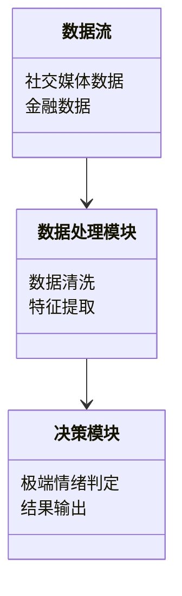
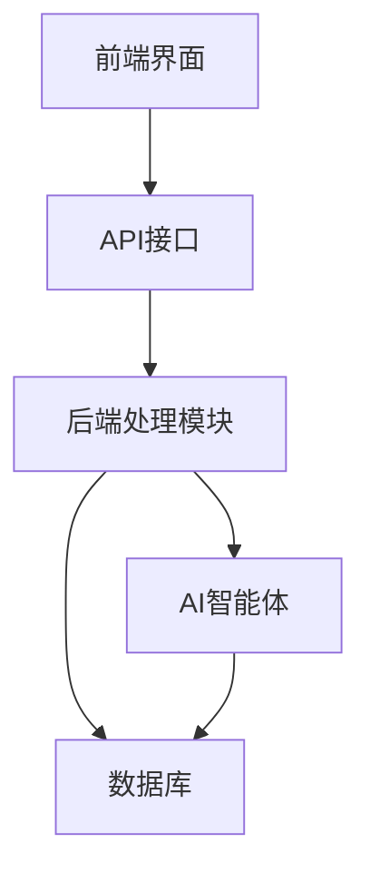

                 


# AI智能体在识别市场情绪极端值中的应用

> 关键词：AI智能体，市场情绪，极端值，情感分析，深度学习

> 摘要：本文深入探讨了AI智能体在识别市场情绪极端值中的应用，分析了市场情绪识别的核心概念、算法原理、系统架构以及实际项目案例。通过结合自然语言处理、深度学习和情感分析，本文详细阐述了如何利用AI智能体有效识别市场中的极端情绪，为投资决策提供支持。

---

## 第一部分: 背景介绍

### 第1章: 市场情绪与极端值概述

#### 1.1 市场情绪的定义与特征
市场情绪是指市场参与者（如投资者、交易员）在特定时间内的整体情感状态，通常反映在市场行为和语言中。极端值指的是市场情绪中出现的极端情况，如过度乐观或过度恐慌。

- **市场情绪的定义**：市场情绪是投资者对市场未来走势的心理预期，通常通过新闻、社交媒体、论坛等数据进行分析。
- **市场情绪的特征**：市场情绪具有波动性、群体性和传染性。极端值通常出现在市场波动剧烈的时期，如金融危机或市场泡沫破裂时。
- **极端值的特征**：极端值表现为市场情绪的剧烈波动，通常伴随着高波动率和非理性决策。

#### 1.2 AI智能体的定义与特点
AI智能体（Artificial Intelligence Agent）是指具有感知环境、自主决策和执行任务能力的智能系统。其特点包括：

- **自主性**：能够在没有外部干预的情况下独立运行。
- **反应性**：能够实时感知环境变化并做出反应。
- **学习能力**：能够通过数据和经验不断优化自身的决策能力。

#### 1.3 市场情绪识别中的问题背景
传统市场情绪分析依赖于人工经验，存在主观性强、效率低、覆盖范围有限等问题。AI智能体的应用为解决这些问题提供了新的思路：

- **传统方法的局限性**：依赖专家经验，难以处理大量非结构化数据。
- **极端情绪识别的挑战**：极端情绪通常伴随着非线性变化，传统模型难以捕捉。
- **AI智能体的优势**：能够快速处理大量数据，识别潜在模式，提供实时反馈。

---

## 第二部分: 核心概念与AI智能体的结合

### 第2章: AI智能体在市场情绪识别中的核心概念

#### 2.1 市场情绪识别的核心要素
- **数据来源**：包括社交媒体、新闻、金融数据等。
- **情感分析模型**：用于判断文本中的情感倾向。
- **极端情绪判定标准**：基于历史数据和统计模型设定的阈值。

#### 2.2 AI智能体与市场情绪识别的关系
- **AI智能体的作用**：通过实时数据处理和模型训练，帮助识别市场情绪中的极端值。
- **市场情绪识别对AI智能体的反馈机制**：情绪数据可以反哺AI智能体的决策优化。
- **协同工作原理**：AI智能体通过分析情绪数据，辅助投资者做出更明智的决策。

#### 2.3 核心概念的属性特征对比
| 概念 | 属性 | 特征 |
|------|------|------|
| 数据来源 | 多样性 | 包括文本、语音、图像等 |
| 情感分析模型 | 精度 | 基于深度学习的模型精度更高 |
| 极端情绪判定标准 | 可调性 | 可根据市场变化动态调整 |

---

## 第三部分: 算法原理与数学模型

### 第3章: 情感分析的算法原理
#### 3.1 基于词袋模型的情感分析
词袋模型将文本表示为词的集合，不考虑词序，适用于简单的文本分类任务。

#### 3.2 基于TF-IDF的特征提取
TF-IDF（Term Frequency-Inverse Document Frequency）用于衡量词的重要性，常用于文本特征提取。

#### 3.3 基于深度学习的情感分析模型
深度学习模型（如LSTM、BERT）能够捕捉文本中的语义信息，适合处理复杂的市场情绪分析任务。

### 第4章: 极端情绪识别的数学模型
#### 4.1 情感强度计算公式
$$ 情感强度 = \sum_{i=1}^{n} (w_i \cdot s_i) $$
其中，$w_i$ 是词$w_i$的权重，$s_i$ 是情感极性值。

#### 4.2 极端情绪判定阈值的设定
极端情绪判定通常基于历史数据的标准差和均值，设定动态阈值：
$$ 阈值 = \mu + k \cdot \sigma $$
其中，$\mu$ 是均值，$\sigma$ 是标准差，$k$ 是调节系数。

#### 4.3 基于概率论的极端情绪识别模型
利用贝叶斯定理，计算某段时间内市场情绪为极端值的概率：
$$ P(极端值 | 数据) = \frac{P(数据 | 极端值) \cdot P(极端值)}{P(数据)} $$

---

## 第四部分: 系统分析与架构设计

### 第5章: 问题场景介绍
#### 5.1 问题背景
本文以社交媒体上的股票评论为数据源，分析市场情绪并识别极端值。

#### 5.2 问题目标
构建一个AI智能体，实时分析社交媒体数据，识别市场情绪中的极端值。

### 第6章: 系统功能设计
#### 6.1 领域模型类图


#### 6.2 系统架构图


---

## 第五部分: 项目实战

### 第7章: 项目环境与核心代码

#### 7.1 环境安装
```bash
pip install numpy pandas scikit-learn tensorflow
```

#### 7.2 核心代码实现
```python
import numpy as np
from sklearn.feature_extraction.text import TfidfVectorizer
from sklearn.svm import SVC

# 数据清洗
def preprocess(data):
    return data.lower().replace(',', ' ')

# 特征提取
vectorizer = TfidfVectorizer(max_features=1000)
X = vectorizer.fit_transform(data)

# 模型训练
model = SVC()
model.fit(X.toarray(), labels)

# 极端情绪判定
def is_extreme(sentiment_score):
    return sentiment_score > np.mean(sentiment_scores) + 2 * np.std(sentiment_scores)
```

#### 7.3 案例分析
以某段时间内的社交媒体数据为例，分析极端情绪出现的频率和影响。

---

## 第六部分: 总结与展望

### 第8章: 总结与小结
本文详细探讨了AI智能体在识别市场情绪极端值中的应用，从理论到实践，全面分析了其在金融领域的潜力。

### 第9章: 展望与建议
- **技术优化**：结合区块链和边缘计算，提升系统的实时性和安全性。
- **领域扩展**：将AI智能体应用于更多领域，如舆情监控、社会治理等。
- **未来研究方向**：探索更复杂的情感建模方法，如多模态情感分析。

---

## 作者信息
作者：AI天才研究院  
联系方式：contact@aicourse.com  
简介：专注于人工智能领域的研究与实践，致力于推动AI技术在金融、医疗等领域的应用。

--- 

**本文由AI天才研究院编写，转载请注明出处。**

