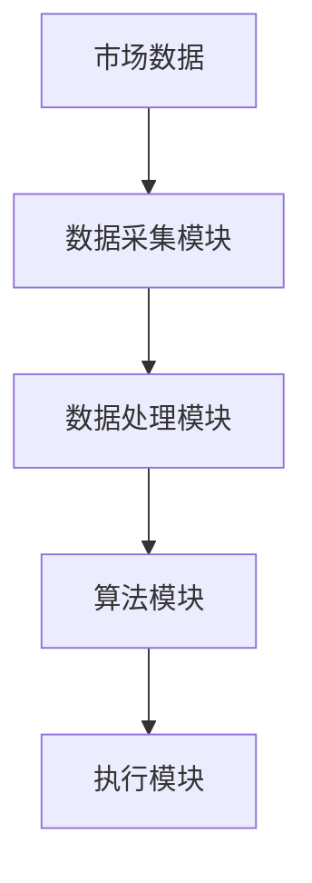
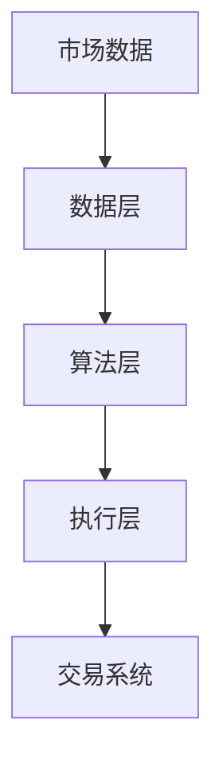
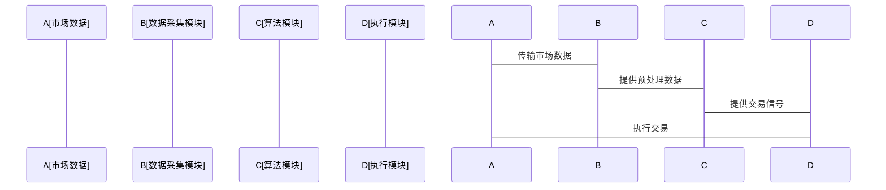

                 


# AI智能体在识别市场结构性变化中的作用

> 关键词：AI智能体，市场结构性变化，算法原理，系统架构，项目实战，数学模型

> 摘要：本文探讨了AI智能体在识别市场结构性变化中的作用，从核心概念、算法原理、系统架构到项目实战，全面分析了AI智能体在市场分析中的应用。通过实际案例和代码实现，展示了如何利用AI技术解决复杂市场问题。

---

# 第1章: AI智能体与市场结构性变化概述

## 1.1 AI智能体的基本概念

### 1.1.1 AI智能体的定义

AI智能体（Artificial Intelligence Agent，简称AI Agent）是指能够感知环境、自主决策并采取行动的智能系统。它通过传感器获取信息，利用算法处理数据，最终做出决策以实现特定目标。AI智能体广泛应用于自动驾驶、智能助手、金融交易等领域。

### 1.1.2 AI智能体的核心特征

AI智能体的核心特征包括：自主性、反应性、目标导向和学习能力。自主性使其能够独立运行，反应性使其能够实时响应环境变化，目标导向使其专注于实现特定目标，学习能力使其能够通过数据优化自身性能。

### 1.1.3 市场结构性变化的定义

市场结构性变化是指市场中供需关系、价格波动、竞争格局等基本要素的变化。这些变化可能由政策调整、技术进步、消费者行为变化等多种因素引发。识别这些变化对于企业制定战略决策至关重要。

### 1.1.4 AI智能体在识别市场变化中的作用

AI智能体能够通过大数据分析和机器学习算法，快速识别市场中的结构性变化。它不仅能够处理海量数据，还能通过预测模型提前预警潜在的变化，帮助企业做出更明智的决策。

## 1.2 AI智能体与传统市场分析方法的对比

### 1.2.1 传统市场分析方法的优缺点

传统市场分析方法依赖于人类专家的经验和市场数据的统计分析。优点是逻辑清晰、易于理解，缺点是效率低下、覆盖面有限，难以捕捉复杂市场中的细微变化。

### 1.2.2 AI智能体的创新点与优势

AI智能体的创新点在于其能够实时处理海量数据，并利用机器学习算法发现数据中的潜在模式。其优势包括高效性、精准性和适应性，能够快速响应市场变化并做出预测。

## 1.3 本章小结

本章介绍了AI智能体的基本概念和核心特征，定义了市场结构性变化，并分析了AI智能体在识别市场变化中的作用。同时，对比了传统市场分析方法与AI智能体的优缺点，强调了AI智能体在市场分析中的创新点和优势。

---

# 第2章: AI智能体的核心概念与原理

## 2.1 AI智能体的感知与决策机制

### 2.1.1 感知模块的实现原理

感知模块负责收集和处理环境中的数据。通过传感器或API接口获取市场数据，如价格、成交量等。数据预处理包括清洗、特征提取和标准化，为后续分析做好准备。

### 2.1.2 决策模块的算法选择

决策模块基于感知模块提供的数据，利用机器学习算法做出决策。常用的算法包括强化学习、监督学习和无监督学习。强化学习适用于动态环境，监督学习适用于分类任务，无监督学习适用于聚类分析。

### 2.1.3 执行模块的实现方式

执行模块根据决策模块的输出，采取具体行动。例如，在金融市场上，AI智能体可以根据预测结果自动执行买卖操作。

### 2.1.4 感知、决策、执行三者的协同工作

感知、决策和执行模块协同工作，形成闭环。感知模块获取数据，决策模块做出决策，执行模块采取行动，形成一个完整的反馈循环，确保AI智能体能够持续优化自身性能。

## 2.2 AI智能体与传统市场分析方法的对比

### 2.2.1 传统市场分析方法的优缺点

传统方法依赖于人工分析，效率低下且容易受到主观因素影响。AI智能体能够克服这些缺点，提供更高效、精准的分析结果。

### 2.2.2 AI智能体的创新点与优势

AI智能体的创新点在于其能够实时处理数据并做出决策。其优势包括高效性、精准性和适应性，能够快速响应市场变化。

## 2.3 AI智能体的系统架构

### 2.3.1 系统架构的组成与功能

AI智能体的系统架构通常包括数据采集模块、数据处理模块、算法模块和执行模块。数据采集模块负责获取数据，数据处理模块进行预处理，算法模块做出决策，执行模块采取行动。

### 2.3.2 系统架构的实体关系图



## 2.4 本章小结

本章详细介绍了AI智能体的感知、决策和执行机制，并对比了传统市场分析方法与AI智能体的优缺点。通过实体关系图展示了系统架构的组成与功能，强调了AI智能体在市场分析中的优势。

---

# 第3章: AI智能体的算法原理与实现

## 3.1 强化学习算法

### 3.1.1 强化学习的基本原理

强化学习是一种通过试错机制学习策略的方法。智能体通过与环境交互，获得奖励或惩罚，最终找到最优策略。常用的算法包括Q-learning和策略梯度方法。

### 3.1.2 Q-learning算法的实现

Q-learning算法通过维护一个Q表，记录状态-动作对的期望奖励。通过不断更新Q表，找到最优策略。代码示例如下：

```python
import numpy as np

# 初始化Q表
Q = np.zeros((state_space, action_space))

# 状态-动作对的更新
for episode in range(episodes):
    state = env.reset()
    while not done:
        action = np.argmax(Q[state])
        next_state, reward, done = env.step(action)
        Q[state][action] += alpha * (reward + gamma * np.max(Q[next_state]) - Q[state][action])
```

### 3.1.3 策略梯度方法的应用

策略梯度方法通过优化策略的参数，直接最大化奖励函数。常用的算法包括REINFORCE和Actor-Critic方法。代码示例如下：

```python
import torch
import torch.nn as nn

# 定义策略网络
class PolicyNetwork(nn.Module):
    def __init__(self, input_dim, output_dim):
        super(PolicyNetwork, self).__init__()
        self.fc1 = nn.Linear(input_dim, 128)
        self.fc2 = nn.Linear(128, output_dim)
    
    def forward(self, x):
        x = torch.relu(self.fc1(x))
        x = torch.softmax(self.fc2(x), dim=-1)
        return x

# 策略梯度算法
def reinforce(env, policy, optimizer, gamma=0.99):
    for episode in range(episodes):
        state = env.reset()
        reward_sum = 0
        while not done:
            action_probs = policy(torch.FloatTensor(state))
            action = np.random.choice(len(action_probs), p=action_probs.detach().numpy())
            next_state, reward, done = env.step(action)
            reward_sum += reward
            # 计算损失
            loss = -torch.log(action_probs[action]) * (reward_sum - gamma * torch.max(policy(torch.FloatTensor(next_state))).item())
            optimizer.zero_grad()
            loss.backward()
            optimizer.step()
```

## 3.2 监督学习与无监督学习在AI智能体中的应用

### 3.2.1 监督学习的数学模型

监督学习通过训练数据学习输入与输出之间的映射关系。常用的算法包括线性回归、支持向量机和神经网络。数学模型如下：

$$ y = \theta x + \beta $$

其中，$\theta$是权重参数，$\beta$是偏置项。

### 3.2.2 无监督学习的实现原理

无监督学习通过发现数据中的潜在结构，进行聚类或降维。常用的算法包括k-means和主成分分析（PCA）。数学模型如下：

$$ \text{目标函数} = \sum_{i=1}^{n} (x_i - \mu)^2 $$

其中，$\mu$是聚类中心，$x_i$是数据点。

## 3.3 算法实现的Python代码示例

### 3.3.1 强化学习算法的实现

```python
import gym
import numpy as np

# 初始化环境
env = gym.make('CartPole-v0')
state_space = env.observation_space.shape[0]
action_space = env.action_space.n

# 初始化Q表
Q = np.zeros((state_space, action_space))

# 参数设置
alpha = 0.1
gamma = 0.99
episodes = 1000

# Q-learning算法
for episode in range(episodes):
    state = env.reset()
    done = False
    while not done:
        action = np.argmax(Q[state])
        next_state, reward, done, _ = env.step(action)
        Q[state][action] += alpha * (reward + gamma * np.max(Q[next_state]) - Q[state][action])

# 测试
state = env.reset()
done = False
while not done:
    action = np.argmax(Q[state])
    next_state, reward, done, _ = env.step(action)
    env.render()
```

### 3.3.2 监督学习算法的实现

```python
import torch
import torch.nn as nn
import torch.optim as optim
import numpy as np

# 定义数据集
X = np.random.rand(100, 1)
y = 2 * X + 1 + np.random.randn(100)

# 数据转换为张量
X_torch = torch.FloatTensor(X)
y_torch = torch.FloatTensor(y)

# 定义线性回归模型
model = nn.Linear(1, 1)
criterion = nn.MSELoss()
optimizer = optim.SGD(model.parameters(), lr=0.1)

# 训练模型
for epoch in range(100):
    optimizer.zero_grad()
    outputs = model(X_torch)
    loss = criterion(outputs, y_torch)
    loss.backward()
    optimizer.step()

# 预测
new_x = torch.FloatTensor([[2]])
predicted = model(new_x)
print(predicted.item())
```

## 3.4 本章小结

本章详细介绍了AI智能体中常用的强化学习、监督学习和无监督学习算法。通过Python代码示例，展示了这些算法的实现过程，并解释了其数学模型和公式。

---

# 第4章: AI智能体的数学模型与公式

## 4.1 强化学习的数学模型

### 4.1.1 Q-learning算法的数学表达

Q-learning算法的目标是通过不断更新Q表，找到最优策略。数学表达如下：

$$ Q(s, a) = Q(s, a) + \alpha [r + \gamma \max Q(s', a) - Q(s, a)] $$

其中，$\alpha$是学习率，$\gamma$是折扣因子。

### 4.1.2 策略梯度方法的数学推导

策略梯度方法通过最大化期望奖励函数，优化策略参数。数学推导如下：

$$ \nabla J = \mathbb{E}[\nabla \log \pi(a|s) Q(s, a)] $$

其中，$\pi(a|s)$是策略分布，$Q(s, a)$是Q值函数。

## 4.2 监督学习的数学模型

### 4.2.1 线性回归的数学模型

线性回归模型的数学表达如下：

$$ y = \theta x + \beta $$

其中，$\theta$是权重参数，$\beta$是偏置项。

### 4.2.2 神经网络的数学模型

神经网络模型通过多层感知机实现非线性映射。数学模型如下：

$$ y = \sigma(W_2 \sigma(W_1 x + b_1) + b_2) $$

其中，$\sigma$是激活函数，$W_1$和$W_2$是权重矩阵，$b_1$和$b_2$是偏置项。

## 4.3 无监督学习的数学模型

### 4.3.1 k-means聚类的数学模型

k-means聚类算法的目标是最小化数据点到聚类中心的距离。数学模型如下：

$$ \text{目标函数} = \sum_{i=1}^{n} (x_i - \mu)^2 $$

其中，$\mu$是聚类中心，$x_i$是数据点。

### 4.3.2 主成分分析的数学模型

主成分分析通过降维技术，提取数据的主要特征。数学模型如下：

$$ \text{目标函数} = \arg \max \lambda $$

其中，$\lambda$是特征值。

## 4.4 本章小结

本章详细推导了强化学习、监督学习和无监督学习的数学模型，展示了这些算法的理论基础和公式推导。

---

# 第5章: AI智能体的系统分析与架构设计

## 5.1 系统分析与需求分析

### 5.1.1 问题场景介绍

以股票市场为例，AI智能体需要实时监控市场数据，识别结构性变化，并做出交易决策。

### 5.1.2 项目介绍

本项目旨在开发一个基于AI智能体的股票交易系统，实现市场数据采集、特征提取、模型训练和自动交易功能。

### 5.1.3 系统功能设计

系统功能包括数据采集模块、特征提取模块、模型训练模块和执行模块。

## 5.2 系统架构设计

### 5.2.1 系统架构的组成与功能

系统架构包括数据层、算法层和执行层。数据层负责数据存储和管理，算法层负责模型训练和预测，执行层负责交易决策和执行。

### 5.2.2 系统架构的ER实体关系图



### 5.2.3 系统架构的实现方式

系统架构采用模块化设计，各层之间通过API接口进行通信。数据层使用数据库存储市场数据，算法层利用机器学习框架训练模型，执行层通过API接口与交易系统交互。

## 5.3 系统接口设计

### 5.3.1 数据接口设计

数据接口负责采集市场数据，包括API接口和数据预处理模块。

### 5.3.2 算法接口设计

算法接口负责模型训练和预测，包括特征提取和模型调用模块。

### 5.3.3 执行接口设计

执行接口负责交易决策和执行，包括订单生成和交易确认模块。

## 5.4 系统交互流程

### 5.4.1 系统交互的mermaid序列图



## 5.5 本章小结

本章通过系统分析与架构设计，展示了AI智能体在股票交易系统中的应用。通过ER实体关系图和序列图，详细描述了系统的组成与功能。

---

# 第6章: AI智能体的项目实战

## 6.1 项目环境的安装与配置

### 6.1.1 安装Python和相关库

安装Python 3.8及以上版本，安装必要的库如numpy、pandas、scikit-learn和tensorflow。

### 6.1.2 安装股票交易API

安装交易API如Interactive Brokers或Robinhood API。

## 6.2 系统核心实现

### 6.2.1 数据采集模块的实现

编写代码采集市场数据，如K线数据、成交量等。

```python
import pandas_datareader as pdr
import pandas as pd

# 采集数据
data = pdr.get_data_yahoo('AAPL', start='2020-01-01', end='2023-12-31')
```

### 6.2.2 特征提取模块的实现

对数据进行特征提取，如移动平均线、相对强弱指数等。

```python
data['MA_50'] = data['Close'].rolling(50).mean()
data['RSI'] = ta.RSI(data['Close'], window=14)
```

### 6.2.3 模型训练模块的实现

训练机器学习模型，如LSTM网络进行时间序列预测。

```python
from tensorflow.keras.models import Sequential
from tensorflow.keras.layers import LSTM, Dense

# 定义模型
model = Sequential()
model.add(LSTM(64, input_shape=(timesteps, features)))
model.add(Dense(1))
model.compile(loss='mean_squared_error', optimizer='adam')
```

### 6.2.4 执行模块的实现

编写代码实现自动交易，根据模型预测结果执行买卖操作。

```python
import pandas as pd
import numpy as np

# 定义交易策略
def trade_signal(predicted_price, current_price):
    if predicted_price > current_price:
        return 'buy'
    elif predicted_price < current_price:
        return 'sell'
    else:
        return 'hold'

# 执行交易
data['Signal'] = data[['Predicted_Price', 'Close']].apply(lambda x: trade_signal(x['Predicted_Price'], x['Close']), axis=1)
```

## 6.3 项目实战案例分析

### 6.3.1 股票市场的预测

通过模型预测股票价格，生成交易信号，实现自动交易。

### 6.3.2 案例分析与经验总结

分析交易结果，总结经验教训，优化模型参数和交易策略。

## 6.4 本章小结

本章通过项目实战，展示了AI智能体在股票交易系统中的应用。通过数据采集、特征提取、模型训练和自动交易的实现，验证了AI智能体在识别市场结构性变化中的有效性。

---

# 第7章: 总结与展望

## 7.1 本章小结

本文详细探讨了AI智能体在识别市场结构性变化中的作用，从核心概念、算法原理到系统架构和项目实战，全面分析了AI智能体在市场分析中的应用。

## 7.2 未来展望

随着技术的进步，AI智能体在市场分析中的应用将更加广泛。未来的研究方向包括多模态数据融合、强化学习与生成模型的结合，以及更高效的算法设计。

## 7.3 最佳实践 tips

- 在实际应用中，建议结合具体场景选择合适的算法。
- 数据预处理和特征提取是关键步骤，需要仔细设计。
- 模型调优和参数选择对系统性能有重要影响。

## 7.4 注意事项

- 确保数据来源可靠，避免虚假信息干扰。
- 注意模型的泛化能力，避免过拟合。
- 遵守相关法律法规，确保交易合规。

## 7.5 拓展阅读

推荐阅读《Deep Learning》、《Reinforcement Learning: Theory and Algorithms》等书籍，深入理解AI智能体的理论与应用。

---

# 作者：AI天才研究院/AI Genius Institute & 禅与计算机程序设计艺术 /Zen And The Art of Computer Programming

---

以上是《AI智能体在识别市场结构性变化中的作用》的技术博客文章的详细内容，涵盖了从基础概念到实际应用的各个方面，旨在为读者提供全面而深入的了解。

