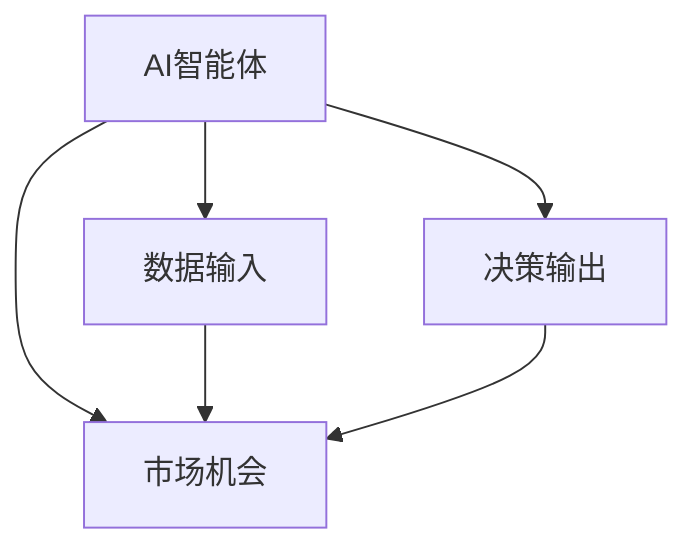
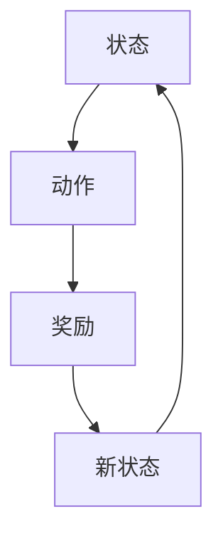
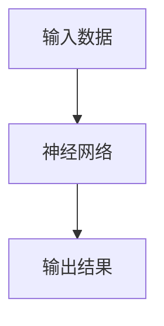
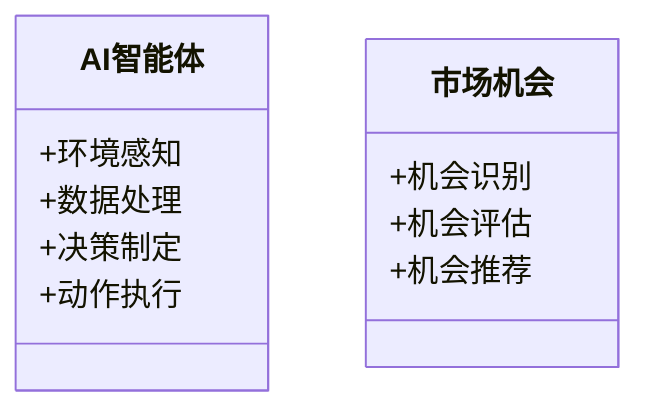
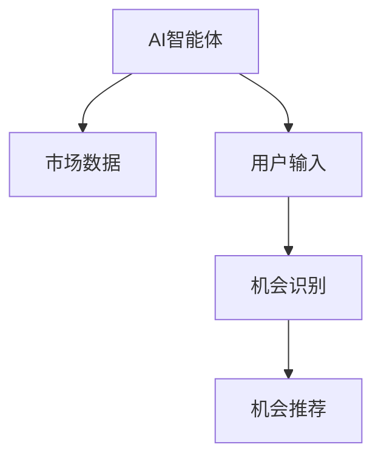
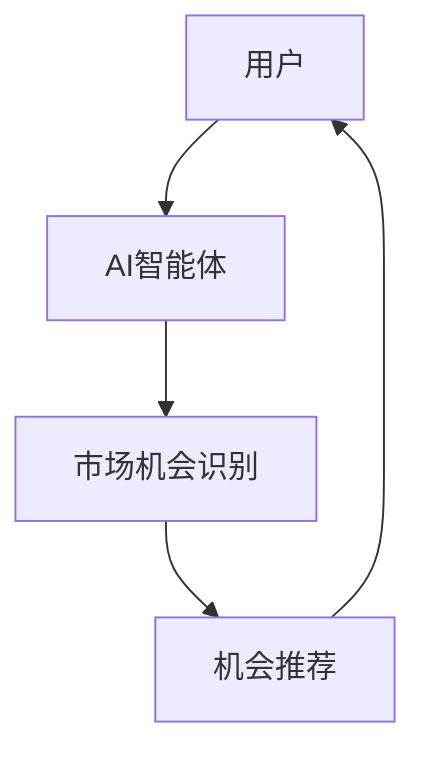

                 


# AI智能体在识别市场结构性机会中的作用

## 关键词：AI智能体，市场机会，强化学习，深度学习，系统架构

## 摘要：AI智能体通过强化学习和深度学习等技术手段，能够有效地识别市场中的结构性机会。本文从AI智能体的基本概念出发，详细阐述其在市场机会识别中的算法原理、系统架构设计，结合实际案例分析，探讨AI智能体在金融、商业等领域的应用前景。

---

# 第一部分: AI智能体与市场结构性机会的背景介绍

## 第1章: AI智能体的定义与核心概念

### 1.1 AI智能体的基本概念

#### 1.1.1 AI智能体的定义
AI智能体（Artificial Intelligence Agent）是指具备感知环境、做出决策并执行动作的智能实体。与传统算法不同，AI智能体具有主动性、目标导向性和适应性。

#### 1.1.2 AI智能体的核心属性
- **主动性**：能够主动感知环境并采取行动。
- **目标导向性**：所有行为均以实现特定目标为导向。
- **适应性**：能够根据环境反馈调整行为策略。

#### 1.1.3 AI智能体与传统算法的区别
| 属性 | AI智能体 | 传统算法 |
|------|----------|----------|
| 行为驱动 | 主动感知并采取行动 | 被动执行预设规则 |
| 学习能力 | 具备学习能力，能优化策略 | 无法优化，仅能按规则执行 |
| 适应性 | 能根据环境变化调整策略 | 无法调整，策略固定 |

### 1.2 市场结构性机会的定义与特征

#### 1.2.1 市场结构性机会的概念
市场结构性机会是指在市场中由于供需变化、政策调整、技术进步等因素导致的结构性变化中蕴含的商业机会。

#### 1.2.2 市场结构性机会的特征
- **周期性**：市场机会通常具有周期性，会随着市场环境的变化而出现和消失。
- **复杂性**：市场机会往往隐藏在复杂的市场环境中，需要通过数据分析和模型构建才能识别。
- **可预测性**：通过AI技术可以对市场机会进行预测和评估。

#### 1.2.3 市场结构性机会的分类
- **技术驱动型机会**：由技术创新带来的市场机会。
- **政策驱动型机会**：由政策变化带来的市场机会。
- **需求驱动型机会**：由消费者需求变化带来的市场机会。

### 1.3 AI智能体在识别市场机会中的作用

#### 1.3.1 AI智能体与市场机会的关系
AI智能体通过感知市场环境、分析市场数据，能够主动识别潜在的市场机会，并制定相应的策略。

#### 1.3.2 AI智能体识别市场机会的优势
- **数据处理能力**：AI智能体能够处理海量数据，发现数据中的潜在规律。
- **实时性**：AI智能体能够实时感知市场变化，快速做出反应。
- **自我优化能力**：通过强化学习，AI智能体能够不断优化识别市场机会的能力。

#### 1.3.3 AI智能体识别市场机会的边界与外延
AI智能体识别市场机会的边界在于其数据来源和模型能力。外延则体现在AI智能体能够帮助人类发现那些难以察觉的市场机会。

---

## 第2章: AI智能体与市场机会识别的核心概念联系

### 2.1 核心概念原理

#### 2.1.1 AI智能体的感知与决策机制
AI智能体通过感知环境、分析数据、制定策略并执行动作来识别市场机会。

#### 2.1.2 市场机会识别的算法模型
市场机会识别通常采用强化学习、深度学习等算法。

#### 2.1.3 AI智能体与市场机会识别的交互过程
AI智能体会根据市场反馈不断优化其识别策略。

### 2.2 核心概念属性对比表

| 属性 | AI智能体 | 市场机会 |
|------|----------|----------|
| 输入 | 市场数据、环境信息 | 市场结构、供需变化 |
| 输出 | 动作、决策 | 机会识别结果 |
| 关系 | AI智能体通过感知市场环境，识别市场机会 | 市场机会由AI智能体主动识别并提供支持 |

### 2.3 ER实体关系图



---

# 第二部分: AI智能体识别市场机会的算法原理

## 第3章: AI智能体的算法原理

### 3.1 基于强化学习的市场机会识别

#### 3.1.1 强化学习的基本原理
强化学习（Reinforcement Learning）是一种通过试错机制来优化决策模型的算法。

#### 3.1.2 Q-learning算法在市场机会识别中的应用
Q-learning算法通过不断更新Q值来优化决策策略。

#### 3.1.3 算法流程图


### 3.2 深度学习在市场机会识别中的应用

#### 3.2.1 深度学习的基本原理
深度学习通过多层神经网络来学习数据的特征表示。

#### 3.2.2 基于神经网络的市场机会识别模型
市场机会识别模型通常采用卷积神经网络（CNN）或循环神经网络（RNN）。

#### 3.2.3 模型训练流程图


### 3.3 算法的数学模型与公式

#### 3.3.1 强化学习的Q值更新公式
$$ Q(s, a) = Q(s, a) + \alpha (r + \gamma \max Q(s', a) - Q(s, a)) $$

#### 3.3.2 深度学习的损失函数
$$ \text{损失函数} = -\sum y_i \log p_i + \lambda \|W\|^2 $$

---

## 第4章: 系统分析与架构设计

### 4.1 问题场景介绍

#### 4.1.1 问题背景
在金融领域，识别市场机会对于投资者至关重要。

#### 4.1.2 项目介绍
本项目旨在构建一个基于AI智能体的市场机会识别系统。

### 4.2 系统功能设计

#### 4.2.1 领域模型


### 4.3 系统架构设计

#### 4.3.1 系统架构图


### 4.4 系统接口设计

#### 4.4.1 系统接口
- **输入接口**：市场数据输入
- **输出接口**：机会识别结果

### 4.5 系统交互设计

#### 4.5.1 交互流程图


---

## 第5章: 项目实战

### 5.1 环境安装

#### 5.1.1 安装Python
```bash
python --version
pip install numpy
pip install tensorflow
pip install keras
```

#### 5.1.2 安装其他依赖
```bash
pip install matplotlib
pip install scikit-learn
```

### 5.2 系统核心实现源代码

#### 5.2.1 强化学习实现
```python
import numpy as np
import random

class AI智能体:
    def __init__(self, 状态空间, 动作空间):
        self.状态空间 = 状态空间
        self.动作空间 = 动作空间
        self.Q = { (s,a): 0 for s in 状态空间 for a in 动作空间 }

    def 感知环境(self, 状态):
        return 状态

    def 选择动作(self, 状态, epsilon=0.1):
        if random.random() < epsilon:
            return random.choice(self.动作空间)
        max_Q = max([self.Q[(状态, a)] for a in self.动作空间])
        动作 = [a for a in self.动作空间 if self.Q[(状态, a)] == max_Q][0]
        return 动作

    def 更新Q值(self, 状态, 动作, 奖励, 下一状态, gamma=0.9):
        current_Q = self.Q[(状态, 动作)]
        max_next_Q = max([self.Q[(下一状态, a)] for a in self.动作空间])
        self.Q[(状态, 动作)] = current_Q + gamma * (奖励 + max_next_Q - current_Q)
```

#### 5.2.2 深度学习实现
```python
from tensorflow.keras.models import Sequential
from tensorflow.keras.layers import Dense

class 深度学习模型:
    def __init__(self, 输入维度):
        self.模型 = Sequential()
        self.模型.add(Dense(64, activation='relu', input_dim=输入维度))
        self.模型.add(Dense(1, activation='sigmoid'))
        self.模型.compile(optimizer='adam', loss='binary_crossentropy', metrics=['accuracy'])

    def 训练(self, 训练数据, 标签, epochs=10):
        self.模型.fit(训练数据, 标签, epochs=epochs)

    def 预测(self, 测试数据):
        return self.模型.predict(测试数据)
```

### 5.3 代码应用解读与分析

#### 5.3.1 强化学习代码解读
- 初始化Q值表
- 感知环境并选择动作
- 更新Q值表

#### 5.3.2 深度学习代码解读
- 构建神经网络模型
- 训练模型
- 预测结果

### 5.4 实际案例分析

#### 5.4.1 案例介绍
在金融市场上，利用AI智能体识别股票投资机会。

#### 5.4.2 数据来源与预处理
- 数据来源：历史股票价格、市场指数、经济指标
- 数据预处理：归一化、特征提取

#### 5.4.3 模型训练与测试
- 训练数据：2010-2020年股票数据
- 测试数据：2021年股票数据

### 5.5 项目小结

#### 5.5.1 成果总结
成功构建了一个基于AI智能体的市场机会识别系统。

#### 5.5.2 经验总结
- 数据质量对模型性能影响重大
- 模型调参是关键

---

## 第六部分: 总结与展望

### 6.1 总结

#### 6.1.1 全文总结
本文详细探讨了AI智能体在识别市场结构性机会中的作用，从理论到实践，给出了完整的解决方案。

#### 6.1.2 最佳实践 tips
- 数据预处理是关键
- 模型调参是优化的重要步骤

### 6.2 未来展望

#### 6.2.1 当前研究的不足
- 模型的泛化能力需要进一步提升
- 如何处理多目标优化问题

#### 6.2.2 未来的研究方向
- 结合博弈论的AI智能体设计
- 跨领域应用研究

---

作者：AI天才研究院/AI Genius Institute & 禅与计算机程序设计艺术 /Zen And The Art of Computer Programming

