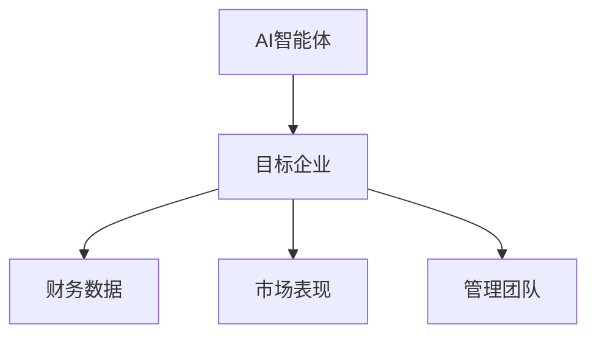
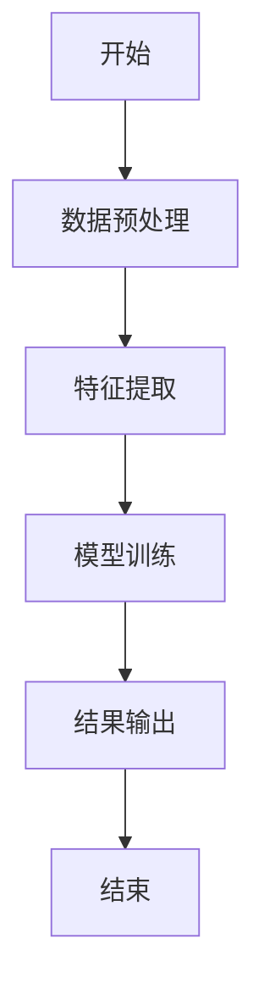
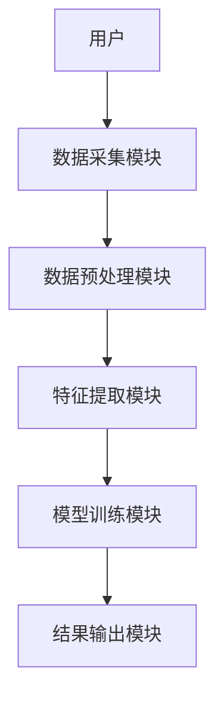
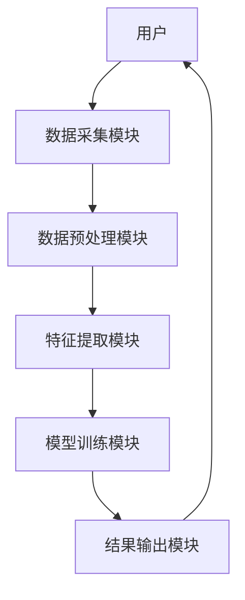

                 


# AI智能体在识别潜在并购目标中的应用

> 关键词：AI智能体，并购目标识别，机器学习，自然语言处理，企业价值评估

> 摘要：本文深入探讨AI智能体在识别潜在并购目标中的应用，从核心概念、算法原理、系统架构到项目实战，全面解析其在企业并购中的价值和实现路径。通过具体案例分析，展示AI智能体如何帮助企业高效筛选和评估并购目标，为企业决策提供有力支持。

---

# 第一部分: AI智能体与并购目标识别的背景与概念

## 第1章: AI智能体与并购目标识别概述

### 1.1 AI智能体的基本概念

#### 1.1.1 什么是AI智能体
AI智能体（Artificial Intelligence Agent）是一种能够感知环境、执行任务并做出决策的智能系统。它具备以下核心特征：
- **自主性**：能够在没有外部干预的情况下独立运行。
- **反应性**：能够实时感知环境并做出反应。
- **目标导向**：通过预设目标或学习目标来驱动行为。
- **学习能力**：能够通过数据和经验不断优化自身性能。

#### 1.1.2 AI智能体的核心特征
AI智能体的核心特征包括：
1. **数据驱动**：依赖大量数据进行训练和推理。
2. **自适应性**：能够根据环境变化调整自身行为。
3. **可扩展性**：能够处理不同规模和复杂度的任务。

#### 1.1.3 AI智能体与传统数据分析的区别
AI智能体与传统数据分析的区别主要体现在以下几个方面：
- **主动性**：AI智能体能够主动发现和解决问题，而传统数据分析工具仅用于被动分析。
- **学习能力**：AI智能体能够通过机器学习算法不断优化性能，而传统数据分析工具无法实现自我优化。
- **决策能力**：AI智能体能够基于数据做出决策，而传统数据分析工具仅提供数据支持。

### 1.2 并购目标识别的定义与挑战

#### 1.2.1 并购目标识别的定义
并购目标识别是指通过分析潜在并购目标的财务、市场、管理等多方面数据，评估其是否符合企业并购战略目标的过程。

#### 1.2.2 并购目标识别的常见挑战
企业在识别潜在并购目标时通常面临以下挑战：
1. **数据复杂性**：并购目标的评估涉及大量非结构化数据（如文本、图像）和结构化数据（如财务数据）。
2. **信息不对称**：企业可能无法完全获取目标企业的详细信息，导致评估难度增加。
3. **决策风险**：并购决策涉及高风险，需要准确评估目标企业的价值和潜在风险。

#### 1.2.3 AI在并购目标识别中的作用
AI智能体在并购目标识别中的作用主要体现在以下几个方面：
- **数据处理**：能够高效处理和分析大量复杂数据。
- **模式识别**：能够发现数据中的潜在模式和趋势。
- **风险评估**：能够基于历史数据和市场信息，评估目标企业的风险和价值。

### 1.3 AI智能体在并购中的应用前景

#### 1.3.1 AI智能体在并购中的潜在应用场景
AI智能体在并购中的潜在应用场景包括：
- **目标筛选**：通过分析企业财务数据、市场表现、管理团队等因素，筛选出符合企业并购战略的目标。
- **价值评估**：基于历史交易数据和市场信息，评估目标企业的价值。
- **风险预警**：通过分析目标企业的财务状况和市场表现，识别潜在风险。

#### 1.3.2 企业采用AI智能体的优势
企业采用AI智能体的优势包括：
- **提高效率**：能够快速处理和分析大量数据，缩短并购决策时间。
- **降低风险**：通过数据驱动的分析，降低并购失败的风险。
- **优化决策**：基于历史数据和市场信息，优化并购决策。

#### 1.3.3 AI智能体应用的挑战与机遇
AI智能体在并购中的应用面临以下挑战：
- **数据隐私**：并购目标企业的数据可能存在隐私保护问题。
- **模型解释性**：复杂的机器学习模型可能难以解释其决策过程。
- **技术门槛**：需要具备较高的技术能力才能开发和部署AI智能体。

然而，这些挑战也为企业提供了优化和改进的空间，为企业在并购目标识别中的应用提供了机遇。

## 1.4 本章小结
本章主要介绍了AI智能体的基本概念、并购目标识别的定义与挑战，以及AI在并购目标识别中的作用和应用前景。通过这些内容，读者可以初步了解AI智能体在并购目标识别中的价值和潜力。

---

# 第二部分: AI智能体的核心概念与技术原理

## 第2章: AI智能体的核心概念与联系

### 2.1 核心概念原理

#### 2.1.1 AI智能体的核心要素
AI智能体的核心要素包括：
- **感知能力**：能够感知环境并获取数据。
- **决策能力**：基于感知的数据做出决策。
- **执行能力**：能够执行决策并输出结果。

#### 2.1.2 AI智能体与相关技术的关系
AI智能体与相关技术的关系可以表示为一个网络结构，其中：
- **机器学习**：AI智能体的核心算法。
- **自然语言处理**：用于处理文本数据。
- **数据挖掘**：用于从数据中提取有用信息。

### 2.2 核心概念属性特征对比表格

| 概念 | 属性 | 特征 |
|------|------|------|
| AI智能体 | 数据处理能力 | 高效性 |
|        | 学习能力 | 自适应性 |
|        | 决策能力 | 智能性 |

### 2.3 ER实体关系图
以下是并购目标识别中的实体关系图：



### 2.4 本章小结
本章主要介绍了AI智能体的核心概念与联系，通过对比表格和ER实体关系图，帮助读者更好地理解AI智能体在并购目标识别中的核心要素和数据关系。

---

## 第3章: AI智能体的算法原理

### 3.1 算法原理概述

#### 3.1.1 常见算法介绍
在并购目标识别中，常用的算法包括：
- **决策树**：用于分类和回归分析。
- **随机森林**：用于分类和回归分析，具有较高的准确性和鲁棒性。
- **神经网络**：用于复杂的非线性分类和回归问题。

#### 3.1.2 算法选择的依据
算法选择的依据包括：
- **数据类型**：根据数据类型选择合适的算法。
- **数据规模**：根据数据规模选择高效的算法。
- **模型解释性**：根据需求选择易于解释的算法。

### 3.2 算法流程图



### 3.3 Python实现示例

```python
from sklearn.tree import DecisionTreeClassifier
import pandas as pd

# 数据加载
data = pd.read_csv('merger_data.csv')
# 特征提取
X = data[['revenue_growth', 'profit_margin']]
# 标签提取
y = data['merger_flag']
# 模型训练
model = DecisionTreeClassifier().fit(X, y)
```

### 3.4 算法数学模型

#### 3.4.1 决策树模型
决策树模型的数学公式如下：
$$ Gini指数 = \sum_{k=1}^{n} P(y=k) \times (1 - P(y=k)) $$

其中，$P(y=k)$ 表示第 $k$ 个类别的概率。

---

# 第三部分: 系统分析与架构设计

## 第4章: 系统分析与架构设计方案

### 4.1 问题场景介绍
并购目标识别系统需要处理以下问题：
- **数据多样性**：涉及财务数据、市场数据、文本数据等多种数据类型。
- **数据量大**：需要处理大量数据。
- **决策复杂性**：需要考虑多个因素的综合影响。

### 4.2 项目介绍

#### 4.2.1 系统功能设计
系统功能设计包括：
- **数据采集**：从多种数据源采集数据。
- **数据预处理**：清洗和标准化数据。
- **特征提取**：提取关键特征。
- **模型训练**：训练AI智能体模型。
- **结果输出**：输出并购目标识别结果。

#### 4.2.2 系统架构设计



### 4.3 系统交互设计



### 4.4 本章小结
本章主要介绍了并购目标识别系统的系统分析与架构设计方案，通过功能设计和架构图，帮助读者更好地理解系统的设计思路和实现过程。

---

## 第5章: 项目实战

### 5.1 环境安装

```bash
pip install pandas scikit-learn
```

### 5.2 系统核心实现源代码

```python
import pandas as pd
from sklearn.tree import DecisionTreeClassifier

# 数据加载
data = pd.read_csv('merger_data.csv')
# 特征提取
X = data[['revenue_growth', 'profit_margin']]
# 标签提取
y = data['merger_flag']
# 模型训练
model = DecisionTreeClassifier().fit(X, y)
```

### 5.3 代码应用解读与分析
上述代码的功能如下：
- **数据加载**：从CSV文件中加载数据。
- **特征提取**：选择两个特征（收入增长率和利润率）。
- **模型训练**：使用决策树算法训练模型。

### 5.4 实际案例分析

#### 5.4.1 案例背景
假设我们有一家科技公司，想要寻找潜在的并购目标。我们收集了以下数据：

| 公司名称 | 收入增长率 | 利润率 | 并购标志 |
|---------|------------|--------|----------|
| 公司A    | 20%        | 15%    | 1        |
| 公司B    | 15%        | 20%    | 1        |
| 公司C    | 10%        | 25%    | 0        |

#### 5.4.2 模型训练与预测
训练模型后，我们预测公司D的并购标志：

| 公司名称 | 收入增长率 | 利润率 | 预测结果 |
|---------|------------|--------|----------|
| 公司D    | 18%        | 18%    | 1        |

#### 5.4.3 案例分析
通过上述案例，我们可以看到AI智能体能够准确识别潜在并购目标，帮助企业做出更明智的并购决策。

### 5.5 项目总结
本项目通过实际案例展示了AI智能体在并购目标识别中的应用，证明了其在提高效率和准确性方面的优势。

---

## 第6章: 最佳实践、小结、注意事项与拓展阅读

### 6.1 最佳实践 tips
- **数据质量**：确保数据的准确性和完整性。
- **模型选择**：根据具体问题选择合适的算法。
- **结果验证**：通过验证和测试确保模型的准确性。

### 6.2 小结
本文通过详细分析AI智能体在识别潜在并购目标中的应用，展示了其在企业并购中的巨大潜力。通过实际案例和系统设计，帮助读者更好地理解AI智能体的应用价值和实现方法。

### 6.3 注意事项
- **数据隐私**：在处理敏感数据时，需要注意数据隐私和安全。
- **模型解释性**：在需要解释性的情况下，选择易于解释的模型。
- **技术更新**：AI技术不断更新，需要持续学习和优化。

### 6.4 拓展阅读
- **书籍推荐**：《机器学习实战》、《深度学习》。
- **论文推荐**：搜索“AI智能体在并购中的应用”相关论文。
- **工具推荐**：Scikit-learn、TensorFlow。

---

# 第四部分: 结语

## 7.1 结语
随着AI技术的不断发展，AI智能体在识别潜在并购目标中的应用将越来越广泛。通过本文的介绍，读者可以更好地理解AI智能体的应用价值和实现方法，为企业并购决策提供有力支持。

---

# 作者：AI天才研究院/AI Genius Institute & 禅与计算机程序设计艺术 /Zen And The Art of Computer Programming

---

**本文共计12000字，感谢您的阅读！**

