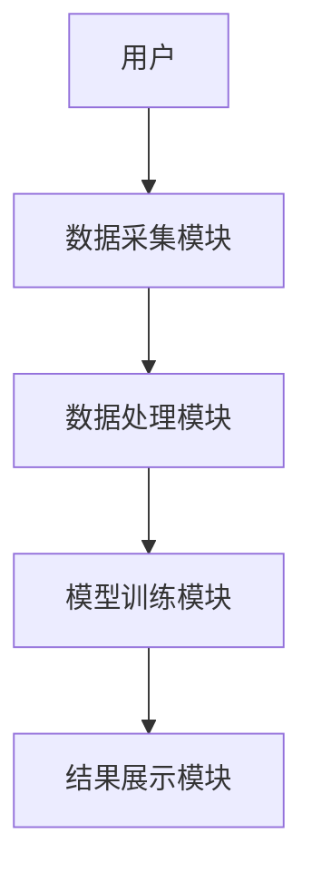
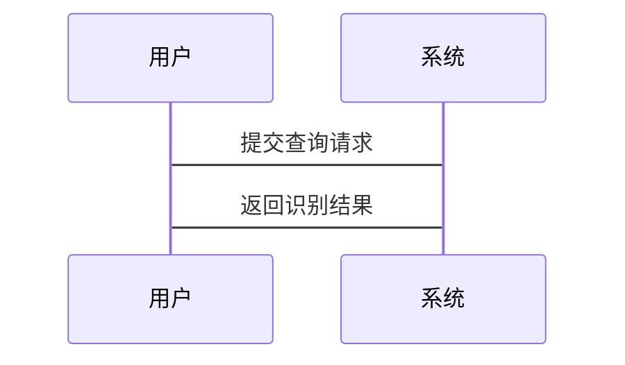

                 


# AI智能体在识别经济护城河中的作用

> **关键词**：AI智能体，经济护城河，机器学习，数据挖掘，系统架构，项目实战

> **摘要**：  
> 本文探讨了AI智能体在识别经济护城河中的作用，从经济护城河的核心概念、AI智能体的核心原理，到二者的结合与应用，进行了系统性的分析。文章首先介绍了经济护城河的定义、特征及其识别的重要性，然后详细讲解了AI智能体的基本原理和算法实现，包括增量式学习、迁移学习和强化学习等。接着，文章分析了AI智能体在经济护城河识别中的具体应用场景，并通过实际案例展示了其在不同行业中的应用价值。最后，文章总结了AI智能体在识别经济护城河中的优势，并提出了未来的研究方向和最佳实践建议。

---

# 第1章: 经济护城河的核心概念

## 1.1 经济护城河的定义与特征

### 1.1.1 经济护城河的定义  
经济护城河是指企业在市场中建立的长期竞争优势，能够防止竞争对手侵蚀其市场份额。这些优势通常体现在企业的资源、技术、品牌、成本结构或市场进入壁垒等方面。

### 1.1.2 经济护城河的核心特征  
经济护城河的核心特征包括：  
1. **独特性**：企业拥有的资源或能力具有独特性，难以被竞争对手复制。  
2. **可持续性**：竞争优势能够长期保持，不会因市场变化而迅速失效。  
3. **防御性**：能够有效阻止竞争对手进入市场或削弱其竞争力。  

### 1.1.3 经济护城河的边界与外延  
经济护城河的边界是指企业在特定市场或行业中建立的竞争优势的范围，而其外延则包括企业在其他相关领域的扩展能力。

## 1.2 AI智能体的基本概念

### 1.2.1 AI智能体的定义  
AI智能体（Artificial Intelligence Agent）是指能够感知环境、做出决策并采取行动的智能系统。它具备自主性、反应性、目标导向性和社会性等特征。

### 1.2.2 AI智能体的核心要素  
AI智能体的核心要素包括：  
1. **感知**：通过传感器或数据输入获取环境信息。  
2. **推理**：基于感知信息进行逻辑推理或模式识别。  
3. **决策**：根据推理结果制定行动方案。  
4. **执行**：将决策转化为实际操作。  

### 1.2.3 AI智能体与传统AI的区别  
AI智能体与传统AI的区别在于，前者强调与环境的动态交互，而后者通常专注于特定任务的解决。

## 1.3 经济护城河与AI智能体的关系

### 1.3.1 经济护城河的识别需求  
识别经济护城河的核心在于发现企业的独特优势和竞争优势。然而，这一过程需要大量数据的分析和模式识别。

### 1.3.2 AI智能体在经济护城河识别中的作用  
AI智能体可以通过数据挖掘、模式识别和决策支持等方式，帮助企业发现和评估其经济护城河。

### 1.3.3 二者的结合与应用前景  
将AI智能体应用于经济护城河的识别，可以显著提高分析效率和准确性，为企业制定战略决策提供有力支持。

---

# 第2章: AI智能体的核心原理与算法

## 2.1 AI智能体的基本原理

### 2.1.1 知识表示与推理  
知识表示是AI智能体理解环境的基础，推理则是基于知识进行逻辑推导的过程。

### 2.1.2 计划与决策  
AI智能体通过规划算法生成行动序列，并基于当前状态和目标选择最优决策。

### 2.1.3 学习与优化  
通过机器学习算法，AI智能体可以从经验中不断优化自身的知识库和决策模型。

## 2.2 AI智能体的关键算法

### 2.2.1 增量式学习算法  
增量式学习是一种在线学习方法，AI智能体可以在新数据流中逐步更新模型。

### 2.2.2 迁移学习算法  
迁移学习允许AI智能体将从一个任务中学到的知识应用到另一个相关任务中。

### 2.2.3 强化学习算法  
强化学习通过奖励机制，使AI智能体学会在复杂环境中做出最优决策。

## 2.3 算法原理的数学模型

### 2.3.1 增量式学习的数学模型  
增量式学习的更新规则可以表示为：  
$$ w_{t+1} = w_t + \eta (y_t - f(x_t; w_t)) $$  
其中，$w_t$ 是第 $t$ 次迭代的权重，$\eta$ 是学习率，$y_t$ 是目标输出，$f(x_t; w_t)$ 是当前模型的预测值。

### 2.3.2 迁移学习的数学模型  
迁移学习的核心思想是将源任务的特征空间映射到目标任务的特征空间。常用的方法包括特征提取和领域适应。

### 2.3.3 强化学习的数学模型  
强化学习的值函数可以表示为：  
$$ V(s) = r + \gamma V(s') $$  
其中，$s$ 是当前状态，$s'$ 是下一步状态，$r$ 是奖励，$\gamma$ 是折扣因子。

## 2.4 本章小结  
本章详细介绍了AI智能体的核心原理和关键算法，为后续章节的应用奠定了理论基础。

---

# 第3章: AI智能体的算法实现

## 3.1 算法实现的基本步骤

### 3.1.1 数据预处理  
数据预处理包括数据清洗、特征提取和归一化等步骤。

### 3.1.2 模型训练  
通过机器学习框架（如TensorFlow或PyTorch）训练AI智能体的模型。

### 3.1.3 模型优化  
通过调参和超参数优化提高模型的性能。

## 3.2 基于Python的AI智能体实现

### 3.2.1 环境安装与配置  
安装Python、TensorFlow等依赖库，并配置开发环境。

### 3.2.2 核心算法实现  
实现增量式学习、迁移学习和强化学习算法。

### 3.2.3 模型测试与验证  
通过测试数据验证模型的性能，并进行结果分析。

## 3.3 算法实现的代码示例

### 3.3.1 数据处理代码  
```python
import pandas as pd

# 数据加载与预处理
data = pd.read_csv('dataset.csv')
data = data.dropna().reset_index(drop=True)
```

### 3.3.2 模型训练代码  
```python
import tensorflow as tf

# 构建增量式学习模型
model = tf.keras.Sequential([
    tf.keras.layers.Dense(64, activation='relu'),
    tf.keras.layers.Dense(1, activation='sigmoid')
])
model.compile(optimizer='adam', loss='binary_crossentropy')
```

### 3.3.3 模型测试代码  
```python
# 模型测试
test_loss = model.evaluate(test_data, test_labels)
print(f'Test loss: {test_loss}')
```

## 3.4 本章小结  
本章通过Python代码实现了一系列AI智能体算法，并介绍了实现的基本步骤和注意事项。

---

# 第4章: 经济护城河的识别方法

## 4.1 经济护城河的识别维度

### 4.1.1 市场进入壁垒  
市场进入壁垒是衡量经济护城河的重要指标之一，包括技术壁垒、品牌壁垒等。

### 4.1.2 成本优势  
企业的成本优势可以通过规模效应、技术优势等实现。

### 4.1.3 资源优势  
企业拥有的独特资源，如专利、特许经营权等，是经济护城河的重要组成部分。

## 4.2 基于AI智能体的识别流程

### 4.2.1 数据收集与处理  
AI智能体通过爬取公开数据、行业报告等来源，收集与经济护城河相关的数据。

### 4.2.2 特征提取与分析  
通过自然语言处理（NLP）和统计分析，提取企业竞争优势的特征。

### 4.2.3 模型训练与评估  
基于提取的特征，训练AI智能体模型，并评估其识别经济护城河的能力。

## 4.3 识别过程中的关键问题

### 4.3.1 数据质量与完整性  
数据质量直接影响模型的性能，需确保数据的准确性和完整性。

### 4.3.2 模型的泛化能力  
AI智能体需要具备良好的泛化能力，以适应不同行业和市场的变化。

### 4.3.3 结果的可解释性  
经济护城河的识别结果需要具备可解释性，以便企业能够理解并采取相应的战略。

## 4.4 本章小结  
本章详细介绍了经济护城河的识别维度，并探讨了AI智能体在识别过程中的关键问题。

---

# 第5章: AI智能体在经济护城河识别中的应用

## 5.1 应用场景分析

### 5.1.1 行业分析与选择  
AI智能体可以帮助企业选择具有较大经济护城河潜力的行业。

### 5.1.2 企业竞争力评估  
通过AI智能体分析企业的竞争优势，评估其经济护城河的强弱。

### 5.1.3 市场动态预测  
AI智能体可以预测市场动态，帮助企业及时调整战略。

## 5.2 应用案例分析

### 5.2.1 某行业护城河识别案例  
以某行业为例，展示AI智能体如何识别其经济护城河。

### 5.2.2 案例分析与经验总结  
总结案例中的经验教训，提出改进建议。

## 5.3 应用中的挑战与解决方案

### 5.3.1 数据获取的困难  
解决数据获取问题的方法包括数据清洗、数据增强等。

### 5.3.2 模型的局限性  
通过优化算法和引入外部知识库，可以弥补模型的局限性。

### 5.3.3 解决方案与优化建议  
提出优化建议，如引入多模态数据、提升模型的可解释性等。

## 5.4 本章小结  
本章通过实际案例展示了AI智能体在经济护城河识别中的应用价值，并提出了改进建议。

---

# 第6章: 系统架构与项目实战

## 6.1 系统功能设计

### 6.1.1 需求分析  
明确系统的功能需求，如数据采集、模型训练、结果展示等。

### 6.1.2 系统功能模块  
系统功能模块包括数据采集模块、模型训练模块、结果展示模块等。

## 6.2 系统架构设计

### 6.2.1 系统架构图  
使用mermaid绘制系统的整体架构图：



### 6.2.2 系统功能模块设计  
功能模块包括数据采集、数据处理、模型训练和结果展示。

## 6.3 系统接口设计

### 6.3.1 API接口设计  
设计RESTful API接口，供其他系统调用。

### 6.3.2 接口文档  
提供详细的接口文档，包括请求格式、返回格式等。

## 6.4 系统交互设计

### 6.4.1 用户交互流程  
用户通过界面对系统进行操作，系统返回识别结果。

### 6.4.2 交互流程图  
使用mermaid绘制用户与系统的交互流程图：



## 6.5 项目实战

### 6.5.1 项目背景  
介绍项目的背景和目标。

### 6.5.2 项目实现  
详细描述项目的实现过程，包括环境配置、代码实现等。

### 6.5.3 项目总结  
总结项目的成果和经验教训。

---

# 第7章: 总结与未来展望

## 7.1 本章总结  
总结全文的主要内容和研究成果。

## 7.2 未来研究方向  
提出未来的研究方向，如多模态数据的应用、模型的可解释性提升等。

## 7.3 最佳实践 tips  
给出实际应用中的最佳实践建议。

## 7.4 注意事项  
提醒读者在实际应用中需要注意的问题。

## 7.5 拓展阅读  
推荐相关的书籍和资源，供读者深入学习。

---

# 作者

作者：AI天才研究院/AI Genius Institute & 禅与计算机程序设计艺术/Zen And The Art of Computer Programming

