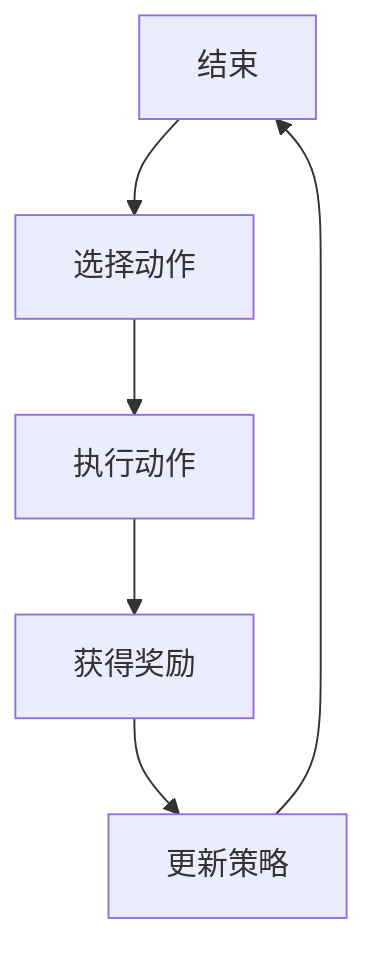
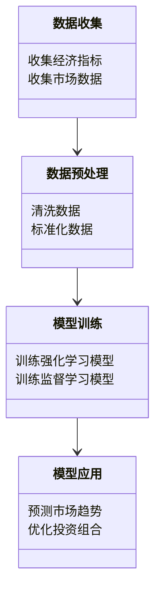
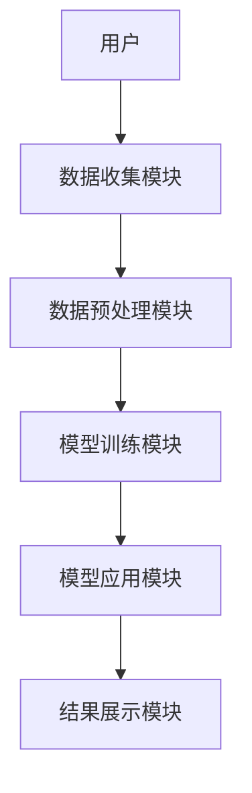
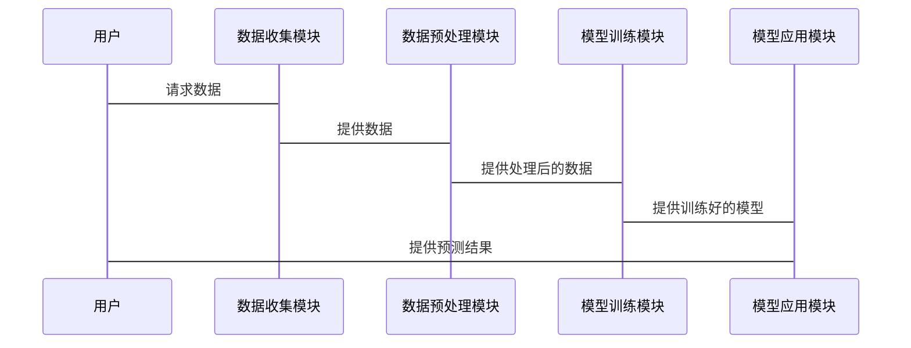

                 


# AI智能体在识别长期增长潜力中的应用

## 关键词
AI智能体，长期增长潜力，投资分析，强化学习，监督学习，无监督学习，系统架构设计

## 摘要
随着人工智能技术的快速发展，AI智能体在识别长期增长潜力中的应用越来越广泛。本文将从AI智能体的基本概念出发，详细探讨其在经济分析和投资决策中的应用，结合算法原理、系统架构设计和实际案例，帮助读者理解如何利用AI智能体来提升长期增长潜力的识别能力。

---

## 第一部分：背景介绍

### 第1章：AI智能体与长期增长潜力概述

#### 1.1 问题背景
经济增长是现代社会的核心议题之一。投资者、企业和政府都在寻求有效的方法来识别具有长期增长潜力的领域或资产。然而，传统的投资分析方法往往依赖于人类的直觉和经验，存在主观性强、效率低下的问题。随着数据的爆炸式增长和技术的进步，人工智能（AI）技术为这一领域带来了新的可能性。

#### 1.2 问题描述
长期增长潜力的识别需要综合分析大量的经济指标、市场趋势和行业数据。传统的分析方法依赖于经验丰富的分析师，但这种方法不仅耗时，而且容易受到主观因素的影响。例如，分析师可能因为市场波动或外部干扰而做出错误的判断。

#### 1.3 问题解决
AI智能体通过机器学习算法，能够从海量数据中提取模式和趋势，从而更准确地预测长期增长潜力。例如，强化学习算法可以模拟投资决策过程，优化投资组合以最大化收益。

#### 1.4 边界与外延
AI智能体的应用范围主要集中在数据驱动的决策领域，如金融投资、市场预测和资源配置。其局限性在于依赖高质量的数据输入和算法的有效性。与其他技术（如传统的统计分析）相比，AI智能体的优势在于能够处理非结构化数据和实时更新。

#### 1.5 概念结构与核心要素
AI智能体识别长期增长潜力的过程包括以下几个核心要素：
1. 数据收集：从多个来源获取经济指标、市场数据等。
2. 数据预处理：清洗和标准化数据。
3. 模型训练：使用机器学习算法训练模型。
4. 模型应用：利用模型进行预测和决策。
5. 结果分析：评估模型的准确性和优化模型。

---

## 第二部分：核心概念与联系

### 第2章：AI智能体的核心原理

#### 2.1 核心概念原理
AI智能体是一种能够感知环境并采取行动以实现目标的实体。在识别长期增长潜力的场景中，AI智能体通过分析数据来预测未来的市场趋势，从而做出投资决策。

#### 2.2 概念属性对比
以下是AI智能体与其他分析工具的关键区别：

| 属性       | AI智能体                     | 传统统计分析方法 |
|------------|------------------------------|------------------|
| 数据需求   | 高度依赖大数据               | 依赖少量结构化数据 |
| 处理能力   | 能够处理非结构化数据         | 仅能处理结构化数据 |
| 学习能力   | 具备自适应学习能力           | 需要手动调整模型 |
| 决策效率   | 能够快速决策                 | 决策速度较慢       |

#### 2.3 ER实体关系图
以下是AI智能体识别长期增长潜力的实体关系图：

```mermaid
erDiagram
    ++attributes
    Actor {
        id : integer
        name : string
    }
    Data {
        id : integer
        type : string
        source : string
    }
    Model {
        id : integer
        type : string
        accuracy : float
    }
    ++relationships
    Actor --> Data : 提供
    Data --> Model : 训练
    Model --> Actor : 提供预测结果
```

---

## 第三部分：算法原理讲解

### 第3章：AI智能体的算法原理

#### 3.1 算法原理
AI智能体的核心算法包括强化学习、监督学习和无监督学习。以下是三种算法的简要介绍：

1. **强化学习**：通过试错机制，AI智能体在环境中不断试验，学习最优策略以最大化奖励。例如，在投资领域，AI智能体可以通过调整投资组合来最大化收益。

2. **监督学习**：通过标记的数据训练模型，使其能够预测未来的结果。例如，使用历史数据训练模型预测股票价格。

3. **无监督学习**：通过发现数据中的模式来识别潜在的增长机会。例如，使用聚类算法发现市场趋势。

#### 3.2 Mermaid流程图
以下是强化学习算法的流程图：



#### 3.3 Python代码实现
以下是强化学习算法的简单实现示例：

```python
import numpy as np

class AI智能体:
    def __init__(self, 状态空间大小):
        self.状态空间大小 = 状态空间大小
        self.动作空间 = [0, 1]

    def 选择动作(self, 状态):
        return np.random.choice(self.动作空间)

    def 更新策略(self, 状态, 动作, 奖励):
        pass

# 示例用法
智能体 = AI智能体(5)
状态 = 3
动作 = 智能体.选择动作(状态)
奖励 = 0.8
智能体.更新策略(状态, 动作, 奖励)
```

#### 3.4 数学模型与公式
以下是强化学习中的关键公式：

- **Q-learning算法**：\( Q(s, a) = Q(s, a) + \alpha [r + \gamma \max Q(s', a) - Q(s, a)] \)

- **策略梯度算法**：\( \nabla \theta J(\theta) = \mathbb{E}[\nabla \log \pi(a|s) Q(s, a)] \)

---

## 第四部分：系统分析与架构设计

### 第4章：系统架构设计方案

#### 4.1 应用场景介绍
AI智能体识别长期增长潜力的应用场景包括：
1. 金融投资：预测股票、基金等的投资价值。
2. 市场分析：预测行业趋势和市场动态。
3. 资源配置：优化资源分配以实现最大收益。

#### 4.2 系统功能设计
以下是系统功能设计的领域模型：



#### 4.3 系统架构设计
以下是系统架构设计的Mermaid图：



#### 4.4 系统接口设计
以下是系统接口设计的简单示例：

```python
# API接口定义
class API:
    def 获取数据(self):
        pass

    def 训练模型(self, 数据):
        pass

    def 预测(self, 输入):
        pass
```

#### 4.5 系统交互设计
以下是系统交互设计的Mermaid图：



---

## 第五部分：项目实战

### 第5章：AI智能体项目实战

#### 5.1 环境安装
以下是项目所需的环境配置：

1. 安装Python和必要的库：
   ```bash
   pip install numpy pandas scikit-learn
   ```

2. 安装Mermaid工具：
   ```bash
   npm install -g mermaid-cli
   ```

#### 5.2 核心代码实现
以下是核心代码实现的示例：

```python
import numpy as np
import pandas as pd
from sklearn.model_selection import train_test_split
from sklearn.linear_model import LinearRegression

# 数据加载
data = pd.read_csv('market_data.csv')

# 数据预处理
X = data[['GDP', '失业率', '通胀率']]
y = data['股票指数']

# 数据分割
X_train, X_test, y_train, y_test = train_test_split(X, y, test_size=0.2)

# 模型训练
model = LinearRegression()
model.fit(X_train, y_train)

# 模型应用
预测结果 = model.predict(X_test)
```

#### 5.3 案例分析
以股票市场预测为例，AI智能体通过分析历史数据，预测未来股票价格的变化趋势。模型的准确率可以通过回测来验证。

#### 5.4 项目小结
通过本项目，读者可以了解如何利用AI智能体进行长期增长潜力的识别，并掌握相关算法和工具的使用方法。

---

## 第六部分：总结与展望

### 第6章：总结与展望

#### 6.1 最佳实践 tips
- 确保数据质量，清洗和标准化数据。
- 选择合适的算法，结合实际问题进行调整。
- 定期更新模型，适应市场变化。

#### 6.2 小结
本文详细介绍了AI智能体在识别长期增长潜力中的应用，包括核心概念、算法原理、系统架构设计和实际案例。通过这些内容，读者可以掌握如何利用AI技术提升投资决策的效率和准确性。

#### 6.3 注意事项
- 数据质量和模型选择直接影响预测结果。
- 模型需要定期更新以适应市场变化。

#### 6.4 拓展阅读
建议读者进一步学习强化学习、监督学习和无监督学习的相关知识，以更深入地理解AI智能体的应用。

---

## 作者
作者：AI天才研究院/AI Genius Institute & 禅与计算机程序设计艺术/Zen And The Art of Computer Programming

---

通过以上内容，您可以系统地了解AI智能体在识别长期增长潜力中的应用，并掌握相关的技术细节。希望这篇文章能为您提供有价值的参考和启发。

