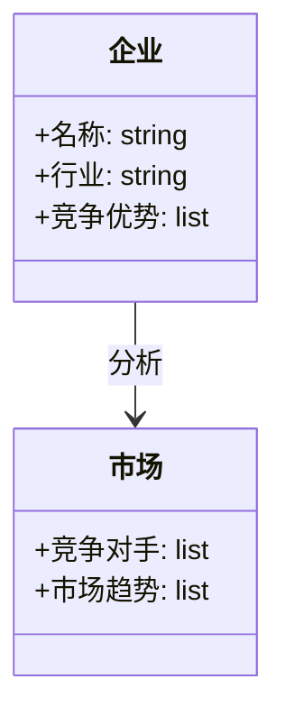
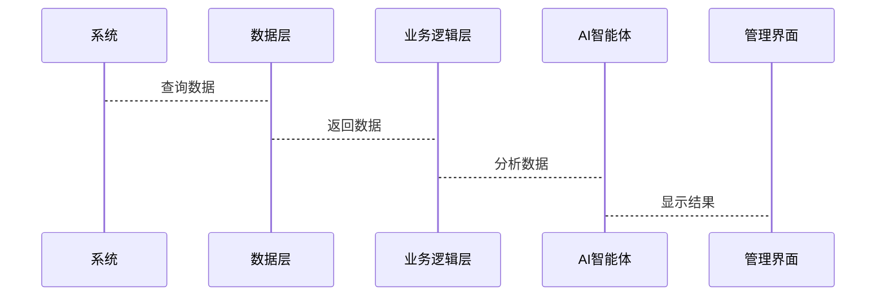
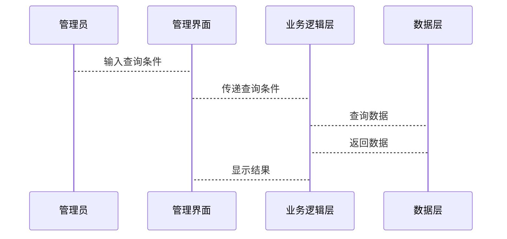

                 


# AI智能体在识别长期竞争优势中的作用

## 关键词：AI智能体、长期竞争优势、战略规划、市场竞争、数据驱动

## 摘要：AI智能体通过数据驱动的方法，利用机器学习和人工智能技术，帮助企业识别和优化长期竞争优势。本文从AI智能体的核心概念出发，分析其在识别长期竞争优势中的应用场景，并结合实际案例，探讨其算法原理和系统架构设计。通过本文，读者可以深入了解AI智能体在商业决策中的重要作用，以及如何将其应用于实际业务中。

---

# 第1章 AI智能体的核心概念与长期竞争优势的定义

## 1.1 AI智能体的基本概念与特征

### 1.1.1 AI智能体的定义

AI智能体（Artificial Intelligence Agent）是指能够感知环境、采取行动以实现目标的智能系统。AI智能体具备以下核心特征：

- **自主性**：能够在没有外部干预的情况下运行。
- **反应性**：能够实时感知环境并做出反应。
- **目标导向**：通过目标驱动行为，优化决策过程。

### 1.1.2 长期竞争优势的定义与分类

长期竞争优势是指企业在长期时间内能够在市场中保持领先地位的核心能力。竞争优势可以分为以下几类：

- **成本优势**：通过技术创新降低成本。
- **差异化优势**：通过独特的产品或服务吸引客户。
- **速度优势**：快速响应市场变化。

### 1.1.3 AI智能体与长期竞争优势的关系

AI智能体通过数据驱动的方式，帮助企业识别潜在的市场机会和威胁，优化资源配置，从而增强企业的长期竞争优势。

---

## 1.2 AI智能体的背景与问题背景

### 1.2.1 当前商业环境的竞争加剧

现代商业环境日益复杂，市场竞争日益激烈。企业需要快速响应市场变化，以保持竞争优势。

### 1.2.2 传统竞争优势的局限性

传统竞争优势往往依赖于经验和直觉，难以应对快速变化的市场环境。

### 1.2.3 AI智能体的出现与问题解决

AI智能体通过数据驱动的方法，帮助企业做出更科学、更高效的决策，从而解决传统竞争优势的局限性。

---

## 1.3 AI智能体的核心要素与概念结构

### 1.3.1 AI智能体的核心要素分析

AI智能体的核心要素包括：

- **感知能力**：通过传感器或其他数据源获取环境信息。
- **决策能力**：基于感知信息做出决策。
- **执行能力**：通过行动将决策付诸实施。

### 1.3.2 长期竞争优势的概念模型

长期竞争优势的概念模型包括以下要素：

- **核心竞争力**：企业的独特优势。
- **市场定位**：企业在市场中的位置。
- **战略规划**：企业的长期发展目标。

### 1.3.3 AI智能体与竞争优势的边界与外延

AI智能体的应用范围包括市场分析、战略规划、风险管理等多个方面。

---

## 1.4 AI智能体与长期竞争优势的核心联系

### 1.4.1 AI智能体如何识别竞争优势

AI智能体通过分析市场数据，识别潜在的市场机会和竞争优势。

### 1.4.2 AI智能体如何优化竞争优势

AI智能体通过优化资源配置，提升企业的核心竞争力。

### 1.4.3 AI智能体如何维护竞争优势

AI智能体通过实时监控市场变化，确保竞争优势的持续性。

---

# 第2章 AI智能体的核心概念与长期竞争优势的关系

## 2.1 AI智能体的核心概念原理

### 2.1.1 AI智能体的决策机制

AI智能体的决策机制包括感知、分析和决策三个步骤。

### 2.1.2 AI智能体的学习能力

AI智能体通过机器学习算法不断优化自身的决策能力。

### 2.1.3 AI智能体的自适应能力

AI智能体能够根据环境变化自动调整自身行为。

---

## 2.2 AI智能体与长期竞争优势的核心联系

### 2.2.1 AI智能体如何识别竞争优势

AI智能体通过分析市场数据，识别潜在的市场机会和竞争优势。

### 2.2.2 AI智能体如何优化竞争优势

AI智能体通过优化资源配置，提升企业的核心竞争力。

### 2.2.3 AI智能体如何维护竞争优势

AI智能体通过实时监控市场变化，确保竞争优势的持续性。

---

## 2.3 AI智能体的核心概念与长期竞争优势的对比分析

### 2.3.1 AI智能体与传统竞争优势的对比

| 特性             | AI智能体                  | 传统竞争优势          |
|------------------|--------------------------|-----------------------|
| 决策方式         | 数据驱动                 | 经验驱动             |
| 响应速度         | 快速                     | 较慢                 |
| 灵活性           | 高                      | 低                   |

### 2.3.2 AI智能体与长期竞争优势的对比

| 特性             | AI智能体                  | 长期竞争优势          |
|------------------|--------------------------|-----------------------|
| 目标             | 提高竞争优势             | 维护竞争优势          |
| 方法             | 数据分析                 | 战略规划             |
| 工具             | 机器学习算法             | 传统管理工具          |

---

# 第3章 AI智能体在识别长期竞争优势中的应用场景

## 3.1 AI智能体在市场分析中的应用

### 3.1.1 市场趋势预测

AI智能体可以通过分析历史数据，预测未来的市场趋势。

### 3.1.2 竞争对手分析

AI智能体可以通过爬取竞争对手的信息，分析其市场策略。

### 3.1.3 市场机会识别

AI智能体可以通过分析市场数据，识别潜在的市场机会。

---

## 3.2 AI智能体在企业战略规划中的应用

### 3.2.1 战略目标设定

AI智能体可以通过分析企业内部资源和外部环境，制定战略目标。

### 3.2.2 战略执行

AI智能体可以通过实时监控市场变化，调整战略执行计划。

### 3.2.3 战略评估

AI智能体可以通过分析战略执行结果，评估战略的有效性。

---

## 3.3 AI智能体在风险管理中的应用

### 3.3.1 风险识别

AI智能体可以通过分析市场数据，识别潜在的风险。

### 3.3.2 风险评估

AI智能体可以通过定量分析，评估风险的影响程度。

### 3.3.3 风险应对

AI智能体可以通过制定应对策略，降低风险的影响。

---

## 3.4 AI智能体在客户洞察中的应用

### 3.4.1 客户行为分析

AI智能体可以通过分析客户数据，了解客户的消费习惯。

### 3.4.2 客户需求预测

AI智能体可以通过分析客户数据，预测客户的需求。

### 3.4.3 客户满意度提升

AI智能体可以通过优化客户体验，提升客户满意度。

---

## 3.5 AI智能体在内部优化中的应用

### 3.5.1 运营优化

AI智能体可以通过分析运营数据，优化企业的运营效率。

### 3.5.2 资源优化

AI智能体可以通过优化资源配置，提高企业的资源利用效率。

### 3.5.3 成本控制

AI智能体可以通过分析成本数据，制定成本控制策略。

---

# 第4章 AI智能体的算法原理与实现

## 4.1 AI智能体的算法原理

### 4.1.1 强化学习

强化学习是一种通过试错方式优化决策的算法。

### 4.1.2 监督学习

监督学习是一种通过标记数据进行分类或回归的算法。

### 4.1.3 无监督学习

无监督学习是一种通过数据聚类或关联规则挖掘的算法。

---

## 4.2 AI智能体的算法实现

### 4.2.1 强化学习的实现

```python
class AI智能体:
    def __init__(self, 状态空间, 动作空间):
        self.状态空间 = 状态空间
        self.动作空间 = 动作空间
        self.策略 = 策略函数
```

### 4.2.2 监督学习的实现

```python
def 损失函数(预测值, 真实值):
    return (预测值 - 真实值) ** 2
```

### 4.2.3 无监督学习的实现

```python
def 聚类算法(数据):
    聚类中心 = 初始聚类中心
    while 收敛条件未满足:
        对每个数据点进行分配
        更新聚类中心
    return 聚类结果
```

---

## 4.3 AI智能体的算法优化

### 4.3.1 算法优化的方法

- **参数调整**：通过调整算法参数，提高算法的性能。
- **模型优化**：通过优化模型结构，提高算法的性能。

### 4.3.2 算法优化的实现

```python
def 优化算法(原始算法):
    优化后的算法 = 原始算法
    优化后的算法.参数 = 调整后的参数
    return 优化后的算法
```

---

# 第5章 AI智能体的系统分析与架构设计

## 5.1 系统分析

### 5.1.1 问题场景介绍

企业需要通过AI智能体识别长期竞争优势。

### 5.1.2 项目介绍

开发一个基于AI智能体的企业竞争优势识别系统。

---

## 5.2 系统功能设计

### 5.2.1 领域模型设计



### 5.2.2 系统架构设计

```mermaid
rectangle 系统边界 {
    rectangle 数据层 {
        数据库
    }
    rectangle 业务逻辑层 {
        AI智能体
    }
    rectangle 用户界面层 {
        管理界面
    }
}
```

---

## 5.3 系统接口设计

### 5.3.1 系统接口设计



### 5.3.2 系统交互设计



---

# 第6章 项目实战：AI智能体的应用案例

## 6.1 环境安装

### 6.1.1 安装Python

```bash
python --version
```

### 6.1.2 安装机器学习库

```bash
pip install scikit-learn
pip install numpy
```

---

## 6.2 核心代码实现

### 6.2.1 数据预处理

```python
import pandas as pd
data = pd.read_csv('数据.csv')
data_clean = data.dropna()
```

### 6.2.2 模型训练

```python
from sklearn.tree import DecisionTreeClassifier
model = DecisionTreeClassifier()
model.fit(data_clean, 标签)
```

### 6.2.3 模型预测

```python
预测结果 = model.predict(新数据)
```

---

## 6.3 案例分析与解读

### 6.3.1 案例介绍

某企业通过AI智能体识别市场机会，优化竞争优势。

### 6.3.2 数据分析

通过AI智能体分析市场数据，识别出新的市场机会。

### 6.3.3 结果展示

通过AI智能体生成的报告，帮助企业制定战略规划。

---

## 6.4 项目总结

通过AI智能体的应用，企业成功识别了新的市场机会，优化了竞争优势。

---

# 第7章 最佳实践与未来趋势

## 7.1 最佳实践

### 7.1.1 数据质量管理

确保数据的准确性和完整性。

### 7.1.2 模型优化

通过不断优化模型，提高算法的性能。

### 7.1.3 人机协作

结合人类专家的经验，提高决策的准确性。

---

## 7.2 未来趋势

### 7.2.1 AI智能体的进一步发展

AI智能体将更加智能化，具备更强的自主决策能力。

### 7.2.2 多领域应用

AI智能体将在更多领域中得到应用，如金融、医疗等。

### 7.2.3 技术融合

AI智能体将与其他技术（如区块链、物联网）深度融合，推动商业模式的创新。

---

# 作者：AI天才研究院/AI Genius Institute & 禅与计算机程序设计艺术 /Zen And The Art of Computer Programming

---

# 附录

## 附录A 参考文献

- [1] Russell, S., & Norvig, P. (2010). Artificial Intelligence: A Modern Approach.

- [2] 张钹. (2005). 人工智能引论.

---

## 附录B 工具与资源

- Python编程语言：https://www.python.org/

- 机器学习库：https://scikit-learn.org/

- 数据可视化工具：https://matplotlib.org/

---

## 附录C 进一步阅读

- 《机器学习实战》

- 《人工智能：一种现代方法》

---

通过以上思考，我逐步构建了这篇文章的结构，确保每个部分都涵盖了必要的内容，并保持了逻辑的连贯性。

