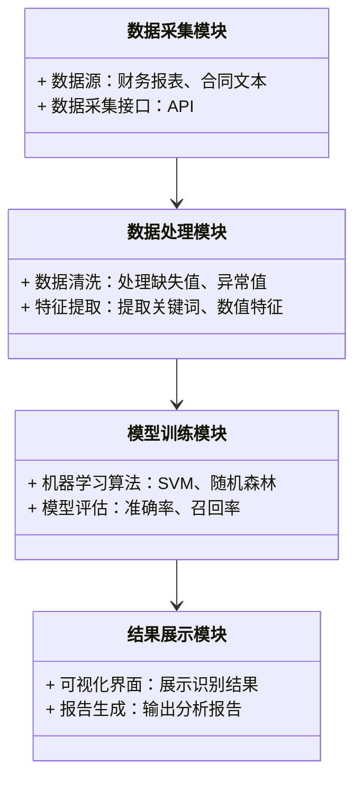
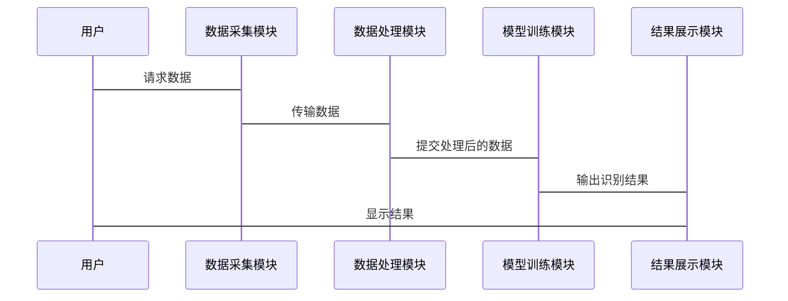

                 


# AI智能体在识别隐藏负债中的应用

## 关键词：AI智能体，隐藏负债，财务数据分析，机器学习，自然语言处理，系统架构

## 摘要：  
本文探讨了AI智能体在识别隐藏负债中的应用，分析了隐藏负债的定义、分类及其对企业的影响。通过结合机器学习、自然语言处理和数据挖掘等技术，详细阐述了AI智能体的基本原理、算法实现和系统架构设计。最后，通过实际案例展示了如何利用AI智能体进行隐藏负债识别，并总结了其在财务风险控制中的重要性。

---

## 第1章: AI智能体与隐藏负债概述

### 1.1 AI智能体的基本概念  
#### 1.1.1 什么是AI智能体  
AI智能体（Artificial Intelligence Agent）是指能够感知环境、自主决策并执行任务的智能系统。它通过数据输入、分析和学习，能够模仿人类的决策过程，实现自动化和智能化的任务处理。  

#### 1.1.2 AI智能体的核心特征  
- **自主性**：能够在没有外部干预的情况下独立运行。  
- **反应性**：能够实时感知环境并做出响应。  
- **学习能力**：通过数据和经验不断优化自身的决策能力。  
- **适应性**：能够根据环境变化调整策略。  

#### 1.1.3 AI智能体与传统算法的区别  
AI智能体不仅仅是简单的算法，它具备更高的自主性和适应性，能够处理复杂且动态变化的场景。传统算法通常针对特定任务设计，而AI智能体能够同时处理多种任务并具备自适应能力。  

### 1.2 隐藏负债的定义与分类  
#### 1.2.1 隐藏负债的定义  
隐藏负债是指企业在财务报表中未明确列示，但可能存在的潜在债务或或有负债。这些负债通常隐藏在合同、承诺、担保或其他非财务报表项目中，具有隐蔽性和不确定性。  

#### 1.2.2 隐藏负债的分类  
1. **或有负债**：源于潜在的法律纠纷、担保、承诺等。  
2. **未记录负债**：因会计政策或管理疏漏未被记录的债务。  
3. **表外负债**：通过特殊目的实体或其他方式转移的债务。  

#### 1.2.3 隐藏负债对企业的影响  
隐藏负债可能导致企业财务状况恶化，增加财务风险，甚至引发企业危机。识别和管理隐藏负债是企业风险管理的重要组成部分。  

### 1.3 AI智能体在隐藏负债识别中的作用  
#### 1.3.1 AI智能体的优势  
- **高效性**：能够快速处理大量数据，识别潜在风险。  
- **准确性**：通过机器学习算法，提高负债识别的准确性。  
- **实时性**：能够实时监控企业财务状况，及时发现隐藏负债。  

#### 1.3.2 隐藏负债识别的挑战  
- 数据复杂性：隐藏负债通常隐藏在非结构化数据中，难以直接识别。  
- 法律和业务复杂性：涉及法律条款和业务承诺的复杂性。  
- 数据隐私问题：处理财务数据时需遵守隐私保护法规。  

#### 1.3.3 AI智能体的应用场景  
- **财务审计**：帮助审计人员发现隐藏负债。  
- **风险管理**：实时监控企业财务状况，预防财务风险。  
- **合规管理**：确保企业财务披露符合法规要求。  

---

## 第2章: AI智能体的基本原理  

### 2.1 AI智能体的核心概念  
#### 2.1.1 智能体的感知与决策  
AI智能体通过感知环境（如财务数据、合同文本等）并基于感知的信息做出决策。  

#### 2.1.2 AI智能体的执行机制  
智能体根据决策结果执行具体任务，如标记潜在的隐藏负债。  

#### 2.1.3 智能体的自适应能力  
智能体能够根据新数据和反馈不断优化自身的决策模型。  

### 2.2 AI智能体的工作流程  
1. **数据采集**：从企业财务系统、合同文档等来源获取数据。  
2. **数据处理**：对数据进行清洗、转换和特征提取。  
3. **模型训练**：利用机器学习算法训练模型，识别隐藏负债。  
4. **结果反馈**：将识别结果反馈给用户，并根据反馈优化模型。  

### 2.3 AI智能体与财务数据的结合  
#### 2.3.1 财务数据的特征  
- 结构化数据：如会计账目、财务报表。  
- 非结构化数据：如合同文本、会议记录。  

#### 2.3.2 AI智能体对财务数据的处理  
- **结构化数据处理**：利用SQL、Excel等工具提取和分析数据。  
- **非结构化数据处理**：通过自然语言处理技术（NLP）分析文本数据。  

#### 2.3.3 数据预处理与特征提取  
- 数据清洗：处理缺失值、异常值等。  
- 特征提取：从数据中提取有用的特征，如关键词、数值特征等。  

---

## 第3章: 隐藏负债识别的理论基础  

### 3.1 隐藏负债识别的基本理论  
#### 3.1.1 财务分析方法  
- 比较分析法：通过对比不同期间的财务数据，识别异常变化。  
- 趋势分析法：分析财务数据的变化趋势，发现潜在问题。  

#### 3.1.2 数据挖掘技术  
- 关联规则挖掘：发现数据中的关联关系。  
- 聚类分析：将相似的财务数据进行分组。  

#### 3.1.3 统计分析方法  
- 回归分析：分析变量之间的关系。  
- 假设检验：验证数据的显著性。  

### 3.2 隐藏负债识别的关键技术  
#### 3.2.1 自然语言处理  
- 文本分类：识别合同中的潜在负债。  
- 实体识别：提取文本中的关键实体（如公司名称、金额等）。  

#### 3.2.2 模式识别  
- 图像识别：识别财务报表中的数字和文字。  

#### 3.2.3 时间序列分析  
- 分析财务数据的时间变化，发现潜在风险。  

### 3.3 隐藏负债识别的流程  
1. **数据收集**：从企业内部和外部获取相关数据。  
2. **数据清洗**：处理数据中的噪声和异常值。  
3. **数据分析与建模**：利用统计方法和机器学习模型进行分析。  
4. **结果验证**：通过人工审核或进一步验证识别结果。  

---

## 第4章: AI智能体的算法实现  

### 4.1 算法选择与优化  
#### 4.1.1 机器学习模型选择  
- **监督学习**：如支持向量机（SVM）、随机森林（Random Forest）。  
- **无监督学习**：如聚类分析（K-means）。  

#### 4.1.2 算法优化  
- 调参：通过交叉验证优化模型参数。  
- 集成学习：结合多个模型的结果，提高准确性。  

### 4.2 算法实现流程  
1. **数据预处理**：清洗数据，提取特征。  
2. **模型训练**：利用训练数据训练模型。  
3. **模型评估**：通过测试数据评估模型性能。  
4. **结果分析**：分析模型的输出，识别隐藏负债。  

### 4.3 机器学习模型的数学原理  
#### 4.3.1 支持向量机（SVM）  
SVM是一种监督学习算法，适用于分类和回归问题。其数学模型如下：  
$$ \text{目标函数：} \min_{w,b,\xi} \frac{1}{2}||w||^2 + C\sum_{i=1}^n \xi_i $$  
$$ \text{约束条件：} y_i(w \cdot x_i + b) \geq 1 - \xi_i $$  
其中，$w$ 是权重向量，$b$ 是偏置项，$\xi_i$ 是松弛变量，$C$ 是惩罚系数。  

#### 4.3.2 随机森林（Random Forest）  
随机森林是一种基于决策树的集成学习算法，适用于分类和回归问题。其数学模型如下：  
$$ y = \sum_{i=1}^n \text{决策树模型} $$  
其中，$y$ 是预测结果，$n$ 是决策树的数量。  

---

## 第5章: 系统架构设计  

### 5.1 问题场景介绍  
隐藏负债识别系统需要处理大量结构化和非结构化数据，涉及文本分析、数据挖掘和机器学习等技术。  

### 5.2 系统功能设计  
#### 5.2.1 领域模型（Mermaid 类图）  


### 5.3 系统架构设计  
#### 5.3.1 系统架构（Mermaid 架构图）  
```mermaid
container 隐藏负债识别系统 {
    数据采集模块
    数据处理模块
    模型训练模块
    结果展示模块
}
```

### 5.4 系统接口设计  
- 数据采集接口：从数据库或文件中获取数据。  
- 模型训练接口：接收预处理后的数据，输出识别结果。  
- 结果展示接口：将识别结果展示给用户。  

### 5.5 系统交互设计（Mermaid 序列图）  


---

## 第6章: 项目实战  

### 6.1 环境搭建  
- 安装Python和相关库（如scikit-learn、spaCy、pandas）。  
- 配置开发环境（如Jupyter Notebook）。  

### 6.2 核心实现  
#### 6.2.1 数据处理代码  
```python
import pandas as pd
from sklearn.preprocessing import StandardScaler

# 数据加载
data = pd.read_csv('负债数据.csv')

# 数据清洗
data.dropna(inplace=True)
data.drop_duplicates(inplace=True)

# 特征提取
features = data[['收入', '支出', '利润']]
scaler = StandardScaler()
scaled_features = scaler.fit_transform(features)
```

#### 6.2.2 模型训练代码  
```python
from sklearn.svm import SVC
from sklearn.model_selection import train_test_split
from sklearn.metrics import accuracy_score

# 数据分割
X_train, X_test, y_train, y_test = train_test_split(scaled_features, data['标签'], test_size=0.2)

# 模型训练
model = SVC()
model.fit(X_train, y_train)

# 模型评估
y_pred = model.predict(X_test)
print("准确率：", accuracy_score(y_test, y_pred))
```

### 6.3 实际案例分析  
通过一个实际案例，展示如何利用AI智能体识别隐藏负债。例如，分析一家公司的合同文本，发现潜在的或有负债。  

### 6.4 代码应用解读与分析  
详细解读上述代码，解释每一步的功能和作用。  

### 6.5 项目小结  
总结项目的实现过程，指出可能的优化方向和实际应用中的注意事项。  

---

## 第7章: 总结与展望  

### 7.1 本章小结  
总结本文的主要内容，强调AI智能体在识别隐藏负债中的重要性。  

### 7.2 未来展望  
探讨AI智能体技术的发展趋势，如更复杂的模型（如深度学习）、多模态数据处理能力等。  

### 7.3 最佳实践 Tips  
- 数据质量是关键，确保数据的完整性和准确性。  
- 结合业务背景，优化模型的泛化能力。  
- 定期更新模型，适应新的数据和业务需求。  

---

## 作者：AI天才研究院/AI Genius Institute & 禅与计算机程序设计艺术 /Zen And The Art of Computer Programming  

---

本文通过系统的分析和实践，展示了AI智能体在识别隐藏负债中的广泛应用和巨大潜力。希望读者能够通过本文，深入了解AI智能体的核心原理和实际应用，为企业财务风险管理提供新的思路和方法。

