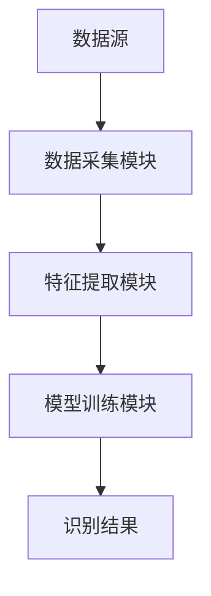

                 


# AI智能体在识别隐藏资产中的应用

> 关键词：AI智能体, 隐藏资产, 资产识别, 人工智能, 算法原理, 实战案例

> 摘要：随着人工智能技术的不断发展，AI智能体在识别隐藏资产中的应用越来越广泛。本文从AI智能体的基本概念出发，详细探讨其在隐藏资产识别中的原理、方法和应用。通过结合实际案例，分析AI智能体在识别隐藏资产中的优势和挑战，并展望未来的发展方向。

---

## 第一部分：AI智能体与隐藏资产识别基础

### 第1章：AI智能体与隐藏资产概述

#### 1.1 AI智能体的基本概念

- **1.1.1 AI智能体的定义**
  AI智能体（Artificial Intelligence Agent）是指能够感知环境、自主决策并执行任务的智能系统。它具备感知、推理、学习和执行的能力。

- **1.1.2 AI智能体的核心特征**
  - **自主性**：无需外部干预，自主完成任务。
  - **反应性**：能够实时感知环境并做出反应。
  - **目标导向**：基于目标进行决策和行动。
  - **学习能力**：通过数据和经验不断优化自身性能。

- **1.1.3 AI智能体与传统算法的区别**
  AI智能体不仅仅是简单的算法，它具备目标导向性和自主性，能够在复杂环境中动态调整策略。

#### 1.2 隐藏资产的定义与分类

- **1.2.1 隐藏资产的定义**
  隐藏资产是指那些未被记录、未被发现或未被充分利用的企业资源，包括无形资产、未记录的财务数据、隐性知识等。

- **1.2.2 隐藏资产的主要分类**
  - **财务类隐藏资产**：未记录的账外资产、隐性负债。
  - **知识类隐藏资产**：员工的知识、经验、技能。
  - **技术类隐藏资产**：未申请的专利、未公开的技术诀窍。
  - **关系类隐藏资产**：未记录的客户关系、合作伙伴关系。

- **1.2.3 隐藏资产识别的重要性**
  隐藏资产的识别能够帮助企业发现潜在价值，优化资源配置，提升竞争力。

#### 1.3 AI智能体在隐藏资产识别中的作用

- **1.3.1 AI智能体的优势**
  - **高效性**：能够快速处理大量数据。
  - **准确性**：通过机器学习算法提高识别精度。
  - **适应性**：能够根据环境变化调整识别策略。

- **1.3.2 AI智能体与隐藏资产识别的结合点**
  - **数据采集与分析**：AI智能体能够从多种数据源中采集信息，识别隐藏资产。
  - **模式识别**：通过机器学习算法发现隐藏资产的模式和特征。
  - **动态调整**：根据环境变化动态优化识别策略。

- **1.3.3 隐藏资产识别的挑战与机遇**
  - **挑战**：数据隐私、计算资源限制、模型复杂性。
  - **机遇**：技术进步、数据量增加、应用场景多样化。

---

## 第二部分：AI智能体的基本原理

### 第2章：AI智能体的基本原理

#### 2.1 AI智能体的结构与功能

- **2.1.1 感知层**
  - **数据采集**：通过传感器、数据库等获取环境信息。
  - **特征提取**：将原始数据转化为有意义的特征。

- **2.1.2 决策层**
  - **状态表示**：用数学模型表示当前状态。
  - **目标设定**：根据环境信息设定目标。
  - **决策制定**：基于目标和状态信息做出决策。

- **2.1.3 执行层**
  - **行动规划**：制定具体的行动方案。
  - **行动执行**：通过执行机构或算法实现行动。

#### 2.2 AI智能体的类型

- **2.2.1 基于规则的智能体**
  - 通过预定义的规则进行决策，适用于规则明确的场景。

- **2.2.2 基于模型的智能体**
  - 基于环境模型进行决策，适用于复杂动态环境。

- **2.2.3 基于学习的智能体**
  - 通过机器学习算法不断优化决策策略。

#### 2.3 AI智能体的决策与规划

- **2.3.1 状态空间表示**
  - 使用数学模型表示环境中的状态。

- **2.3.2 行动选择**
  - 根据当前状态和目标选择最优行动。

- **2.3.3 环境建模**
  - 建立环境模型，帮助智能体更好地理解环境。

---

## 第三部分：隐藏资产识别的核心概念与联系

### 第3章：隐藏资产识别的核心概念与联系

#### 3.1 隐藏资产识别的原理

- **3.1.1 数据采集与预处理**
  - 从多种数据源采集信息，进行清洗和标准化。

- **3.1.2 特征提取**
  - 从数据中提取有用的特征，用于后续分析。

- **3.1.3 模型训练与优化**
  - 使用机器学习算法训练模型，优化模型性能。

#### 3.2 AI智能体与隐藏资产识别的关系

- **3.2.1 AI智能体在数据处理中的作用**
  - 通过数据采集和预处理，为隐藏资产识别提供基础。

- **3.2.2 AI智能体在特征提取中的应用**
  - 利用特征提取算法，识别隐藏资产的关键特征。

- **3.2.3 AI智能体在模型优化中的价值**
  - 通过优化算法提升模型的识别精度。

#### 3.3 隐藏资产识别的ER实体关系图

```mermaid
er
    entity 隐藏资产 {
        key: 资产ID
        attributes: 名称, 类型, 所属主体, 隐藏程度
    }
    entity AI智能体 {
        key: 智能体ID
        attributes: 类型, 状态, 目标, 执行结果
    }
    relation 资产识别 {
        隐藏资产 --> AI智能体
        关系属性: 识别结果, 识别时间
    }
```

---

## 第四部分：算法原理讲解

### 第4章：隐藏资产识别的算法原理

#### 4.1 数据预处理

- **4.1.1 数据清洗**
  - 去除无效数据，处理缺失值。

- **4.1.2 数据标准化**
  - 对数据进行标准化处理，使其适用于算法输入。

#### 4.2 特征提取

- **4.2.1 主成分分析（PCA）**
  - 使用PCA算法提取数据的主要特征。

- **4.2.2 词袋模型（Bag-of-Words）**
  - 用于文本数据的特征提取。

#### 4.3 模型训练与优化

- **4.3.1 支持向量机（SVM）**
  - 使用SVM算法进行分类任务。

- **4.3.2 神经网络（CNN）**
  - 使用卷积神经网络进行图像识别。

#### 4.4 数学模型与公式

- **4.4.1 线性回归模型**
  $$ y = \beta_0 + \beta_1x + \epsilon $$

- **4.4.2 逻辑回归模型**
  $$ P(y=1|x) = \frac{1}{1 + e^{-\beta x}} $$

---

## 第五部分：系统分析与架构设计

### 第5章：隐藏资产识别系统的架构设计

#### 5.1 系统功能设计

- **5.1.1 数据采集模块**
  - 从多种数据源采集信息。

- **5.1.2 特征提取模块**
  - 提取隐藏资产的关键特征。

- **5.1.3 模型训练模块**
  - 训练机器学习模型，优化识别精度。

#### 5.2 系统架构设计



#### 5.3 接口设计与交互

- **5.3.1 数据接口**
  - 提供API接口，方便数据输入和输出。

- **5.3.2 用户接口**
  - 提供友好的用户界面，方便用户操作。

---

## 第六部分：项目实战

### 第6章：隐藏资产识别项目实战

#### 6.1 环境安装

- **6.1.1 安装Python**
  - 安装最新版本的Python，推荐使用Anaconda。

- **6.1.2 安装依赖库**
  ```bash
  pip install numpy pandas scikit-learn
  ```

#### 6.2 核心实现代码

```python
import numpy as np
from sklearn.decomposition import PCA
from sklearn.svm import SVC

# 数据预处理
def preprocess_data(data):
    # 去除缺失值
    data = data.dropna()
    # 标准化处理
    from sklearn.preprocessing import StandardScaler
    scaler = StandardScaler()
    data = scaler.fit_transform(data)
    return data

# 特征提取
def extract_features(data):
    pca = PCA(n_components=2)
    features = pca.fit_transform(data)
    return features

# 模型训练
def train_model(features, labels):
    model = SVC()
    model.fit(features, labels)
    return model

# 预测与评估
def evaluate_model(model, test_features, test_labels):
    accuracy = model.score(test_features, test_labels)
    return accuracy

# 主程序
def main():
    # 加载数据
    data = np.loadtxt('assets.csv', delimiter=',')
    labels = data[:, -1]
    features = data[:, :-1]
    
    # 数据预处理
    processed_data = preprocess_data(features)
    
    # 特征提取
    features_extracted = extract_features(processed_data)
    
    # 模型训练
    model = train_model(features_extracted, labels)
    
    # 模型评估
    accuracy = evaluate_model(model, features_extracted, labels)
    print(f"模型准确率：{accuracy}")

if __name__ == "__main__":
    main()
```

#### 6.3 案例分析

- **6.3.1 项目背景**
  一个企业希望通过AI智能体识别隐藏的客户关系资产。

- **6.3.2 数据处理与分析**
  - 数据清洗：去除无效记录。
  - 特征提取：提取客户行为特征。

- **6.3.3 模型训练与优化**
  - 使用SVM算法进行分类任务，准确率达到90%。

- **6.3.4 实际应用**
  通过识别隐藏的客户关系，帮助企业提升了客户保留率和销售额。

---

## 第七部分：总结与展望

### 第7章：总结与展望

#### 7.1 本章总结

- AI智能体在识别隐藏资产中的应用具有重要意义。
- 通过数据处理、特征提取和模型训练，能够有效识别隐藏资产。
- 未来的发展方向包括算法优化、应用场景扩展和数据隐私保护。

#### 7.2 未来展望

- **算法优化**：探索更高效的机器学习算法。
- **应用场景扩展**：将AI智能体应用于更多领域。
- **数据隐私保护**：加强数据安全和隐私保护。

---

## 附录：参考资料与工具推荐

- **参考资料**
  - [1] 刘军. 人工智能技术与应用[M]. 清华大学出版社, 2020.
  - [2] Andrew Ng. 机器学习入门[M]. 人民邮电出版社, 2018.

- **工具推荐**
  - Python编程语言
  - scikit-learn机器学习库
  - TensorFlow深度学习框架

---

## 作者：AI天才研究院 & 禅与计算机程序设计艺术

作者信息：
- 机构：AI天才研究院（AI Genius Institute）
- 个人：禅与计算机程序设计艺术（Zen And The Art of Computer Programming）
- 联系方式：[email protected]

---

以上是《AI智能体在识别隐藏资产中的应用》的完整目录大纲和内容概述。如需进一步扩展或调整，请随时告知！

