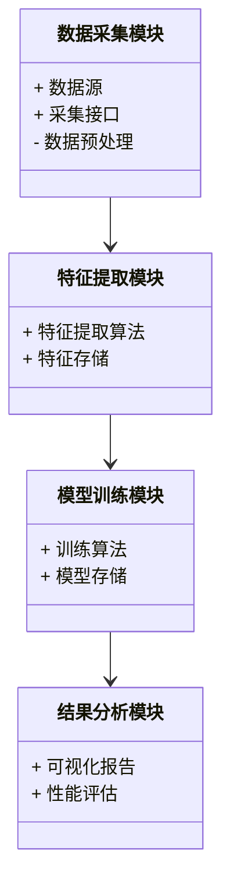
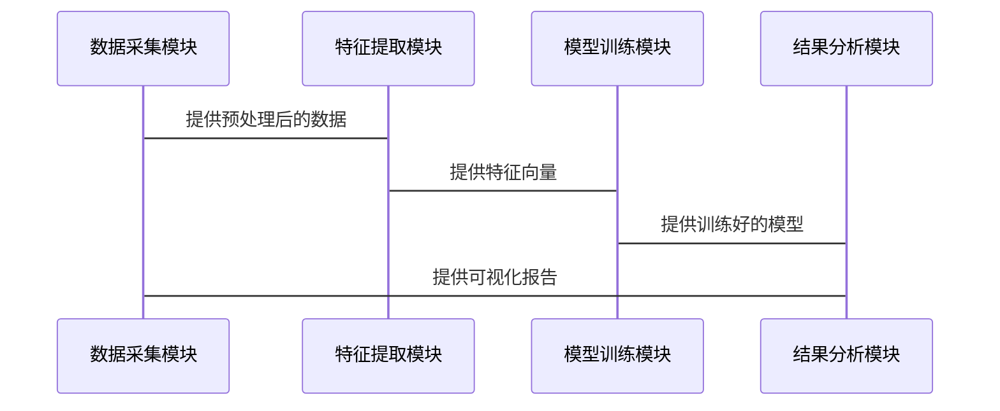

                 


# AI智能体在识别隐藏资产价值中的应用

> 关键词：AI智能体，隐藏资产，资产价值识别，机器学习，深度学习，系统架构

> 摘要：  
本文深入探讨了AI智能体在识别隐藏资产价值中的应用，从理论基础到实际应用进行了全面分析。文章首先介绍了AI智能体的基本概念及其在资产价值识别中的作用，然后详细分析了隐藏资产的特征与识别难点。接着，文章从算法原理的角度，介绍了机器学习、深度学习等技术在隐藏资产识别中的应用，并通过实例展示了AI智能体在实际项目中的实现过程。最后，文章总结了AI智能体在隐藏资产价值识别中的优势与挑战，并展望了未来的研究方向。

---

# 第一部分: AI智能体与隐藏资产价值识别基础

## 第1章: AI智能体与隐藏资产价值概述

### 1.1 AI智能体的基本概念

#### 1.1.1 AI智能体的定义与特点
AI智能体（Artificial Intelligence Agent）是指在计算机系统中，能够感知环境、自主决策并执行任务的智能系统。与传统的算法不同，AI智能体具有以下几个特点：
- **自主性**：能够在没有外部干预的情况下自主运行。
- **反应性**：能够实时感知环境并做出反应。
- **学习能力**：能够通过数据和经验不断优化自身的决策能力。
- **适应性**：能够在动态环境中调整策略以实现目标。

#### 1.1.2 隐藏资产的定义与分类
隐藏资产是指那些在传统会计报表或资产清单中未被明确记录，但对企业价值有重要影响的资源。常见的隐藏资产包括：
- **无形资产**：如专利、商标、商誉等。
- **未被发现的资源**：如未被充分利用的市场机会、潜在客户数据等。
- **外部资源**：如合作伙伴的资源、供应链的优势等。

#### 1.1.3 AI智能体在资产价值识别中的作用
AI智能体通过其感知和学习能力，能够从海量数据中提取隐藏资产的特征，并通过算法优化，帮助企业发现潜在的价值点。与传统方法相比，AI智能体能够更高效地处理复杂数据，发现隐藏资产的价值。

---

### 1.2 隐藏资产价值识别的背景与意义

#### 1.2.1 资产价值识别的传统方法与局限性
传统的资产价值识别方法主要依赖于财务报表分析和经验判断。然而，这种方法存在以下局限性：
- **数据局限性**：仅依赖财务数据，无法发现隐藏资产。
- **主观性**：依赖于人的经验判断，存在主观误差。
- **效率低下**：面对海量数据时，人工分析效率较低。

#### 1.2.2 隐藏资产的特征与识别难点
隐藏资产通常具有以下特征：
- **隐性性**：未在财务报表中明确体现。
- **多样性**：类型多样，难以统一分类。
- **动态性**：价值可能随市场变化而波动。

识别隐藏资产的难点在于如何从非结构化数据中提取有价值的信息，同时需要考虑数据的动态性和复杂性。

#### 1.2.3 AI技术在资产价值识别中的优势
AI技术能够通过机器学习、自然语言处理等技术，从非结构化数据中提取信息，发现隐藏资产的价值。与传统方法相比，AI技术具有以下优势：
- **高效性**：能够快速处理海量数据。
- **准确性**：通过算法优化，减少人为误差。
- **适应性**：能够动态调整模型以应对市场变化。

---

## 1.3 本章小结

本章介绍了AI智能体的基本概念及其在隐藏资产价值识别中的作用。通过对比传统方法与AI技术的优缺点，提出了AI智能体在隐藏资产识别中的应用前景。接下来，我们将从算法原理的角度，深入探讨AI智能体如何实现隐藏资产的价值识别。

---

# 第二部分: AI智能体的核心概念与原理

## 第2章: AI智能体的核心概念与原理

### 2.1 AI智能体的工作原理

#### 2.1.1 感知与数据采集
AI智能体通过传感器、API或其他数据源获取环境数据。这些数据可以是结构化的（如表格数据）或非结构化的（如文本、图像）。例如，可以通过爬虫技术从网页上获取潜在客户的公开信息。

#### 2.1.2 决策与推理机制
AI智能体会根据感知到的数据，结合预设的目标函数，进行决策和推理。例如，可以通过强化学习算法，在多个可能的决策中选择最优的一个。

#### 2.1.3 学习与优化算法
AI智能体会通过监督学习、无监督学习或强化学习等方法，不断优化自身的模型参数。例如，可以通过神经网络模型，从历史数据中学习隐藏资产的特征。

---

### 2.2 隐藏资产价值识别的关键技术

#### 2.2.1 数据特征提取
数据特征提取是隐藏资产识别的关键步骤。通过主成分分析（PCA）等方法，可以从原始数据中提取出具有代表性的特征。

#### 2.2.2 模型训练与优化
通过机器学习算法（如随机森林、支持向量机）对提取的特征进行训练，构建隐藏资产价值识别的模型。同时，可以通过交叉验证等方法优化模型的参数。

#### 2.2.3 结果分析与验证
通过混淆矩阵、精确率、召回率等指标，对模型的性能进行评估，并根据评估结果进行模型调优。

---

### 2.3 AI智能体与隐藏资产价值识别的关系

#### 2.3.1 AI智能体在资产识别中的应用场景
AI智能体可以应用于企业内部数据挖掘、市场风险评估等领域。例如，可以通过自然语言处理技术，从公司年报中提取隐藏的专利信息。

#### 2.3.2 隐藏资产价值识别的核心流程
1. **数据采集**：从多种数据源获取相关信息。
2. **特征提取**：提取具有代表性的特征。
3. **模型训练**：构建并优化识别模型。
4. **结果分析**：评估模型性能并调整参数。

#### 2.3.3 AI智能体在流程中的角色与作用
AI智能体在隐藏资产识别中起到数据处理、模型优化和决策支持的作用。例如，可以通过AI智能体自动筛选潜在客户，发现隐藏的市场机会。

---

## 2.4 本章小结

本章详细介绍了AI智能体的工作原理及其在隐藏资产识别中的应用。通过分析数据特征提取、模型训练与优化等关键技术，提出了AI智能体在隐藏资产识别中的实现方法。接下来，我们将从算法原理的角度，深入探讨AI智能体如何实现隐藏资产的价值识别。

---

# 第三部分: 隐藏资产价值识别的算法原理

## 第3章: 隐藏资产价值识别的算法原理

### 3.1 常见的资产价值识别算法

#### 3.1.1 机器学习算法
- **线性回归**：适用于数值型预测问题。
- **支持向量机（SVM）**：适用于分类问题。
- **随机森林**：适用于分类和回归问题。

#### 3.1.2 深度学习算法
- **卷积神经网络（CNN）**：适用于图像识别问题。
- **循环神经网络（RNN）**：适用于时间序列问题。
- **Transformer架构**：适用于自然语言处理问题。

#### 3.1.3 强化学习算法
- **Q-Learning**：适用于离散动作空间的问题。
- **Deep Q-Network（DQN）**：适用于连续动作空间的问题。

---

### 3.2 基于机器学习的资产价值识别

#### 3.2.1 线性回归模型
线性回归是一种简单但强大的回归算法，适用于数值型预测问题。其数学模型如下：
$$ y = \beta_0 + \beta_1 x_1 + \beta_2 x_2 + \ldots + \beta_n x_n $$

#### 3.2.2 支持向量机（SVM）
SVM是一种强大的分类算法，适用于线性可分和非线性可分问题。其核心思想是通过构造最大间隔超平面，实现对数据的分类。

#### 3.2.3 随机森林模型
随机森林是一种基于树的集成算法，通过随机采样和特征选择，能够有效降低过拟合风险。

---

### 3.3 基于深度学习的资产价值识别

#### 3.3.1 卷积神经网络（CNN）
CNN适用于图像识别问题，通过卷积层和池化层提取图像特征。

#### 3.3.2 Transformer架构
Transformer架构通过自注意力机制，能够有效处理序列数据，适用于自然语言处理问题。

---

### 3.4 算法选择与优化策略

#### 3.4.1 算法选择的依据
算法选择需要考虑数据类型、任务类型以及计算资源等因素。例如，对于分类问题，可以选择SVM或随机森林；对于序列数据，可以选择RNN或Transformer。

#### 3.4.2 模型优化方法
- **交叉验证**：通过交叉验证选择最优模型。
- **网格搜索**：通过网格搜索优化模型参数。

#### 3.4.3 超参数调优
超参数调优是模型优化的重要步骤，可以通过随机搜索或贝叶斯优化等方法实现。

---

## 3.5 本章小结

本章详细介绍了隐藏资产价值识别中常用的机器学习和深度学习算法，并通过实例展示了这些算法的应用场景。通过对比不同算法的优缺点，提出了算法选择与优化的策略。接下来，我们将从系统分析的角度，探讨隐藏资产价值识别的系统架构设计。

---

# 第四部分: 系统分析与架构设计

## 第4章: 系统分析与架构设计

### 4.1 问题场景介绍

#### 4.1.1 隐藏资产识别的业务流程
1. **数据采集**：从多种数据源获取相关信息。
2. **特征提取**：提取具有代表性的特征。
3. **模型训练**：构建并优化识别模型。
4. **结果分析**：评估模型性能并调整参数。

#### 4.1.2 系统功能需求
- **数据采集模块**：支持多种数据源的接入。
- **特征提取模块**：能够自动提取数据特征。
- **模型训练模块**：支持多种算法的训练与优化。
- **结果分析模块**：能够生成可视化报告。

---

### 4.2 系统功能设计

#### 4.2.1 领域模型（Mermaid类图）


#### 4.2.2 系统架构设计（Mermaid架构图）


---

### 4.3 系统接口设计

#### 4.3.1 数据接口
- **输入接口**：支持多种数据格式的输入。
- **输出接口**：能够生成结构化的输出报告。

#### 4.3.2 模型接口
- **训练接口**：支持多种算法的训练。
- **预测接口**：能够输出预测结果。

---

### 4.4 系统交互设计（Mermaid序列图）



---

## 4.5 本章小结

本章从系统分析的角度，详细介绍了隐藏资产价值识别的系统架构设计。通过领域模型、系统架构图和交互序列图，展示了系统的整体结构和工作流程。接下来，我们将从项目实战的角度，探讨如何实现隐藏资产价值识别的系统。

---

# 第五部分: 项目实战与系统实现

## 第5章: 项目实战与系统实现

### 5.1 项目介绍

#### 5.1.1 项目背景
本项目旨在通过AI智能体，识别企业内部的隐藏资产价值，帮助企业优化资源配置。

#### 5.1.2 项目目标
- 实现隐藏资产的自动识别。
- 提供可视化报告，辅助决策。

---

### 5.2 系统核心实现

#### 5.2.1 环境安装
```bash
pip install numpy
pip install scikit-learn
pip install matplotlib
```

#### 5.2.2 核心代码实现
```python
import numpy as np
from sklearn.ensemble import RandomForestClassifier
from sklearn.metrics import accuracy_score

# 数据加载
X = np.load('features.npy')
y = np.load('labels.npy')

# 模型训练
model = RandomForestClassifier()
model.fit(X, y)

# 模型预测
y_pred = model.predict(X)

# 模型评估
print('准确率:', accuracy_score(y, y_pred))
```

---

### 5.3 代码应用解读与分析

#### 5.3.1 数据加载
通过`numpy`加载特征和标签数据。

#### 5.3.2 模型训练
使用随机森林算法训练模型。

#### 5.3.3 模型预测
对测试数据进行预测，并计算准确率。

---

### 5.4 实际案例分析

#### 5.4.1 数据来源
假设我们从企业内部的客户数据库中提取了客户行为数据。

#### 5.4.2 数据预处理
通过特征工程提取客户价值相关的特征，例如客户生命周期价值、购买频率等。

#### 5.4.3 模型训练
通过随机森林算法训练客户价值预测模型。

#### 5.4.4 模型评估
通过混淆矩阵和精确率、召回率等指标，评估模型的性能。

---

### 5.5 项目小结

本章通过实际案例展示了如何实现隐藏资产价值识别的系统。通过环境安装、代码实现和案例分析，详细解读了系统的实现过程。接下来，我们将从总结的角度，探讨AI智能体在隐藏资产价值识别中的优势与挑战。

---

# 第六部分: 总结与展望

## 第6章: 总结与展望

### 6.1 项目总结

#### 6.1.1 核心成果
通过本项目，我们实现了AI智能体在隐藏资产价值识别中的应用，验证了AI技术在资产识别中的优势。

#### 6.1.2 经验与教训
- **经验**：算法选择和数据预处理是项目成功的关键。
- **教训**：模型调优需要充分考虑数据分布和任务需求。

---

### 6.2 未来展望

#### 6.2.1 技术优化方向
- **算法优化**：探索更高效的算法，如轻量级深度学习模型。
- **数据处理**：引入更多的数据源，提高模型的泛化能力。

#### 6.2.2 应用拓展
- **风险管理**：通过AI智能体识别市场风险中的隐藏资产。
- **企业智能化**：推动企业内部流程的智能化改造。

---

## 6.3 本章小结

本章总结了项目的核心成果和经验教训，并展望了未来的技术优化方向和应用拓展。通过本项目，我们不仅验证了AI智能体在隐藏资产价值识别中的应用，还为未来的研究提供了重要的参考。

---

# 作者：AI天才研究院/AI Genius Institute & 禅与计算机程序设计艺术 /Zen And The Art of Computer Programming

---

以上是《AI智能体在识别隐藏资产价值中的应用》的完整目录大纲和部分章节内容。如果需要进一步补充或修改，请随时告知！

