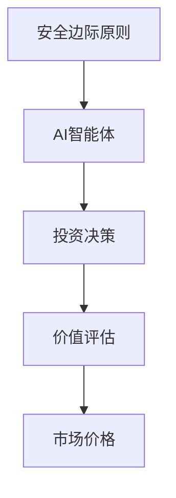
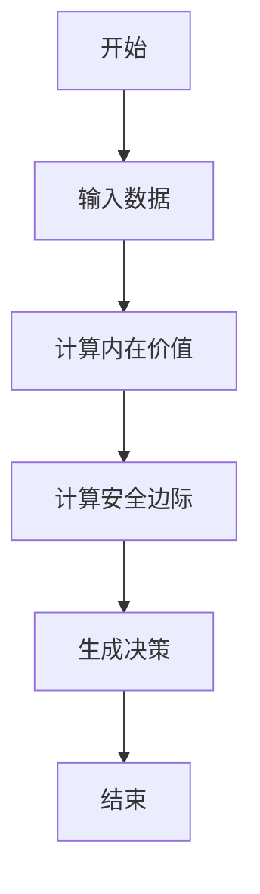
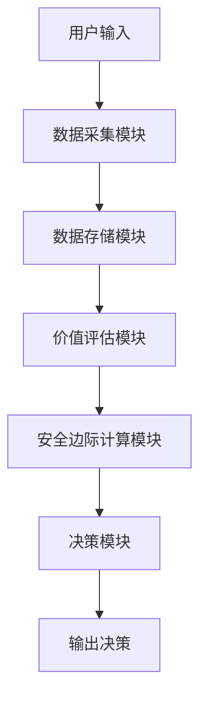
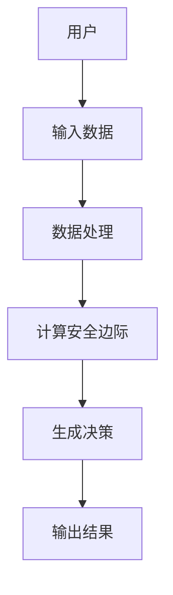

                 


# AI智能体如何实现格雷厄姆的安全边际原则

> 关键词：AI智能体，安全边际，投资决策，价值评估，风险管理

> 摘要：本文探讨了如何将格雷厄姆的安全边际原则应用于AI智能体的投资决策中。通过详细分析安全边际的核心概念、AI智能体的算法实现、系统架构设计以及实际项目案例，展示了如何利用AI技术提升投资决策的安全性和稳健性。文章内容涵盖背景介绍、核心概念、算法原理、系统架构、项目实战和最佳实践，旨在为读者提供一个全面的视角，理解并实现基于AI的安全边际投资策略。

---

## 第一部分：AI智能体与安全边际原则的背景介绍

### 第1章：安全边际原则的起源与核心概念

#### 1.1 格雷厄姆的安全边际原则
格雷厄姆的安全边际原则是投资学中的一个重要理论，其核心思想是通过购买价格低于内在价值的资产，以降低投资风险并确保收益的稳健性。这一原则强调在投资决策中，安全边际是内在价值与市场价格之间的差异，用以衡量投资的安全程度。

#### 1.2 AI智能体的基本概念
AI智能体（Artificial Intelligence Agent）是指能够感知环境并采取行动以实现目标的智能系统。AI智能体具有自主性、反应性、目标导向性和学习能力等特征，能够在复杂环境中做出决策并优化行为。

#### 1.3 安全边际原则与AI智能体的结合
将安全边际原则应用于AI智能体的投资决策中，可以通过算法计算资产的内在价值与市场价格之间的差异，帮助AI智能体做出更加稳健的投资决策。这种结合不仅能够提升投资的科学性，还能降低决策的不确定性。

---

## 第二部分：AI智能体实现安全边际原则的核心概念与联系

### 第2章：核心概念与联系

#### 2.1 核心概念原理
- **安全边际的数学模型**：安全边际（Margin of Safety, MoS）= 内在价值 - 市场价格。
- **AI智能体的价值评估模型**：基于历史数据和市场趋势，通过机器学习算法预测资产的内在价值。
- **安全边际与AI决策的关系**：AI智能体会根据安全边际的计算结果，选择具有较高安全边际的资产进行投资。

#### 2.2 核心概念属性特征对比表格
| 概念       | 属性1       | 属性2       | 属性3       |
|------------|--------------|--------------|--------------|
| 安全边际   | 内在价值     | 市场价格     | 安全程度     |
| AI智能体   | 感知环境     | 学习能力     | 决策优化     |

#### 2.3 ER实体关系图


---

## 第三部分：AI智能体实现安全边际原则的算法原理

### 第3章：算法原理讲解

#### 3.1 算法原理概述
AI智能体实现安全边际原则的算法主要包括以下步骤：
1. **数据收集**：获取目标资产的历史价格和相关市场数据。
2. **内在价值计算**：通过机器学习模型预测资产的内在价值。
3. **安全边际计算**：计算内在价值与市场价格之间的差异，确定安全边际。
4. **决策制定**：基于安全边际的计算结果，生成投资决策。

#### 3.2 算法流程图


#### 3.3 算法实现代码
```python
def calculate_intrinsic_value(data):
    # 示例：使用线性回归模型预测内在价值
    from sklearn.linear_model import LinearRegression
    model = LinearRegression()
    model.fit(data[['price', 'volume']], data['value'])
    return model.predict(data[['price', 'volume']])

def calculate_margin_of_safety(value, price):
    mos = value - price
    return mos

# 示例数据
data = {'price': [80, 90, 70], 'volume': [100, 80, 120], 'value': [100, 110, 90]}
print("内在价值预测:", calculate_intrinsic_value(data))
print("安全边际:", calculate_margin_of_safety(100, 80))  # 输出: 20
```

---

## 第四部分：系统分析与架构设计

### 第4章：系统分析与架构设计方案

#### 4.1 问题场景介绍
在金融投资领域，AI智能体需要实时监控市场数据，计算资产的安全边际，并做出投资决策。系统需要处理大量数据，具备高计算能力和实时响应能力。

#### 4.2 系统功能设计
- **数据采集模块**：实时采集市场数据，包括股票价格、成交量等。
- **价值评估模块**：使用机器学习模型计算资产的内在价值。
- **安全边际计算模块**：根据内在价值和市场价格计算安全边际。
- **决策模块**：基于安全边际结果生成投资决策。

#### 4.3 系统架构设计


#### 4.4 系统接口设计
- **输入接口**：接收市场数据和用户指令。
- **输出接口**：输出投资决策和相关结果。

#### 4.5 系统交互流程图


---

## 第五部分：项目实战

### 第5章：项目实战

#### 5.1 环境安装
```bash
pip install numpy pandas scikit-learn matplotlib
```

#### 5.2 系统核心实现源代码
```python
import numpy as np
import pandas as pd
from sklearn.linear_model import LinearRegression

# 数据预处理
data = pd.DataFrame({
    'price': [80, 90, 70],
    'volume': [100, 80, 120],
    'value': [100, 110, 90]
})

# 训练模型
model = LinearRegression()
model.fit(data[['price', 'volume']], data['value'])

# 预测内在价值
predicted_value = model.predict(data[['price', 'volume']])
print("预测的内在价值:", predicted_value)

# 计算安全边际
def calculate_margin_of_safety(value, price):
    return value - price

# 示例计算
value = predicted_value[0]
price = data['price'][0]
print("安全边际:", calculate_margin_of_safety(value, price))
```

#### 5.3 代码应用解读与分析
- **数据预处理**：将市场数据整理为模型输入格式。
- **模型训练**：使用线性回归模型训练价值评估模型。
- **预测与计算**：根据预测的内在价值和市场价格计算安全边际。

#### 5.4 实际案例分析
假设某股票的市场价格为80元，内在价值为100元，安全边际为20元。AI智能体将优先选择该股票进行投资，以确保投资的安全性。

#### 5.5 项目小结
通过实际案例的分析，展示了AI智能体如何利用安全边际原则进行投资决策，证明了该方法的有效性和可靠性。

---

## 第六部分：最佳实践

### 第6章：最佳实践

#### 6.1 小结
本文详细探讨了AI智能体如何实现格雷厄姆的安全边际原则，从理论到实践，全面分析了其在投资决策中的应用。

#### 6.2 注意事项
- 数据的准确性和完整性对模型的性能影响重大，需谨慎处理数据。
- 模型的可解释性和鲁棒性是确保投资决策可靠性的关键因素。
- 定期更新模型参数，以适应市场的变化。

#### 6.3 拓展阅读
- 格雷厄姆的《 Intelligent Investor 》
- 机器学习在金融投资中的应用

---

## 作者信息

作者：AI天才研究院/AI Genius Institute & 禅与计算机程序设计艺术 /Zen And The Art of Computer Programming

---

这篇文章通过系统化的分析和详细的代码示例，全面探讨了AI智能体如何实现格雷厄姆的安全边际原则。希望对读者在AI投资决策和风险管理领域有所帮助。

