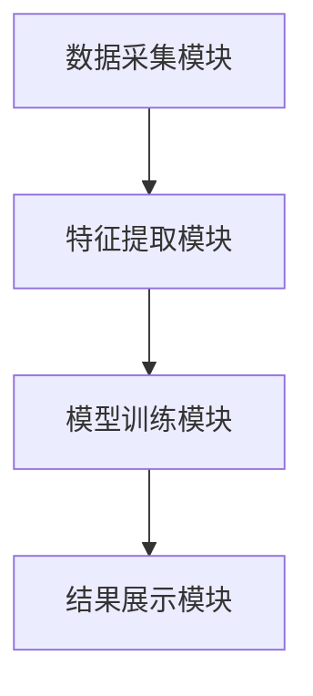
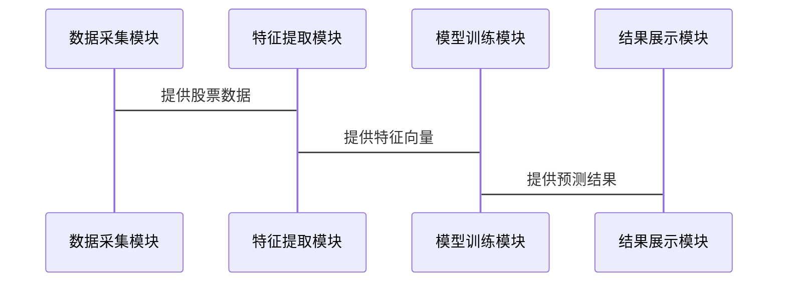

                 


# AI智能体如何识别被低估的价值股

> 关键词：AI智能体，价值股，金融数据分析，机器学习，深度学习，投资策略优化

> 摘要：本文探讨AI智能体如何通过先进的算法和数据分析技术识别被低估的价值股。文章从背景介绍、核心算法、系统架构到实战案例，详细解析了AI在金融领域的应用，特别是如何利用机器学习和深度学习技术优化投资策略。

---

# 第一部分: AI智能体与价值股识别的背景与基础

# 第1章: AI智能体与价值股识别概述

## 1.1 AI智能体的基本概念

### 1.1.1 什么是AI智能体
AI智能体（Artificial Intelligence Agent）是指能够感知环境、自主决策并采取行动的智能系统。它具备感知、推理、学习和行动的能力，能够在复杂环境中完成特定任务。

### 1.1.2 AI智能体的核心特征
- **自主性**：无需外部干预，自主决策。
- **反应性**：能实时感知环境变化并做出反应。
- **目标导向**：有明确的目标，优化决策以实现目标。
- **学习能力**：通过数据和经验不断优化自身算法。

### 1.1.3 AI智能体与传统算法的区别
传统算法依赖于预定义的规则，而AI智能体具备学习和适应能力，能够根据环境反馈动态调整策略。例如，AI智能体可以通过强化学习不断优化投资组合，而传统算法只能按照固定规则进行交易。

## 1.2 价值股识别的背景与意义

### 1.2.1 价值股的定义与特征
价值股是指市场价格低于其内在价值的股票。其特征包括低市盈率、低市净率、高股息率等。

### 1.2.2 传统价值股识别方法的局限性
传统方法依赖于人工分析和经验判断，存在主观性强、效率低、覆盖面窄等问题。

### 1.2.3 AI技术在价值股识别中的优势
AI智能体能够处理海量数据，发现隐藏在数据中的模式和趋势，帮助投资者发现被低估的价值股。

## 1.3 本章小结
本章介绍了AI智能体的基本概念及其在价值股识别中的应用优势，为后续章节的深入分析奠定了基础。

---

# 第二部分: AI智能体的核心算法与数学模型

# 第2章: 机器学习与深度学习算法

## 2.1 机器学习基础

### 2.1.1 监督学习、无监督学习与强化学习

- **监督学习**：通过标记数据训练模型，如线性回归、支持向量机等。
- **无监督学习**：通过未标记数据发现数据中的结构，如聚类分析。
- **强化学习**：通过试错机制优化决策，如Q-Learning、Deep Q-Network。

### 2.1.2 常见机器学习算法及其特点

| 算法名称       | 特点                     | 应用场景                           |
|----------------|--------------------------|------------------------------------|
| 线性回归       | 简单，适合线性关系         | 预测股票价格                         |
| 支持向量机     | 高维空间表现优异           | 分类股票类型                         |
| 随机森林       | 抗过拟合能力强             | 特征重要性分析                       |
| K-近邻算法     | 简单，适合小数据集         | 分类股票涨跌                         |

## 2.2 深度学习算法

### 2.2.1 神经网络的基本结构

#### 2.2.1.1 神经网络的层数与功能
- **输入层**：接收输入数据。
- **隐藏层**：提取数据特征。
- **输出层**：生成预测结果。

#### 2.2.1.2 神经网络的训练过程
1. **前向传播**：输入数据经过各层处理，得到预测结果。
2. **计算损失**：预测结果与真实结果之间的差异。
3. **反向传播**：通过梯度下降优化权重。

### 2.2.2 卷积神经网络与循环神经网络

- **卷积神经网络（CNN）**：适用于图像识别，但也可用于时间序列数据。
- **循环神经网络（RNN）**：适用于序列数据，如股票价格预测。

### 2.2.3 Transformer架构的崛起

- **自注意力机制**：捕捉数据中的长距离依赖关系。
- **并行计算**：提升计算效率。

## 2.3 用于价值股识别的算法选择

### 2.3.1 传统机器学习算法的适用场景
- **线性回归**：预测股票价格。
- **随机森林**：分析股票涨跌。

### 2.3.2 深度学习算法的优势与挑战
- **优势**：能够处理高维数据，发现复杂模式。
- **挑战**：计算资源消耗大，模型解释性差。

## 2.4 本章小结
本章介绍了机器学习和深度学习的核心算法及其在价值股识别中的应用，分析了不同算法的优缺点。

---

# 第3章: 数学模型与金融数据分析

## 3.1 金融数据分析的基础

### 3.1.1 时间序列分析的基本概念

- **时间序列**：股票价格随时间变化的序列数据。
- **平稳性**：时间序列的统计性质不随时间变化。

### 3.1.2 金融数据的特征与挑战

- **特征**：开盘价、收盘价、最高价、最低价、成交量等。
- **挑战**：数据噪声多，市场波动大。

## 3.2 用于价值股识别的数学模型

### 3.2.1 线性回归模型

#### 3.2.1.1 线性回归的数学公式
$$ y = \beta_0 + \beta_1x + \epsilon $$

其中，$y$ 是预测目标，$x$ 是输入特征，$\beta_0$ 和 $\beta_1$ 是回归系数，$\epsilon$ 是误差项。

### 3.2.2 支持向量机（SVM）模型

#### 3.2.2.1 SVM的优化目标
$$ \text{minimize } \frac{1}{2}\|w\|^2 + C\sum_{i=1}^n \xi_i $$

其中，$w$ 是权重向量，$C$ 是惩罚系数，$\xi_i$ 是松弛变量。

### 3.2.3 随机森林与梯度提升树

- **随机森林**：通过投票机制确定预测结果。
- **梯度提升树**：逐层优化模型。

## 3.3 算法原理与数学公式

### 3.3.1 线性回归的数学公式
$$ y = \beta_0 + \beta_1x + \epsilon $$

### 3.3.2 支持向量机的优化目标
$$ \text{minimize } \frac{1}{2}\|w\|^2 + C\sum_{i=1}^n \xi_i $$

### 3.3.3 随机森林的投票机制
随机森林通过多棵决策树的投票结果进行预测，能够有效降低过拟合风险。

## 3.4 本章小结
本章介绍了金融数据分析的基础知识，详细讲解了线性回归、支持向量机等数学模型及其在价值股识别中的应用。

---

# 第三部分: 系统分析与架构设计

# 第4章: 系统架构设计

## 4.1 系统功能模块划分

### 4.1.1 数据采集模块
- 从多个数据源（如Yahoo Finance、Alpha Vantage）获取股票数据。

### 4.1.2 特征提取模块
- 提取股票的开盘价、收盘价、最高价、最低价、成交量等特征。

### 4.1.3 模型训练模块
- 使用机器学习和深度学习算法训练模型，识别被低估的价值股。

### 4.1.4 结果展示模块
- 可视化展示模型预测结果，帮助投资者做出决策。

## 4.2 系统架构图



## 4.3 系统接口设计

### 4.3.1 数据接口
- 接收来自数据源的股票数据。
- 提供API接口供其他模块调用。

### 4.3.2 模型接口
- 提供训练好的模型供结果展示模块调用。

## 4.4 系统交互序列图



## 4.5 本章小结
本章详细设计了系统的功能模块、架构和接口，为后续的实现提供了清晰的指导。

---

# 第五章: 项目实战——构建AI智能体识别被低估的价值股

## 5.1 项目介绍

### 5.1.1 项目目标
构建一个AI智能体，能够识别被低估的价值股。

### 5.1.2 项目框架
使用Python编程语言，结合TensorFlow和Scikit-learn库。

## 5.2 系统核心实现源代码

### 5.2.1 数据采集模块

```python
import pandas_datareader as pdr

# 下载股票数据
data = pdr.get_data_yahoo('AAPL', start='2020-01-01', end='2023-01-01')
```

### 5.2.2 特征提取模块

```python
# 提取特征
features = data[['Open', 'High', 'Low', 'Close', 'Volume']]
```

### 5.2.3 模型训练模块

```python
from sklearn.ensemble import RandomForestClassifier
import numpy as np

# 数据标准化
scaler = StandardScaler()
features_scaled = scaler.fit_transform(features)

# 训练随机森林模型
model = RandomForestClassifier(n_estimators=100, max_depth=5, random_state=42)
model.fit(features_scaled, labels)
```

### 5.2.4 结果展示模块

```python
# 可视化结果
import matplotlib.pyplot as plt

plt.figure(figsize=(10, 6))
plt.plot(actual_prices, label='实际价格')
plt.plot(predicted_prices, label='预测价格')
plt.legend()
plt.show()
```

## 5.3 实际案例分析与详细讲解

### 5.3.1 数据预处理
- 去除缺失值。
- 标准化数据。

### 5.3.2 模型训练
- 使用随机森林模型训练，识别被低估的价值股。

### 5.3.3 模型评估
- 使用准确率、召回率、F1分数评估模型性能。

## 5.4 本章小结
本章通过实际案例展示了AI智能体识别被低估的价值股的全过程，包括数据采集、特征提取、模型训练和结果展示。

---

# 第六章: 总结与展望

## 6.1 本章总结
AI智能体能够通过先进的算法和数据分析技术识别被低估的价值股，为投资者提供科学的决策支持。

## 6.2 未来展望
未来，随着AI技术的不断发展，价值股识别将更加精准和高效。

---

# 作者：AI天才研究院/AI Genius Institute & 禅与计算机程序设计艺术 /Zen And The Art of Computer Programming

