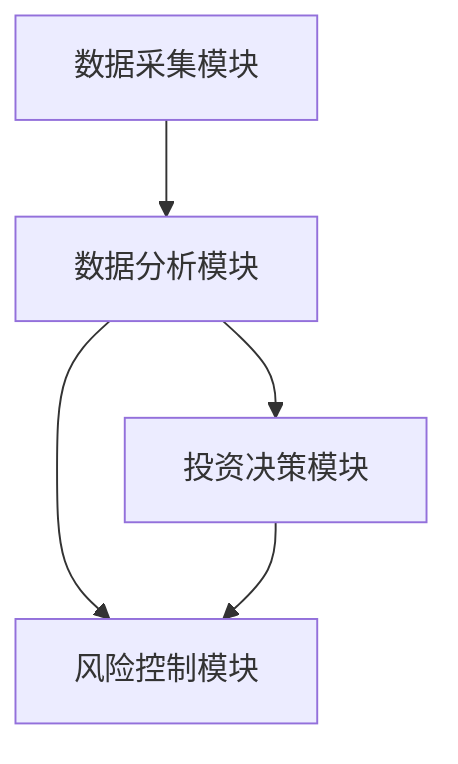
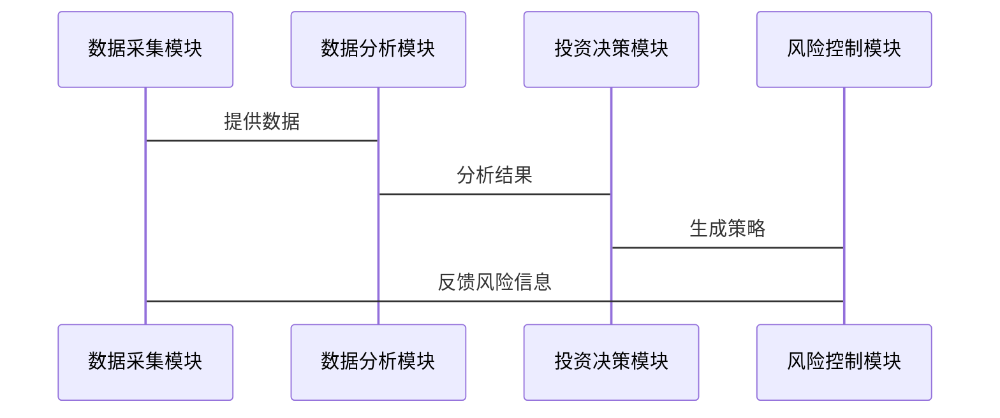

                 


# AI智能体实现巴菲特的焦点投资策略

> 关键词：AI智能体，巴菲特投资策略，焦点投资，强化学习，投资决策，系统架构

> 摘要：本文详细探讨了如何利用AI智能体实现巴菲特的焦点投资策略。首先介绍了巴菲特的焦点投资策略的核心理念和分析框架，接着深入讲解了AI智能体的构建基础和实现原理，然后分析了AI智能体在焦点投资策略中的具体应用场景，包括数据处理、特征提取、模型训练和策略生成。最后，结合实际案例，展示了如何设计一个完整的AI投资系统，并提出了系统的优化建议和未来的发展方向。

---

# 第一部分：巴菲特的焦点投资策略

## 第1章：巴菲特投资策略概述

### 1.1 巴菲特投资理念的核心要素

#### 1.1.1 投资的本质与长期价值

巴菲特认为，投资的本质是购买企业的一部分，而非仅仅是买卖股票。他强调长期投资，关注企业的内在价值，而不是市场的短期波动。企业的内在价值可以通过其财务状况、竞争优势和管理层质量来评估。

$$\text{内在价值} = \frac{\text{净利润} \times (1 + g)}{r - g}$$

其中，$g$ 是企业的年增长率，$r$ 是期望的回报率。

#### 1.1.2 焦点投资策略的定义

焦点投资策略是指集中投资于少数几种容易理解且具有长期竞争优势的企业。巴菲特认为，投资少数优质企业可以降低风险，同时获得更高的长期回报。他建议投资者选择那些具有强大护城河（竞争优势）、良好管理层和稳定财务状况的企业。

#### 1.1.3 投资决策的关键因素

巴菲特的投资决策主要基于以下三个因素：

1. **财务状况**：关注企业的盈利能力、资产负债表和现金流。
2. **竞争优势**：寻找具有长期竞争优势的企业，例如品牌、技术、成本优势等。
3. **管理层**：信任具有优秀管理能力和诚信的企业领导者。

### 1.2 巴菲特投资策略的分析框架

#### 1.2.1 财务状况分析

巴菲特强调对企业财务状况的深入分析，特别是以下几个方面：

1. **盈利能力**：关注净利润率、毛利率等指标。
2. **资产负债表**：分析企业的资产、负债和所有者权益结构。
3. **现金流**：关注经营活动现金流，确保企业有稳定的现金流。

#### 1.2.2 竞争优势分析

竞争优势是巴菲特投资决策的核心因素之一。他寻找那些具有强大护城河的企业，例如：

1. **品牌优势**：例如可口可乐。
2. **成本优势**：例如沃尔玛。
3. **技术优势**：例如苹果。

#### 1.2.3 管理层评估

巴菲特认为，优秀的管理层能够为企业创造长期价值。他关注管理层的诚信、决策能力和企业文化的建设。

### 1.3 巴菲特投资策略的成功案例

#### 1.3.1 可口可乐的投资分析

可口可乐是巴菲特的经典投资案例之一。他选择可口可乐的原因包括：

1. **强大的品牌优势**：可口可乐在全球市场具有极强的品牌影响力。
2. **稳定的现金流**：可口可乐的商业模式能够持续产生稳定的现金流。
3. **优秀的管理层**：可口可乐的管理层表现出色，能够持续推动公司发展。

#### 1.3.2 伯克希尔 Hathaway 的投资布局

伯克希尔 Hathaway 是巴菲特的旗舰公司，其投资组合涵盖了多种具有长期竞争优势的企业，例如苹果、可口可乐和 IBM 等。

#### 1.3.3 焦点投资策略的长期回报

巴菲特的焦点投资策略在长期实践中表现优异，尤其是在2008年金融危机期间，伯克希尔 Hathaway 的表现远超市场指数。

---

## 第2章：AI智能体的核心概念

### 2.1 AI智能体的基本定义

#### 2.1.1 AI智能体的定义与特征

AI智能体（Artificial Intelligence Agent）是指能够感知环境、自主决策并采取行动的智能系统。它具有以下特征：

1. **自主性**：能够在没有外部干预的情况下自主运行。
2. **反应性**：能够实时感知环境并做出反应。
3. **目标导向**：基于目标驱动决策和行动。
4. **学习能力**：能够通过经验优化自身的决策策略。

#### 2.1.2 AI智能体与传统AI的区别

传统的AI系统通常专注于特定任务，例如语音识别或图像分类。而AI智能体是一个更加综合的系统，能够感知环境、理解任务目标，并通过自主决策实现目标。

#### 2.1.3 AI智能体的应用场景

AI智能体的应用场景包括：

1. **自动驾驶**：通过感知环境和自主决策实现自动驾驶。
2. **智能助手**：例如Siri、Alexa等，能够与用户交互并执行任务。
3. **投资决策**：通过分析市场数据和企业信息，辅助或替代人类进行投资决策。

### 2.2 AI智能体的构建基础

#### 2.2.1 数据处理与特征提取

AI智能体的构建需要大量的数据支持。数据处理包括数据清洗、特征提取和数据标准化等步骤。

例如，对于股票数据，我们需要提取以下特征：

- 开盘价、收盘价、最高价、最低价
- 成交量
- 市盈率、市净率等财务指标

#### 2.2.2 知识表示与推理机制

知识表示是AI智能体理解世界的基础。常见的知识表示方法包括：

1. **符号表示**：使用符号逻辑表示知识。
2. **向量表示**：将知识表示为高维向量，例如Word2Vec。
3. **知识图谱**：构建结构化的知识网络。

推理机制则是基于知识表示进行逻辑推理。例如，使用逻辑回归或支持向量机（SVM）进行分类推理。

#### 2.2.3 行为决策与优化算法

行为决策是AI智能体的核心功能。常用的决策算法包括：

1. **基于规则的决策**：根据预定义的规则进行决策。
2. **基于模型的决策**：基于机器学习模型进行预测和决策。
3. **强化学习**：通过试错学习优化决策策略。

### 2.3 AI智能体的算法原理

#### 2.3.1 强化学习算法

强化学习是一种通过试错学习优化决策策略的方法。其核心在于通过与环境的交互，学习最优策略。

$$ Q(s, a) = r + \gamma \max_{a'} Q(s', a') $$

其中，$Q(s, a)$ 表示状态 $s$ 下动作 $a$ 的价值，$r$ 是奖励，$\gamma$ 是折扣因子。

#### 2.3.2 监督学习与无监督学习

监督学习通过标记数据进行模型训练，例如回归和分类任务。无监督学习则通过未标记数据进行模式识别，例如聚类和降维。

#### 2.3.3 神经网络与深度学习

深度学习通过多层神经网络提取数据特征，例如卷积神经网络（CNN）和循环神经网络（RNN）。

---

## 第3章：AI智能体实现巴菲特投资策略的核心思路

### 3.1 焦点投资策略的AI化路径

#### 3.1.1 理解焦点投资策略的逻辑

焦点投资策略的核心是集中投资于优质企业。AI智能体需要理解并模拟这一逻辑，通过数据分析和模型训练实现自动化投资决策。

#### 3.1.2 AI智能体如何模拟人类决策

AI智能体通过分析企业的财务数据、市场信息和行业趋势，模拟人类投资者的决策过程。例如，使用自然语言处理技术分析公司财报，提取关键信息。

#### 3.1.3 焦点投资策略的量化分析

量化分析是AI智能体的核心能力。通过量化分析，AI智能体可以快速评估企业的内在价值和竞争优势。

### 3.2 AI智能体的投资决策模型

#### 3.2.1 投资决策的逻辑框架

AI智能体的投资决策模型通常包括以下几个步骤：

1. **数据采集**：收集企业的财务数据、市场信息和行业报告。
2. **特征提取**：提取关键特征，例如市盈率、市净率、ROE等。
3. **模型训练**：使用机器学习模型进行分类或回归分析。
4. **策略生成**：根据模型输出生成投资策略。

#### 3.2.2 焦点投资策略的数学模型

$$ \text{投资价值} = \alpha \times \text{内在价值} + \beta \times \text{竞争优势} + \gamma \times \text{管理层评分} $$

其中，$\alpha$、$\beta$、$\gamma$ 是权重系数，通常通过训练数据优化得出。

#### 3.2.3 AI智能体的决策优化

通过强化学习，AI智能体可以在实际投资中不断优化其决策策略，例如调整权重系数和优化投资组合。

### 3.3 焦点投资策略的AI实现步骤

#### 3.3.1 数据收集与预处理

1. **数据来源**：从股票市场数据、财经新闻、公司财报等多渠道获取数据。
2. **数据清洗**：去除噪声数据，处理缺失值。
3. **特征提取**：提取关键特征，例如财务指标、市场指标等。

#### 3.3.2 模型训练与优化

1. **选择算法**：根据任务需求选择合适的算法，例如随机森林、支持向量机或深度学习模型。
2. **训练数据**：使用历史数据训练模型。
3. **模型优化**：通过交叉验证和超参数调优优化模型性能。

#### 3.3.3 系统测试与验证

1. **回测**：在历史数据上验证模型的性能。
2. **风险控制**：设计风险管理模块，例如止损策略和仓位管理。
3. **实时测试**：在实际市场中测试系统的表现。

---

## 第4章：AI智能体实现焦点投资策略的系统架构设计

### 4.1 系统功能模块设计

#### 4.1.1 数据采集模块

- 负责从股票市场、财经新闻等多渠道获取数据。
- 数据格式：结构化数据（如财务指标）和非结构化数据（如新闻文本）。

#### 4.1.2 数据分析模块

- 负责数据的清洗、特征提取和初步分析。
- 使用工具：Pandas、NumPy等。

#### 4.1.3 投资决策模块

- 负责基于模型生成投资策略。
- 使用算法：强化学习、监督学习等。

#### 4.1.4 风险控制模块

- 负责管理投资风险，例如止损和仓位控制。
- 使用工具：风险管理框架，如VaR（在险价值）。

### 4.2 系统架构设计

#### 4.2.1 系统架构图



#### 4.2.2 系统交互流程图



### 4.3 系统接口设计

- 数据采集模块接口：提供数据获取接口。
- 数据分析模块接口：提供数据清洗和特征提取接口。
- 投资决策模块接口：提供策略生成接口。
- 风险控制模块接口：提供风险管理接口。

---

## 第5章：AI智能体实现巴菲特焦点投资策略的实战案例

### 5.1 环境安装与配置

1. **安装Python**：确保安装了Python 3.8或更高版本。
2. **安装依赖库**：安装Pandas、NumPy、Scikit-learn、TensorFlow等。

### 5.2 系统核心实现

#### 5.2.1 数据采集模块实现

```python
import pandas as pd
import requests

def get_stock_data(ticker):
    url = f"https://api.example.com/stock/{ticker}"
    response = requests.get(url)
    data = response.json()
    return pd.DataFrame(data)
```

#### 5.2.2 数据分析模块实现

```python
from sklearn.feature_selection import SelectKBest
from sklearn.ensemble import RandomForestClassifier

def analyze_data(df):
    features = df.drop('target', axis=1)
    target = df['target']
    selector = SelectKBest(k=5)
    selector.fit(features, target)
    selected_features = selector.transform(features)
    return selected_features
```

#### 5.2.3 投资决策模块实现

```python
import tensorflow as tf
from tensorflow.keras import layers

def build_model(input_shape):
    model = tf.keras.Sequential()
    model.add(layers.Dense(64, activation='relu', input_shape=input_shape))
    model.add(layers.Dense(32, activation='relu'))
    model.add(layers.Dense(1, activation='sigmoid'))
    model.compile(optimizer='adam', loss='binary_crossentropy', metrics=['accuracy'])
    return model
```

### 5.3 实战案例分析

假设我们选择投资苹果公司（AAPL），以下是系统运行步骤：

1. **数据采集**：获取苹果公司的历史股价、财务数据和新闻报道。
2. **数据分析**：提取关键特征，例如市盈率、市净率、ROE等。
3. **模型训练**：使用随机森林模型进行分类训练，预测股票的投资价值。
4. **策略生成**：基于模型输出生成投资策略，例如买入或卖出信号。

### 5.4 优化建议

1. **数据源优化**：引入更多的数据源，例如社交媒体数据和行业报告。
2. **模型优化**：尝试使用深度学习模型（如LSTM）进行时间序列分析。
3. **风险管理**：引入更复杂的风险管理策略，例如动态调整止损点。

---

## 第6章：AI智能体实现巴菲特焦点投资策略的优化与展望

### 6.1 系统优化建议

1. **算法优化**：尝试使用强化学习优化投资策略。
2. **数据优化**：引入实时数据流和多源数据融合。
3. **系统性能优化**：优化系统运行效率，例如使用分布式计算。

### 6.2 未来展望

1. **智能化投资顾问**：AI智能体可以作为智能化的投资顾问，为投资者提供个性化的投资建议。
2. **个性化投资策略**：根据投资者的风险偏好和财务状况，定制个性化投资策略。
3. **多市场投资**：扩展到更多市场和资产类别，例如外汇、期货和加密货币。

### 6.3 注意事项

1. **风险管理**：AI智能体的投资决策需要严格的风险控制。
2. **法律合规**：确保投资行为符合相关法律法规。
3. **数据隐私**：保护投资者的隐私数据。

### 6.4 最佳实践 Tips

1. **持续学习**：定期更新模型和数据，保持系统的先进性。
2. **监控与反馈**：实时监控系统的运行状态，及时调整策略。
3. **团队协作**：结合人类专家和AI智能体的优势，实现最佳投资效果。

---

## 小结

通过本文的探讨，我们详细分析了如何利用AI智能体实现巴菲特的焦点投资策略。从理论到实践，我们逐步介绍了AI智能体的核心概念、实现步骤和系统架构，并通过实战案例展示了如何在实际投资中应用这些技术。未来，随着AI技术的不断发展，AI智能体将在投资领域发挥越来越重要的作用，为投资者提供更加智能化和个性化的投资服务。

---

作者：AI天才研究院/AI Genius Institute & 禅与计算机程序设计艺术 /Zen And The Art of Computer Programming

