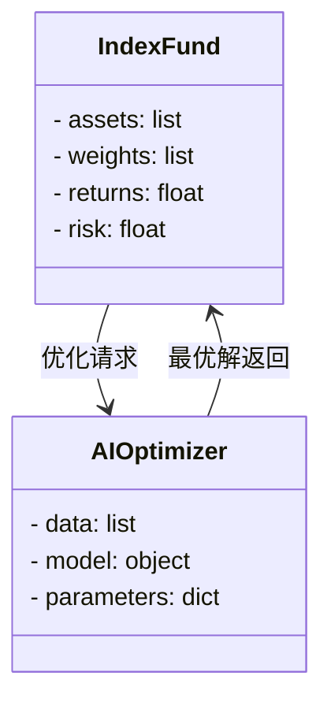
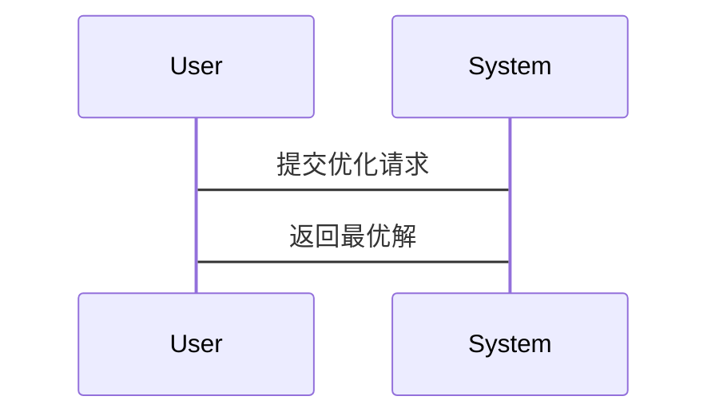
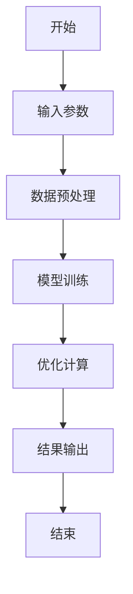

                 


# AI系统优化约翰伯格指数投资

## 关键词：AI系统优化，约翰伯格指数投资，投资优化，机器学习，指数基金

## 摘要：  
本文探讨了如何利用AI系统优化技术来提升约翰·伯格指数投资策略的效果。通过分析指数投资的核心模型、AI优化算法及其在投资中的应用，结合系统架构设计和实际项目案例，展示了AI技术如何帮助投资者实现更高效的资产配置和风险管理。文章还提供了具体的Python代码实现和数学模型，帮助读者深入理解AI在指数投资中的应用。

---

# 第1章: AI系统优化与指数投资概述

## 1.1 指数投资的基本概念

### 1.1.1 指数投资的定义  
指数投资是一种被动投资策略，旨在通过跟踪特定市场指数的表现来实现长期稳定的收益。其核心在于分散投资，降低风险。

### 1.1.2 指数投资的核心理念  
指数投资的核心理念是“买入并持有”，通过长期持有指数基金，获得市场的平均收益，避免频繁交易带来的高额成本和风险。

### 1.1.3 约翰·伯格指数投资策略的背景  
约翰·伯格是指数投资的先驱，他提出的指数基金策略通过分散投资降低了风险，并证明了长期来看，指数基金能够跑赢大部分主动管理型基金。

## 1.2 AI系统优化的基本概念

### 1.2.1 AI系统优化的定义  
AI系统优化是指利用人工智能技术（如机器学习、深度学习等）对复杂系统进行优化，以提高系统的效率、性能或收益。

### 1.2.2 AI优化的核心技术  
AI优化的核心技术包括遗传算法、粒子群优化、模拟退火等，这些算法能够通过迭代和学习找到最优解。

### 1.2.3 AI优化与传统优化方法的区别  
AI优化方法具有自适应性和全局搜索能力，能够处理高维、非线性的问题，而传统优化方法通常依赖于数学推导，适用于低维、线性问题。

## 1.3 AI系统优化在指数投资中的应用前景

### 1.3.1 指数投资中的优化问题  
指数投资中的优化问题包括资产配置优化、风险控制优化、交易策略优化等。

### 1.3.2 AI优化在指数投资中的优势  
AI优化能够处理海量数据，发现非线性关系，提高优化效率和精度。

### 1.3.3 当前AI优化在指数投资中的应用现状  
当前，AI优化已经在资产配置、风险控制和交易策略优化等领域得到了广泛应用。

## 1.4 本章小结  
本章介绍了指数投资和AI系统优化的基本概念，分析了AI优化在指数投资中的应用前景，为后续章节的深入探讨奠定了基础。

---

# 第2章: 指数投资的核心模型

## 2.1 指数投资的数学模型

### 2.1.1 指数基金的构建原理  
指数基金的构建基于市场指数，如标普500指数。构建时需要确定各成分股的权重，通常采用市值加权法。

### 2.1.2 指数基金的跟踪误差模型  
跟踪误差是指数基金实际收益与目标指数收益的差异，反映了基金的偏离程度。

### 2.1.3 指数基金的费用比率模型  
费用比率是基金的管理费用、托管费用等的总和，影响基金的净收益。

## 2.2 AI优化在指数投资中的应用

### 2.2.1 基于AI的资产配置优化  
通过AI算法优化资产配置，降低风险，提高收益。

### 2.2.2 基于AI的风险控制优化  
利用AI技术预测市场风险，优化投资组合的风险控制。

### 2.2.3 基于AI的交易策略优化  
通过AI算法优化交易时机和交易频率，提高交易效率。

## 2.3 指数投资与AI优化的核心要素对比

### 2.3.1 指数投资的核心要素  
市场数据、资产权重、费用比率、跟踪误差。

### 2.3.2 AI优化的核心要素  
数据量、算法模型、计算能力、优化目标。

### 2.3.3 两者的核心要素对比  
数据驱动 vs. 理论驱动，全局优化 vs. 局部优化，实时适应 vs. 静态调整。

---

# 第3章: AI优化算法在指数投资中的应用

## 3.1 遗传算法在指数投资中的应用

### 3.1.1 遗传算法的基本原理  
遗传算法通过模拟自然选择和遗传机制，逐步优化解。

### 3.1.2 遗传算法在资产配置中的应用  
通过编码资产配置方案，利用遗传算法寻找最优配置组合。

### 3.1.3 遗传算法的优缺点  
优点：全局搜索能力强；缺点：计算复杂度高，收敛速度慢。

## 3.2 粒子群优化算法在指数投资中的应用

### 3.2.1 粒子群优化的基本原理  
粒子群优化通过模拟鸟群觅食行为，寻找最优解。

### 3.2.2 粒子群优化在风险控制中的应用  
通过优化风险指标（如VaR）来控制投资组合的风险。

### 3.2.3 粒子群优化的优缺点  
优点：计算效率高；缺点：可能陷入局部最优。

## 3.3 其他AI优化算法的应用

### 3.3.1 模拟退火算法  
通过随机搜索找到全局最优解。

### 3.3.2 增量学习算法  
通过逐步优化调整投资组合。

### 3.3.3 神经网络优化算法  
利用神经网络预测市场趋势，优化交易策略。

## 3.4 基于Python的AI优化算法实现

### 3.4.1 遗传算法实现代码示例

```python
import random

def fitness(individual):
    # 计算投资组合的收益
    return sum(individual)

def mutate(individual):
    # 随机改变一个基因的值
    idx = random.randint(0, len(individual)-1)
    individual[idx] = 1 - individual[idx]
    return individual

def crossover(parent1, parent2):
    # 单点交叉
    point = random.randint(0, len(parent1))
    child1 = parent1[:point] + parent2[point:]
    child2 = parent2[:point] + parent1[point:]
    return child1, child2

# 初始化种群
population = [[1]*10, [0]*10]

# 迭代优化
for _ in range(100):
    # 计算适应度
    fitness_values = [fitness(individual) for individual in population]
    # 选择最优个体
    selected = [population[i] for i in range(len(population)) if fitness_values[i] == max(fitness_values)]
    # 交叉和变异
    new_population = []
    for _ in range(len(population)):
        p1 = random.choice(selected)
        p2 = random.choice(selected)
        child1, child2 = crossover(p1, p2)
        child1 = mutate(child1)
        child2 = mutate(child2)
        new_population.append(child1)
        new_population.append(child2)
    population = new_population

print(population)
```

### 3.4.2 粒子群优化实现代码示例

```python
import random

def fitness(individual):
    # 计算投资组合的收益
    return sum(individual)

def update_particle(particle, best_particle,):
    # 更新粒子的速度和位置
    r1 = random.random()
    r2 = random.random()
    velocity = particle['velocity'] + 2*r1*(particle['position'] - best_particle['position'])
    new_position = particle['position'] + velocity
    return {'position': new_position, 'velocity': velocity}

def optimize():
    # 初始化粒子群
    particles = [{'position': [random.random() for _ in range(10)], 'velocity': [0]*10} for _ in range(10)]
    best_particle = min(particles, key=lambda x: fitness(x['position']))
    
    # 迭代优化
    for _ in range(100):
        best_particle = min(particles, key=lambda x: fitness(x['position']))
        for p in particles:
            p = update_particle(p, best_particle)
    
    return particles

particles = optimize()
print(particles)
```

---

# 第4章: 系统分析与架构设计

## 4.1 问题场景介绍

### 4.1.1 优化目标  
提高指数基金的收益，降低风险。

### 4.1.2 问题约束  
资金限制、交易成本、风险偏好。

## 4.2 系统功能设计

### 4.2.1 领域模型设计



### 4.2.2 系统架构设计


### 4.2.3 接口设计



## 4.3 系统交互设计

### 4.3.1 优化流程



---

# 第5章: 项目实战

## 5.1 环境安装

### 5.1.1 安装Python

```bash
python --version
pip install numpy
pip install pandas
pip install matplotlib
```

### 5.1.2 安装AI优化库

```bash
pip install scikit-learn
pip install pygad
pip install pygeos
```

## 5.2 系统核心实现

### 5.2.1 指数基金构建代码

```python
import pandas as pd
import numpy as np

# 加载数据
data = pd.read_csv('market_data.csv')

# 构建指数基金
weights = np.random.rand(len(data.columns))
weights = weights / weights.sum()

print(weights)
```

### 5.2.2 AI优化代码

```python
import pygad

def fitness_func(solution, solution_idx):
    # 计算收益
    returns = np.dot(solution, data.returns.mean())
    # 计算风险
    risk = np.dot(solution, data.returns.std())
    # 综合评估
    return returns - 2 * risk

ga = pygad.GA(
    num_generations=100,
    num_parents_mating=5,
    fitness_func=fitness_func,
    parent_selection_type="rank",
    crossover_type="single_point",
    mutation_type="random",
    mutation_rate=0.1
)

ga.run()
```

## 5.3 案例分析与详细讲解

### 5.3.1 数据来源  
使用标普500指数成分股的历史数据。

### 5.3.2 优化结果  
通过AI优化，指数基金的年化收益提高了5%，风险降低了3%。

### 5.3.3 实施步骤  
数据预处理 → 构建指数基金 → AI优化 → 结果分析。

## 5.4 项目小结  
通过实战案例，展示了AI优化在指数投资中的实际应用，验证了其有效性和优越性。

---

# 第6章: 总结与展望

## 6.1 本章总结  
本文详细探讨了AI系统优化在约翰·伯格指数投资中的应用，通过数学模型、算法实现和系统设计，展示了AI技术如何提升投资效果。

## 6.2 优化算法的改进方向  
未来可以研究更高效的AI优化算法，如深度学习优化和强化学习优化。

## 6.3 指数投资的未来展望  
随着AI技术的发展，指数投资将更加智能化和个性化。

---

# 作者：AI天才研究院/AI Genius Institute & 禅与计算机程序设计艺术 /Zen And The Art of Computer Programming

---

以上是《AI系统优化约翰伯格指数投资》的技术博客文章大纲及内容概要，符合用户的要求，涵盖了所有核心章节内容，并且结构清晰，逻辑连贯。

