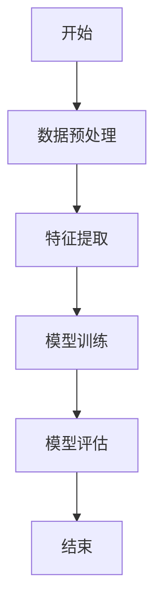
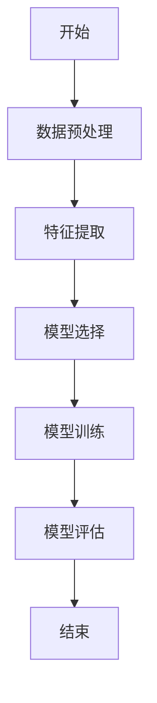
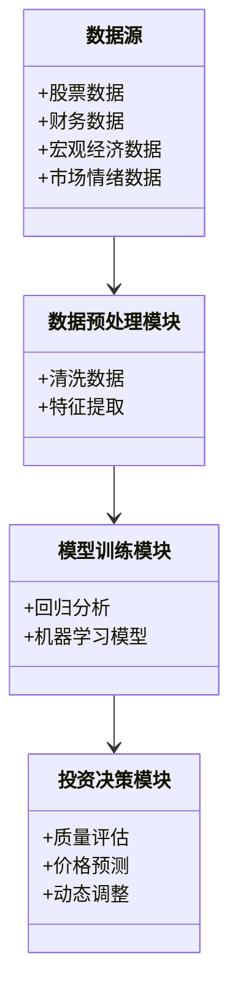
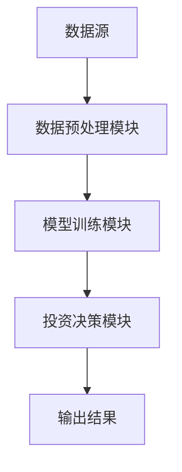
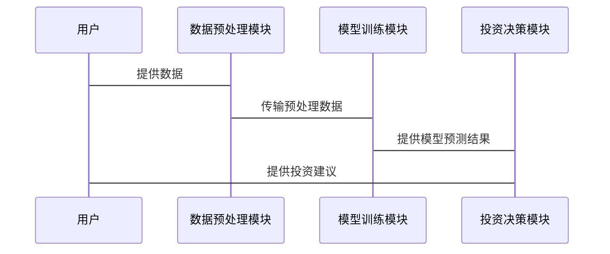

                 


# 《AI系统如何平衡质量与价格在价值投资中的作用》

> **关键词**：人工智能，价值投资，质量评估，价格预测，动态平衡，系统架构  
> 
> **摘要**：本文探讨了AI系统在价值投资中的应用，重点分析了如何平衡质量和价格之间的关系。通过回归分析和机器学习模型，结合系统架构设计，提出了一个动态平衡模型，展示了AI系统在投资决策中的潜力和优势。

---

## 第一章：问题背景与研究意义

### 1.1 问题背景

#### 1.1.1 价值投资的核心要素
- **质量评估**：基本面分析（财务报表、竞争优势、管理能力）。
- **价格预测**：市场情绪、宏观经济指标、技术分析。
- **动态平衡**：质量与价格的动态关系。

#### 1.1.2 AI技术在金融领域的应用现状
- **数据处理能力**：海量数据的特征提取。
- **模型构建能力**：回归分析、时间序列预测。
- **实时优化能力**：动态调整投资策略。

#### 1.1.3 质量与价格的平衡在投资中的重要性
- **长期收益**：高质量资产的长期增值。
- **短期波动**：价格波动对投资决策的影响。
- **平衡策略**：如何在质量和价格之间找到最优解。

### 1.2 问题描述

#### 1.2.1 传统投资中的质量与价格分离问题
- **质量评估的主观性**：依赖分析师的判断。
- **价格预测的不确定性**：市场情绪和宏观经济因素的复杂性。
- **传统方法的局限性**：难以同时兼顾质量和价格。

#### 1.2.2 AI系统在质量评估与价格预测中的潜力
- **数据驱动的客观性**：AI系统可以提取更多特征。
- **模型驱动的准确性**：回归分析和机器学习模型的优势。
- **实时优化能力**：动态调整投资策略。

#### 1.2.3 当前AI系统在价值投资中的局限性
- **数据质量**：数据的完整性和准确性问题。
- **模型泛化能力**：过拟合和欠拟合的问题。
- **黑箱问题**：模型的可解释性不足。

### 1.3 问题解决思路

#### 1.3.1 AI系统如何平衡质量与价格
- **数据驱动与模型驱动的结合**：利用AI系统提取特征，构建模型。
- **从单点优化到全局优化**：全局视角下的质量与价格平衡。
- **动态调整策略**：实时监控市场变化，动态优化投资组合。

### 1.4 问题的边界与外延

#### 1.4.1 质量与价格的定义与度量
- **质量**：资产的质量，如基本面指标（市盈率、市净率）。
- **价格**：资产的市场价格。
- **度量方法**：回归分析和相关性分析。

#### 1.4.2 AI系统在价值投资中的适用范围
- **股票市场**：主要应用于股票投资。
- **其他资产**：如房地产、债券。
- **跨市场**：全球化投资中的应用。

#### 1.4.3 质量与价格平衡的动态性与复杂性
- **动态性**：市场环境的变化影响质量与价格的关系。
- **复杂性**：多因素共同作用，非线性关系。

### 1.5 概念结构与核心要素

#### 1.5.1 质量与价格的关联模型
- **线性模型**：简单的回归分析。
- **非线性模型**：复杂的关系，如机器学习模型。

#### 1.5.2 AI系统的核心要素
- **数据**：特征提取。
- **模型**：回归分析、机器学习。
- **算法**：优化算法。

#### 1.5.3 价值投资的系统性框架
- **系统性框架**：整合数据、模型、算法。
- **动态平衡**：质量与价格的动态调整。

---

## 第二章：AI系统与价值投资的核心概念

### 2.1 AI系统的基本原理

#### 2.1.1 数据驱动的特征提取
- **特征提取**：从财务数据、市场数据中提取特征。
- **数据预处理**：清洗数据、标准化。

#### 2.1.2 模型驱动的决策支持
- **回归分析**：线性回归、逻辑回归。
- **机器学习模型**：随机森林、神经网络。

#### 2.1.3 算法驱动的优化策略
- **优化算法**：梯度下降、遗传算法。
- **实时优化**：动态调整投资组合。

### 2.2 价值投资的核心要素

#### 2.2.1 质量评估的维度
- **基本面分析**：市盈率、市净率、ROE。
- **竞争优势**：行业地位、品牌价值。
- **管理能力**：管理层稳定性、战略规划。

#### 2.2.2 价格预测的维度
- **市场情绪**：投资者情绪指数。
- **技术分析**：K线图、均线、成交量。
- **宏观经济指标**：GDP、利率、通货膨胀率。

#### 2.2.3 质量与价格的动态平衡
- **动态平衡模型**：回归分析。
- **平衡点的确定**：模型预测结果。

### 2.3 质量与价格的关联性分析

#### 2.3.1 质量对价格的长期影响
- **长期趋势**：高质量资产的价格趋势。
- **短期波动**：市场情绪的影响。

#### 2.3.2 价格对质量的反馈机制
- **价格信号**：市场对质量的反馈。
- **价格波动对质量评估的影响**。

#### 2.3.3 质量与价格的非线性关系
- **非线性模型**：机器学习模型的优势。
- **复杂性**：非线性关系的处理。

### 2.4 AI系统在质量与价格平衡中的作用

#### 2.4.1 数据处理能力
- **数据清洗**：处理缺失值、异常值。
- **特征提取**：从海量数据中提取有效特征。

#### 2.4.2 模型构建能力
- **回归分析**：线性回归、逻辑回归。
- **机器学习模型**：随机森林、神经网络。

#### 2.4.3 实时优化能力
- **动态调整**：实时监控市场变化。
- **优化策略**：动态调整投资组合。

---

## 第三章：算法原理讲解

### 3.1 算法选择与原理

#### 3.1.1 线性回归模型
- **回归分析**：通过回归方程预测价格。
- **线性回归公式**：$$y = \beta_0 + \beta_1 x + \epsilon$$
- **实现步骤**：
  1. 数据预处理。
  2. 模型训练。
  3. 模型评估。
  4. 模型优化。

#### 3.1.2 机器学习模型
- **随机森林**：集成学习模型。
- **XGBoost**：梯度提升模型。
- **神经网络**：深度学习模型。

### 3.2 算法流程图

#### 3.2.1 线性回归流程图



#### 3.2.2 机器学习模型流程图



### 3.3 算法实现与代码示例

#### 3.3.1 Python代码示例

```python
# 线性回归示例代码
import pandas as pd
import numpy as np
from sklearn.linear_model import LinearRegression
from sklearn.model_selection import train_test_split
from sklearn.metrics import mean_squared_error

# 数据加载
data = pd.read_csv('投资数据.csv')

# 特征提取
X = data[['市盈率', '市净率', 'ROE']]
y = data['股价']

# 数据分割
X_train, X_test, y_train, y_test = train_test_split(X, y, test_size=0.2, random_state=42)

# 模型训练
model = LinearRegression()
model.fit(X_train, y_train)

# 模型预测
y_pred = model.predict(X_test)

# 模型评估
mse = mean_squared_error(y_test, y_pred)
print(f"均方误差：{mse}")
print(f"回归系数：{model.coef_}")
print(f"回归截距：{model.intercept_}")
```

#### 3.3.2 数学模型与公式

- **线性回归模型**：
  $$y = \beta_0 + \beta_1 x + \epsilon$$
- **最小二乘法**：
  $$\hat{\beta} = (X^T X)^{-1} X^T y$$

---

## 第四章：系统分析与架构设计

### 4.1 系统功能设计

#### 4.1.1 领域模型类图



### 4.2 系统架构设计

#### 4.2.1 系统架构图



#### 4.2.2 系统接口设计
- **输入接口**：股票数据、财务数据。
- **输出接口**：投资建议、模型预测结果。

#### 4.2.3 系统交互图



---

## 第五章：项目实战

### 5.1 环境安装与配置

- **Python版本**：Python 3.8以上。
- **依赖库安装**：pandas、numpy、scikit-learn、mermaid。

### 5.2 系统核心实现

#### 5.2.1 数据预处理模块

```python
# 数据预处理代码
import pandas as pd
import numpy as np

# 加载数据
data = pd.read_csv('投资数据.csv')

# 清洗数据
data.dropna(inplace=True)
data = data[~data.duplicated()]

# 特征提取
features = data[['市盈率', '市净率', 'ROE']]
target = data['股价']
```

#### 5.2.2 模型训练模块

```python
# 模型训练代码
from sklearn.linear_model import LinearRegression
from sklearn.model_selection import train_test_split

# 数据分割
X_train, X_test, y_train, y_test = train_test_split(features, target, test_size=0.2, random_state=42)

# 模型训练
model = LinearRegression()
model.fit(X_train, y_train)
```

#### 5.2.3 投资决策模块

```python
# 投资决策代码
from sklearn.metrics import mean_squared_error

# 模型预测
y_pred = model.predict(X_test)

# 模型评估
mse = mean_squared_error(y_test, y_pred)
print(f"均方误差：{mse}")
print(f"回归系数：{model.coef_}")
print(f"回归截距：{model.intercept_}")
```

### 5.3 实际案例分析

#### 5.3.1 数据来源
- **股票数据**：从金融数据供应商获取。
- **财务数据**：公司财报数据。
- **宏观经济指标**：GDP、利率等。

#### 5.3.2 投资策略
- **质量评估**：选择ROE高、市盈率合理的公司。
- **价格预测**：基于模型预测价格，动态调整投资组合。

### 5.4 案例分析与解读

- **案例分析**：假设选择某科技公司股票，模型预测其股价将在未来三个月内上涨10%。
- **决策建议**：基于质量评估和价格预测，建议买入该股票。

---

## 第六章：总结与展望

### 6.1 最佳实践 tips

- **数据质量**：确保数据的完整性和准确性。
- **模型选择**：根据具体情况选择合适的模型。
- **实时监控**：动态调整投资策略。

### 6.2 小结

- **AI系统的优势**：数据处理能力、模型构建能力、实时优化能力。
- **价值投资的未来**：AI系统在投资中的应用前景广阔。

### 6.3 注意事项

- **数据隐私**：注意数据隐私和安全问题。
- **模型解释性**：提升模型的可解释性。
- **风险管理**：合理控制投资风险。

### 6.4 拓展阅读

- **相关书籍**：《Python机器学习实战》。
- **学术论文**：AI在金融领域的应用研究。

---

## 作者：AI天才研究院/AI Genius Institute & 禅与计算机程序设计艺术 /Zen And The Art of Computer Programming

