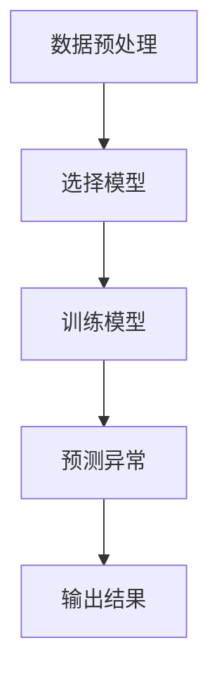
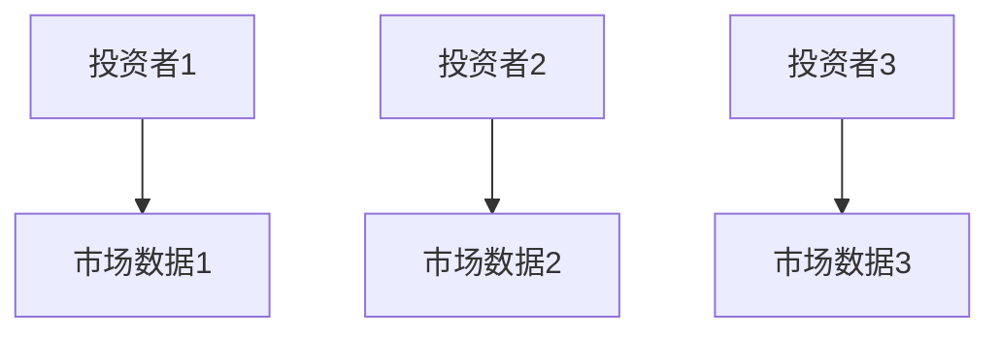
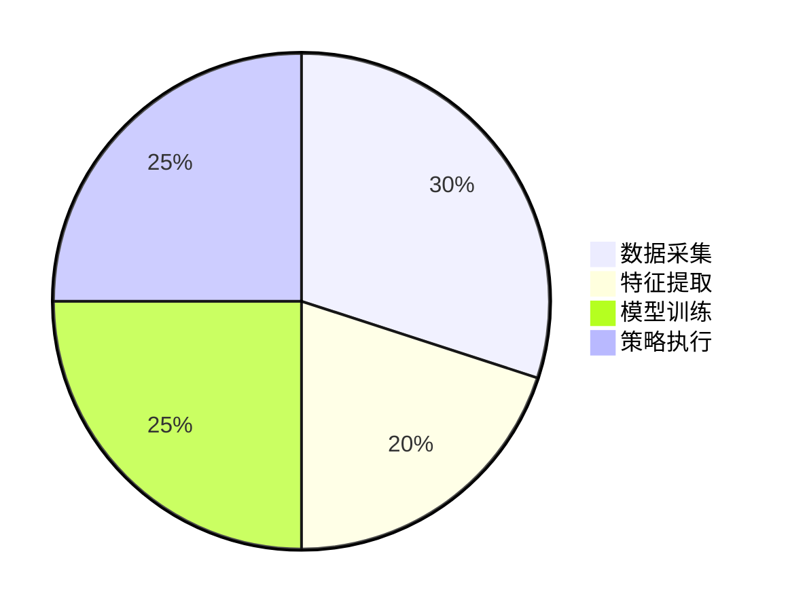

                 


# AI系统如何识别并利用市场非理性行为

## 关键词：AI系统，市场非理性行为，行为金融学，情绪分析，异常检测，机器学习，深度学习

## 摘要：本文深入探讨了AI系统在识别和利用市场非理性行为中的应用。通过分析市场非理性行为的定义、特征及其对金融市场的的影响，结合AI技术的核心优势，详细讲解了基于机器学习和深度学习的算法原理，系统架构设计以及实际案例分析。文章最后总结了最佳实践和未来发展方向。

---

# 第一部分: AI系统与市场非理性行为概述

## 第1章: 市场非理性行为的定义与特征

### 1.1 市场非理性行为的定义

市场非理性行为是指投资者在金融市场中由于情绪、认知偏差或外部环境影响而做出的违背理性决策的行为。与传统经济学假设中“理性人”模型不同，非理性行为在现实中普遍存在，例如过度自信、从众心理、损失厌恶等。

#### 1.1.1 传统市场理性假设的局限性
- **理性假设的假设**：传统经济学假设投资者是理性的，追求效用最大化。
- **实际市场的复杂性**：现实中，投资者受情绪、认知偏差等因素影响，难以完全理性决策。
- **非理性行为的表现形式**：如恐慌性抛售、盲目跟风等。

#### 1.1.2 非理性行为在金融市场中的表现
- **情绪波动**：投资者情绪波动会导致市场短期波动加剧。
- ** herd behavior**：从众心理引发市场泡沫或崩盘。
- **过度反应**：对利好或利空消息的过度反应。

#### 1.1.3 非理性行为的边界与外延
- **边界**：非理性行为并非完全随机，通常与特定情境相关。
- **外延**：非理性行为可能与个体差异、市场环境、时间周期等因素相关。

### 1.2 非理性行为的核心概念与联系

#### 1.2.1 核心概念原理
- **情绪与决策**：情绪影响投资者决策，导致非理性行为。
- **认知偏差**：投资者的认知偏差（如确认偏见）导致错误判断。
- **社会影响**：社会环境（如媒体、市场情绪）加剧非理性行为。

#### 1.2.2 非理性行为的属性特征对比表格

| 特性 | 理性行为 | 非理性行为 |
|------|---------|------------|
| 目标 | 最大化收益 | 追求非理性满足 |
| 决策 | 基于事实 | 受情绪影响 |
| 时间 | 追求长期收益 | 追求短期快感 |

#### 1.2.3 ER实体关系图架构

```mermaid
erDiagram
    investor(I_id, name, emotion) {
        I_id : integer
        name : string
        emotion : string
    }
    market_data(M_id, time, price) {
        M_id : integer
        time : datetime
        price : float
    }
    transaction(T_id, I_id, M_id) {
        T_id : integer
        I_id : integer
        M_id : integer
    }
    investor --> transaction : 参与
    market_data --> transaction : 影响
```

---

## 第2章: AI技术在识别市场非理性行为中的应用

### 2.1 AI技术的核心优势

#### 2.1.1 大数据分析能力
- **数据处理能力**：AI能够处理海量数据，发现隐藏模式。
- **实时性**：AI可以实时监控市场数据，快速识别非理性行为。

#### 2.1.2 情感分析与情绪识别
- **自然语言处理**：通过分析新闻、社交媒体数据，识别市场情绪。
- **情感分类**：基于文本的情感分析模型可以量化市场情绪。

#### 2.1.3 异常行为检测
- **实时监控**：通过机器学习算法，实时检测市场中的异常交易行为。

### 2.2 AI系统识别非理性行为的原理

#### 2.2.1 机器学习算法的适用性
- **监督学习**：基于历史数据，训练分类模型识别非理性行为。
- **无监督学习**：通过聚类分析发现异常交易模式。

#### 2.2.2 深度学习模型的优势
- **神经网络结构**：深度学习模型能够捕捉复杂的非线性关系。
- **自动特征提取**：模型可以自动提取有用的特征，减少人工干预。

#### 2.2.3 自然语言处理在文本数据中的应用
- **文本预处理**：分词、去停用词、向量化。
- **情感分析模型**：基于LSTM的双向情感分析模型。

---

## 第3章: 市场非理性行为的数学模型与算法原理

### 3.1 基于时间序列的异常检测

#### 3.1.1 时间序列分析的数学模型
- **ARIMA模型**：自回归积分滑动平均模型，用于预测时间序列数据。
- **GARCH模型**：广义自回归条件异方差模型，用于捕捉波动性。

#### 3.1.2 异常检测算法的流程图



### 3.2 情感分析模型的构建

#### 3.2.1 情感分类的数学公式

$$ P(y=1|x) = \sigma(w \cdot x + b) $$

其中，$\sigma$是sigmoid函数，$w$是权重向量，$x$是输入特征，$b$是偏置项。

#### 3.2.2 基于深度学习的情感分析模型

$$ \text{模型结构} = \text{词嵌入层} \rightarrow \text{双向LSTM层} \rightarrow \text{全连接层} \rightarrow \text{输出层} $$

### 3.3 群体行为分析的算法实现

#### 3.3.1 基于聚类分析的行为分组

$$ \text{聚类中心} = \text{K-means算法} $$

#### 3.3.2 基于图论的网络分析



---

## 第4章: 系统架构与设计方案

### 4.1 系统功能设计

#### 4.1.1 数据采集模块

- **功能**：实时采集市场数据、社交媒体数据等。
- **输入**：API接口获取实时数据。
- **输出**：结构化数据存储。

#### 4.1.2 特征提取模块

- **功能**：提取市场情绪、交易量等特征。
- **输入**：结构化数据。
- **输出**：特征向量。

#### 4.1.3 模型训练模块

- **功能**：训练情感分析模型、异常检测模型。
- **输入**：特征向量。
- **输出**：训练好的模型。

#### 4.1.4 策略执行模块

- **功能**：根据模型预测结果执行交易策略。
- **输入**：模型预测结果。
- **输出**：交易指令。

### 4.2 系统架构设计

#### 4.2.1 分层架构图



---

## 第5章: 项目实战与案例分析

### 5.1 项目环境安装

- **工具**：Python、TensorFlow、Keras、Scikit-learn。
- **数据源**：股票价格数据、社交媒体数据。

### 5.2 核心算法实现

#### 5.2.1 情感分析代码实现

```python
import tensorflow as tf
from tensorflow.keras import layers

model = tf.keras.Sequential([
    layers.Embedding(input_dim= vocabulary_size, output_dim= embedding_dim),
    layers.Bidirectional(layers.LSTM(units= lstm_units)),
    layers.Dense(1, activation='sigmoid')
])
```

#### 5.2.2 异常检测代码实现

```python
from sklearn.ensemble import IsolationForest

model = IsolationForest(contamination=0.05)
model.fit(X_train)
```

### 5.3 实际案例分析

#### 5.3.1 案例背景介绍

- **案例名称**：2020年新冠疫情引发的市场崩盘。
- **数据来源**：社交媒体情绪数据、股票价格数据。

#### 5.3.2 数据分析与建模

- **数据分析**：使用时间序列分析模型预测市场波动。
- **模型训练**：训练情感分析模型识别恐慌情绪。

#### 5.3.3 模型结果解读

- **结果**：模型成功预测了市场的异常波动，帮助投资者规避风险。

---

## 第6章: 最佳实践与总结

### 6.1 最佳实践 tips

#### 6.1.1 数据质量的重要性

- 数据清洗：确保数据的完整性和准确性。
- 数据多样性：收集多来源数据，减少数据偏差。

#### 6.1.2 模型解释性的提升

- 可视化工具：使用图表展示模型结果。
- 解释性模型：选择LIME等可解释模型。

#### 6.1.3 伦理与合规性考虑

- 数据隐私：遵守数据隐私保护法规。
- 模型透明度：确保模型决策可解释。

### 6.2 项目小结

#### 6.2.1 项目目标的达成情况

- 成功识别市场非理性行为。
- 提供有效的交易策略。

#### 6.2.2 可能遇到的挑战与解决方案

- 数据偏差问题：通过数据清洗和增强解决。
- 模型过拟合问题：通过交叉验证和正则化解决。

#### 6.2.3 未来研究方向

- 多模态数据分析：结合文本、图像等多种数据源。
- 可解释性AI：提高模型的透明度和可解释性。

---

## 第7章: 拓展阅读与进一步思考

### 7.1 相关领域研究进展

#### 7.1.1 行为金融学的最新研究

- 研究热点：情绪与认知偏差对金融市场的影响。
- 新趋势：行为金融学与AI的结合。

#### 7.1.2 AI在金融领域的其他应用

- 风险管理：基于AI的信用评分模型。
- 量化交易：基于AI的算法交易策略。

### 7.2 未来技术趋势

#### 7.2.1 多模态数据的融合分析

- 技术趋势：结合文本、图像等多种数据源进行分析。
- 挑战：数据融合的复杂性和计算成本。

#### 7.2.2 可解释性AI的发展方向

- 技术趋势：开发更透明的模型，满足监管需求。
- 挑战：在保持模型性能的同时提高可解释性。

### 7.3 注意事项与风险提示

#### 7.3.1 数据偏差的风险

- 风险提示：数据偏差可能导致模型预测不准确。
- 应对措施：数据清洗、增强学习。

#### 7.3.2 模型过拟合的问题

- 风险提示：模型过拟合会导致泛化能力差。
- 应对措施：交叉验证、正则化。

#### 7.3.3 金融市场波动的不确定性

- 风险提示：金融市场具有高度不确定性，模型预测仅供参考。
- 应对措施：结合多种模型进行预测。

---

作者：AI天才研究院 & 禅与计算机程序设计艺术

