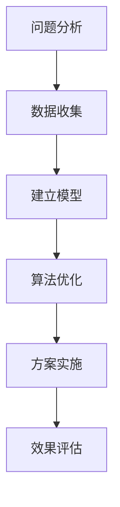
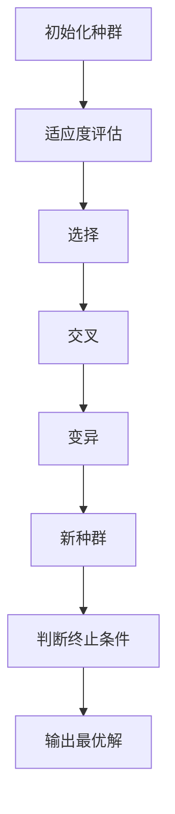
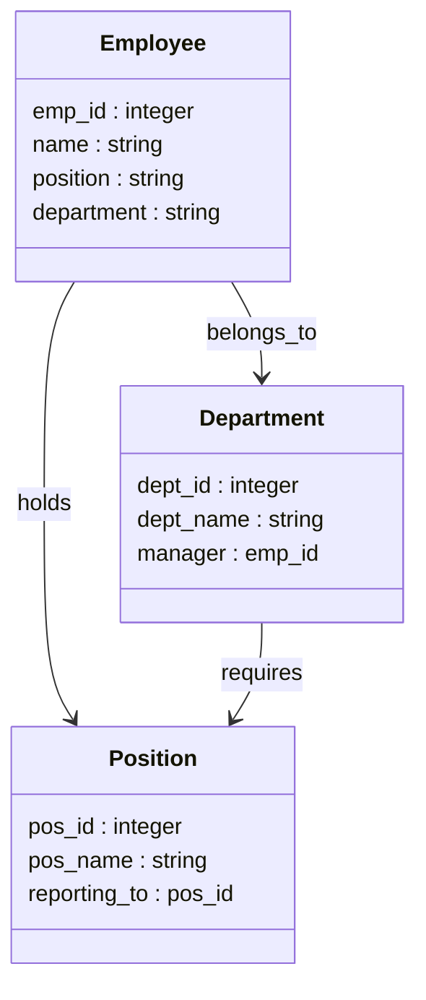
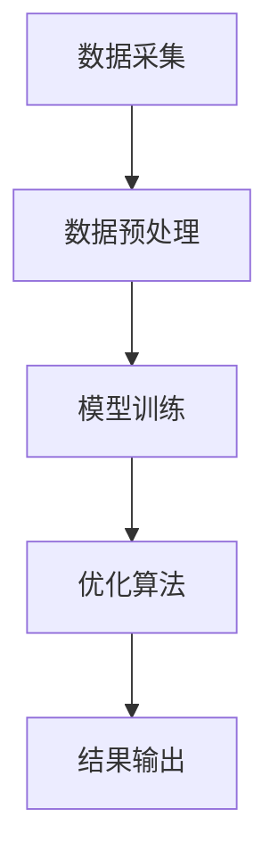
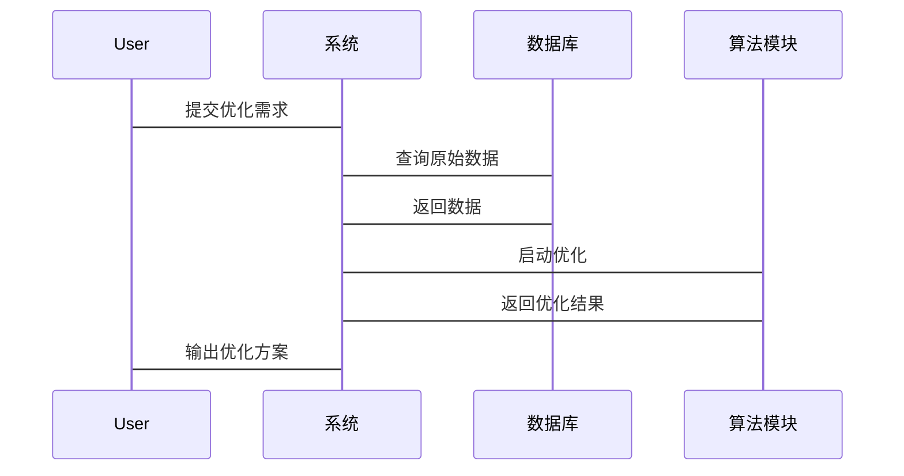

                 


# AI辅助企业组织结构优化与岗位设计

> 关键词：AI技术，组织结构优化，岗位设计，数据驱动管理，AI算法

> 摘要：本文深入探讨了如何利用AI技术优化企业组织结构与岗位设计，通过数据驱动的管理方法和先进算法，为企业提供科学的决策支持。文章从背景介绍、核心概念、算法原理、系统架构、项目实战等方面展开，结合实际案例，详细讲解了AI在企业组织优化中的应用及实施步骤。

---

## 第一部分：背景介绍

### 第1章：企业组织结构优化的背景与挑战

#### 1.1 问题背景

- **传统企业组织结构的局限性**  
  传统的组织结构常常呈现出层级复杂、部门分割明显的问题，导致信息传递不畅、资源浪费和效率低下。特别是在快速变化的市场环境中，这种结构难以适应灵活调整的需求。

- **当前企业面临的管理挑战**  
  当今企业面临着市场竞争加剧、客户需求多样化、技术更新换代快等挑战。如何在复杂的环境中优化组织结构和岗位设计，成为企业管理者的重要课题。

- **技术驱动管理变革的必要性**  
  随着AI、大数据等技术的快速发展，企业开始利用技术手段优化管理流程，提升效率和竞争力。

#### 1.2 问题描述

- **组织结构复杂化带来的效率问题**  
  过于复杂的组织结构可能导致职责不清、沟通成本增加，影响企业的整体效率。

- **岗位设计不合理导致的人才浪费**  
  岗位设置不合理可能导致人才无法充分发挥潜力，员工积极性下降，影响企业绩效。

- **企业目标与组织结构不匹配的矛盾**  
  组织结构往往滞后于企业战略目标的变化，难以快速响应市场变化。

#### 1.3 问题解决

- **AI技术在管理优化中的应用潜力**  
  AI技术可以通过数据分析、模式识别和智能优化算法，帮助企业发现组织结构中的问题，并提出优化建议。

- **数据驱动决策的优势**  
  通过收集和分析企业内部数据，AI可以帮助管理者更准确地识别问题、制定决策。

- **组织结构优化的目标与路径**  
  优化目标包括提升效率、降低成本、增强灵活性等。路径包括数据收集、模型建立、算法优化、方案实施等。

#### 1.4 边界与外延

- **组织结构优化的适用范围**  
  适用于企业内部管理的多个方面，如部门设置、岗位分配、流程优化等。

- **相关概念的区分与联系**  
  区分组织结构优化与流程优化、组织文化优化等，明确优化的核心是通过调整结构和岗位设计来提升效率。

- **优化边界与企业战略的关系**  
  组织结构优化需要与企业战略目标一致，避免偏离主航道。

#### 1.5 核心要素组成

- **数据基础：企业运营数据**  
  包括员工绩效、部门协作效率、项目完成情况等数据。

- **方法工具：AI算法与优化模型**  
  使用遗传算法、模拟退火等算法构建优化模型。

- **实施步骤：分析、设计、实施**  
  从数据收集到模型建立，再到方案实施，确保优化过程系统化。

---

## 第二部分：核心概念与联系

### 第2章：AI辅助组织结构优化的核心概念

#### 2.1 数据驱动的管理

- **数据在管理决策中的作用**  
  数据是AI优化的基础，通过分析数据可以发现管理中的问题和改进空间。

- **AI算法在组织优化中的应用**  
  AI算法可以处理复杂的数据关系，发现潜在的优化点。

#### 2.2 核心概念原理

- **数据驱动管理的核心思想**  
  通过数据发现问题、制定策略、评估效果。

- **AI算法优化的原理**  
  利用算法搜索最优解，模拟人类决策过程。

#### 2.3 实体关系图与流程图

```mermaid
erDiagram
    employee {
        emp_id : integer
        name : string
        position : string
        department : string
        performance : float
    }
    department {
        dept_id : integer
        dept_name : string
        manager : emp_id
    }
    position {
        pos_id : integer
        pos_name : string
        reporting_to : pos_id
    }
    employee --> department : belongs_to
    employee --> position : holds
    department --> position : requires
```



---

## 第三部分：算法原理讲解

### 第3章：优化算法原理

#### 3.1 遗传算法

- **算法流程图**



- **Python实现示例**

```python
import random

def fitness(individual):
    # 计算适应度
    return sum(individual)

def mutate(individual):
    # 变异操作
    pos = random.randint(0, len(individual)-1)
    individual[pos] = 1 - individual[pos]
    return individual

def crossover(parent1, parent2):
    # 单点交叉
    point = random.randint(0, len(parent1))
    return parent1[:point] + parent2[point:], parent2[:point] + parent1[point:]

# 初始化种群
population = [[0, 1, 0, 1] for _ in range(10)]

# 迭代优化
for _ in range(100):
    population = [mutate(individual) for individual in population]
    # 交叉操作
    new_population = []
    for i in range(0, len(population), 2):
        p1 = population[i]
        p2 = population[i+1]
        child1, child2 = crossover(p1, p2)
        new_population.append(child1)
        new_population.append(child2)
    population = new_population

# 输出最优解
print(max(fitness(individual) for individual in population))
```

- **数学模型与公式**

$$
\text{适应度函数} = \sum_{i=1}^{n} x_i
$$

$$
\text{选择概率} = \frac{fitness(x)}{\sum_{i} fitness(x_i)}
$$

---

## 第四部分：系统分析与架构设计

### 第4章：系统分析与架构设计方案

#### 4.1 问题场景介绍

- 中型制造企业的组织结构优化项目，目标是提高生产效率，降低成本。

#### 4.2 系统功能设计



#### 4.3 系统架构设计



#### 4.4 系统接口设计

- 输入接口：员工数据、部门数据、岗位数据。
- 输出接口：优化后的组织结构、岗位分配方案。

#### 4.5 交互序列图



---

## 第五部分：项目实战

### 第5章：项目实战与案例分析

#### 5.1 环境安装

- 安装Python和相关库：`pip install numpy pandas scikit-learn`

#### 5.2 核心代码实现

```python
import numpy as np
from sklearn.cluster import KMeans

# 假设数据为部门间协作效率矩阵
data = np.array([[0.8, 0.6, 0.7],
                 [0.5, 0.9, 0.6],
                 [0.7, 0.4, 0.8]])

# K-means聚类
model = KMeans(n_clusters=2)
model.fit(data)
labels = model.labels_

print("聚类结果：", labels)
```

#### 5.3 代码解读与分析

- 数据预处理：将部门间协作效率矩阵标准化。
- 使用K-means算法进行聚类，得到部门分组。
- 结果分析：根据聚类结果优化部门结构。

#### 5.4 案例分析

- **需求分析**：识别关键岗位和冗余岗位。
- **数据收集**：收集员工绩效、部门协作数据。
- **模型实现**：使用聚类算法和优化模型进行岗位分配。
- **结果分析**：评估优化效果，调整模型参数。

#### 5.5 项目小结

- 成功优化了部门结构，提高了协作效率。
- 降低了管理成本，提升了员工满意度。

---

## 第六部分：最佳实践

### 第6章：最佳实践与小结

#### 6.1 总结

- AI技术为组织结构优化提供了强大的工具，但需要结合企业实际情况。
- 数据质量和算法选择是关键因素。

#### 6.2 注意事项

- 数据质量直接影响优化效果，需确保数据准确性和完整性。
- 算法选择需考虑问题规模和复杂度，避免过度复杂化。

#### 6.3 拓展阅读

- 推荐阅读《集体智慧编程》和《数据驱动的决策》，深入了解AI在管理中的应用。

---

## 作者信息

作者：AI天才研究院/AI Genius Institute & 禅与计算机程序设计艺术 /Zen And The Art of Computer Programming

---

**注意**：以上内容为示例，实际撰写时需根据具体情况进行补充和调整，确保内容完整性和逻辑性。

