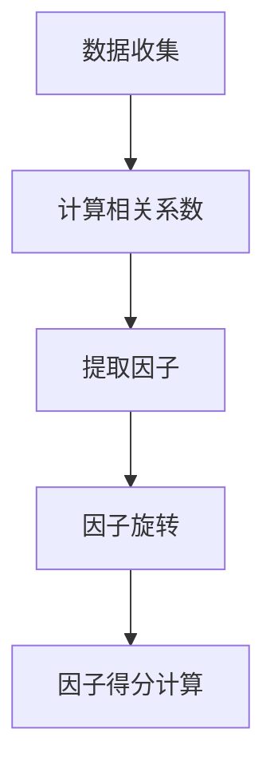
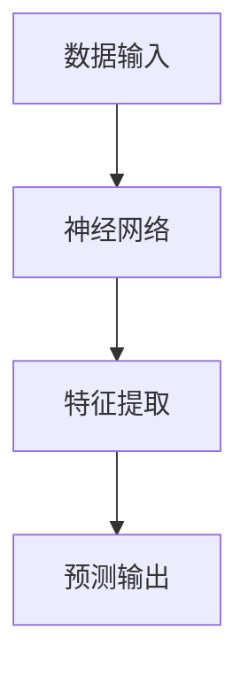
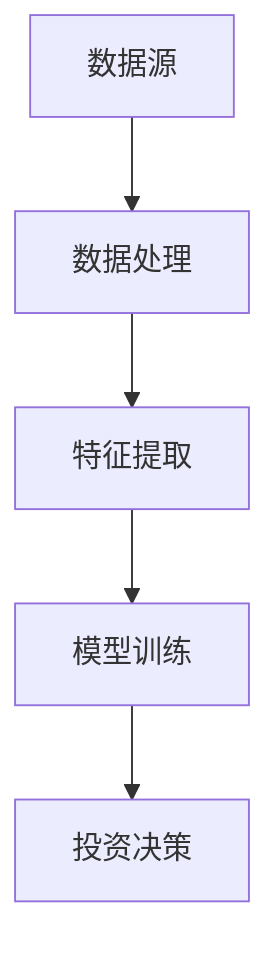
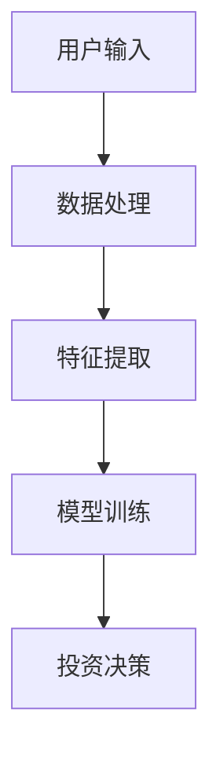

                 


# AI辅助发现隐藏的价值投资机会

> **关键词：** 人工智能，价值投资，投资机会，数据驱动，机器学习

> **摘要：** 本文探讨了人工智能在价值投资中的应用，详细分析了如何利用AI技术发现隐藏的价值投资机会。通过介绍AI在数据处理、模式识别和决策支持中的作用，结合实际案例和算法原理，展示了AI如何提升投资决策的准确性和效率。

---

## 第1章: AI在投资领域的应用现状

### 1.1 价值投资的基本概念

#### 1.1.1 价值投资的定义

价值投资是一种以基本面分析为基础的投资策略，旨在通过识别市场价格低于其内在价值的资产，实现长期稳定的收益。其核心在于寻找那些被市场低估的企业，长期持有，等待其价值回归。

#### 1.1.2 价值投资的核心理念

- **安全边际：** 投资价格远低于其内在价值，以降低风险。
- **长期视角：** 关注企业的长期盈利能力，而非短期波动。
- **逆向思维：** 在市场恐慌时寻找机会，在市场狂热时保持冷静。

#### 1.1.3 价值投资的局限性

- 数据依赖性：传统方法依赖财务报表和市场数据，难以捕捉非结构化数据中的价值信号。
- 计算复杂性：手动分析大量数据耗时且效率低下。
- 市场变化：市场波动和突发事件可能导致传统模型失效。

### 1.2 AI技术在投资中的应用

#### 1.2.1 AI在金融数据分析中的应用

AI技术能够处理海量金融数据，包括市场数据、新闻、社交媒体等，帮助投资者发现隐藏的机会。例如，自然语言处理（NLP）可以分析公司财报中的文本，识别潜在的风险或利好信息。

#### 1.2.2 AI在投资组合优化中的作用

通过机器学习算法，AI可以优化投资组合，平衡风险与收益。例如，使用均值-方差优化模型，AI可以根据历史数据和市场预测，生成最优投资组合。

#### 1.2.3 AI在风险控制中的应用

AI可以帮助投资者预测市场波动和潜在风险，例如使用时间序列模型（如ARIMA或LSTM）预测市场走势，提前规避风险。

### 1.3 价值投资与AI技术的结合

#### 1.3.1 价值投资的数字化转型

传统价值投资依赖人工分析，而AI技术的引入使得分析过程更加高效和精准。例如，通过大数据分析，AI可以在短时间内筛选出潜在的低估企业。

#### 1.3.2 AI如何辅助发现隐藏价值

AI可以通过分析非结构化数据（如新闻、社交媒体）和结构化数据（如财务报表），发现传统方法难以察觉的价值信号。例如，利用NLP分析公司新闻，识别潜在的并购机会。

#### 1.3.3 价值投资中的数据驱动决策

AI技术能够整合多源数据，构建数据驱动的决策模型，帮助投资者做出更明智的投资决策。例如，使用因子分析模型，AI可以识别影响股价的关键因素，指导投资决策。

---

## 第2章: 价值投资的核心概念与分析框架

### 2.1 价值投资的关键要素

#### 2.1.1 公司基本面分析

基本面分析是价值投资的核心，包括财务报表分析（收入、利润、负债等）和行业分析（竞争地位、市场前景等）。

#### 2.1.2 市场情绪分析

市场情绪影响短期价格波动，通过分析市场情绪，投资者可以判断市场的非理性波动，寻找价值低估的机会。

#### 2.1.3 财务指标分析

关键财务指标如市盈率（P/E）、市净率（P/B）等，帮助投资者评估企业的内在价值。

### 2.2 数据驱动的价值投资框架

#### 2.2.1 数据收集与处理

AI技术可以自动收集和处理多源数据，包括市场数据、新闻、社交媒体等，构建全面的数据集。

#### 2.2.2 数据特征提取

从原始数据中提取有用的特征，例如使用NLP提取文本特征，或使用统计方法提取数值特征。

#### 2.2.3 数据分析与建模

通过机器学习算法，分析数据特征，构建预测模型，识别潜在的投资机会。

### 2.3 AI在价值投资中的核心作用

#### 2.3.1 AI在数据处理中的优势

AI能够处理海量数据，提取隐藏的模式和关系，帮助投资者发现潜在的机会。

#### 2.3.2 AI在模式识别中的应用

通过模式识别，AI可以识别市场中的周期性波动和趋势，指导投资决策。

#### 2.3.3 AI在决策支持中的作用

AI可以提供实时数据支持和预测，帮助投资者做出更明智的决策。

---

## 第3章: 价值投资中的数据特征分析

### 3.1 数据特征提取方法

#### 3.1.1 基本统计特征

包括均值、方差、偏度等，帮助理解数据的分布特性。

#### 3.1.2 时间序列特征

如趋势、周期性、突变点等，帮助分析数据的时序特性。

#### 3.1.3 文本特征分析

通过NLP技术提取文本中的情感、关键词等特征，分析市场情绪。

### 3.2 数据特征的可视化与分析

#### 3.2.1 数据分布分析

通过直方图、箱线图等可视化工具，分析数据的分布情况。

#### 3.2.2 数据相关性分析

通过热力图分析变量之间的相关性，识别重要的影响因素。

#### 3.2.3 数据趋势分析

通过折线图分析数据的趋势，识别潜在的趋势性机会。

### 3.3 数据特征的机器学习分析

#### 3.3.1 线性回归分析

用于预测目标变量与特征变量之间的线性关系。

#### 3.3.2 聚类分析

用于将相似的资产分组，识别潜在的投资机会。

#### 3.3.3 无监督学习

通过无监督学习发现数据中的隐藏结构，识别潜在的价值信号。

---

## 第4章: AI在价值投资中的算法原理

### 4.1 因子分析模型

#### 4.1.1 因子分析的定义

因子分析是一种统计方法，用于识别数据中的潜在因子，解释变量之间的关系。

#### 4.1.2 因子分析的步骤

1. **数据收集：** 收集相关变量的数据。
2. **计算相关系数：** 计算变量之间的相关系数矩阵。
3. **提取因子：** 通过主成分分析等方法提取因子。
4. **因子旋转：** 优化因子结构，使其更易于解释。
5. **因子得分计算：** 根据因子载荷计算因子得分。

#### 4.1.3 因子分析的数学公式

因子分析模型可以表示为：
$$
X = \mu + \Lambda F + \epsilon
$$
其中，\( X \) 是观测变量，\( \mu \) 是均值，\( \Lambda \) 是载荷矩阵，\( F \) 是因子，\( \epsilon \) 是误差。

#### 4.1.4 因子分析的流程图



### 4.2 深度学习模型

#### 4.2.1 深度学习模型的定义

深度学习是一种机器学习技术，通过多层神经网络提取数据的高层次特征。

#### 4.2.2 深度学习模型的应用

- **时间序列预测：** 使用LSTM网络预测股价走势。
- **文本分类：** 使用卷积神经网络（CNN）分析新闻文本，判断市场情绪。

#### 4.2.3 深度学习模型的流程图



---

## 第5章: AI投资系统的系统分析与架构设计

### 5.1 系统功能设计

#### 5.1.1 数据获取模块

- 从金融市场数据源获取实时或历史数据。
- 数据清洗和预处理，确保数据质量。

#### 5.1.2 特征提取模块

- 使用统计方法和NLP技术提取数据特征。
- 对特征进行标准化或归一化处理。

#### 5.1.3 模型训练模块

- 使用因子分析或深度学习模型训练投资模型。
- 调参优化，提高模型性能。

#### 5.1.4 风险管理模块

- 计算投资组合的风险指标，如VaR和CVaR。
- 设定止损和止盈策略，控制投资风险。

### 5.2 系统架构设计

#### 5.2.1 系统架构图



#### 5.2.2 系统接口设计

- 数据接口：与金融市场数据源对接，获取实时数据。
- 模型接口：与第三方机器学习库（如TensorFlow、PyTorch）对接，训练模型。
- 报告接口：生成投资报告，展示分析结果。

#### 5.2.3 系统交互流程图



---

## 第6章: 项目实战

### 6.1 环境安装

- 安装Python和必要的库（如NumPy、Pandas、Scikit-learn、TensorFlow）。
- 安装数据获取工具（如Yahoo Finance API）。

### 6.2 核心实现代码

#### 6.2.1 数据获取

```python
import pandas as pd
from pandas_datareader import data as pdr
import yfinance as yf

# 获取数据
yf.pdr_version = 'v1.0.0'
df = pdr.get_data_yahoo('AAPL', start='2020-01-01', end='2023-12-31')
```

#### 6.2.2 数据预处理

```python
import pandas as pd
import numpy as np

# 删除缺失值
df.dropna(inplace=True)

# 标准化处理
from sklearn.preprocessing import StandardScaler
scaler = StandardScaler()
scaled_features = scaler.fit_transform(df[['Open', 'High', 'Low', 'Close']])
```

#### 6.2.3 因子分析

```python
from sklearn.decomposition import FactorAnalysis

# 初始化因子分析模型
fa = FactorAnalysis(n_components=3, random_state=42)

# 训练模型
fa.fit(df[['Open', 'High', 'Low', 'Close', 'Adj Close', 'Volume']])

# 获取因子载荷
factor_loadings = fa.components_
```

#### 6.2.4 深度学习模型

```python
from tensorflow.keras import layers, models

# 构建LSTM模型
model = models.Sequential()
model.add(layers.LSTM(64, input_shape=(None, 5)))
model.add(layers.Dense(1))
model.compile(optimizer='adam', loss='mse')
```

### 6.3 代码应用解读

- 数据获取：使用Yahoo Finance API获取股票数据。
- 数据预处理：删除缺失值并标准化处理。
- 因子分析：提取影响股价的主要因子。
- 深度学习：构建LSTM模型预测股价走势。

### 6.4 案例分析与详细讲解

以苹果公司（AAPL）为例，使用因子分析和LSTM模型，预测其股价走势，并识别潜在的价值投资机会。

### 6.5 项目小结

通过项目实战，展示了AI技术在价值投资中的应用，验证了模型的有效性，并总结了实际应用中的注意事项。

---

## 第7章: 总结与展望

### 7.1 总结

本文详细探讨了AI技术在价值投资中的应用，从数据处理、模型构建到实际案例分析，展示了AI如何辅助发现隐藏的价值投资机会。

### 7.2 展望

未来，随着AI技术的不断发展，价值投资将更加依赖数据驱动的决策。同时，多模态数据（如图像、文本、语音）的分析也将成为研究的热点。

### 7.3 最佳实践 tips

- 数据质量是关键：确保数据的准确性和完整性。
- 模型调优：根据实际需求调整模型参数，提高预测精度。
- 风险管理：设定合理的止损和止盈策略，控制投资风险。

---

## 作者信息

**作者：** AI天才研究院/AI Genius Institute  
**联系：** [禅与计算机程序设计艺术](https://github.com/llc2001)  
**GitHub：** [禅与计算机程序设计艺术](https://github.com/llc2001)

