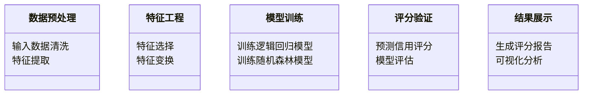

                 


# AI辅助的企业信用评分卡验证系统

## 关键词：人工智能，信用评分卡，企业信用评估，机器学习，算法原理，系统架构

## 摘要：本文详细探讨了如何利用人工智能技术优化企业信用评分卡的验证系统。从背景介绍到算法原理，再到系统架构和项目实战，全面分析了AI在信用评估中的应用。通过详细的技术解读和案例分析，展示了如何构建高效、准确的信用评分系统，助力企业信用风险管理。

---

## 第一部分：企业信用评分卡与AI辅助的背景介绍

### 第1章：企业信用评分卡概述

#### 1.1 问题背景

- **传统企业信用评估的挑战**：传统的信用评估主要依赖人工审核，效率低下且容易受到主观因素影响。企业财务数据复杂，人工分析耗时且容易出错，难以满足现代金融业务的高效率需求。

- **信用评分卡的作用与重要性**：信用评分卡是一种量化评估工具，能够快速、准确地评估企业的信用风险，帮助企业做出更明智的信贷决策。它是企业信用风险管理的核心工具之一。

- **AI在信用评估中的应用潜力**：人工智能技术，尤其是机器学习算法，能够处理海量数据，发现传统方法难以察觉的模式和关系，显著提高信用评估的准确性和效率。

#### 1.2 问题描述

- **信用评分卡的定义与目标**：信用评分卡是基于企业财务、经营状况等多维度数据，通过量化模型计算得出的信用评分，用于评估企业的信用风险。

- **传统方法的局限性**：传统信用评估方法依赖经验丰富的专家，主观性强，且难以处理复杂的数据关系。人工审核效率低，难以应对海量数据的处理需求。

- **引入AI辅助的必要性**：AI能够自动化处理大量数据，发现隐藏的模式，提高评估效率和准确性，降低人为错误，是信用评估领域的重要发展方向。

#### 1.3 问题解决

- **AI如何优化信用评分过程**：AI通过自动化数据处理、特征提取和模型训练，优化信用评分过程。机器学习算法能够识别关键特征，提高模型的预测能力。

- **提高准确性和效率的方法**：利用先进的机器学习算法，如逻辑回归、随机森林和梯度提升机（GBDT），构建高精度的信用评分模型。同时，自动化数据处理和并行计算显著提高处理效率。

#### 1.4 边界与外延

- **信用评分卡的适用范围**：适用于中小型企业，特别是一些数据不完全或信用历史有限的企业。对于大型企业，可能需要结合其他评估方法。

- **AI辅助系统的边界条件**：系统依赖高质量的数据输入，数据缺失或不完整可能影响模型性能。此外，AI模型的可解释性也是一个重要考虑因素。

- **相关领域的扩展**：AI技术不仅应用于企业信用评分，还可扩展至个人信用评估、风险预警等领域。

#### 1.5 核心概念与组成

- **信用评分卡的要素**：包括企业财务数据、经营历史、市场表现、还款记录等多维度信息。

- **AI辅助系统的核心模块**：数据采集与预处理、特征工程、模型训练与优化、评分验证与结果展示。

---

## 第二部分：AI辅助信用评分卡的核心概念与联系

### 第2章：核心概念与原理

#### 2.1 AI在信用评分中的原理

- **机器学习模型的作用**：机器学习模型通过学习历史数据，识别影响信用评分的关键特征，构建预测模型。

- **特征工程的重要性**：特征工程是构建高精度模型的关键步骤，包括特征选择、特征变换和特征组合。

- **模型评估与优化**：通过交叉验证、ROC曲线等方法评估模型性能，并进行参数调优和模型优化。

#### 2.2 核心概念对比表

| 对比维度       | 分类特征                | 数值特征                |
|-----------------|------------------------|------------------------|
| 特征类型       | 企业类型、行业类别     | 营业收入、净利润        |
| 处理方法       | 独热编码、特征选择     | 标准化、归一化          |
| 示例           | 企业属于制造业吗？      | 企业去年的收入是多少？  |

#### 2.3 ER实体关系图

```mermaid
erd
    企业信息表
    + 企业ID (主键)
    + 企业名称
    + 注册资本
    + 经营范围
    + 企业地址

    财务指标表
    + 财务指标ID (主键)
    + 企业ID (外键)
    + 净利润
    + 营业收入
    + 资产总额

    信用评分表
    + 评分ID (主键)
    + 企业ID (外键)
    + 信用评分
    + 评分时间
```

---

## 第三部分：算法原理与数学模型

### 第3章：算法原理讲解

#### 3.1 逻辑回归

- **概率计算**：逻辑回归通过sigmoid函数将线性回归的结果映射到概率空间。
  
  $$ P(y=1) = \frac{1}{1 + e^{-\beta x}} $$

- **损失函数**：对数损失函数用于衡量预测值与真实值的差异。
  
  $$ \text{损失} = -\sum_{i=1}^{n} [y_i \ln(p_i) + (1 - y_i) \ln(1 - p_i)] $$

- **优化方法**：使用梯度下降或牛顿法优化参数，最小化损失函数。

#### 3.2 随机森林

- **树的构建**：随机森林通过随机选择特征和样本进行袋装法，构建多个决策树。

- **特征重要性**：通过投票机制确定特征的重要性，每个决策树的权重相加，得到最终的特征重要性。

- **集成学习**：随机森林通过集成多个决策树的结果，提高模型的准确性和鲁棒性。

---

## 第四部分：系统分析与架构设计

### 第4章：系统架构设计

#### 4.1 系统功能设计

- **领域模型**：通过类图展示系统的核心模块，包括数据预处理、特征工程、模型训练、评分验证和结果展示。



- **系统架构**：采用微服务架构，分为数据处理服务、模型服务和用户界面。

```mermaid
archi
    网络和服务器层
        服务器
            - 数据库
            - API网关

    应用层
        数据处理服务
        模型服务
        用户界面

    表现层
        用户终端
```

- **接口设计**：通过RESTful API实现数据交互，例如使用POST请求提交企业数据，返回信用评分结果。

- **交互流程**：用户通过网页提交企业数据，系统调用API进行处理，返回评分报告。

---

## 第五部分：项目实战

### 第5章：项目实战

#### 5.1 环境安装

- 安装Python和必要的库：`scikit-learn`、`pandas`、`numpy`、`xgboost`、`matplotlib`。

#### 5.2 核心实现代码

```python
import pandas as pd
from sklearn.model_selection import train_test_split
from sklearn.preprocessing import StandardScaler
from sklearn.linear_model import LogisticRegression
from sklearn.ensemble import RandomForestClassifier
from sklearn.metrics import accuracy_score, roc_auc_score

# 数据预处理
data = pd.read_csv('企业数据.csv')
X = data.drop('信用评分', axis=1)
y = data['信用评分']

# 划分训练集和测试集
X_train, X_test, y_train, y_test = train_test_split(X, y, test_size=0.2, random_state=42)

# 特征工程
scaler = StandardScaler()
X_train = scaler.fit_transform(X_train)
X_test = scaler.transform(X_test)

# 训练模型
lr_model = LogisticRegression()
lr_model.fit(X_train, y_train)

rf_model = RandomForestClassifier(n_estimators=100)
rf_model.fit(X_train, y_train)

# 模型评估
y_lr_pred = lr_model.predict(X_test)
y_rf_pred = rf_model.predict(X_test)

lr_accuracy = accuracy_score(y_test, y_lr_pred)
rf_accuracy = accuracy_score(y_test, y_rf_pred)
lr_auc = roc_auc_score(y_test, lr_model.predict_proba(X_test)[:, 1])
rf_auc = roc_auc_score(y_test, rf_model.predict_proba(X_test)[:, 1])

print(f"逻辑回归准确率：{lr_accuracy}")
print(f"随机森林准确率：{rf_accuracy}")
print(f"逻辑回归AUC：{lr_auc}")
print(f"随机森林AUC：{rf_auc}")
```

#### 5.3 案例分析

- **案例背景**：某制造企业财务数据，包括营业收入、净利润、资产总额等。

- **模型训练与评估**：通过上述代码训练模型，并评估其在测试集上的表现。

- **结果展示**：生成信用评分报告，提供企业信用等级和风险分析。

---

## 第六部分：最佳实践与总结

### 第6章：最佳实践

- **数据质量**：确保数据的完整性和准确性，数据预处理是关键。

- **特征选择**：合理选择特征，避免冗余和无关特征。

- **模型调优**：通过交叉验证和网格搜索优化模型参数。

- **部署与维护**：模型上线后，定期更新数据和模型，确保性能稳定。

---

## 结语

通过本文的详细讲解，读者可以深入了解AI辅助的企业信用评分卡验证系统的构建与应用。从背景介绍到算法实现，再到系统设计和项目实战，系统地展示了如何利用AI技术优化企业信用评估过程。希望本文能为相关领域的从业者提供有价值的参考和启发。

---

## 作者：AI天才研究院 & 禅与计算机程序设计艺术

---

