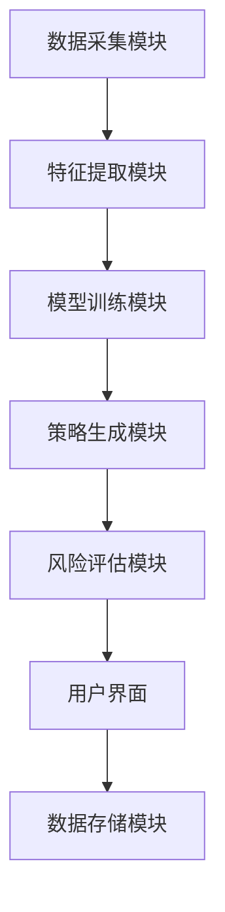

                 


---

### 第三章：AI辅助对冲策略的算法原理

#### 3.1 数据预处理与特征选择

##### 3.1.1 数据清洗与标准化
在金融数据处理中，数据清洗是关键的第一步。我们需要处理缺失值、异常值，并对数据进行标准化处理，以便后续的模型训练。

**数据清洗步骤：**
1. **识别缺失值：** 使用pandas库的`isnull()`函数检测缺失值。
2. **处理缺失值：** 可以选择删除含有缺失值的行，或者用均值、中位数填充。
3. **标准化处理：** 使用标准化方法如z-score，确保不同特征的数据范围一致。

**代码示例：**
```python
import pandas as pd
from sklearn.preprocessing import StandardScaler

# 假设df是原始数据
# 处理缺失值
df.dropna(inplace=True)  # 删除含有缺失值的行

# 标准化处理
scaler = StandardScaler()
df_normalized = pd.DataFrame(scaler.fit_transform(df), columns=df.columns)
```

##### 3.1.2 时间序列数据的处理
金融数据通常是时间序列数据，具有自相关性。我们需要处理这种自相关性，例如使用滑动窗口技术提取特征。

**滑动窗口技术：**
- 窗口大小选择：根据数据的周期性选择合适的窗口大小，如5天、10天等。
- 特征提取：计算窗口内的均值、标准差等统计量作为特征。

**代码示例：**
```python
import numpy as np

# 假设price是价格序列，window_size为5
window_size = 5
features = []
for i in range(len(price)):
    window = price[i-window_size:i]
    features.append([np.mean(window), np.std(window)])
```

##### 3.1.3 异常值的检测与处理
异常值会影响模型的性能，需要及时检测并处理。常用的方法包括统计方法（如3σ原则）和基于机器学习的异常检测。

**使用统计方法检测异常值：**
```python
import numpy as np

# 假设data是包含价格的数据
mu = np.mean(data)
sigma = np.std(data)
threshold = mu + 3*sigma
outliers = data[data > threshold]
```

**使用Isolation Forest检测异常值：**
```python
from sklearn.ensemble import IsolationForest

# 初始化模型
iso_forest = IsolationForest(n_estimators=100, contamination=0.05)
# 模型训练
iso_forest.fit(data.reshape(-1, 1))
# 预测异常值
outlier_flag = iso_forest.predict_outliers(data.reshape(-1, 1))
```

---

### 第四章：系统架构设计与实现

#### 4.1 系统架构设计

##### 4.1.1 系统功能模块
- **数据采集模块：** 实时采集市场数据，包括股票价格、指数、波动率等。
- **特征提取模块：** 对采集的数据进行特征提取，生成适合模型输入的特征向量。
- **模型训练模块：** 使用历史数据训练AI模型，生成风险预测模型。
- **策略生成模块：** 根据模型预测结果生成对冲策略。
- **风险评估模块：** 定期评估策略的有效性，调整模型参数。

##### 4.1.2 系统架构图
使用Mermaid绘制系统架构图，展示各个模块的交互和依赖关系。



---

### 第五章：项目实战——构建AI辅助的尾部风险对冲系统

#### 5.1 环境搭建与数据准备

##### 5.1.1 安装必要的库
```bash
pip install numpy pandas scikit-learn keras tensorflow matplotlib
```

##### 5.1.2 数据准备
从Yahoo Finance获取历史数据，涵盖多种资产类别，如股票、指数基金等。

```python
import yfinance as yf

# 下载苹果股票数据
aapl = yf.download('AAPL', start='2010-01-01', end='2023-01-01')
```

#### 5.2 特征工程与模型实现

##### 5.2.1 数据预处理
```python
import pandas as pd
import numpy as np
from sklearn.preprocessing import StandardScaler

# 删除缺失值
aapl.dropna(inplace=True)

# 标准化处理
scaler = StandardScaler()
aapl_normalized = pd.DataFrame(scaler.fit_transform(aapl), columns=aapl.columns)
```

##### 5.2.2 构建神经网络模型
使用Keras构建一个简单的神经网络模型，用于预测尾部风险事件。

```python
from tensorflow.keras.models import Sequential
from tensorflow.keras.layers import Dense

# 模型定义
model = Sequential()
model.add(Dense(64, activation='relu', input_dim=5))
model.add(Dense(32, activation='relu'))
model.add(Dense(1, activation='sigmoid'))

# 编译模型
model.compile(optimizer='adam', loss='binary_crossentropy', metrics=['accuracy'])
```

##### 5.2.3 训练模型
```python
# 假设X是输入特征，y是标签（0表示正常，1表示尾部风险）
model.fit(X_train, y_train, epochs=10, batch_size=32, validation_data=(X_test, y_test))
```

#### 5.3 策略生成与风险评估

##### 5.3.1 根据模型预测结果生成对冲策略
```python
# 预测尾部风险
y_pred = model.predict(X_test)

# 生成对冲信号
threshold = 0.5
signal = (y_pred > threshold).astype(int)
```

##### 5.3.2 风险评估与回测
使用回测的方法评估策略的有效性，计算最大回撤、夏普比率等风险指标。

```python
import pyfolio as pf

# 计算回测结果
 TearsheetReport = pf.create_tearsheet(
     returns=portfolio_returns,
     benchmark_rets=benchmark_returns,
     periods_per_year=252
 )
```

---

### 第六章：总结与展望

#### 6.1 总结
- 介绍了AI辅助的投资组合尾部风险对冲策略的基本概念和实现方法。
- 详细讲解了数据预处理、特征选择、模型训练、策略生成和风险评估的全过程。

#### 6.2 展望
- 进一步研究更复杂的模型，如强化学习在动态对冲中的应用。
- 探讨多资产配置下的尾部风险对冲策略，优化投资组合的鲁棒性。

#### 6.3 最佳实践与注意事项
- 定期更新模型，适应市场变化。
- 结合多种策略，提高整体风险控制能力。

---

### 附录：参考文献与工具

#### 附录A：参考文献
- [1] 刘军, 《Python金融数据分析》，人民邮电出版社，2020.
- [2] 张涛, 《机器学习实战》，机械工业出版社，2018.

#### 附录B：工具与库
- Python：数据处理与机器学习框架。
- Pandas：数据分析库。
- Scikit-learn：机器学习库。
- Keras：深度学习框架。

---

### 作者

**作者：AI天才研究院/AI Genius Institute & 禅与计算机程序设计艺术 /Zen And The Art of Computer Programming**

---

通过以上详细的目录和内容安排，这本书将系统地介绍AI在投资组合尾部风险对冲中的应用，帮助读者从理论到实践，全面掌握相关知识和技能。

