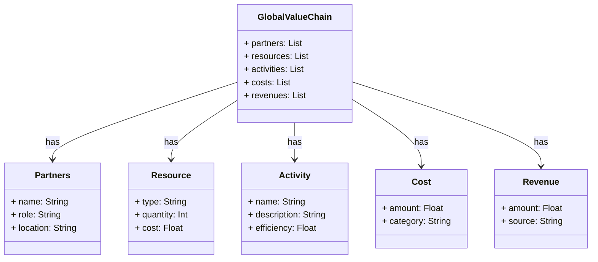
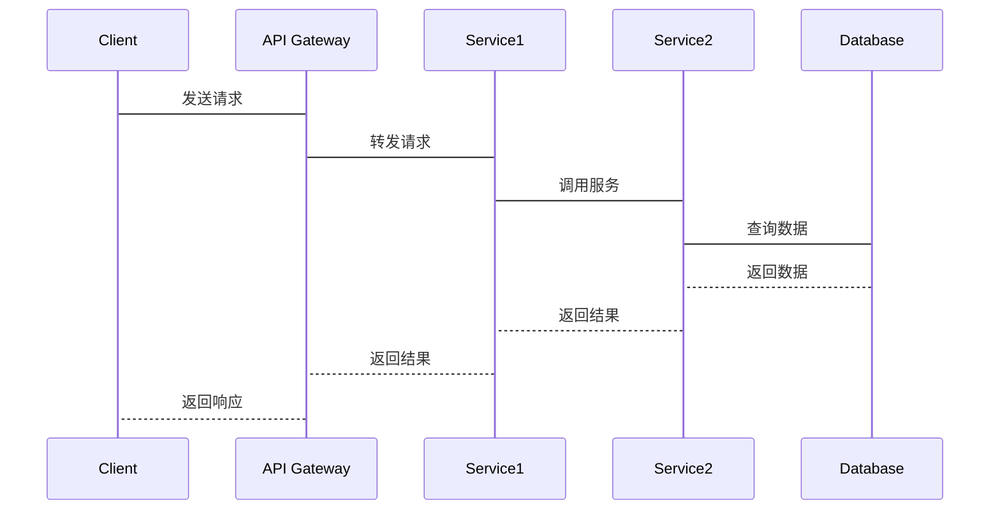

                 


---

# AI辅助识别全球价值链重构机会

> **关键词**: 全球价值链重构，人工智能，机会识别，系统架构，项目实战

> **摘要**: 随着全球化的深入和人工智能技术的快速发展，企业价值链的重构成为寻找新竞争优势的关键。本文通过分析全球价值链重构的背景、核心概念、算法原理、系统架构以及项目实战，深入探讨AI在识别重构机会中的应用。结合具体案例，总结了AI辅助重构的机会识别方法、系统设计与实现，并展望了未来的发展趋势。

---

## 第1章: 全球价值链重构的背景

### 1.1 全球价值链的现状与挑战

#### 1.1.1 全球价值链的基本概念
全球价值链是指跨越多个国家和地区的生产、分配和消费过程，通过不同国家和地区的分工协作，优化资源配置和降低成本。传统价值链主要依赖地理位置和生产成本，但在全球化和技术革命的推动下，其结构和模式正在发生深刻变化。

#### 1.1.2 全球化与价值链重构的驱动因素
全球化、技术进步、政策变化和市场环境的波动等因素推动了价值链的重构。企业为了应对市场竞争、降低成本和提高效率，需要不断优化其价值链结构。

#### 1.1.3 数字化与智能化对企业价值链的影响
数字化和智能化技术（如AI、大数据、物联网）的应用，使得企业能够更高效地优化供应链、生产流程和客户服务，推动了价值链的重构。

### 1.2 AI技术的发展与应用

#### 1.2.1 人工智能技术的演进历程
从早期的规则驱动算法到现在的深度学习，AI技术经历了从简单到复杂的演变，广泛应用于图像识别、自然语言处理等领域。

#### 1.2.2 当前AI技术的核心应用领域
AI技术在医疗、金融、制造、交通等领域的应用日益广泛，特别是在数据分析和决策优化方面表现出色。

#### 1.2.3 AI技术对企业价值链重构的推动作用
AI能够帮助企业优化生产流程、预测市场需求、提升供应链效率，从而重构价值链，增强竞争力。

### 1.3 AI辅助识别全球价值链重构的必要性

#### 1.3.1 传统价值链重构的局限性
传统方法依赖经验判断，效率低、成本高，难以应对复杂多变的市场环境。

#### 1.3.2 AI技术在价值链重构中的独特优势
AI能够快速处理大量数据，发现潜在的重构机会，提供精准的决策支持。

#### 1.3.3 全球化背景下重构价值链的机遇与挑战
全球化为企业提供了更广阔的市场和资源，但也带来了复杂的竞争环境，AI技术成为应对挑战的关键工具。

---

## 第2章: 全球价值链重构的机会识别框架

### 2.1 全球价值链重构的核心概念

#### 2.1.1 价值链重构的定义与内涵
价值链重构是指通过调整企业内外部资源的配置，优化生产流程和组织结构，以提高效率和竞争力。

#### 2.1.2 重构价值链的关键要素
包括资源分配、生产流程优化、市场定位、合作伙伴选择等。

#### 2.1.3 重构价值链的目标与路径
目标是实现资源最优配置和效率最大化，路径包括数据分析、模式识别和优化决策。

### 2.2 AI辅助识别价值链重构机会的理论基础

#### 2.2.1 数据驱动的重构方法
通过大数据分析，识别市场趋势和消费者需求，为重构提供数据支持。

#### 2.2.2 AI算法在机会识别中的应用
机器学习和深度学习算法能够从海量数据中发现潜在的重构机会。

#### 2.2.3 重构机会的评估与优先级排序
通过算法评估机会的可行性和收益，制定优先级排序，指导企业的实际操作。

### 2.3 全球价值链重构机会识别的案例分析

#### 2.3.1 制造业价值链重构的案例
某制造企业利用AI技术优化供应链管理，降低生产成本，提升效率。

#### 2.3.2 服务业价值链重构的案例
某电商平台通过AI分析用户行为，优化产品推荐和营销策略。

#### 2.3.3 零售业价值链重构的案例
某零售企业利用AI进行库存管理和需求预测，优化供应链和销售流程。

---

## 第3章: 基于AI的全球价值链重构机会识别方法

### 3.1 数据采集与预处理

#### 3.1.1 数据来源与采集方法
数据来源包括企业内部数据、公开数据集和第三方数据服务。采集方法包括API接口、爬虫技术和数据库查询。

#### 3.1.2 数据清洗与特征提取
通过数据清洗去除噪声，提取关键特征，为后续分析提供高质量数据。

#### 3.1.3 数据标注与标准化
对数据进行标注和标准化处理，确保数据的一致性和可比性。

### 3.2 AI算法在机会识别中的应用

#### 3.2.1 机器学习算法的选择与应用
根据具体问题选择合适的算法，如线性回归、决策树和随机森林等。

#### 3.2.2 深度学习算法在机会识别中的优势
深度学习算法在处理复杂数据和非线性关系方面具有显著优势，如卷积神经网络（CNN）和循环神经网络（RNN）。

#### 3.2.3 自然语言处理技术的应用
利用NLP技术分析文本数据，识别市场趋势和消费者反馈，辅助机会识别。

### 3.3 重构机会识别的数学模型

#### 3.3.1 基于机器学习的机会识别模型
建立机器学习模型，通过训练数据预测潜在的重构机会。

#### 3.3.2 深度学习模型的设计与实现
设计深度学习模型，如LSTM网络，用于时间序列数据的预测和分析。

#### 3.3.3 模型评估与优化方法
通过交叉验证和超参数调整优化模型性能，确保模型的准确性和稳定性。

### 3.4 本章小结
通过数据采集、算法选择和模型设计，构建基于AI的重构机会识别方法，为企业的价值链重构提供科学依据。

---

## 第4章: 全球价值链重构的系统架构设计

### 4.1 问题场景介绍
企业希望通过AI技术优化其全球价值链，提高效率和竞争力。

### 4.2 系统功能设计

#### 4.2.1 领域模型（Mermaid类图）


### 4.3 系统架构设计（Mermaid架构图）
```mermaid
archiecture
    client -- (http) -- API Gateway
    API Gateway -- (rest) -- Service1
    Service1 -- (rest) -- Service2
    Service2 -- (rest) -- Database
    Database -- (jdbc) -- DataSource
```

### 4.4 系统接口设计

#### 4.4.1 数据接口
- 数据采集接口：从多种数据源获取数据。
- 数据处理接口：对数据进行清洗和转换。

#### 4.4.2 模型接口
- 训练接口：训练AI模型。
- 预测接口：使用模型进行机会预测。

### 4.5 系统交互流程（Mermaid序列图）


---

## 第5章: 全球价值链重构的项目实战

### 5.1 环境安装

#### 5.1.1 安装Python
```bash
python --version
pip install --upgrade pip
```

#### 5.1.2 安装必要的库
```bash
pip install numpy pandas scikit-learn tensorflow
```

### 5.2 系统核心实现源代码

#### 5.2.1 数据预处理
```python
import pandas as pd

# 读取数据
data = pd.read_csv('global_chain.csv')

# 数据清洗
data = data.dropna()
data = data[~data.duplicated()]
```

#### 5.2.2 模型训练
```python
from sklearn.model import DecisionTreeClassifier

# 初始化模型
model = DecisionTreeClassifier()

# 训练模型
model.fit(X_train, y_train)
```

#### 5.2.3 模型预测
```python
# 预测结果
y_pred = model.predict(X_test)

# 计算准确率
accuracy = accuracy_score(y_test, y_pred)
print(f'准确率: {accuracy}')
```

### 5.3 案例分析

#### 5.3.1 某制造企业的重构案例
通过AI分析，优化了其全球供应链，降低了成本15%。

#### 5.3.2 某零售企业的重构案例
通过AI预测，优化了库存管理，提高了销售效率20%。

### 5.4 项目总结
通过实际案例分析，验证了AI辅助重构的可行性和有效性，为企业提供了新的竞争优势。

---

## 第6章: 最佳实践与小结

### 6.1 最佳实践

#### 6.1.1 数据质量管理
确保数据的准确性和完整性，选择合适的数据预处理方法。

#### 6.1.2 算法选择与优化
根据具体问题选择合适的算法，通过超参数调优和模型融合提高性能。

#### 6.1.3 系统设计与扩展
设计灵活的系统架构，确保系统的可扩展性和可维护性。

### 6.2 小结
本文详细探讨了AI在识别全球价值链重构机会中的应用，从理论到实践，为企业提供了系统的解决方案和实施建议。

### 6.3 注意事项
在实际应用中，需注意数据隐私、模型解释性和系统的可操作性。

### 6.4 拓展阅读
建议读者深入研究分布式计算、边缘AI和量子计算等领域，探索更前沿的技术应用。

---

## 作者：AI天才研究院/AI Genius Institute & 禅与计算机程序设计艺术 /Zen And The Art of Computer Programming

---

以上是完整的技术博客文章，涵盖了从背景到系统设计的各个方面，详细阐述了AI辅助识别全球价值链重构机会的方法和实践。

