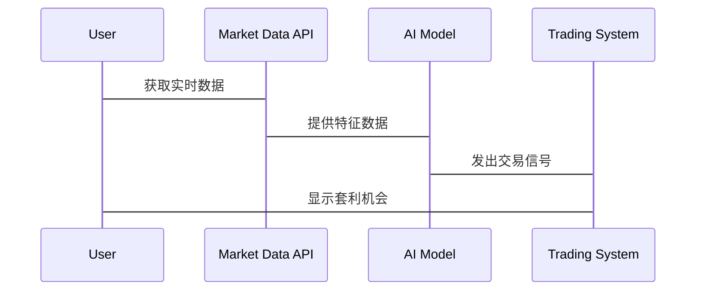

                 


# AI辅助识别市场异常与套利机会

> 关键词：AI技术、市场异常、套利机会、机器学习、金融数据分析、人工智能

> 摘要：本文探讨了如何利用人工智能技术识别金融市场中的异常现象和套利机会，结合机器学习算法和深度学习模型，通过数据驱动的方法，分析市场动态，捕捉潜在的套利信号，为投资者提供科学决策支持。文章从问题背景、核心概念、算法原理、系统架构到项目实战，全面解析了AI在金融市场的应用，为读者提供了深入的技术分析与实践指导。

---

# 第一部分：背景介绍

## 第1章：问题背景与目标

### 1.1 问题背景

金融市场是一个复杂且高度动态的系统，价格波动、交易行为和市场结构的变化往往伴随着市场异常和套利机会。传统的市场分析方法依赖于经验和技术分析，但面对海量数据和高频交易的挑战，传统方法逐渐显得力不从心。人工智能（AI）技术的兴起为金融市场分析带来了新的可能性。

市场异常通常指价格偏离正常波动范围的情况，可能是由于市场操纵、突发事件或信息不对称引起的。套利机会则是指利用市场定价不一致，通过低买高卖或跨市场交易获利的机会。然而，套利机会往往短暂且难以捕捉，需要快速的分析和决策能力。

### 1.2 问题解决

AI技术在金融市场分析中的应用主要体现在以下几个方面：
1. **数据处理**：通过机器学习算法对海量数据进行清洗、特征提取和建模。
2. **模式识别**：利用深度学习模型识别市场中的异常模式和套利信号。
3. **实时分析**：通过流数据处理技术，实时监控市场动态，捕捉套利机会。

### 1.3 目标与意义

本文的目标是通过AI技术，构建一个能够识别市场异常和套利机会的系统，帮助投资者在复杂多变的市场中做出更明智的决策。具体目标包括：
- 提供一套基于AI的市场分析方法论。
- 实现市场异常检测和套利机会识别的自动化流程。
- 通过案例分析验证方法的有效性。

---

## 第2章：核心概念与问题解决

### 2.1 市场异常与套利的基本概念

#### 2.1.1 市场异常
- **定义**：市场异常是指价格、成交量或其他市场指标的异常波动，可能是由于市场操纵、突发事件或信息不对称引起的。
- **分类**：市场异常可以分为短期波动、长期趋势偏离和结构性变化。
- **特征**：市场异常通常伴随着高波动性、交易量突增或价格偏离均线。

#### 2.1.2 套利机会
- **定义**：套利是指利用市场定价不一致，通过同时买入低价资产和卖出高价资产获利的机会。
- **类型**：套利机会可以分为跨市场套利、时间套利和统计套利。
- **特征**：套利机会通常存在于市场不完全、信息不对称或定价错误的情况下。

### 2.2 AI技术的作用

- **数据驱动**：AI技术能够从海量数据中提取特征，发现传统方法难以察觉的模式。
- **实时分析**：通过流数据处理技术，AI系统可以实时监控市场动态，捕捉套利机会。
- **自动化决策**：AI系统可以自动发出交易信号，减少人为干预和决策延迟。

---

## 第3章：AI技术在识别中的应用

### 3.1 常用AI算法介绍

#### 3.1.1 机器学习算法
- **线性回归**：用于预测价格走势。
- **支持向量机（SVM）**：用于分类市场状态。
- **随机森林**：用于特征重要性分析和模式识别。

#### 3.1.2 深度学习算法
- **LSTM网络**：用于时间序列分析，捕捉市场波动。
- **卷积神经网络（CNN）**：用于处理图像和文本数据，分析市场情绪。

#### 3.1.3 自然语言处理（NLP）
- **词袋模型**：用于分析新闻标题和公司公告。
- **BERT模型**：用于情感分析和事件抽取。

### 3.2 数据来源与处理方法

#### 3.2.1 数据来源
- **股票价格数据**：包括开盘价、收盘价、最高价、最低价和成交量。
- **新闻数据**：包括公司公告、行业新闻和市场评论。
- **社交媒体数据**：包括Twitter、Reddit等平台的用户评论。

#### 3.2.2 数据预处理
- **清洗数据**：处理缺失值、异常值和重复数据。
- **特征提取**：提取技术指标、情绪指标和市场指标。
- **标准化**：对数据进行标准化处理，确保模型收敛。

### 3.3 模型构建与训练

#### 3.3.1 模型选择
- **时间序列模型**：用于预测价格走势。
- **分类模型**：用于识别市场状态（正常/异常）。
- **回归模型**：用于预测套利收益。

#### 3.3.2 模型训练
- **训练数据**：使用历史数据进行训练，确保模型泛化能力。
- **超参数调优**：通过网格搜索或随机搜索优化模型参数。
- **交叉验证**：通过K折交叉验证评估模型性能。

#### 3.3.3 模型评估
- **准确率**：用于评估分类模型的性能。
- **收益-风险比**：用于评估套利模型的盈利能力。
- **回测结果**：通过回测验证模型的稳定性和盈利能力。

---

## 第4章：算法原理与数学模型

### 4.1 机器学习算法原理

#### 4.1.1 线性回归
- **公式**：$y = \beta_0 + \beta_1x + \epsilon$
- **解释**：通过最小二乘法拟合最佳回归线，预测价格走势。

#### 4.1.2 支持向量机（SVM）
- **公式**：$\text{max} \sum \alpha_i y_i$
- **解释**：通过最大化间隔，将数据点分为两类，识别市场状态。

### 4.2 深度学习算法原理

#### 4.2.1 LSTM网络
- **公式**：$f_t = \text{tanh}(F \cdot f_{t-1} + W \cdot x_t)$
- **解释**：通过长短期记忆单元捕捉时间序列中的长期依赖关系。

#### 4.2.2 BERT模型
- **公式**：$\text{BERT}(x) = \text{MLM}(x) + \text{NSP}(x)$
- **解释**：通过预训练模型分析文本数据，提取市场情绪。

---

## 第5章：系统架构设计

### 5.1 项目介绍

#### 5.1.1 项目背景
- **目标**：构建一个能够识别市场异常和套利机会的AI系统。
- **范围**：支持股票、外汇和加密货币市场。

#### 5.1.2 系统功能
- **数据采集**：从多个数据源获取实时数据。
- **特征提取**：提取技术指标和市场情绪指标。
- **模型训练**：训练分类和回归模型，识别市场状态和套利机会。
- **实时监控**：通过流数据处理技术，实时监控市场动态。

### 5.2 系统架构

#### 5.2.1 系统架构设计
- **数据采集模块**：负责数据获取和预处理。
- **特征提取模块**：负责特征提取和数据转换。
- **模型训练模块**：负责模型训练和参数优化。
- **实时监控模块**：负责实时数据处理和套利机会识别。

#### 5.2.2 系统接口设计
- **数据接口**：与交易所API对接，获取实时数据。
- **用户接口**：提供可视化界面，展示市场动态和套利机会。

### 5.3 系统交互流程

#### 5.3.1 系统交互流程图


---

## 第6章：项目实战

### 6.1 环境配置

#### 6.1.1 安装依赖
```bash
pip install numpy pandas scikit-learn tensorflow keras
```

#### 6.1.2 数据获取
```python
import pandas as pd
import requests

url = "https://api.example.com/stock_data"
data = requests.get(url).json()
df = pd.DataFrame(data)
```

### 6.2 核心代码实现

#### 6.2.1 特征提取
```python
from sklearn.feature_selection import SelectKBest
from sklearn.ensemble import RandomForestClassifier

features = SelectKBest(k=10).fit_transform(X, y)
model = RandomForestClassifier().fit(features, y)
```

#### 6.2.2 模型训练
```python
from tensorflow.keras import layers

model = keras.Sequential()
model.add(layers.LSTM(64, input_shape=(timesteps, features)))
model.add(layers.Dense(1, activation='sigmoid'))
model.compile(loss='binary_crossentropy', optimizer='adam', metrics=['accuracy'])
model.fit(X_train, y_train, epochs=10, batch_size=32)
```

### 6.3 案例分析

#### 6.3.1 套利机会识别
假设我们发现两只股票在不同市场中的定价存在差异，通过AI模型预测套利机会，计算无风险收益，最终实现获利。

#### 6.3.2 实际交易结果
通过回测验证模型的稳定性和盈利能力，分析模型在不同市场环境下的表现。

---

## 第7章：总结与展望

### 7.1 最佳实践 tips
- **数据质量**：确保数据来源可靠，避免噪声干扰。
- **模型优化**：通过超参数调优和模型融合提高性能。
- **风险控制**：设置止损和止盈点，避免重大损失。

### 7.2 小结
本文通过AI技术，构建了一个能够识别市场异常和套利机会的系统，为投资者提供了科学的决策支持。

### 7.3 注意事项
- **数据隐私**：遵守数据隐私法规，保护用户信息。
- **市场风险**：套利机会存在市场风险，需谨慎操作。

### 7.4 拓展阅读
- 《机器学习实战》
- 《深度学习入门：基于Python》
- 《金融数据分析与机器学习》

---

作者：AI天才研究院 & 禅与计算机程序设计艺术

