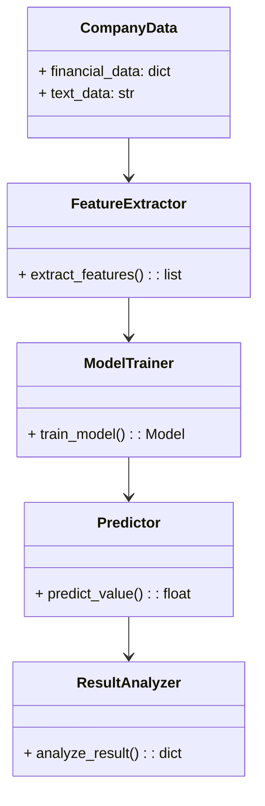
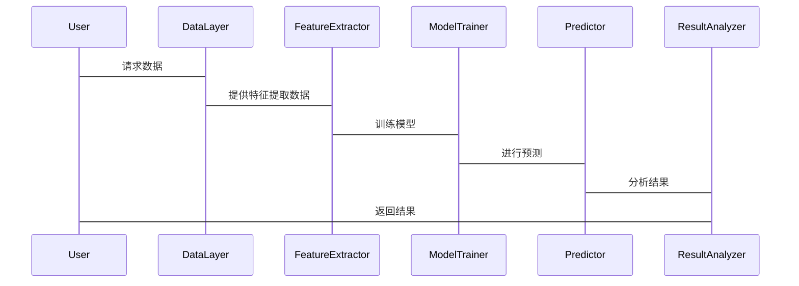

                 


# AI辅助识别长期价值创造型公司

> 关键词：人工智能、长期价值、公司识别、财务数据、文本分析、算法原理、系统架构

> 摘要：本文通过分析人工智能在企业价值评估中的应用，探讨如何利用AI技术识别长期价值创造型公司。文章从背景、数据、模型、算法、系统架构到项目实战，全面解析AI辅助识别的实现过程，提供详细的理论支持和实践指导。

---

## 第一部分: AI辅助识别长期价值创造型公司的背景与核心概念

### 第1章: AI在企业分析中的应用背景

#### 1.1 问题背景与描述
##### 1.1.1 传统企业分析的局限性
传统的企业分析方法依赖于财务报表和人工判断，存在以下问题：
- 数据量有限：难以捕捉非财务因素的影响。
- 主观性较强：分析结果受分析师经验影响。
- 动态变化难测：难以及时捕捉市场波动和公司战略调整。

##### 1.1.2 长期价值创造型公司的定义与特征
长期价值创造型公司是指那些能够持续为股东创造超额价值的企业，其核心特征包括：
- 财务稳健：ROE、净利润等指标持续向好。
- 创新能力强：研发投入占比高，专利数量增长快。
- 市场竞争力：市场份额稳定或持续扩大。
- 管理层优秀：高管团队经验丰富，战略清晰。

##### 1.1.3 AI技术在企业分析中的潜在价值
AI技术可以通过以下方式提升企业分析的效率和准确性：
- 处理海量数据：利用自然语言处理（NLP）分析公司公告、新闻和社交媒体数据。
- 模型预测：基于历史数据和市场行为预测公司未来表现。
- 实时监控：通过流数据处理技术实时跟踪公司动态。

#### 1.2 问题解决与边界
##### 1.2.1 AI辅助识别的核心问题
AI辅助识别的核心问题是：如何从多源异构数据中提取有效特征，并构建可靠的预测模型，以识别具备长期价值创造潜力的公司。

##### 1.2.2 解决问题的边界与外延
- 数据范围：主要关注财务数据和文本数据，暂不考虑视频、图像等其他类型数据。
- 时间范围：以季度或年度为单位进行分析，不涉及实时高频数据。
- 公司范围：聚焦于上市公司，数据来源为公开披露的信息。

##### 1.2.3 核心概念的结构与组成
核心概念包括以下三个模块：
1. 数据模块：包含财务数据、文本数据和市场数据。
2. 模型模块：包括特征提取、模型训练和预测算法。
3. 结果模块：输出公司价值评分和投资建议。

---

## 第二部分: 公司价值评估的关键数据

### 第2章: 财务数据的重要性

#### 2.1 财务指标的分类与作用
##### 2.1.1 利润能力
- 净利润（Net Profit）：衡量公司盈利能力的核心指标。
- 资产回报率（ROA）：衡量公司资产使用效率。
- 净资产收益率（ROE）：衡量公司股东投资回报能力。

##### 2.1.2 营运能力
- 存货周转率：衡量公司库存管理效率。
- 应收账款周转率：衡量公司收账能力。

##### 2.1.3 偿债能力
- 负债率：衡量公司财务杠杆风险。
- 流动比率：衡量公司短期偿债能力。

#### 2.2 财务数据的预处理与特征提取
##### 2.2.1 数据清洗
- 处理缺失值：使用均值、中位数或插值法填补。
- 标准化：将不同量纲的指标归一化处理。
- 异常值处理：使用Z-score或IQR方法剔除异常值。

##### 2.2.2 特征选择
- 主成分分析（PCA）：降低特征维度，减少计算复杂度。
- Lasso回归：通过正则化方法自动筛选重要特征。

##### 2.2.3 时间序列数据的处理
- 移动平均（MA）：平滑数据，识别趋势。
- 差分法（Differencing）：消除时间序列的周期性。
- 季节性分解（Seasonal Decomposition）：提取数据的季节性成分。

### 第3章: 文本数据的价值

#### 3.1 公司公告与新闻的文本分析
##### 3.1.1 文本预处理
- 分词：使用jieba等工具对中文文本进行分词。
- 去停用词：去除无意义词汇（如“的”、“了”）。
- 词干提取：将词语还原为基本形式（如“companiesto company”）。

##### 3.1.2 文本情感分析
- 使用自然语言处理模型（如BERT）对文本进行情感分类。
- 将文本情感分为正面、中性、负面三类。

##### 3.1.3 多模态数据的融合与应用
- 将文本情感分析结果与财务指标结合，构建多特征预测模型。

---

## 第三部分: AI模型构建与算法原理

### 第4章: AI辅助识别模型的构建

#### 4.1 数据预处理与特征工程
##### 4.1.1 数据清洗与标准化
- 使用Python的pandas库进行数据清洗。
- 使用scikit-learn库进行标准化处理。

##### 4.1.2 特征选择与降维
- 使用PCA进行特征降维。
- 使用Lasso回归进行特征选择。

##### 4.1.3 时间序列数据的处理
- 使用Prophet模型进行时间序列预测。
- 使用LSTM模型捕捉时间序列的长期依赖关系。

#### 4.2 模型训练与优化
##### 4.2.1 模型选择
- 使用LSTM进行时间序列预测。
- 使用BERT进行文本特征提取。

##### 4.2.2 超参数调优
- 使用网格搜索（Grid Search）优化模型参数。
- 使用K折交叉验证评估模型性能。

##### 4.2.3 模型评估与验证
- 使用准确率（Accuracy）、召回率（Recall）、F1分数评估模型性能。
- 使用混淆矩阵分析模型预测结果。

### 第5章: 算法原理与数学模型

#### 5.1 LSTM模型的原理
##### 5.1.1 LSTM的结构与工作原理
- LSTM由输入门（Input Gate）、遗忘门（Forget Gate）和输出门（Output Gate）组成。
- 通过 gates 的计算，LSTM能够有效捕捉时间序列的长期依赖关系。

##### 5.1.2 LSTM的数学模型与公式
$$
f_t = \sigma(W_f \cdot [h_{t-1}, x_t] + b_f)
$$
$$
i_t = \sigma(W_i \cdot [h_{t-1}, x_t] + b_i)
$$
$$
o_t = \sigma(W_o \cdot [h_{t-1}, x_t] + b_o)
$$
$$
g_t = \tanh(W_g \cdot [h_{t-1}, x_t] + b_g)
$$
$$
h_t = f_t \cdot h_{t-1} + i_t \cdot g_t
$$
$$
s_t = h_t
$$

##### 5.1.3 LSTM在时间序列预测中的应用
- 使用LSTM对财务指标进行预测。
- 使用 Prophet 模型作为基准模型进行对比。

#### 5.2 BERT模型的文本分析
##### 5.2.1 BERT模型的结构与特点
- BERT基于Transformer架构，采用双向编码机制。
- 使用掩码自注意力机制（Masked Self-Attention）处理文本。

##### 5.2.2 BERT模型的文本分析
- 使用BERT对 company announcements 进行情感分析。
- 使用BERT提取文本中的关键信息（如关键词、主题）。

---

## 第四部分: 系统架构设计

### 第6章: 系统架构设计

#### 6.1 问题场景介绍
- 数据来源：公司财务数据、新闻公告、社交媒体等。
- 业务目标：识别具备长期价值创造潜力的公司。
- 使用场景：投资者、机构投资者、金融分析师等。

#### 6.2 系统功能设计
##### 6.2.1 领域模型（Mermaid 类图）


##### 6.2.2 系统架构设计（Mermaid 架构图）
```mermaid
container DataLayer {
    Service: 数据采集服务
    Database: 数据库
}
container ProcessingLayer {
    Service: 特征提取服务
    Service: 模型训练服务
}
container ApplicationLayer {
    Service: 预测服务
    Service: 结果分析服务
}
DataLayer --> ProcessingLayer
ProcessingLayer --> ApplicationLayer
```

##### 6.2.3 系统交互设计（Mermaid 序列图）


---

## 第五部分: 项目实战

### 第7章: 项目实战

#### 7.1 环境安装
- 安装Python、Jupyter Notebook。
- 安装pandas、numpy、scikit-learn、keras、tensorflow、transformers等库。

#### 7.2 核心实现源代码
##### 7.2.1 数据预处理
```python
import pandas as pd
import numpy as np

# 加载数据
df = pd.read_csv('company_data.csv')

# 数据清洗
df.dropna(inplace=True)
df = df[df['revenue'] > 0]

# 标准化处理
from sklearn.preprocessing import StandardScaler
scaler = StandardScaler()
scaled_features = scaler.fit_transform(df[['revenue', 'profit', 'growth']])
```

##### 7.2.2 模型训练
```python
from tensorflow.keras import layers
from tensorflow.keras import Model

def build_model(input_shape):
    inputs = layers.Input(shape=input_shape)
    lstm_layer = layers.LSTM(64)(inputs)
    dense_layer = layers.Dense(32, activation='relu')(lstm_layer)
    outputs = layers.Dense(1)(dense_layer)
    model = Model(inputs=inputs, outputs=outputs)
    model.compile(loss='mean_squared_error', optimizer='adam')
    return model

model = build_model((None, 3))
model.fit(X_train, y_train, epochs=10, batch_size=32)
```

##### 7.2.3 文本分析
```python
from transformers import BertTokenizer, BertModel
import torch

tokenizer = BertTokenizer.from_pretrained('bert-base-uncased')
model = BertModel.from_pretrained('bert-base-uncased')

inputs = tokenizer("The company has strong growth potential.", return_tensors="pt")
outputs = model(**inputs)
```

#### 7.3 实际案例分析
- 数据来源：某公司过去5年的财务数据和新闻公告。
- 模型预测：预测该公司未来3年的价值评分。
- 结果分析：根据预测结果提供投资建议。

---

## 第六部分: 总结与展望

### 第8章: 总结与展望

#### 8.1 最佳实践 tips
- 数据质量是模型性能的基础，需重视数据清洗和特征工程。
- 模型调优是关键，建议使用网格搜索和交叉验证。
- 持续监控是保障，需定期更新模型和数据。

#### 8.2 小结
本文通过分析AI技术在企业价值评估中的应用，详细介绍了如何利用财务数据和文本数据构建预测模型，最终实现长期价值创造型公司的识别。

#### 8.3 注意事项
- 模型结果仅供参考，投资需谨慎。
- 数据隐私需注意，避免泄露敏感信息。

#### 8.4 拓展阅读
- 《深度学习》—— Ian Goodfellow
- 《自然语言处理入门》—— 陆远

---

作者：AI天才研究院/AI Genius Institute & 禅与计算机程序设计艺术/Zen And The Art of Computer Programming

