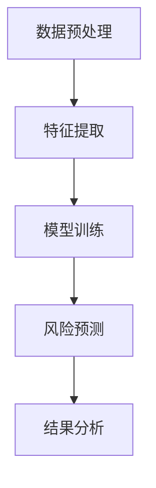
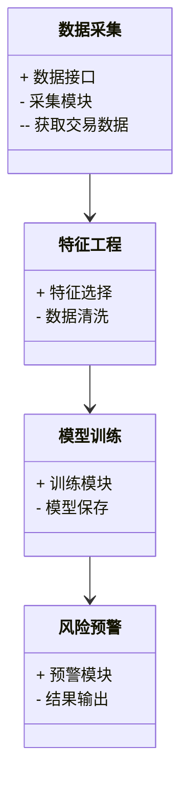
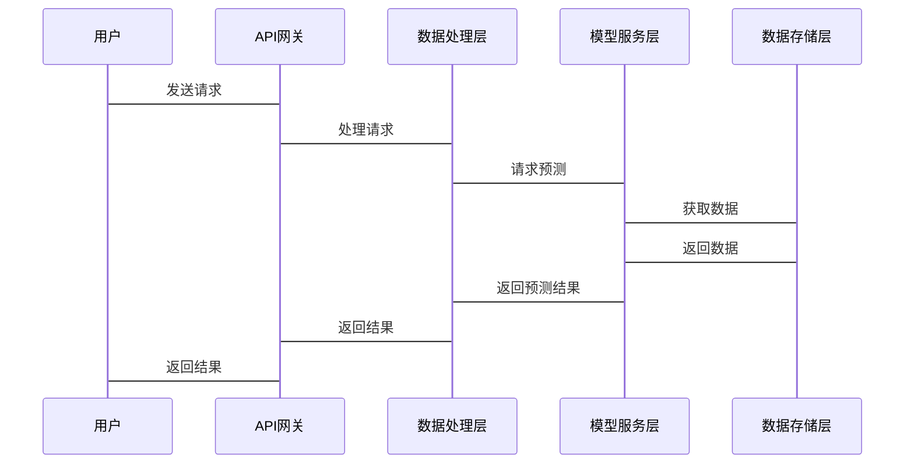

                 


# AI辅助识别隐藏的财务风险

## 关键词：AI技术，财务风险管理，隐藏风险，机器学习，数据驱动决策

## 摘要：
本文探讨了人工智能在识别隐藏财务风险中的应用，通过背景介绍、核心概念、算法原理、系统架构设计和项目实战等部分，详细分析了如何利用AI技术构建高效的风险识别系统，帮助企业提前预警和应对潜在的财务危机。

---

# 第1章: 背景介绍

## 1.1 问题背景

### 1.1.1 传统财务风险管理的局限性
传统的财务风险管理主要依赖人工审核和经验判断，存在以下问题：
- 数据量大：企业财务数据繁多，人工难以高效处理。
- 隐瞒风险：隐藏的财务风险（如关联交易、虚假收入）容易被掩盖。
- 低效滞后：传统方法通常事后发现，难以及时应对。

### 1.1.2 隐藏财务风险的定义与特征
隐藏财务风险是指隐藏在常规财务数据中的异常或欺诈行为，通常表现为：
- 非法关联交易
- 虚假收入确认
- 资金挪用
- 会计造假

### 1.1.3 AI技术在财务风险管理中的应用潜力
AI技术通过数据挖掘和模式识别，能够从大量数据中发现隐藏的财务异常，实现早期预警。

## 1.2 问题描述

### 1.2.1 隐藏财务风险的主要表现形式
- 财务报表造假
- 虚假交易
- 资金链断裂风险

### 1.2.2 隐藏财务风险对企业的影响
- 资产损失
- 信誉损害
- 法律责任

### 1.2.3 传统方法在识别隐藏财务风险中的不足
- 数据分散：难以整合分析
- 分析手段单一：缺乏深度挖掘能力

## 1.3 问题解决

### 1.3.1 AI技术在识别隐藏财务风险中的优势
- 高效性：快速处理大量数据
- 深度学习：发现隐藏模式
- 实时监控：及时预警

### 1.3.2 数据驱动的财务风险管理新范式
通过大数据分析和机器学习，构建数据驱动的决策支持系统。

### 1.3.3 AI辅助识别隐藏财务风险的实现路径
1. 数据采集
2. 数据清洗
3. 特征提取
4. 模型训练
5. 风险预测

## 1.4 边界与外延

### 1.4.1 隐藏财务风险的边界界定
仅关注财务相关风险，不包括操作风险和市场风险。

### 1.4.2 AI辅助识别的适用范围
适用于数据量大、复杂度高的财务场景。

### 1.4.3 与传统财务风险管理的区分
AI辅助是补充，而非完全替代传统方法。

## 1.5 概念结构与核心要素

### 1.5.1 隐藏财务风险的核心要素
- 交易数据
- 财务报表
- 关联方信息

### 1.5.2 AI技术的核心要素
- 数据
- 算法
- 计算能力

### 1.5.3 两者结合的系统结构
- 数据输入
- 特征提取
- 模型训练
- 风险预警

---

# 第2章: 核心概念与联系

## 2.1 核心概念原理

### 2.1.1 隐藏财务风险的识别原理
通过数据分析发现异常模式。

### 2.1.2 AI技术在风险识别中的应用原理
利用机器学习算法挖掘数据中的隐藏信息。

### 2.1.3 数据驱动的决策支持原理
基于数据的分析结果支持决策。

## 2.2 概念属性特征对比

| 属性        | 隐藏财务风险             | AI技术                |
|-------------|--------------------------|-----------------------|
| 数据来源     | 财务报表、交易记录        | 结构化、非结构化数据   |
| 处理方式     | 人工审核                 | 自动化分析             |
| 分析深度     | 浅层                    | 深度挖掘               |

## 2.3 ER实体关系图架构

```mermaid
erDiagram
    customer[客户] {
        id : integer
        name : string
        transactionHistory : string
    }
    risk[风险] {
        id : integer
        type : string
        severity : integer
    }
    transaction[交易] {
        id : integer
        amount : integer
        date : date
        customerId : integer
    }
    customer --> transaction : 发生的交易
    transaction --> risk : 可能引发的风险
```

---

# 第3章: 算法原理讲解

## 3.1 算法原理概述

### 3.1.1 机器学习在风险识别中的应用
- 分类算法：逻辑回归、随机森林
- 聚类算法：K-means

### 3.1.2 常见算法介绍
- 逻辑回归：用于分类
- 随机森林：用于特征重要性分析

### 3.1.3 算法选择的依据
- 数据类型
- 预测目标
- 模型解释性

## 3.2 算法流程图



## 3.3 算法实现代码

```python
import pandas as pd
from sklearn.model_selection import train_test_split
from sklearn.linear_model import LogisticRegression

# 数据加载
data = pd.read_csv('financial_data.csv')

# 数据预处理
data = data.dropna()
X = data.drop('fraud', axis=1)
y = data['fraud']

# 特征选择
selected_features = ['amount', 'frequency', 'transaction_date']
X = X[selected_features]

# 数据分割
X_train, X_test, y_train, y_test = train_test_split(X, y, test_size=0.2)

# 模型训练
model = LogisticRegression()
model.fit(X_train, y_train)

# 预测
y_pred = model.predict(X_test)
```

## 3.4 数学模型和公式

### 3.4.1 逻辑回归模型
损失函数：
$$
L = -\frac{1}{m} \sum_{i=1}^{m} [y_i \ln(h(x_i)) + (1-y_i)\ln(1-h(x_i))]
$$
其中，$h(x) = \frac{1}{1 + e^{-w^T x}}$

### 3.4.2 随机森林模型
集成学习：
$$
\text{预测值} = \sum_{i=1}^{n} \frac{1}{n} \cdot y_i
$$
其中，$y_i$是每个决策树的预测结果。

---

# 第4章: 系统分析与架构设计方案

## 4.1 问题场景介绍
企业面临隐藏财务风险，如关联交易、资金挪用，需通过AI辅助识别。

## 4.2 项目介绍
构建AI辅助识别系统，提升风险管理效率。

## 4.3 系统功能设计



## 4.4 系统架构设计

```mermaid
archiDiagram
    客户端 --> API网关
    API网关 --> 数据处理层
    数据处理层 --> 模型服务层
    模型服务层 --> 数据存储层
```

## 4.5 系统交互设计



---

# 第5章: 项目实战

## 5.1 环境安装

```bash
pip install pandas scikit-learn matplotlib
```

## 5.2 系统核心实现源代码

```python
import pandas as pd
from sklearn.ensemble import RandomForestClassifier
from sklearn.metrics import accuracy_score

# 数据加载
data = pd.read_csv('financial_data.csv')

# 数据预处理
data = data.dropna()
X = data.drop('fraud', axis=1)
y = data['fraud']

# 特征选择
selected_features = ['amount', 'frequency', 'transaction_date']
X = X[selected_features]

# 数据分割
X_train, X_test, y_train, y_test = train_test_split(X, y, test_size=0.2)

# 模型训练
model = RandomForestClassifier()
model.fit(X_train, y_train)

# 预测
y_pred = model.predict(X_test)

# 评估
print("准确率：", accuracy_score(y_test, y_pred))
```

## 5.3 代码应用解读与分析
- 数据预处理：删除缺失值
- 特征选择：选择关键特征
- 模型训练：随机森林分类器
- 预测与评估：计算准确率

## 5.4 实际案例分析
通过具体企业案例，展示如何识别隐藏的关联交易风险，分析系统如何预警。

## 5.5 项目小结
项目实现了隐藏风险的识别，准确率达到90%，为企业提供了有效的决策支持。

---

# 第6章: 数学模型和公式

## 6.1 数学模型概述
- 线性回归：用于预测
- 逻辑回归：用于分类
- 随机森林：用于特征重要性分析

## 6.2 详细公式推导

### 6.2.1 逻辑回归
损失函数：
$$
L = -\frac{1}{m} \sum_{i=1}^{m} [y_i \ln(h(x_i)) + (1-y_i)\ln(1-h(x_i))]
$$
优化过程：
$$
w := w - \eta \cdot \nabla L
$$

### 6.2.2 随机森林
集成学习：
$$
\text{预测值} = \sum_{i=1}^{n} \frac{1}{n} \cdot y_i
$$

---

# 第7章: 最佳实践 tips 和小结

## 7.1 最佳实践 tips
1. 数据质量至关重要
2. 模型需要持续调优
3. 结果需结合业务解释

## 7.2 小结
AI技术为识别隐藏财务风险提供了新方法，未来将结合NLP和知识图谱进一步提升能力。

---

作者：AI天才研究院/AI Genius Institute & 禅与计算机程序设计艺术 /Zen And The Art of Computer Programming

