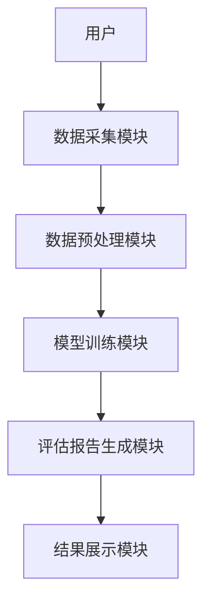
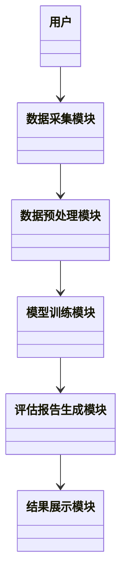

                 


# AI驱动的个人财务健康指数动态评估系统

> 关键词：个人财务健康，AI驱动，动态评估系统，机器学习，风险管理

> 摘要：本文介绍了一种基于人工智能的个人财务健康指数动态评估系统。通过分析个人的财务数据，利用机器学习算法构建评估模型，实现对个人财务健康状况的实时监测和动态评估。文章详细阐述了系统的构建过程，包括数据采集、模型训练、系统架构设计以及实际应用案例，并提出了优化建议和注意事项。

---

## 第一部分: 背景与现状

### 第1章: 个人财务健康评估的重要性

#### 1.1 个人财务健康的概念
- 财务健康指数的定义与意义
- 财务健康评估的核心维度（收入、支出、资产、负债等）

#### 1.2 当前财务评估方法的局限性
- 传统财务评估方法的不足
- 数据采集与处理的挑战
- 评估结果的静态性和滞后性

#### 1.3 AI技术在财务健康评估中的应用前景
- AI技术的基本概念与优势
- AI在金融领域的应用现状
- AI驱动财务健康评估的创新点

---

## 第二部分: 财务健康指数动态评估的核心概念

### 第2章: 财务健康指数的定义与构成

#### 2.1 财务健康指数的多维度构成
- 收入与支出分析
- 资产与负债分析
- 投资与风险管理

#### 2.2 财务健康指数的评估标准
- 标准化评分体系
- 不同人群的差异化评估

#### 2.3 财务健康指数的核心要素
- 数据特征的提取与处理
- 综合评分模型的设计

---

## 第三部分: AI驱动的财务健康评估模型构建

### 第3章: 数据采集与预处理

#### 3.1 数据来源
- 第三方数据接口
- 用户自填数据
- 数据清洗与去重

#### 3.2 数据特征提取
- 财务相关特征（收入、支出、资产、负债等）
- 行为特征（消费习惯、投资偏好等）
- 时间序列特征（历史数据、周期性变化等）

#### 3.3 数据标注与分类
- 健康等级划分
- 标签传播与验证

---

### 第4章: AI驱动的评估模型

#### 4.1 模型选择与训练
- 机器学习算法的选择（如随机森林、神经网络等）
- 模型训练流程（数据输入、特征提取、模型训练、结果输出）

#### 4.2 模型训练代码
```python
# 示例代码：基于机器学习的财务健康评估模型
import pandas as pd
from sklearn.ensemble import RandomForestClassifier
from sklearn.model_selection import train_test_split
from sklearn.metrics import accuracy_score

# 数据加载与预处理
data = pd.read_csv('financial_data.csv')
X = data.drop('health_index', axis=1)
y = data['health_index']

# 数据分割
X_train, X_test, y_train, y_test = train_test_split(X, y, test_size=0.2)

# 模型训练
model = RandomForestClassifier()
model.fit(X_train, y_train)

# 模型评估
y_pred = model.predict(X_test)
print(f"模型准确率：{accuracy_score(y_test, y_pred)}")
```

#### 4.3 模型评估与优化
- 模型评估指标（准确率、召回率、F1分数等）
- 模型优化策略（超参数调优、特征选择等）

---

## 第四部分: 系统架构与实现

### 第5章: 系统功能模块设计

#### 5.1 功能模块划分
- 数据采集模块
- 模型训练模块
- 评估报告生成模块

#### 5.2 功能流程设计
- 用户数据输入
- 模型计算与分析
- 结果展示与反馈

#### 5.3 系统交互设计
- 用户界面设计
- 系统交互流程图（Mermaid）

---

### 第6章: 系统架构设计

#### 6.1 系统架构图（Mermaid）


#### 6.2 系统功能类图（Mermaid）


---

## 第五部分: 项目实战与案例分析

### 第7章: 项目实战

#### 7.1 环境搭建与数据准备
- Python环境配置
- 第三方库安装（如pandas、scikit-learn）
- 数据集下载与预处理

#### 7.2 核心代码实现
```python
# 数据预处理代码
import pandas as pd
import numpy as np

data = pd.read_csv('financial_data.csv')
data = data.dropna()
data = pd.get_dummies(data)
print(data.head())
```

```python
# 模型训练代码
from sklearn.ensemble import RandomForestClassifier
from sklearn.model_selection import train_test_split
from sklearn.metrics import classification_report

X = data.drop('health_index', axis=1)
y = data['health_index']

X_train, X_test, y_train, y_test = train_test_split(X, y, test_size=0.2)
model = RandomForestClassifier()
model.fit(X_train, y_train)
y_pred = model.predict(X_test)
print(classification_report(y_test, y_pred))
```

#### 7.3 实际案例分析
- 案例背景介绍
- 数据分析与结果解读
- 模型优化与效果提升

---

## 第六部分: 最佳实践与总结

### 第8章: 系统优化与注意事项

#### 8.1 系统优化方案
- 数据处理效率提升
- 模型计算加速
- 系统资源优化配置

#### 8.2 使用注意事项
- 数据隐私与安全保护
- 模型解释性与可解释性
- 系统稳定性与容错性

#### 8.3 扩展阅读与学习资源
- 相关技术文档与书籍推荐
- 开源项目与社区资源

---

## 作者信息

作者：AI天才研究院/AI Genius Institute & 禅与计算机程序设计艺术/Zen And The Art of Computer Programming

---

**Note:** 由于篇幅限制，以上目录和内容仅为概要。实际撰写时，每部分内容需要详细展开，确保逻辑清晰、技术深度足够，同时保持语言的专业性和可读性。

