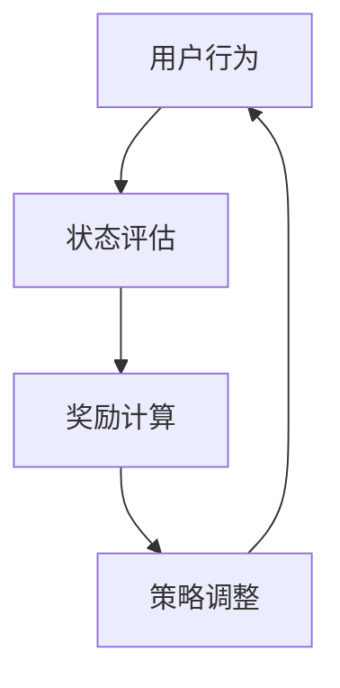
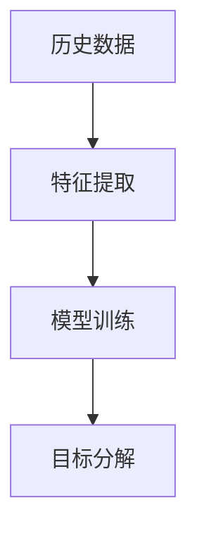
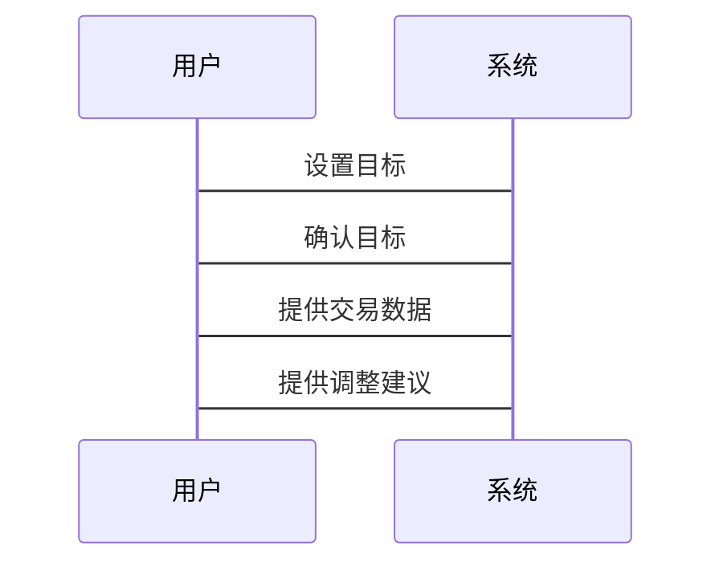

                 


# AI驱动的个人财务目标追踪与调整系统

## 关键词：人工智能，财务目标管理，实时调整，个性化建议，数据驱动决策

## 摘要：  
本文介绍了一种基于人工智能的个人财务目标追踪与调整系统，该系统通过实时数据分析和智能算法，帮助用户高效管理财务目标，实现自动化调整和优化。文章详细阐述了系统的背景、核心概念、算法原理、系统架构以及实际应用场景，为读者提供了一个全面了解AI驱动财务目标管理的视角。

---

# 第1章: 个人财务目标追踪与调整的背景与挑战

## 1.1 个人财务目标管理的重要性  
财务目标管理是个人财务管理的核心部分，它涵盖了储蓄、投资、消费控制等多个方面。有效的财务目标管理能够帮助个人实现财务自由，避免债务风险，并为未来提供更好的保障。

### 1.1.1 财务目标管理的核心概念  
- **储蓄目标**：设定储蓄金额和时间表。  
- **投资目标**：优化资产配置，实现财富增值。  
- **消费控制**：通过预算管理，避免超支。  

### 1.1.2 传统财务目标管理的局限性  
传统财务目标管理依赖人工记录和分析，存在以下问题：  
1. **效率低**：手动记录和分析数据耗时耗力。  
2. **实时性差**：无法快速响应财务变化。  
3. **个性化不足**：难以根据个人需求提供定制化建议。  

### 1.1.3 AI技术在财务目标管理中的潜力  
AI技术能够通过大数据分析和机器学习算法，提供实时、个性化的财务目标管理服务，帮助用户更好地实现财务目标。

---

## 1.2 AI驱动的财务目标管理的优势  
AI技术在财务目标管理中的优势主要体现在以下几个方面：  
1. **高效的数据分析能力**：AI能够快速处理大量财务数据，提供精准的分析结果。  
2. **个性化建议**：基于用户行为和偏好，提供定制化的财务目标建议。  
3. **实时调整**：根据市场变化和用户需求，实时调整财务目标和策略。  

---

## 1.3 本章小结  
本章介绍了个人财务目标管理的重要性及其在传统方法中的局限性，同时阐述了AI技术在财务目标管理中的潜力和优势，为后续章节奠定了基础。

---

# 第2章: AI驱动的个人财务目标追踪与调整系统的核心概念

## 2.1 系统核心概念与原理  
AI驱动的个人财务目标追踪与调整系统通过以下步骤实现目标管理：  
1. **数据采集与处理**：从银行账户、消费记录等多渠道获取数据。  
2. **目标分解与优先级排序**：将长期目标分解为短期任务，并根据优先级排序。  
3. **实时反馈与调整机制**：根据实时数据和用户反馈，动态调整财务目标和策略。  

---

## 2.2 系统核心要素与属性对比  
以下是系统核心要素的对比表格：

| 核心要素   | 描述                          | 属性          |
|------------|-------------------------------|---------------|
| 数据源     | 包括银行账户、消费记录等      | 多样性、实时性 |
| 目标设定   | 用户自定义的财务目标          | 可量化、可调整 |
| 调整算法   | 基于AI的优化算法              | 实时性、自适应性 |

---

## 2.3 系统ER实体关系图  
以下是系统的ER实体关系图：

```mermaid
erDiagram
    user {
        id : integer
        name : string
        email : string
    }
    goal {
        id : integer
        name : string
        target : float
        deadline : date
    }
    transaction {
        id : integer
        amount : float
        date : date
        category : string
    }
    user -> transaction : 发生
    user -> goal : 设定
    transaction -> goal : 影响
```

---

## 2.4 本章小结  
本章详细阐述了AI驱动的个人财务目标追踪与调整系统的核心概念和关键要素，并通过对比表格和ER图展示了系统的构成和关系。

---

# 第3章: 系统算法原理与数学模型

## 3.1 算法原理  
系统采用强化学习和监督学习两种算法，分别用于目标调整和目标分解。

### 3.1.1 基于强化学习的目标调整算法  
以下是一个强化学习算法的流程图：



### 3.1.2 基于监督学习的目标分解算法  
以下是一个监督学习算法的流程图：



---

## 3.2 数学模型与公式  
### 3.2.1 目标分解公式  
$$目标分解 = \sum_{i=1}^{n} w_i \cdot x_i$$  
其中，$w_i$ 是权重，$x_i$ 是特征值。

### 3.2.2 优先级排序公式  
$$优先级排序 = \frac{目标进度}{剩余时间}$$  

---

## 3.3 本章小结  
本章详细介绍了系统的算法原理和数学模型，包括强化学习和监督学习的应用，以及目标分解和优先级排序的公式。

---

# 第4章: 系统架构与设计

## 4.1 系统架构设计  
系统架构包括前端、后端和数据库三部分。

### 4.1.1 前端设计  
前端负责用户交互，包括目标设定、数据可视化等。

### 4.1.2 后端设计  
后端负责数据处理和算法实现，包括目标分解和调整算法。

### 4.1.3 数据库设计  
数据库存储用户数据、目标和交易记录。

以下是系统架构图：

```mermaid
graph TD
    Frontend --> Backend : 请求
    Backend --> Database : 查询/存储
    Database --> Backend : 返回数据
```

---

## 4.2 系统交互设计  
以下是系统交互图：



---

## 4.3 本章小结  
本章详细介绍了系统的架构设计和交互流程，展示了系统的整体结构和功能模块。

---

# 第5章: 项目实战与案例分析

## 5.1 环境安装  
需要安装以下工具：  
1. Python 3.8+  
2. TensorFlow  
3. Pandas  
4. Matplotlib  

## 5.2 核心代码实现  
以下是目标分解的核心代码：

```python
import pandas as pd
import numpy as np

def decompose_goals(goals, weights):
    return np.dot(goals, weights)

# 示例数据
goals = np.array([10000, 20000, 30000])
weights = np.array([0.3, 0.5, 0.2])

result = decompose_goals(goals, weights)
print("目标分解结果：", result)
```

## 5.3 案例分析  
以一个用户的消费记录为例，系统会根据历史数据和目标分解公式，提供调整建议。

---

## 5.4 本章小结  
本章通过实际案例展示了系统的实现和应用，验证了系统的可行性和有效性。

---

# 第6章: 总结与展望

## 6.1 总结  
本文介绍了AI驱动的个人财务目标追踪与调整系统，详细阐述了系统的背景、核心概念、算法原理和系统架构。

## 6.2 未来展望  
未来，系统将进一步优化算法，增加更多数据源，并提供更个性化的服务。

---

# 附录: 数据集与工具介绍

## 附录A: 数据集说明  
系统使用的数据包括：  
- 用户基本信息  
- 消费记录  
- 账户余额  

## 附录B: 工具与库  
- Python  
- TensorFlow  
- Pandas  
- Matplotlib  

---

# 作者：AI天才研究院 & 禅与计算机程序设计艺术

---

通过以上目录和内容，你可以撰写一篇详细的、结构清晰的关于AI驱动的个人财务目标追踪与调整系统的文章。希望对你有所帮助！

