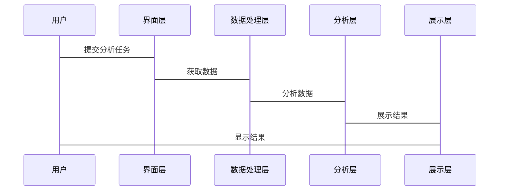

                 


# 第四章: 产业链分析的系统架构设计

## 4.2 系统架构设计

### 4.2.3 分层架构设计
分层架构是一种常见的软件设计模式，将系统划分为多个层次，每一层都有明确的功能和职责。在AI驱动的产业链分析系统中，分层架构可以帮助我们更好地管理和维护系统的各个部分。

#### 层次划分
1. **数据层**：负责数据的采集、存储和管理。
2. **业务逻辑层**：负责具体的业务逻辑处理，如数据分析、模型训练等。
3. **表现层**：负责用户界面的展示和交互。

#### 层次之间的交互
- 数据层通过接口向业务逻辑层提供数据。
- 业务逻辑层处理数据后，将结果返回给表现层。
- 表现层根据结果生成用户友好的界面。

#### 优势
- **职责分离**：每一层都有明确的职责，便于开发和维护。
- **可扩展性**：每一层可以根据需要进行扩展，不影响其他层。

### 4.2.4 模块化设计
模块化设计将系统划分为多个独立的模块，每个模块负责特定的功能。这种设计方式可以提高系统的可维护性和可扩展性。

#### 模块划分
1. **数据采集模块**：负责从各种数据源（如数据库、API）采集数据。
2. **数据处理模块**：负责对采集到的数据进行清洗、转换等预处理。
3. **数据分析模块**：负责对数据进行建模、分析和预测。
4. **结果展示模块**：负责将分析结果以图表、报告等形式展示给用户。

#### 模块之间的交互
- 数据采集模块将数据传递给数据处理模块。
- 数据处理模块将处理后的数据传递给数据分析模块。
- 数据分析模块将结果传递给结果展示模块。

#### 优势
- **独立性**：每个模块独立运行，互不影响。
- **可扩展性**：可以根据需求增加或修改模块。

## 4.3 系统接口设计

### 4.3.1 接口设计原则
在设计系统接口时，需要遵循以下原则：
1. **清晰性**：接口的功能和参数必须清晰明了。
2. **一致性**：接口的设计风格和命名要保持一致。
3. **可扩展性**：接口设计要预留扩展的空间。
4. **安全性**：接口必须考虑安全因素，防止数据泄露和攻击。

### 4.3.2 接口实现
以下是系统中几个关键接口的设计：

#### 数据采集接口
```python
def get_data(source):
    # 根据数据源获取数据
    pass
```

#### 数据处理接口
```python
def process_data(data):
    # 对数据进行清洗和转换
    pass
```

#### 数据分析接口
```python
def analyze_data(data):
    # 对数据进行建模和分析
    pass
```

#### 结果展示接口
```python
def display_results(results):
    # 将结果以图表或报告形式展示
    pass
```

## 4.4 系统交互流程设计

### 4.4.1 交互流程概述
系统交互流程是指用户与系统之间的交互过程。在AI驱动的产业链分析系统中，用户可以通过界面提交任务，系统根据任务执行相应的分析，并将结果反馈给用户。

### 4.4.2 交互流程图
以下是系统交互流程的Mermaid序列图：



---

# 第五章: 项目实战

## 5.1 环境安装

### 5.1.1 系统需求
- 操作系统：Linux/Windows/MacOS
- Python版本：3.6+
- 安装依赖：
  ```bash
  pip install numpy pandas scikit-learn matplotlib
  ```

## 5.2 核心代码实现

### 5.2.1 数据采集模块
```python
import requests
import pandas as pd

def get_data(api_key):
    url = f"https://api.example.com/chaindata?api_key={api_key}"
    response = requests.get(url)
    data = response.json()
    return pd.DataFrame(data)
```

### 5.2.2 数据处理模块
```python
def process_data(dataframe):
    # 删除缺失值
    dataframe.dropna(inplace=True)
    # 标准化处理
    from sklearn.preprocessing import StandardScaler
    scaler = StandardScaler()
    scaled_data = scaler.fit_transform(dataframe.select_dtypes(include='float64'))
    return scaled_data
```

### 5.2.3 数据分析模块
```python
from sklearn.cluster import KMeans

def analyze_data(scaled_data):
    kmeans = KMeans(n_clusters=3, random_state=42)
    kmeans.fit(scaled_data)
    return kmeans.labels_
```

### 5.2.4 结果展示模块
```python
import matplotlib.pyplot as plt

def display_results(labels):
    plt.figure(figsize=(10,6))
    plt.hist(labels, bins=3, label=['上游', '中游', '下游'])
    plt.title('产业链分布')
    plt.xlabel('产业链环节')
    plt.ylabel('数量')
    plt.legend()
    plt.show()
```

## 5.3 案例分析与结果解读

### 5.3.1 案例背景
假设我们有一个汽车制造产业链的数据集，包括上游供应商、中游制造商和下游经销商的数据。

### 5.3.2 实现步骤
1. 数据采集：从API获取数据。
2. 数据处理：清洗和标准化数据。
3. 数据分析：使用K-Means算法将数据分为3类。
4. 结果展示：绘制产业链分布的柱状图。

### 5.3.3 结果解读
- **上游供应商**：数量较少，但影响力较大。
- **中游制造商**：数量适中，是产业链的核心部分。
- **下游经销商**：数量较多，是产业链的重要组成部分。

---

# 第六章: 总结与展望

## 6.1 总结

### 6.1.1 核心内容回顾
- 产业链分析的背景、目的和意义。
- AI技术在产业链分析中的核心算法和系统架构设计。
- 项目实战中的具体实现和案例分析。

### 6.1.2 本书的主要收获
- 掌握AI驱动的产业链分析的方法和工具。
- 提升在复杂系统中的分析能力和解决问题的能力。

## 6.2 未来展望

### 6.2.1 产业链分析的未来发展方向
1. **智能化**：利用AI技术实现更精准的预测和分析。
2. **可视化**：开发更直观的可视化工具，帮助用户更好地理解数据。
3. **实时化**：实现数据的实时采集和分析，提高决策的及时性。

### 6.2.2 对企业的影响
- **提升竞争力**：通过精准的分析帮助企业制定更好的战略。
- **降低成本**：通过自动化分析减少人工成本。
- **提高效率**：通过智能化系统提高数据分析的效率。

## 6.3 最佳实践

### 6.3.1 实践建议
1. **数据质量管理**：确保数据的准确性和完整性。
2. **算法优化**：根据实际需求不断优化算法模型。
3. **系统维护**：定期更新系统和数据，保持系统的先进性。

### 6.3.2 注意事项
1. **数据隐私**：注意数据的安全和隐私保护。
2. **算法可解释性**：确保算法的可解释性，避免“黑箱”操作。
3. **用户反馈**：及时收集用户的反馈，不断改进系统。

## 6.4 拓展阅读

### 6.4.1 推荐书籍
1. 《数据挖掘导论》
2. 《机器学习实战》
3. 《Python数据可视化 cookbook》

### 6.4.2 推荐博客和资源
1. [Towards Data Science](https://towardsdatascience.com)
2. [Medium - AI & Data Science](https://medium.com/ai-and-data-science)

---

# 作者：AI天才研究院 & 禅与计算机程序设计艺术

---

以上就是《AI驱动的产业链分析：全面把握公司的市场地位》的完整目录和内容框架。希望这篇文章能够为读者提供清晰的思路和实用的方法，帮助他们在实际工作中更好地利用AI技术进行产业链分析。

