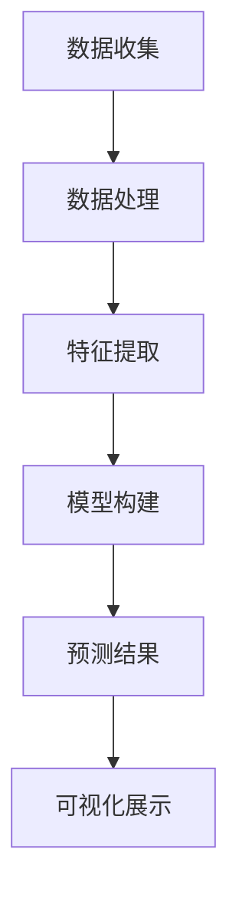

                 


# AI驱动的产品创新周期分析：预测公司未来增长点

## 关键词
AI，产品创新周期，预测模型，时间序列分析，机器学习，公司增长点

## 摘要
本文探讨了AI在产品创新周期分析中的应用，通过详细分析产品生命周期理论、AI算法和系统架构，构建了一个预测公司未来增长点的模型。文章从数据分析到模型实现，再到实际案例，全面展示了AI如何助力企业预测和优化产品创新周期。

---

## 第一部分: AI驱动的产品创新周期概述

### 第1章: AI与产品创新周期的基本概念

#### 1.1 什么是产品创新周期
- **定义**: 产品创新周期指产品从概念提出、研发、市场推广到退市的全过程。
- **核心要素**:
  - 时间跨度
  - 增长阶段
  - 用户反馈
- **分类**:
  - 创新型产品
  - 改进型产品
  - 维持型产品

#### 1.2 AI在产品创新周期中的作用
- **AI基本概念**: 利用机器学习、自然语言处理等技术，通过数据驱动的方式分析和预测。
- **驱动产品创新**: AI帮助识别潜在需求、优化设计和预测市场趋势。
- **预测增长点**: 通过历史数据分析和模型训练，AI能准确预测产品在不同阶段的市场表现。

### 第2章: 产品创新周期的分析框架

#### 2.1 产品生命周期理论
- **四个阶段**:
  1. 引入期：产品进入市场的初期，增长缓慢。
  2. 增长期：市场需求上升，销售额快速增长。
  3. 成熟期：市场趋于饱和，增长放缓。
  4. 衰退期：市场需求下降，产品逐渐退出市场。

#### 2.2 数据分析方法
- **市场趋势分析**: 通过分析市场数据，识别行业趋势和潜在机会。
- **竞争对手分析**: 监测竞争对手的动态，调整自身策略。

#### 2.3 AI驱动的预测模型
- **数据处理**: 清洗和标准化数据，提取关键特征。
- **模型构建**: 使用时间序列模型（如ARIMA）和机器学习模型（如LSTM）进行预测。
- **优化**: 通过回测和调整参数，提升模型准确性。

---

## 第二部分: AI驱动的产品创新周期分析方法

### 第3章: 数据分析与特征提取

#### 3.1 数据来源与预处理
- **数据来源**: 包括市场调研数据、销售数据、用户反馈等。
- **数据清洗**: 去除无效数据，处理缺失值和异常值。
- **特征提取**: 从数据中提取有意义的特征，如销量增长率、市场占有率等。

#### 3.2 时间序列分析
- **基本概念**: 时间序列是一种按时间顺序排列的数据集。
- **常见方法**:
  - 移动平均法
  - 指数平滑法
  - 自回归模型

### 第4章: AI算法与模型构建

#### 4.1 机器学习算法简介
- **监督学习**: 用于分类和回归问题。
- **非监督学习**: 用于聚类分析。
- **强化学习**: 用于策略优化。

#### 4.2 时间序列预测模型
- **ARIMA模型**:
  - 由自回归（AR）、积分（I）和移动平均（MA）三部分组成。
  - 公式：ARIMA(p, d, q)
  - 代码示例：
    ```python
    from statsmodels.tsa.arima.model import ARIMA
    model = ARIMA(train_data, order=(p, d, q))
    model_fit = model.fit()
    ```

- **LSTM模型**:
  - 适用于长序列数据，捕捉时间依赖性。
  - 结构包括输入门、遗忘门和输出门。
  - 代码示例：
    ```python
    from tensorflow.keras.layers import LSTM, Dense
    model = Sequential()
    model.add(LSTM(50, input_shape=(timesteps, features)))
    model.add(Dense(1))
    model.compile(loss='mean_squared_error', optimizer='adam')
    ```

---

## 第三部分: AI驱动的创新周期预测模型实现

### 第5章: 系统架构与实现

#### 5.1 系统架构设计
- **模块划分**:
  - 数据收集模块：负责数据的获取和初步处理。
  - 数据处理模块：清洗和特征提取。
  - 模型构建模块：训练和优化预测模型。
  - 可视化模块：展示预测结果和分析报告。

#### 5.2 系统架构图


### 第6章: 项目实战与案例分析

#### 6.1 项目实战
- **数据来源**: 假设我们分析某科技公司的产品销售数据。
- **数据预处理**: 使用pandas库清洗数据。
  ```python
  import pandas as pd
  df = pd.read_csv('sales_data.csv')
  df.dropna(inplace=True)
  ```

- **模型训练**: 使用LSTM进行时间序列预测。
  ```python
  from tensorflow.keras.models import Sequential
  model = Sequential()
  model.add(LSTM(50, input_shape=(timesteps, features)))
  model.add(Dense(1))
  model.fit(X_train, y_train, epochs=50, batch_size=32)
  ```

- **结果分析**: 对比预测值与实际值，评估模型准确性。

#### 6.2 案例分析
- **实际案例**: 某公司的产品A在预测周期内的销售额预测。
- **结果展示**: 通过图表展示预测值与实际值的对比，验证模型的有效性。

---

## 第四部分: 高级分析与实际应用

### 第7章: 复杂场景下的模型优化

#### 7.1 模型优化
- **数据质量**: 提高数据准确性，减少噪声。
- **特征工程**: 构建更有效的特征，如引入用户行为数据。
- **模型调优**: 调整超参数，使用网格搜索优化。

### 第8章: 行业案例与最佳实践

#### 8.1 行业案例
- **案例1**: 智能手机行业的产品周期预测。
- **案例2**: 医药行业的药品研发周期预测。

#### 8.2 最佳实践
- **持续监测**: 定期更新模型，适应市场变化。
- **多模型结合**: 组合不同模型，提高预测准确性。

---

## 第五部分: 总结与展望

### 第9章: 总结与展望

#### 9.1 总结
- AI在产品创新周期分析中的应用前景广阔，能够显著提升预测的准确性和效率。
- 通过数据分析和模型构建，企业可以更好地规划产品策略，抓住增长机会。

#### 9.2 展望
- 随着AI技术的进步，未来预测模型将更加精准，应用场景也将更加广泛。
- 结合物联网和大数据，AI将进一步推动企业创新和增长。

---

## 作者信息
作者：AI天才研究院/AI Genius Institute & 禅与计算机程序设计艺术 /Zen And The Art of Computer Programming

---

通过以上结构和内容，文章详细探讨了AI在产品创新周期分析中的应用，从理论到实践，层层深入，为企业预测未来增长点提供了系统的解决方案。

