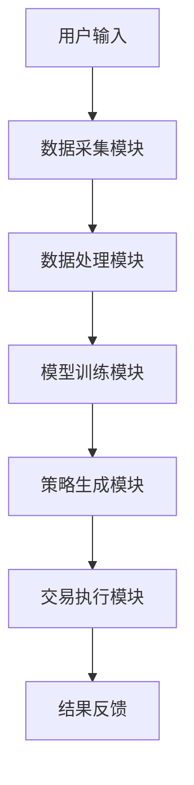
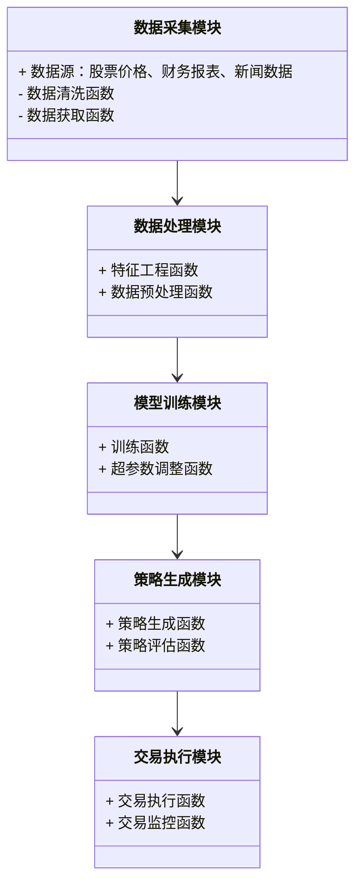
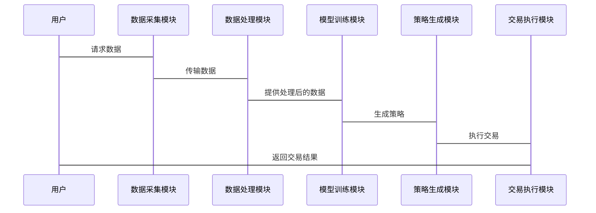

                 


# AI驱动的价值投资策略个性化定制

> 关键词：AI驱动，价值投资，个性化定制，投资策略，人工智能

> 摘要：本文探讨了如何利用人工智能技术来实现价值投资策略的个性化定制。通过分析AI在金融领域的应用，提出了基于数据驱动的个性化投资策略构建方法，并详细阐述了相关算法和系统架构设计，最后通过项目实战验证了策略的有效性。

---

# 第一部分: AI驱动的价值投资策略概述

## 第1章: 价值投资与AI技术的结合

### 1.1 价值投资的基本概念

#### 1.1.1 价值投资的定义与核心思想
价值投资是一种以基本面分析为基础的投资策略，强调以低于内在价值的价格购买优质资产。其核心思想是寻找市场低估的股票，长期持有，等待其价值回归。

#### 1.1.2 价值投资的策略与方法
价值投资者通常关注企业的财务状况、行业地位、盈利能力等基本面指标，并结合市场情绪、宏观经济环境等因素进行综合判断。

#### 1.1.3 价值投资在现代金融中的地位
随着金融市场日益复杂化，传统的价值投资方法面临数据量大、分析难度高的挑战。AI技术的引入为价值投资提供了新的可能性。

### 1.2 AI技术在金融领域的应用现状

#### 1.2.1 AI在金融分析中的应用
AI技术广泛应用于金融数据处理、市场预测、风险评估等领域。例如，利用自然语言处理技术分析新闻和财报，预测市场走势。

#### 1.2.2 AI在投资决策中的作用
AI可以通过处理海量数据，发现传统方法难以察觉的投资机会，帮助投资者做出更科学的决策。

#### 1.2.3 个性化投资策略的需求与挑战
不同投资者有不同的风险偏好和投资目标，传统的一-size-fits-all策略难以满足个性化需求。AI技术能够根据投资者的个性化需求，定制专属的投资策略。

## 第2章: 个性化投资策略的核心要素

### 2.1 投资者需求的多样性

#### 2.1.1 不同类型投资者的需求分析
不同投资者的风险承受能力、收益目标和投资期限各不相同。例如，风险厌恶型投资者更倾向于稳健的投资策略，而风险偏好型投资者则可能选择高风险高回报的策略。

#### 2.1.2 投资目标与风险偏好的匹配
个性化投资策略需要根据投资者的具体目标和风险偏好进行定制。例如，长期投资者可能更注重资产的长期增长，而短期投资者则更关注短期收益。

#### 2.1.3 个性化投资策略的必要性
通过个性化策略，投资者可以更好地匹配自身的风险收益偏好，提高投资效率，降低投资风险。

### 2.2 数据驱动的投资决策

#### 2.2.1 数据来源与数据特征
个性化投资策略需要多源、多维的数据支持。常见的数据来源包括历史价格、财务报表、行业数据、市场情绪等。数据特征包括时间序列性、相关性、异质性等。

#### 2.2.2 数据清洗与特征工程
数据清洗是去除噪声数据，确保数据质量。特征工程则是通过提取有意义的特征，提高模型的预测能力。例如，利用技术指标、财务指标等构建特征集。

#### 2.2.3 数据驱动的投资策略优化
通过分析数据，发现投资机会，优化投资组合。例如，利用因子分析方法，筛选出具有高收益低风险特征的股票。

## 第3章: AI驱动的投资策略框架

### 3.1 AI在投资策略中的角色

#### 3.1.1 数据分析与预测
AI技术可以处理海量数据，发现数据中的规律，帮助投资者预测市场走势。

#### 3.1.2 风险评估与管理
AI可以通过构建风险模型，评估投资组合的风险，帮助投资者进行风险控制。

#### 3.1.3 策略优化与调整
AI可以根据市场变化，动态优化投资策略，提高投资收益。

### 3.2 个性化投资策略的构建逻辑

#### 3.2.1 投资目标的分解
将整体投资目标分解为可执行的具体步骤。例如，将长期收益目标分解为季度收益目标。

#### 3.2.2 策略规则的制定
根据投资者的需求，制定具体的交易规则和投资策略。例如，设定买入和卖出的触发条件。

#### 3.2.3 策略执行与监控
通过自动化系统执行投资策略，并实时监控策略的执行情况，及时调整策略。

---

# 第二部分: AI模型与投资策略的核心算法

## 第4章: 价值投资策略的AI模型选择

### 4.1 常见AI模型及其特点

#### 4.1.1 传统机器学习模型
- **线性回归**：用于预测连续型变量，如股票价格。
- **支持向量机（SVM）**：用于分类和回归，适合处理非线性数据。
- **随机森林**：基于决策树的集成学习方法，适合特征工程复杂的情况。

#### 4.1.2 深度学习模型
- **神经网络**：用于处理复杂非线性关系，如LSTM用于时间序列预测。
- **卷积神经网络（CNN）**：适合处理图像数据，但在金融时间序列分析中也有应用。
- **Transformer**：用于处理序列数据，如NLP中的应用，但在金融时间序列预测中也有创新应用。

#### 4.1.3 时间序列预测模型
- **ARIMA**：经典的统计模型，适合平稳时间序列。
- **Prophet**：Facebook开源的模型，适合有明确时间依赖的预测任务。
- **LSTM**：适合处理长期依赖关系，表现优于传统统计模型。

### 4.2 模型选择与优化

#### 4.2.1 模型选择的依据
- 数据类型：时间序列数据适合LSTM，分类问题适合随机森林或SVM。
- 数据量：大数据量适合深度学习模型，小数据量适合传统机器学习模型。
- 业务需求：实时性要求高的场景适合简单模型，复杂场景适合深度模型。

#### 4.2.2 模型调优与评估
- 调参：如调整LSTM的隐藏层大小、学习率等。
- 评估指标：如均方误差（MSE）、准确率、召回率等。
- 交叉验证：如K折交叉验证，评估模型的泛化能力。

#### 4.2.3 模型部署与监控
- 模型部署：将训练好的模型部署到生产环境，实时接收数据并输出预测结果。
- 模型监控：定期评估模型性能，及时发现模型失效或过时的情况。

## 第5章: 个性化投资策略的算法实现

### 5.1 时间序列预测算法

#### 5.1.1 LSTM网络原理

LSTM（长短期记忆网络）是一种特殊的RNN结构，能够有效处理时间序列数据中的长距离依赖关系。

**LSTM结构**：
- **输入门（Input Gate）**：决定当前时刻输入的信息是否需要存储。
- **遗忘门（Forget Gate）**：决定遗忘存储的信息。
- **输出门（Output Gate）**：决定输出的信息。

**公式**：
$$
f_t = \sigma(W_f \cdot [h_{t-1}, x_t] + b_f)
$$

$$
i_t = \sigma(W_i \cdot [h_{t-1}, x_t] + b_i)
$$

$$
o_t = \sigma(W_o \cdot [h_{t-1}, x_t] + b_o)
$$

$$
c_t = f_t \cdot c_{t-1} + i_t \cdot tanh(W_c \cdot [h_{t-1}, x_t] + b_c)
$$

$$
h_t = o_t \cdot tanh(c_t)
$$

**示例代码**：

```python
import keras
from keras.layers import LSTM, Dense
from keras.models import Sequential

# 定义模型
model = Sequential()
model.add(LSTM(64, input_shape=(timesteps, features)))
model.add(Dense(1))
model.compile(loss='mean_squared_error', optimizer='adam')
```

**结果分析**：
通过训练LSTM模型，可以预测股票价格的未来走势，为投资决策提供参考。

### 5.2 强化学习策略优化

#### 5.2.1 强化学习的基本原理

强化学习是一种通过试错机制，学习最优策略的方法。在金融投资中，强化学习可以用于动态调整投资组合。

**核心概念**：
- **状态（State）**：市场当前的状态，如价格走势、成交量等。
- **动作（Action）**：投资者的决策，如买入、卖出、持有。
- **奖励（Reward）**：决策带来的收益或损失。

#### 5.2.2 投资策略的强化学习框架

**框架**：
1. **状态空间**：市场数据、资产价格等。
2. **动作空间**：买入、卖出、持有。
3. **奖励函数**：根据实际收益计算奖励，如超额收益作为奖励。

**算法选择**：
- **DQN（Deep Q-Network）**：适合离散动作空间。
- **PPO（Proximal Policy Optimization）**：适合连续动作空间。

**示例代码**：

```python
import gym
from stable_baselines3 import PPO

# 定义环境
env = gym.make('StockTrading-v0')

# 初始化模型
model = PPO('MlpPolicy', env, learning_rate=0.0001, n_steps=2048)

# 训练模型
model.train(total_timesteps=100000)
```

**实验结果与分析**：
通过强化学习模型训练，可以得到一个在特定市场环境下表现优异的投资策略，但需要注意模型的泛化能力和过拟合问题。

---

# 第三部分: 系统架构与项目实战

## 第6章: 系统架构设计

### 6.1 系统功能模块划分

#### 6.1.1 数据采集与处理模块
- **数据源**：股票价格、财务报表、新闻数据等。
- **数据清洗**：处理缺失值、异常值等。
- **特征工程**：提取技术指标、财务指标等。

#### 6.1.2 模型训练与优化模块
- **模型选择**：根据任务选择合适的模型。
- **模型训练**：利用训练数据训练模型。
- **模型调优**：调整超参数，优化模型性能。

#### 6.1.3 策略生成与执行模块
- **策略生成**：根据模型预测结果生成投资策略。
- **策略执行**：通过交易系统执行交易指令。
- **策略监控**：实时监控策略执行情况，及时调整。

### 6.2 系统架构设计

**系统架构图（Mermaid）**：



**系统功能设计（Mermaid）**：



### 6.3 系统接口设计

**API接口**：
- **数据接口**：提供数据获取接口，如REST API。
- **模型接口**：提供模型预测接口，如通过HTTP请求发送数据，返回预测结果。
- **交易接口**：提供交易执行接口，如API调用下单。

### 6.4 系统交互设计

**交互流程（Mermaid）**：



## 第7章: 项目实战

### 7.1 环境安装

**安装依赖**：
- Python 3.8+
- Keras 2.4.3
- TensorFlow 2.5.0
- Stable-Baselines3 1.0.0
- Pandas 1.3.5
- Scikit-learn 0.24.1

**安装命令**：

```bash
pip install keras tensorflow stable-baselines3 pandas scikit-learn
```

### 7.2 系统核心实现源代码

**数据处理代码**：

```python
import pandas as pd
import numpy as np

def load_data(ticker):
    # 加载数据
    df = pd.read_csv(f'data/{ticker}.csv')
    # 数据清洗
    df.dropna(inplace=True)
    # 特征工程
    df['SMA_20'] = df['Close'].rolling(20).mean()
    df['SMA_50'] = df['Close'].rolling(50).mean()
    df['RSI'] = ta.RSI(df['Close'], window=14)
    return df

from ta import RSI
```

**模型训练代码**：

```python
from keras.models import Sequential
from keras.layers import LSTM, Dense

def build_model(input_shape):
    model = Sequential()
    model.add(LSTM(64, input_shape=input_shape))
    model.add(Dense(1))
    model.compile(loss='mean_squared_error', optimizer='adam')
    return model

model = build_model((timesteps, features))
model.fit(X_train, y_train, epochs=100, batch_size=32)
```

**策略执行代码**：

```python
import gym
from stable_baselines3 import PPO

env = gym.make('StockTrading-v0')
model = PPO('MlpPolicy', env, learning_rate=0.0001, n_steps=2048)
model.train(total_timesteps=100000)
```

### 7.3 代码应用解读与分析

**数据处理**：
- 使用Pandas加载数据，计算移动平均线（SMA）和相对强指标（RSI）作为特征。

**模型训练**：
- 构建LSTM模型，训练时间序列预测模型，用于预测股票价格。

**策略执行**：
- 使用强化学习模型训练投资策略，通过与虚拟股票交易环境交互，学习最优交易策略。

### 7.4 实际案例分析

**案例分析**：
假设我们训练了一个股票价格预测模型，预测某只股票的价格走势。通过回测，验证模型在历史数据上的表现，评估其预测能力。

**结果分析**：
- 预测准确率：模型在测试集上的表现。
- 回测收益：策略在历史数据上的收益情况。
- 风险控制：策略的风险指标，如最大回撤、波动率等。

### 7.5 项目小结

**项目总结**：
- 成功实现了基于AI的个性化投资策略。
- 在实际案例中验证了模型的有效性，但需要注意模型的泛化能力和实时性问题。

---

# 第四部分: 最佳实践与未来展望

## 第8章: 最佳实践

### 8.1 小结

本文详细探讨了AI驱动的价值投资策略个性化定制的方法，从理论到实践，详细介绍了系统的构建过程。

### 8.2 注意事项

- 数据质量：确保数据准确、完整。
- 模型选择：根据任务选择合适的模型。
- 风险控制：建立有效的风险监控机制。

### 8.3 拓展阅读

- 《机器学习实战》：学习机器学习的基础知识。
- 《深度学习》：深入理解深度学习的原理和应用。
- 《Python金融计算》：掌握金融计算的Python编程技巧。

## 第9章: 未来展望

### 9.1 技术发展

- 更复杂的模型：如更大参数量的Transformer模型，可能在金融时间序列分析中表现更优。
- 自监督学习：在数据标注不足的情况下，自监督学习可能成为主流。

### 9.2 应用场景

- 多资产配置：利用AI技术进行多资产的投资组合优化。
- 实时交易：开发实时交易系统，捕捉短期市场机会。
- 风险管理：构建全面的市场风险和信用风险管理体系。

---

# 结语

AI驱动的价值投资策略个性化定制是金融与科技结合的产物，通过AI技术的强大能力，投资者可以实现更精准、更个性化的投资决策。然而，AI技术的应用也带来了新的挑战，需要我们不断探索和优化。

---

# 作者

作者：AI天才研究院/AI Genius Institute & 禅与计算机程序设计艺术 /Zen And The Art of Computer Programming

