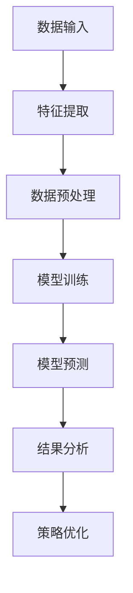
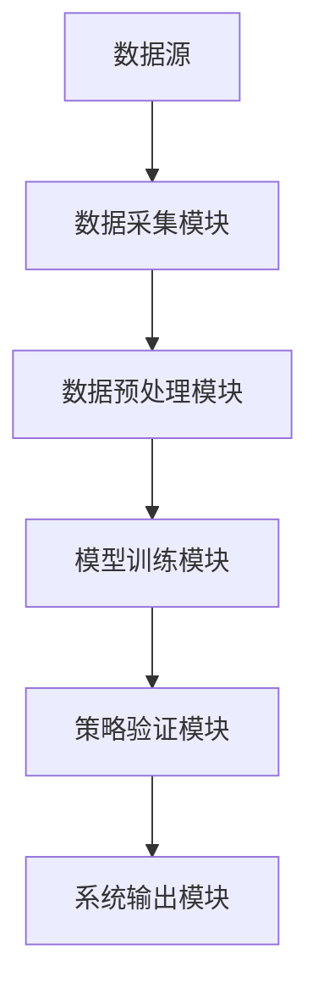
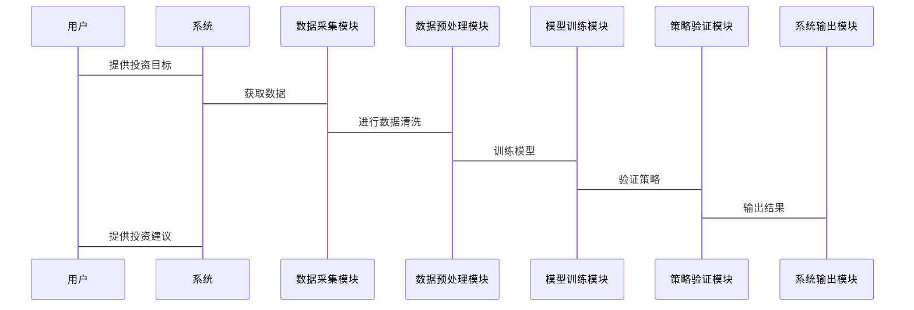

                 


# AI驱动的价值投资策略交叉验证

> 关键词：AI, 价值投资, 交叉验证, 机器学习, 金融分析, 算法原理, 系统设计

> 摘要：本文探讨了AI技术在价值投资策略中的应用，重点分析了如何通过交叉验证提升策略的准确性和稳定性。文章从AI驱动的策略核心概念、算法原理、系统设计、实战案例等多方面展开，详细阐述了AI在价值投资中的潜力和实现路径。通过结合数学模型、mermaid流程图和Python代码示例，本文为读者提供了一套完整的AI驱动的价值投资策略交叉验证解决方案。

---

# 正文

## 第1章: 背景介绍与核心概念

### 1.1 价值投资与AI的结合

#### 1.1.1 价值投资的基本概念

价值投资是一种以基本面分析为基础的投资策略，旨在通过分析企业的财务状况、行业地位、竞争优势等因素，找到被市场低估的投资标的。其核心理念是购买具有长期竞争优势的企业，并以合理的价格买入，等待其价值回归。

#### 1.1.2 AI技术在金融领域的应用

人工智能（AI）技术在金融领域的应用日益广泛，包括股票预测、风险评估、量化交易、客户画像等多个方面。AI技术通过处理海量数据，发现传统方法难以捕捉的模式和规律，为投资决策提供了新的可能性。

#### 1.1.3 价值投资与AI结合的必要性

传统价值投资依赖分析师的主观判断，存在效率低、覆盖面窄、数据处理能力有限等问题。而AI技术能够快速处理大量数据，发现潜在的投资机会，并通过交叉验证提升策略的稳定性，为价值投资提供了新的工具和方法。

### 1.2 价值投资策略的核心要素

#### 1.2.1 财务指标分析

财务指标是价值投资的重要依据，主要包括市盈率（P/E）、市净率（P/B）、股息率等。通过分析这些指标，可以评估企业的盈利能力、成长潜力和分红能力。

#### 1.2.2 市场情绪分析

市场情绪影响投资者的决策，进而影响资产价格。通过自然语言处理（NLP）技术分析财经新闻、社交媒体等数据，可以捕捉市场情绪的变化，辅助投资决策。

#### 1.2.3 风险评估与管理

投资策略需要考虑风险因素，包括市场风险、行业风险、公司特有风险等。AI技术可以通过构建风险模型，量化风险并制定相应的风险管理策略。

### 1.3 AI驱动的策略交叉验证

#### 1.3.1 交叉验证的基本概念

交叉验证是一种评估模型性能的方法，通过将数据集分成多个部分，轮流使用部分数据训练模型，其余部分验证模型。通过多次交叉验证，可以减少过拟合风险，提升模型的泛化能力。

#### 1.3.2 AI在策略验证中的作用

AI技术可以通过交叉验证评估投资策略的稳定性和有效性。通过多次验证，可以发现策略在不同市场环境下的表现，优化策略参数，提升策略的稳健性。

#### 1.3.3 交叉验证在投资决策中的优势

交叉验证可以有效评估投资策略的鲁棒性，避免因为数据偏差或市场波动导致的策略失效。同时，通过交叉验证，可以发现策略的优缺点，为策略优化提供方向。

---

## 第2章: AI驱动的价值投资策略的核心概念与联系

### 2.1 AI模型在价值投资中的应用

#### 2.1.1 机器学习模型的选择与优化

在价值投资中，机器学习模型可以帮助分析企业财务数据、行业趋势等信息。常用的模型包括线性回归、支持向量机（SVM）、随机森林等。选择合适的模型并进行参数优化，可以提升策略的预测能力。

#### 2.1.2 深度学习在金融时间序列中的应用

深度学习模型，如LSTM（长短期记忆网络），在处理金融时间序列数据方面具有优势。通过分析历史价格、成交量等数据，可以预测未来的价格走势，辅助投资决策。

#### 2.1.3 自然语言处理在财经新闻中的应用

自然语言处理技术可以帮助分析财经新闻、公司公告等文本数据，提取情绪指标，评估市场情绪的变化。这为价值投资提供了额外的信息源。

### 2.2 核心概念的ER实体关系图

以下是价值投资策略中涉及的核心概念的ER实体关系图：

```mermaid
erd
title 价值投资策略核心概念ER图

entity 投资者
  id: int
  名称: string
  资产规模: float
  风险偏好: string

entity 投资标的
  id: int
  名称: string
  行业: string
  财务数据: string

entity 财务数据
  id: int
  营业收入: float
  净利润: float
  市盈率: float
  市净率: float

entity 市场情绪
  id: int
  情绪指标: float
  时间戳: datetime

entity 风险评估
  id: int
  风险等级: string
  风险因子: string
```

### 2.3 算法原理讲解

以下是机器学习算法在价值投资中的应用流程图：



---

## 第3章: 算法原理与数学模型

### 3.1 常用算法及其原理

#### 3.1.1 线性回归模型

线性回归是一种简单但强大的预测模型，常用于分析变量之间的线性关系。其数学公式为：

$$y = \beta_0 + \beta_1x_1 + \beta_2x_2 + ... + \beta_nx_n + \epsilon$$

其中，$y$是目标变量，$x_i$是自变量，$\beta_i$是系数，$\epsilon$是误差项。

#### 3.1.2 支持向量机（SVM）

SVM是一种监督学习算法，适用于分类和回归问题。其核心思想是通过构建超平面将数据点分到不同的类别中。SVM的优势在于处理非线性问题时可以通过核函数进行特征映射。

#### 3.1.3 随机森林与梯度提升树

随机森林是一种基于决策树的集成学习方法，通过构建多棵决策树并取其预测结果的多数投票作为最终结果。梯度提升树（如XGBoost、LightGBM）是一种优化的树模型，通过迭代优化模型性能。

### 3.2 数学模型与公式

#### 3.2.1 线性回归模型公式

线性回归的最小二乘法求解公式为：

$$\hat{y} = b_0 + b_1x_1 + b_2x_2 + ... + b_nx_n$$

其中，$\hat{y}$是预测值，$b_i$是回归系数，$x_i$是自变量。

#### 3.2.2 随机森林算法

随机森林的预测公式为：

$$\text{预测值} = \frac{1}{N}\sum_{i=1}^{N} \text{基学习器预测值}$$

其中，$N$是基学习器的数量。

### 3.3 算法实现与案例分析

#### 3.3.1 算法实现代码示例

以下是使用随机森林模型进行价值投资策略预测的Python代码示例：

```python
import pandas as pd
from sklearn.ensemble import RandomForestRegressor
from sklearn.metrics import mean_squared_error

# 加载数据
data = pd.read_csv('investment_data.csv')

# 特征与目标变量分离
X = data[['市盈率', '市净率', '净利润率', '营业收入增长率']]
y = data['股价']

# 数据划分
from sklearn.model_selection import train_test_split
X_train, X_test, y_train, y_test = train_test_split(X, y, test_size=0.2, random_state=42)

# 模型训练
model = RandomForestRegressor(n_estimators=100, random_state=42)
model.fit(X_train, y_train)

# 预测与评估
y_pred = model.predict(X_test)
print('均方误差:', mean_squared_error(y_test, y_pred))
print('R²值:', model.score(X_test, y_test))
```

---

## 第4章: 系统分析与架构设计

### 4.1 问题场景介绍

在实际投资中，投资者需要综合考虑多种因素，包括市场环境、企业基本面、行业趋势等。通过构建一个AI驱动的投资系统，可以实时分析这些因素，提供投资建议。

### 4.2 项目介绍

本项目旨在构建一个基于AI的价值投资策略交叉验证系统，通过整合多源数据，利用机器学习算法，实现对投资标的的自动筛选和策略优化。

### 4.3 系统功能设计

以下是系统的功能模块图：

```mermaid
classDiagram
    class 数据采集模块
        负责从数据源获取财务数据、市场数据等
    class 数据预处理模块
        负责清洗、转换和特征提取
    class 模型训练模块
        负责训练机器学习模型
    class 策略验证模块
        负责交叉验证和策略优化
    class 系统输出模块
        负责输出投资建议和策略报告
```

### 4.4 系统架构设计

以下是系统的架构图：



### 4.5 系统接口设计

系统接口主要分为数据接口和用户接口。数据接口用于与数据源对接，用户接口用于显示投资建议和策略报告。

### 4.6 系统交互设计

以下是系统的交互流程图：



---

## 第5章: 项目实战

### 5.1 环境安装与配置

#### 5.1.1 安装Python环境

安装Python 3.8以上版本，并安装以下库：

```bash
pip install numpy pandas scikit-learn matplotlib
```

#### 5.1.2 数据源配置

准备投资数据，包括财务数据、市场数据等。数据格式可以是CSV或Excel。

### 5.2 系统核心实现源代码

以下是系统核心代码示例：

```python
import pandas as pd
from sklearn.ensemble import RandomForestRegressor
from sklearn.model_selection import GridSearchCV
from sklearn.metrics import mean_squared_error, r2_score

# 加载数据
data = pd.read_csv('investment_data.csv')

# 特征与目标变量分离
X = data[['市盈率', '市净率', '净利润率', '营业收入增长率']]
y = data['股价']

# 参数优化
param_grid = {
    'n_estimators': [100, 200],
    'max_depth': [None, 10, 20],
    'min_samples_split': [2, 5, 10]
}

grid_search = GridSearchCV(RandomForestRegressor(), param_grid, cv=5)
grid_search.fit(X, y)

best_model = grid_search.best_estimator_

# 预测与评估
y_pred = best_model.predict(X)
print('最佳模型参数:', grid_search.best_params_)
print('均方误差:', mean_squared_error(y, y_pred))
print('R²值:', r2_score(y, y_pred))
```

### 5.3 代码应用解读与分析

上述代码通过网格搜索优化随机森林模型的参数，找到最优模型，并评估模型的性能。通过交叉验证，可以确保模型的泛化能力。

### 5.4 实际案例分析

以某行业为例，假设我们有以下数据：

| 公司 | 市盈率 | 市净率 | 净利润率 | 营业收入增长率 | 股价 |
|------|--------|--------|----------|----------------|------|
| A    | 15     | 2      | 10%      | 20%            | 30   |
| B    | 20     | 3      | 15%      | 15%            | 40   |
| C    | 10     | 1      | 5%       | 25%            | 20   |

通过模型训练，可以预测这些公司的股价，并进行策略优化。

### 5.5 项目小结

通过实战案例，我们可以看到AI技术在价值投资中的应用潜力。通过交叉验证和参数优化，可以提升策略的准确性和稳定性。

---

## 第6章: 总结与展望

### 6.1 总结

本文详细探讨了AI技术在价值投资策略中的应用，重点分析了交叉验证在策略优化中的作用。通过构建AI驱动的投资系统，可以有效提升投资决策的效率和准确性。

### 6.2 展望

未来，随着AI技术的不断发展，价值投资策略将更加智能化和自动化。通过结合更复杂的数据源和算法，可以进一步提升策略的预测能力。同时，AI技术还可以在风险管理、组合优化等方面发挥更大的作用。

---

## 附录

### 附录A: 数据来源与处理

投资数据可以来自多个来源，包括金融数据库（如Yahoo Finance、Alpha Vantage）、财经新闻网站等。数据处理包括数据清洗、特征提取、数据标准化等步骤。

### 附录B: 代码库与工具

常用的Python库包括：

- `pandas`: 数据处理
- `numpy`: 数值计算
- `scikit-learn`: 机器学习算法
- `xgboost`: 梯度提升树
- `matplotlib`: 数据可视化

---

## 参考文献

1. 《Python机器学习实战》
2. 《深入理解机器学习》
3. 《价值投资入门》
4. 《AI在金融中的应用》

---

## 作者

**作者：AI天才研究院/AI Genius Institute & 禅与计算机程序设计艺术/Zen And The Art of Computer Programming**

