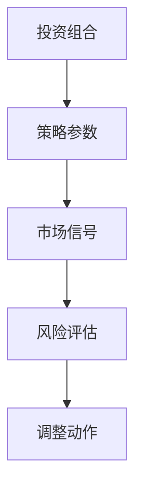
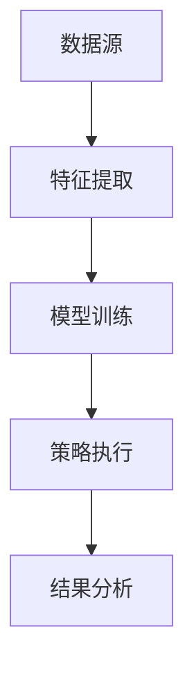

                 


# AI驱动的价值投资策略动态调整

> 关键词：AI，价值投资，动态调整，机器学习，金融策略

> 摘要：本文探讨了如何利用人工智能技术优化价值投资策略的动态调整。通过分析市场波动和投资者行为，结合机器学习算法，构建动态调整模型，实现投资组合的实时优化。本文从背景介绍、核心概念、算法原理、系统架构到项目实战，全面解析AI驱动的价值投资策略动态调整的实现与应用。

---

## 第一部分: AI驱动的价值投资策略动态调整概述

### 第1章: 价值投资与AI驱动的概述

#### 1.1 价值投资的基本概念
价值投资是一种以低于内在价值的价格买入优质资产的投资策略，其核心在于识别市场低估的股票，并长期持有，等待其价值回归。传统价值投资依赖于分析师的主观判断和经验，但在市场波动加剧和数据量激增的背景下，这种方法逐渐显露出效率低下、决策滞后等问题。

#### 1.2 AI在金融投资中的应用
人工智能技术在金融领域的应用日益广泛，从高频交易到风险评估，AI正在改变传统的投资方式。AI通过分析海量数据，捕捉市场中的微小趋势，帮助投资者做出更科学的决策。在价值投资中，AI不仅可以提高数据分析的效率，还能实时跟踪市场变化，为动态调整提供支持。

#### 1.3 动态调整策略的核心概念
动态调整策略是指根据市场环境的变化，实时优化投资组合的过程。与静态策略不同，动态调整能够快速响应市场波动，降低风险敞口，抓住潜在收益机会。AI驱动的动态调整策略通过机器学习算法，结合实时市场数据和投资者行为分析，实现智能化的投资决策。

---

## 第二部分: AI驱动的动态调整策略原理

### 第2章: 动态调整策略的背景与问题分析

#### 2.1 价值投资中的动态调整问题
传统的价值投资策略往往忽视市场短期波动，导致在极端市场条件下可能面临较大的损失。动态调整策略通过实时跟踪市场变化，优化投资组合，能够在保持长期收益目标的同时，降低短期波动带来的风险。

#### 2.2 数据驱动的动态调整
现代金融市场的数据量呈指数级增长，包括股价、成交量、新闻情绪、财务报表等。通过大数据分析，AI能够从海量数据中提取有用的信息，帮助投资者捕捉市场机会。动态调整策略依赖于高频数据和实时信息，确保投资组合能够及时适应市场变化。

#### 2.3 动态调整与投资收益的平衡
动态调整策略的核心在于在收益与风险之间找到平衡点。AI通过预测市场走势和评估风险，动态调整投资组合的构成，确保在不同市场环境下实现最优收益。

### 第3章: AI驱动的动态调整策略核心概念与联系

#### 3.1 动态调整策略的核心概念
动态调整策略的核心概念包括：
- **策略参数的动态调整**：根据市场变化实时调整投资组合的权重和配置。
- **市场信号的实时捕捉**：通过算法分析市场数据，识别潜在的趋势和机会。
- **风险与收益的动态平衡**：在不同市场条件下优化风险收益比。

#### 3.2 核心概念之间的联系
动态调整策略涉及多个核心概念，包括策略参数、市场信号和风险控制。通过分析这些概念之间的关系，可以构建一个完整的动态调整框架。例如，市场信号的变化会影响策略参数的调整，而风险控制则是动态调整的核心目标。

#### 3.3 实体关系图（ER图）


---

## 第三部分: 算法原理与数学模型

### 第4章: 动态调整算法的原理

#### 4.1 基于机器学习的动态调整模型
动态调整策略的核心是机器学习模型，常用的算法包括随机森林、支持向量机（SVM）和长短期记忆网络（LSTM）。这些算法能够从历史数据中学习市场规律，预测未来走势。

#### 4.2 算法的基本流程
动态调整算法的基本流程包括数据采集、特征提取、模型训练和策略执行。数据采集涉及市场数据和投资者行为数据，特征提取通过降维技术提取关键特征，模型训练基于历史数据，策略执行则是根据模型预测结果动态调整投资组合。

#### 4.3 算法的输入与输出
- **输入**：市场数据（如股价、成交量）、财务报表、新闻情绪等。
- **输出**：投资组合调整建议，包括买卖信号、权重调整等。

### 第5章: 数学模型与公式

#### 5.1 投资组合优化的数学模型
投资组合优化的目标是在给定的风险约束下，最大化预期收益。常用的优化模型包括均值-方差优化和风险中性优化。

#### 5.2 LSTM模型的数学公式
LSTM（长短期记忆网络）是一种特殊的RNN结构，用于捕捉时间序列数据中的长期依赖关系。LSTM的单元结构包括遗忘门、输入门和输出门。

$$ \text{遗忘门: } f_t = \sigma(W_f \cdot [h_{t-1}, x_t] + b_f) $$
$$ \text{输入门: } i_t = \sigma(W_i \cdot [h_{t-1}, x_t] + b_i) $$
$$ \text{输出门: } o_t = \sigma(W_o \cdot [h_{t-1}, x_t] + b_o) $$
$$ \text{遗忘单元: } \tilde{c}_t = \tanh(W_c \cdot [h_{t-1}, x_t] + b_c) $$
$$ \text{单元状态: } c_t = f_t \cdot c_{t-1} + i_t \cdot \tilde{c}_t $$
$$ \text{隐藏状态: } h_t = o_t \cdot \tanh(c_t) $$

---

## 第四部分: 系统分析与架构设计

### 第6章: 系统架构设计

#### 6.1 问题场景介绍
系统目标是构建一个基于AI的动态调整平台，帮助投资者实时优化投资组合。主要功能包括数据采集、模型训练、策略执行和结果分析。

#### 6.2 系统功能设计
- **数据采集模块**：从多个数据源获取市场数据。
- **特征提取模块**：提取关键特征，如技术指标和情绪分析。
- **模型训练模块**：训练机器学习模型，生成预测信号。
- **策略执行模块**：根据模型预测结果动态调整投资组合。

#### 6.3 系统架构图


---

## 第五部分: 项目实战

### 第7章: 项目实战

#### 7.1 环境配置
- **编程语言**：Python
- **深度学习框架**：TensorFlow或PyTorch
- **数据源**：Yahoo Finance API
- **工具库**：Pandas、Matplotlib、Scikit-learn

#### 7.2 核心代码实现
```python
import numpy as np
import pandas as pd
from sklearn.preprocessing import MinMaxScaler
from tensorflow.keras.models import Sequential
from tensorflow.keras.layers import LSTM, Dense, Dropout

# 数据预处理
data = pd.read_csv('stock_data.csv')
data = data['Close'].values
data = data.reshape(-1, 1)
scaler = MinMaxScaler()
data_scaled = scaler.fit_transform(data)

# 划分训练集和测试集
train_data = data_scaled[:1000]
test_data = data_scaled[1000:]

# 构建LSTM模型
model = Sequential()
model.add(LSTM(50, return_sequences=True, input_shape=(1, 1)))
model.add(Dropout(0.2))
model.add(LSTM(50, return_sequences=True))
model.add(Dropout(0.2))
model.add(Dense(1))
model.compile(loss='mean_squared_error', optimizer='adam')

# 训练模型
model.fit(train_data, train_data, epochs=50, batch_size=32)

# 预测测试数据
predictions = model.predict(test_data)
```

#### 7.3 案例分析
通过实际案例分析，展示AI驱动的动态调整策略在实际投资中的应用效果。例如，在2020年新冠疫情爆发期间，模型能够及时捕捉市场恐慌情绪，调整投资组合，减少损失。

---

## 第六部分: 最佳实践与小结

### 第8章: 最佳实践

#### 8.1 总结与回顾
AI驱动的价值投资策略动态调整是一种高效的投资方式，能够帮助投资者在复杂多变的市场中优化投资组合，实现长期收益目标。

#### 8.2 注意事项
- 数据质量对模型性能影响重大，需确保数据的准确性和完整性。
- 动态调整策略需要实时监控市场变化，及时应对突发事件。
- 风险控制是动态调整的核心，需合理设置止损点和止盈点。

#### 8.3 拓展阅读
建议读者深入研究强化学习在投资中的应用，探索更高级的动态调整策略。

---

## 作者：AI天才研究院（AI Genius Institute）

