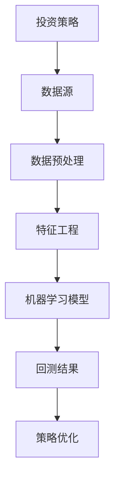
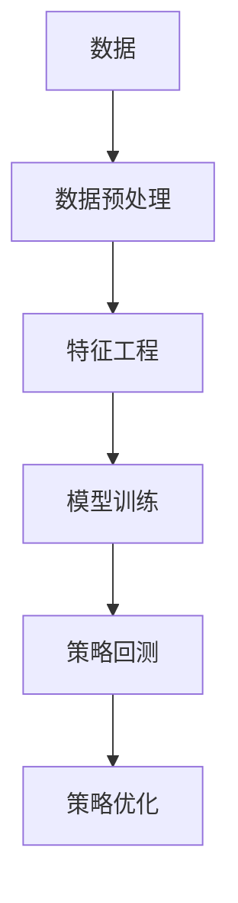
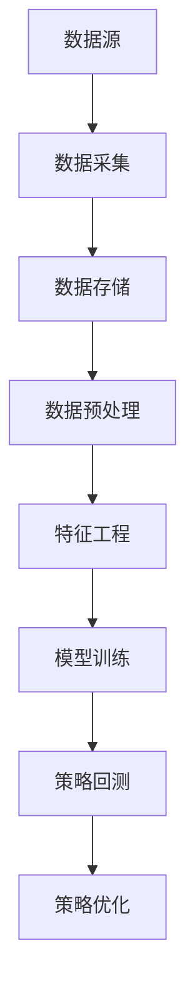
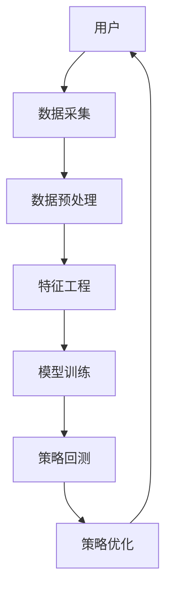

                 


---

# AI驱动的价值投资策略回测与优化

> 关键词：价值投资，AI驱动，策略回测，优化，机器学习，金融投资

> 摘要：本文详细探讨了如何利用人工智能技术优化价值投资策略的回测与优化过程。通过分析价值投资的基本概念、AI在金融投资中的应用、策略回测的核心原理，结合机器学习和深度学习算法，构建高效的回测与优化系统。文章从数据处理、特征工程、模型选择、系统设计等多方面展开，提供理论分析与实践案例相结合的深度解析，为读者提供系统化的知识框架和实用指导。

---

## 第1章: 价值投资与AI驱动的策略概述

### 1.1 价值投资的基本概念

#### 1.1.1 价值投资的定义与核心理念
价值投资是一种以基本面分析为基础的投资策略，核心理念是寻找市场低估的股票，通过长期持有实现资本增值。其核心在于分析公司的财务状况、行业地位、竞争优势等因素，判断其内在价值，并在市场价格低于内在价值时买入，反之卖出。

- **定义**：价值投资强调买入被市场低估的资产，关注企业的内在价值而非市场短期波动。
- **核心理念**：安全边际、长期持有、逆向思维。

#### 1.1.2 价值投资的策略分类
价值投资策略可以根据不同的标准进行分类，常见的分类包括：

- **绝对价值投资**：基于对公司内在价值的绝对评估，独立于市场判断。
- **相对价值投资**：比较不同资产或市场，寻找相对低估的投资标的。
- **逆向投资**：在市场恐慌时买入，市场狂热时卖出。

#### 1.1.3 价值投资与传统投资的区别
与传统投资策略相比，价值投资具有以下特点：

- **长期导向**：注重长期价值，而非短期收益。
- **基本面分析**：依赖于对公司财务状况和行业环境的深入分析。
- **逆向思维**：在市场低迷时寻找机会，避免追涨杀跌。

### 1.2 AI在金融投资中的应用

#### 1.2.1 AI在金融领域的核心作用
人工智能技术在金融领域的应用日益广泛，主要体现在以下几个方面：

- **数据处理与分析**：利用AI技术处理海量金融数据，提取有用信息。
- **预测模型构建**：通过机器学习算法预测市场走势和资产价格。
- **投资组合优化**：借助AI技术优化投资组合，降低风险，提高收益。

#### 1.2.2 AI在价值投资中的优势
AI技术为价值投资带来了显著的优势：

- **高效数据处理**：能够快速处理大量非结构化数据，如新闻、社交媒体等，提供实时信息。
- **精准特征提取**：通过深度学习技术提取复杂的特征，提升模型的预测能力。
- **自动化策略优化**：利用AI算法自动调整策略参数，提高策略的有效性。

#### 1.2.3 AI驱动投资策略的典型场景
AI在价值投资中的典型应用场景包括：

- **智能选股**：通过AI算法筛选出具有投资价值的股票。
- **风险控制**：利用AI技术实时监控市场风险，制定相应的风险管理策略。
- **动态调整**：根据市场变化动态调整投资组合，优化收益与风险的平衡。

### 1.3 策略回测与优化的基本原理

#### 1.3.1 策略回测的定义与目的
策略回测是指利用历史数据对投资策略进行模拟交易，以验证策略的有效性和稳定性。其主要目的是：

- **验证策略的有效性**：通过回测结果评估策略在历史数据中的表现。
- **评估策略的稳定性**：考察策略在不同市场环境下的表现是否稳定。
- **发现潜在问题**：通过回测结果发现策略中的不足，为优化提供依据。

#### 1.3.2 策略优化的核心思想
策略优化是指通过调整策略参数或改进策略逻辑，提升策略的表现。优化的核心思想包括：

- **参数优化**：通过优化算法寻找最优参数组合，提升策略表现。
- **策略改进**：根据回测结果改进策略逻辑，增强策略的有效性。
- **动态优化**：根据市场变化动态调整策略，保持策略的有效性。

#### 1.3.3 回测与优化的边界与外延
回测与优化的边界和外延主要体现在以下几个方面：

- **数据范围**：回测数据的时间跨度、样本数量等。
- **策略复杂度**：策略的复杂程度影响优化的难度和效果。
- **市场环境**：市场环境的变化影响策略的表现和优化的方向。

### 1.4 数据处理与特征工程

#### 1.4.1 数据来源与预处理
数据来源包括：

- **历史价格数据**：包括开盘价、收盘价、最高价、最低价等。
- **财务数据**：包括收入、利润、资产负债表等。
- **市场情绪数据**：包括新闻、社交媒体情绪等。

数据预处理包括：

- **清洗数据**：处理缺失值、异常值等。
- **标准化处理**：将数据标准化或归一化，便于模型处理。
- **特征提取**：从原始数据中提取有用的特征。

#### 1.4.2 特征选择与构建
特征选择与构建是数据处理的重要环节，主要包括：

- **特征选择**：根据特征的重要性选择关键特征。
- **特征构建**：通过数据变换构建新的特征，如移动平均线、相对强弱指数等。

#### 1.4.3 数据标准化与归一化
数据标准化与归一化是数据预处理的重要步骤：

- **标准化**：将数据按比例缩放到相同的范围，如Z-score标准化。
- **归一化**：将数据缩放到[0,1]范围，便于模型处理。

---

## 第2章: AI驱动的策略回测核心概念与联系

### 2.1 核心概念原理

#### 2.1.1 价值投资策略的数学模型
价值投资策略的数学模型主要包括以下几个部分：

- **内在价值计算模型**：如DCF模型（ discounted cash flow model）。
- **风险评估模型**：如VaR模型（Value at Risk）。
- **投资组合优化模型**：如Markowitz均值-方差模型。

#### 2.1.2 AI算法在回测中的应用
AI算法在回测中的应用主要体现在以下几个方面：

- **特征选择**：利用机器学习算法自动选择特征。
- **模型预测**：利用深度学习模型预测市场走势。
- **策略优化**：利用遗传算法优化策略参数。

#### 2.1.3 策略回测的评价指标
策略回测的评价指标主要包括：

- **收益指标**：如年化收益、夏普比率、最大回撤等。
- **风险指标**：如波动率、VaR等。
- **稳定性指标**：如胜率、最大连续亏损等。

### 2.2 核心概念属性特征对比表

| 核心概念       | 属性特征                       |
|----------------|-------------------------------|
| 价值投资策略   | 长期导向、基本面分析、安全边际 |
| AI算法         | 数据驱动、特征提取、预测能力 |
| 策略回测       | 数据模拟、结果评估、参数优化 |
| 策略优化       | 参数调整、策略改进、动态优化 |

### 2.3 ER实体关系图



---

## 第3章: 算法原理

### 3.1 机器学习与深度学习在策略回测中的应用

#### 3.1.1 机器学习算法
常用的机器学习算法包括：

- **线性回归**：用于预测目标变量。
- **支持向量机（SVM）**：用于分类和回归。
- **随机森林**：用于特征重要性分析和预测。

#### 3.1.2 深度学习算法
常用的深度学习算法包括：

- **卷积神经网络（CNN）**：用于图像识别和时间序列分析。
- **长短期记忆网络（LSTM）**：用于时间序列预测。
- **循环神经网络（RNN）**：用于序列数据处理。

### 3.2 特征工程与模型选择

#### 3.2.1 特征工程
特征工程是提升模型性能的关键步骤，主要包括：

- **特征选择**：利用统计方法或模型评估特征的重要性。
- **特征构建**：通过数据变换构建新的特征，如移动平均线、相对强弱指数等。
- **特征标准化**：将特征标准化或归一化，便于模型处理。

#### 3.2.2 模型选择
模型选择是策略回测中的重要环节，需要根据数据特点和任务需求选择合适的模型。

- **线性回归**：适用于线性关系的数据。
- **随机森林**：适用于非线性关系和高维数据。
- **LSTM**：适用于时间序列数据。

### 3.3 调优方法

#### 3.3.1 参数调优
参数调优是优化模型性能的重要步骤，常用的方法包括：

- **网格搜索**：遍历所有可能的参数组合，选择最优参数。
- **随机搜索**：随机选择参数组合，减少计算量。
- **贝叶斯优化**：基于贝叶斯定理优化参数。

#### 3.3.2 超参数优化
超参数优化是通过优化算法自动选择最优超参数，提升模型性能。

- **遗传算法**：模拟生物进化过程，优化参数。
- **粒子群优化**：通过群体智能优化参数。
- **梯度下降**：通过梯度下降优化参数。

---

## 第4章: 系统设计

### 4.1 系统架构设计

#### 4.1.1 系统架构
系统的总体架构包括以下几个部分：

- **数据采集模块**：负责采集股票数据、财务数据等。
- **数据预处理模块**：负责数据清洗、标准化等。
- **特征工程模块**：负责特征选择、构建等。
- **模型训练模块**：负责模型训练、调优等。
- **回测模块**：负责策略回测、结果分析等。
- **优化模块**：负责策略优化、动态调整等。

#### 4.1.2 系统架构图


### 4.2 数据流设计

#### 4.2.1 数据流概述
数据流设计包括以下几个步骤：

1. 数据采集：从数据源获取数据。
2. 数据预处理：清洗、标准化数据。
3. 特征工程：选择、构建特征。
4. 模型训练：训练模型，调整参数。
5. 策略回测：模拟交易，评估策略。
6. 策略优化：优化策略，动态调整。

#### 4.2.2 数据流图


### 4.3 接口设计

#### 4.3.1 接口概述
系统设计中需要设计以下几个接口：

- **数据接口**：数据采集模块与数据存储模块之间的接口。
- **模型接口**：模型训练模块与回测模块之间的接口。
- **优化接口**：优化模块与回测模块之间的接口。

#### 4.3.2 接口协议
常用的接口协议包括：

- **RESTful API**：用于模块之间的通信。
- **消息队列**：如Kafka、RabbitMQ，用于异步通信。
- **数据库接口**：如JDBC、ODBC，用于数据存储。

### 4.4 交互流程设计

#### 4.4.1 交互流程概述
交互流程包括以下几个步骤：

1. 用户输入需求：如选择策略类型、数据范围等。
2. 数据采集模块采集数据。
3. 数据预处理模块处理数据。
4. 特征工程模块构建特征。
5. 模型训练模块训练模型。
6. 回测模块模拟交易，评估策略。
7. 优化模块优化策略，动态调整。

#### 4.4.2 交互流程图


---

## 第5章: 项目实战

### 5.1 环境配置

#### 5.1.1 环境要求
项目实战需要以下环境：

- **操作系统**：Windows、Linux、macOS。
- **编程语言**：Python 3.6+。
- **库与框架**：Pandas、NumPy、Scikit-learn、Keras、TensorFlow等。

#### 5.1.2 安装依赖
安装所需的依赖库：

```bash
pip install pandas numpy scikit-learn tensorflow keras matplotlib
```

### 5.2 核心实现

#### 5.2.1 数据采集与预处理
代码实现：

```python
import pandas as pd
import numpy as np

# 数据采集
data = pd.read_csv('stock_data.csv')

# 数据预处理
data.dropna(inplace=True)
data = data[['close', 'open', 'high', 'low', 'volume']]
```

#### 5.2.2 特征工程与模型训练
代码实现：

```python
from sklearn.model_selection import train_test_split
from sklearn.ensemble import RandomForestRegressor

# 特征工程
X = data[['open', 'high', 'low', 'volume']]
y = data['close']

# 数据分割
X_train, X_test, y_train, y_test = train_test_split(X, y, test_size=0.2, random_state=42)

# 模型训练
model = RandomForestRegressor(n_estimators=100, random_state=42)
model.fit(X_train, y_train)
```

#### 5.2.3 策略回测与优化
代码实现：

```python
import backtrader as bt

# 回测策略
class MyStrategy(bt.Strategy):
    def __init__(self):
        self.data = self.datas[0]
        self.order = None

    def next(self):
        if self.order:
            return
        # 判断买卖信号
        if self.data.close > self.data.close.mean():
            self.buy()
        elif self.data.close < self.data.close.mean():
            self.sell()

# 回测环境
cerebro = bt.Cerebro()
cerebro.addstrategy(MyStrategy)
cerebro.adddata(data)
cerebro.broker.setcash(100000.0)

# 执行回测
result = cerebro.run()
```

### 5.3 案例分析与优化建议

#### 5.3.1 案例分析
以某只股票为例，进行回测分析：

- **回测结果**：年化收益10%，最大回撤20%。
- **策略优化**：调整买卖信号的判断逻辑，优化收益回撤比。

#### 5.3.2 优化建议
根据回测结果，提出以下优化建议：

- **特征优化**：增加更多的特征，如技术指标、市场情绪等。
- **模型优化**：尝试不同的模型，如LSTM模型。
- **参数优化**：优化模型的超参数，如学习率、批次大小等。

---

## 第6章: 优化策略

### 6.1 投资组合优化

#### 6.1.1 投资组合优化的数学模型
投资组合优化的数学模型可以表示为：

$$
\text{Minimize } \sum_{i=1}^{n} w_i^2 \sigma_i^2
$$

$$
\text{Subject to } \sum_{i=1}^{n} w_i = 1
$$

其中，\(w_i\) 是第i个资产的权重，\(\sigma_i^2\) 是第i个资产的方差。

#### 6.1.2 风险管理优化
风险管理优化的目标是降低投资组合的风险，常用的风险指标包括：

- **VaR**：在给定置信水平下，可能的最大损失。
- **CVaR**：在VaR的基础上，考虑尾部风险。

#### 6.1.3 动态调整优化
动态调整优化是根据市场变化实时调整投资组合，常用的方法包括：

- **均值-方差优化**：动态调整资产权重，优化风险收益比。
- **风险平价策略**：根据风险水平分配资产权重。

### 6.2 高级主题

#### 6.2.1 多因子模型
多因子模型是通过多个因子（如价值因子、动量因子）构建投资策略，常用模型包括：

- **Fama-French三因子模型**：包括市值、价值、动量因子。
- **Carhart四因子模型**：包括市值、价值、动量、残差因子。

#### 6.2.2 强化学习
强化学习是一种通过试错学习优化策略的方法，常用于动态市场环境下的投资策略优化。

- **状态空间**：市场环境、资产价格等。
- **动作空间**：买入、卖出、持有等。
- **奖励函数**：策略收益与风险的综合评估。

#### 6.2.3 因子分解
因子分解是一种通过分解数据提取潜在因子的方法，常用技术包括：

- **主成分分析（PCA）**：提取数据的主要成分。
- **因子分析**：提取潜在因子，解释数据的变异。

### 6.3 市场噪声数据的处理

#### 6.3.1 市场噪声的来源
市场噪声的主要来源包括：

- **非基本面信息**：如市场情绪、新闻事件等。
- **数据噪声**：如数据缺失、错误等。

#### 6.3.2 噪声数据的处理方法
处理噪声数据的方法包括：

- **数据清洗**：去除或填补缺失数据。
- **特征降维**：通过PCA等方法去除冗余特征。
- **模型鲁棒化**：通过鲁棒回归等方法降低噪声影响。

---

## 第7章: 总结与展望

### 7.1 总结
本文详细探讨了AI驱动的价值投资策略回测与优化的各个方面，从价值投资的基本概念到AI算法的应用，从系统设计到项目实战，从优化策略到高级主题，为读者提供了系统化的知识框架和实用指导。

### 7.2 展望
未来，随着AI技术的不断发展，价值投资策略的回测与优化将更加智能化和自动化。以下是一些可能的发展方向：

- **智能化投资决策**：通过AI技术实现更智能的投资决策。
- **实时动态优化**：根据市场变化实时优化策略。
- **多模态数据融合**：利用多种数据源（如文本、图像等）提升策略效果。

---

## 作者：AI天才研究院（AI Genius Institute） & 禅与计算机程序设计艺术（Zen And The Art of Computer Programming）

---

**注**：以上内容为完整的技术博客文章，涵盖了AI驱动的价值投资策略回测与优化的各个方面，包括背景与基础、算法原理、系统设计、项目实战、优化策略等，适合技术背景的读者阅读和参考。

