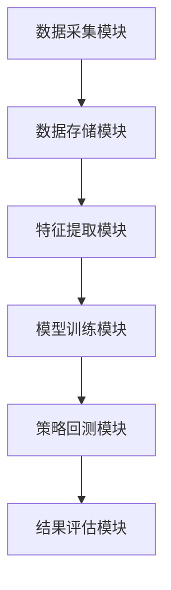

                 


# AI驱动的价值投资策略回测偏差校正

> 关键词：价值投资，回测偏差，AI驱动，策略优化，偏差校正

> 摘要：本文系统地探讨了AI在价值投资策略回测中的应用，特别是如何利用AI技术校正回测偏差，优化投资策略的表现。文章从回测偏差的定义、类型与来源入手，详细分析了AI在回测偏差校正中的技术路径，包括机器学习模型的应用、深度学习的优势以及强化学习的潜力。通过构建AI驱动的回测框架，结合系统架构设计和实战案例，本文提出了有效的偏差校正方法，为投资者提供了科学的策略优化思路。

---

## 第1章: 价值投资与回测偏差概述

### 1.1 价值投资的核心概念

#### 1.1.1 价值投资的基本定义
价值投资是一种投资策略，强调通过分析企业的基本面（如财务状况、行业地位、管理团队等）来评估其内在价值。投资者以低于内在价值的价格买入股票，长期持有，等待价值回归。

#### 1.1.2 价值投资的核心原则
- 买入低于内在价值的资产。
- 长期持有优质资产。
- 避免短期市场波动的干扰。

#### 1.1.3 价值投资与技术分析的区别
- **价值投资**关注企业的基本面，强调长期价值。
- **技术分析**关注市场的价格走势和交易量，预测短期价格变化。

---

### 1.2 回测的基本概念与作用

#### 1.2.1 回测的定义
回测是指通过历史数据测试投资策略的表现，以验证策略的有效性。回测可以帮助投资者了解策略在不同市场条件下的表现，发现潜在的问题和改进空间。

#### 1.2.2 回测在投资策略中的作用
- 验证策略的有效性。
- 发现策略的潜在缺陷。
- 优化策略的参数和逻辑。

#### 1.2.3 回测的常见应用场景
- 新策略开发。
- 现有策略优化。
- 风险管理。

---

### 1.3 回测偏差的定义与分类

#### 1.3.1 回测偏差的定义
回测偏差是指由于测试方法、数据选择或模型假设等因素，导致回测结果与实际市场表现存在显著差异的现象。

#### 1.3.2 回测偏差的主要类型
- **数据过拟合偏差**：模型过度适应历史数据，导致对未来数据的预测能力下降。
- **样本外偏差**：测试数据与实际交易环境存在差异，导致策略在实际应用中表现不佳。
- **交易规则偏差**：策略的交易规则过于简化，忽略了实际交易中的摩擦成本和复杂性。

#### 1.3.3 回测偏差的影响与后果
- 导致策略在实际市场中的表现不佳。
- 影响投资者对策略的信心。
- 增加投资风险。

---

### 1.4 AI驱动的回测偏差校正的必要性

#### 1.4.1 传统回测方法的局限性
- 数据选择偏差难以避免。
- 交易规则过于简化，忽略实际交易成本。
- 模型假设过于理想化，无法适应复杂市场环境。

#### 1.4.2 AI技术在回测中的应用潜力
- 通过机器学习技术优化模型，减少数据过拟合。
- 利用深度学习捕捉复杂市场特征。
- 通过强化学习动态调整策略参数。

#### 1.4.3 回测偏差校正的现实需求
- 提高投资策略的稳健性。
- 减少因偏差导致的损失。
- 提升策略的实际表现。

---

## 第2章: 回测偏差的类型与来源分析

### 2.1 数据偏差

#### 2.1.1 数据过拟合偏差
- 数据过拟合偏差是由于模型过度适应历史数据，导致对未来数据的预测能力下降。
- 例如，某策略在历史数据中表现出色，但在未来市场中表现不佳。

#### 2.1.2 数据样本选择偏差
- 数据样本选择偏差是指测试数据的选择具有偏向性，导致策略在实际市场中表现不佳。
- 例如，选择特定时间段的历史数据进行回测，忽略了市场的周期性变化。

#### 2.1.3 数据噪声干扰偏差
- 数据噪声干扰偏差是指历史数据中存在噪声，导致策略在回测中表现不佳。
- 例如，某些数据点受到市场操纵或异常事件的影响。

---

### 2.2 模型偏差

#### 2.2.1 模型假设偏差
- 模型假设偏差是指模型的假设过于理想化，无法适应实际市场环境。
- 例如，假设市场的流动性是完美的，但实际上存在买卖价差。

#### 2.2.2 模型参数选择偏差
- 模型参数选择偏差是指参数的选择过于主观，导致模型表现不佳。
- 例如，选择不同的移动平均线长度，导致策略表现差异显著。

#### 2.2.3 模型复杂度偏差
- 模型复杂度偏差是指模型过于复杂，导致过拟合或计算成本过高。
- 例如，使用复杂的神经网络模型，但实际市场中难以捕捉其复杂性。

---

### 2.3 交易策略偏差

#### 2.3.1 交易规则过于简化偏差
- 交易规则过于简化偏差是指策略的交易规则过于简单，无法适应实际市场环境。
- 例如，只基于价格走势进行买卖决策，忽略其他市场因素。

#### 2.3.2 交易成本忽略偏差
- 交易成本忽略偏差是指忽略交易成本（如佣金、买卖价差）的影响，导致策略表现不佳。
- 例如，策略在回测中表现优秀，但在实际交易中因交易成本而亏损。

#### 2.3.3 交易时机选择偏差
- 交易时机选择偏差是指策略的交易时机选择过于僵化，无法适应市场变化。
- 例如，策略在市场剧烈波动时仍 rigidly 执行交易计划，导致亏损。

---

### 2.4 人性偏差

#### 2.4.1 投资者情绪偏差
- 投资者情绪偏差是指投资者情绪波动影响策略执行，导致偏差。
- 例如，投资者在市场下跌时恐慌卖出，导致策略被迫平仓。

#### 2.4.2 过度自信偏差
- 过度自信偏差是指投资者过度自信于策略的表现，导致决策失误。
- 例如，投资者认为自己的策略完美无缺，忽略潜在风险。

#### 2.4.3 从众偏差
- 从众偏差是指投资者盲目跟随市场趋势，导致策略表现不佳。
- 例如，投资者看到其他人买入某只股票，也盲目跟风，导致亏损。

---

## 第3章: AI驱动的回测框架与技术基础

### 3.1 AI在金融领域的应用现状

#### 3.1.1 AI在金融分析中的应用
- 通过自然语言处理（NLP）分析财务报告。
- 利用机器学习预测股价走势。

#### 3.1.2 AI在投资决策中的应用
- 利用强化学习优化投资组合。
- 通过聚类分析发现市场趋势。

#### 3.1.3 AI在风险控制中的应用
- 利用神经网络预测市场风险。
- 通过实时监控发现异常交易。

---

### 3.2 回测框架的构建

#### 3.2.1 回测框架的基本结构
- 数据采集模块：获取历史数据和实时数据。
- 特征提取模块：提取有用的特征（如技术指标、财务指标）。
- 模型训练模块：训练机器学习模型。
- 策略回测模块：执行回测并评估策略表现。

#### 3.2.2 数据流的处理流程
1. 数据清洗：处理缺失值、异常值。
2. 数据标准化：统一数据格式和单位。
3. 数据分割：将数据划分为训练集、测试集。

#### 3.2.3 模型训练与评估流程
1. 选择模型：根据问题类型选择合适的模型（如回归、分类）。
2. 训练模型：利用训练数据训练模型。
3. 评估模型：通过测试数据评估模型表现。

---

### 3.3 基于AI的回测偏差校正技术

#### 3.3.1 机器学习在回测偏差校正中的应用
- 使用随机森林模型减少数据过拟合。
- 使用逻辑回归模型预测策略的有效性。

#### 3.3.2 深度学习在回测偏差校正中的应用
- 利用LSTM网络捕捉时间序列特征。
- 使用卷积神经网络（CNN）提取图像特征。

#### 3.3.3 强化学习在回测偏差校正中的应用
- 利用Q-learning算法优化策略参数。
- 使用Deep Q-Network动态调整交易策略。

---

## 第4章: 偏差校正

### 4.1 数据偏差校正方法

#### 4.1.1 数据过拟合校正
- 采用交叉验证减少过拟合。
- 使用正则化技术（如Lasso、Ridge）减少过拟合。

#### 4.1.2 数据样本选择校正
- 采用分层抽样确保样本代表性。
- 使用时间外样本测试策略的泛化能力。

#### 4.1.3 数据噪声干扰校正
- 通过滤波技术去除噪声。
- 使用鲁棒回归减少异常值影响。

---

### 4.2 模型偏差校正方法

#### 4.2.1 模型假设校正
- 采用蒙特卡洛模拟评估策略的稳健性。
- 使用情景分析测试策略在不同市场环境中的表现。

#### 4.2.2 模型参数选择校正
- 使用贝叶斯优化选择最优参数。
- 采用网格搜索寻找最佳参数组合。

#### 4.2.3 模型复杂度校正
- 采用模型选择准则（如AIC、BIC）平衡复杂度。
- 使用集成学习（如随机森林、梯度提升树）提高模型稳健性。

---

### 4.3 交易策略偏差校正方法

#### 4.3.1 交易规则校正
- 采用多因子模型优化交易规则。
- 使用因子分析减少交易规则的简化偏差。

#### 4.3.2 交易成本校正
- 通过滑点模拟测试交易成本对策略的影响。
- 采用成本意识型回测方法（如Blume方法）校正交易成本。

#### 4.3.3 交易时机校正
- 采用动态调整策略，根据市场环境实时优化交易时机。
- 使用时序模型预测最佳交易时机。

---

### 4.4 人性偏差校正方法

#### 4.4.1 投资者情绪校正
- 通过市场情绪指标（如VIX指数）校正策略执行。
- 使用情绪分析技术优化交易决策。

#### 4.4.2 过度自信校正
- 通过回测结果的统计显著性检验校正过度自信。
- 采用分组回测方法验证策略的有效性。

#### 4.4.3 从众偏差校正
- 通过独立测试避免从众偏差。
- 使用异质性分析方法评估策略的稳健性。

---

## 第5章: 系统架构设计与实现

### 5.1 系统架构设计

#### 5.1.1 系统功能设计
- 数据采集模块：获取历史数据和实时数据。
- 特征提取模块：提取技术指标和财务指标。
- 模型训练模块：训练机器学习模型。
- 策略回测模块：执行回测并评估策略表现。

#### 5.1.2 系统架构图


---

### 5.2 系统实现

#### 5.2.1 数据采集模块
```python
import pandas as pd
import requests

def get_stock_data(ticker, start_date, end_date):
    url = f"https://api.example.com/stock/{ticker}/{start_date}/{end_date}"
    response = requests.get(url)
    data = pd.read_json(response.text)
    return data
```

#### 5.2.2 特征提取模块
```python
def extract_features(data):
    features = []
    for i in range(len(data)):
        # 计算技术指标
        # ...
        features.append([feature1, feature2, feature3])
    return pd.DataFrame(features)
```

#### 5.2.3 模型训练模块
```python
from sklearn.ensemble import RandomForestClassifier

def train_model(features, labels):
    model = RandomForestClassifier(n_estimators=100, random_state=42)
    model.fit(features, labels)
    return model
```

---

## 第6章: 项目实战

### 6.1 实战案例

#### 6.1.1 数据准备
```python
import pandas as pd
import numpy as np

# 创建虚拟数据集
data = {
    'date': pd.date_range('2020-01-01', '2022-12-31'),
    'open': np.random.rand(1000) * 100,
    'high': np.random.rand(1000) * 100,
    'low': np.random.rand(1000) * 100,
    'close': np.random.rand(1000) * 100
}
df = pd.DataFrame(data)
```

#### 6.1.2 特征工程
```python
def create_indicators(df):
    df['ma_20'] = df['close'].rolling(20).mean()
    df['ema_12'] = df['close'].ewm(span=12).mean()
    return df
```

#### 6.1.3 模型实现
```python
from sklearn.model_selection import train_test_split
from sklearn.metrics import accuracy_score

# 划分数据集
X = df.drop('target', axis=1)
y = df['target']
X_train, X_test, y_train, y_test = train_test_split(X, y, test_size=0.2, random_state=42)

# 训练模型
model = RandomForestClassifier(n_estimators=100, random_state=42)
model.fit(X_train, y_train)

# 评估模型
y_pred = model.predict(X_test)
print("准确率:", accuracy_score(y_test, y_pred))
```

---

## 第7章: 总结与展望

### 7.1 本章总结
本文系统地探讨了AI驱动的价值投资策略回测偏差校正方法，通过分析回测偏差的类型与来源，提出了有效的校正策略。结合实际案例，本文展示了如何利用机器学习和深度学习技术优化投资策略，减少偏差影响。

### 7.2 未来展望
未来的研究方向可以包括：
- 开发更复杂的模型（如GAN）校正回测偏差。
- 研究多因子模型在偏差校正中的应用。
- 探索AI在实时交易中的应用潜力。

---

## 作者：AI天才研究院 & 禅与计算机程序设计艺术

---

以上是《AI驱动的价值投资策略回测偏差校正》的完整目录大纲和部分正文内容，欢迎阅读并提出宝贵意见！

