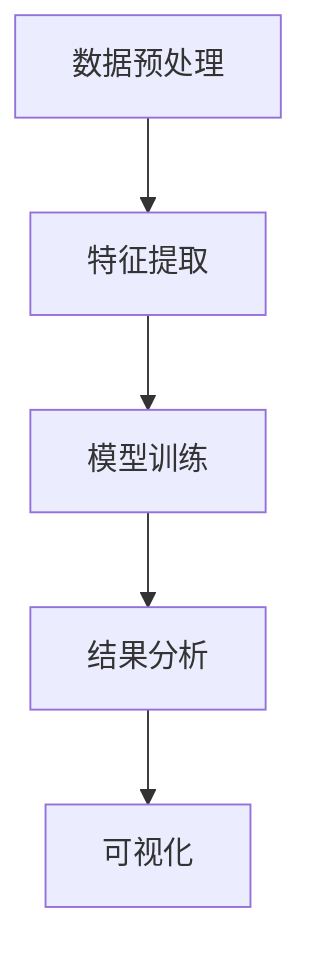
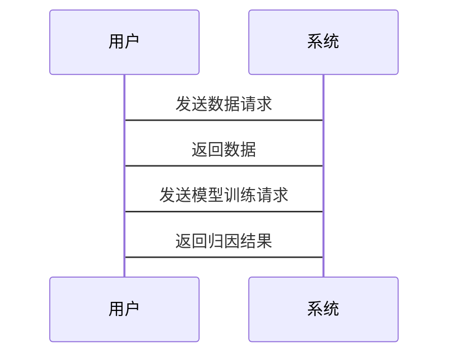

                 


# AI驱动的价值投资策略归因分析

> 关键词：AI，价值投资，归因分析，投资策略，算法，系统架构

> 摘要：本文旨在探讨AI技术在价值投资策略归因分析中的应用，通过系统化的分析流程，结合算法原理和实际案例，深入剖析AI驱动的价值投资策略的实现路径和优化方法，为投资者提供科学的决策支持。

---

## 第一章: 价值投资与AI归因分析的背景

### 1.1 价值投资的定义与核心理念
- 价值投资是一种基于基本面分析的投资策略，旨在通过识别市场低估的资产来获取超额收益。
- 核心理念包括：安全边际、长期视角、逆向思维。
- 传统价值投资依赖于分析师的经验和主观判断，而AI技术的引入为价值投资提供了更高效、更精准的工具。

### 1.2 AI技术在金融领域的应用前景
- AI技术在金融领域的应用包括：股票预测、风险评估、投资组合优化等。
- AI的三大优势：数据处理能力、模式识别能力和实时分析能力。
- 价值投资领域中，AI可以用于筛选优质标的、评估内在价值、优化投资组合。

### 1.3 归因分析的重要性
- 归因分析是将投资收益分解为各个因素贡献的过程，有助于识别策略的有效性。
- 传统归因分析的局限性：主观性较强、难以量化多因素影响。
- AI技术在归因分析中的优势：数据驱动、自动化、高精度。

---

## 第二章: 价值投资策略归因分析的核心概念

### 2.1 价值投资的核心要素
| 核心要素 | 描述 |
|----------|------|
| 内在价值 | 资产的真实价值，基于基本面分析得出。 |
| 安全边际 | 资产市场价格与内在价值的差距，确保投资的安全性。 |
| 长期视角 | 以长期持有的方式获取复利收益。 |

### 2.2 AI驱动的归因分析原理
- 归因分析的流程：数据收集 → 模型训练 → 结果分析。
- AI在归因分析中的作用：提取数据特征、构建预测模型、量化因素贡献。

### 2.3 归因分析的关键指标
- 收益分解指标：如因子贡献、行业贡献、个股贡献。
- 风险调整后收益指标：如夏普比率、最大回撤。
- 归因分析的可视化工具：如热力图、仪表盘。

---

## 第三章: 价值投资策略归因分析的算法原理

### 3.1 算法概述
- 常用的归因分析算法：线性回归、聚类分析、时间序列分析。
- AI算法的核心：特征提取、模型训练、结果解释。

### 3.2 算法实现流程


### 3.3 算法实现的数学模型
#### 线性回归模型
$$ y = \beta_0 + \beta_1x_1 + \beta_2x_2 + ... + \beta_nx_n + \epsilon $$

#### 聚类分析模型
- 输入：股票价格数据。
- 输出：股票的聚类结果，用于识别相似的资产。

#### 时间序列分析模型
$$ ARIMA(p, d, q) $$

### 3.4 算法实现的代码示例
```python
import pandas as pd
from sklearn.linear_model import LinearRegression

# 数据加载与预处理
data = pd.read_csv('value_invest.csv')
X = data[['市盈率', '市净率', 'ROE']]
y = data['超额收益']

# 模型训练
model = LinearRegression()
model.fit(X, y)

# 结果分析
coefficients = pd.DataFrame({'特征': X.columns, '系数': model.coef_})
print(coefficients)
```

---

## 第四章: 价值投资策略归因分析的系统架构设计

### 4.1 系统功能设计
| 模块 | 功能描述 |
|------|----------|
| 数据采集 | 从数据库中获取股票数据、财务数据等。 |
| 数据处理 | 数据清洗、特征工程、数据标准化。 |
| 模型训练 | 训练归因分析模型，生成归因结果。 |
| 结果分析 | 解释模型输出，生成可视化报告。 |

### 4.2 系统架构设计


### 4.3 系统接口设计
- 数据接口：RESTful API，如`/api/data`。
- 模型接口：`/api/model`，接收特征数据，返回归因结果。
- 结果接口：`/api/results`，返回可视化报告。

### 4.4 系统交互


---

## 第五章: 项目实战与经验分享

### 5.1 环境安装
- 安装Python、Pandas、Scikit-learn等依赖库。

### 5.2 核心代码实现
```python
import pandas as pd
from sklearn.linear_model import LinearRegression

# 数据加载
data = pd.read_csv('value_invest.csv')

# 特征选择
features = ['市盈率', '市净率', 'ROE']
target = '超额收益'

# 模型训练
model = LinearRegression()
model.fit(data[features], data[target])

# 结果解释
coefficients = pd.DataFrame({'特征': features, '系数': model.coef_})
print(coefficients)
```

### 5.3 实际案例分析
- 以某只股票为例，展示如何通过AI技术进行归因分析，识别其超额收益的主要来源。

### 5.4 经验总结
- 数据质量至关重要，需进行充分的特征工程。
- 模型的选择应结合实际业务需求。
- 结果解释需结合市场背景，避免过度依赖模型。

---

## 第六章: 最佳实践与未来展望

### 6.1 最佳实践
- 数据层面：确保数据的完整性和时效性。
- 模型层面：结合多种算法，构建稳健的归因模型。
- 业务层面：将AI归因分析与投资决策紧密结合。

### 6.2 未来展望
- AI技术的进一步发展，如深度学习在归因分析中的应用。
- 多因子模型的优化，提升归因分析的精度。
- 个性化投资策略的实现，满足不同投资者的需求。

---

## 作者：AI天才研究院 & 禅与计算机程序设计艺术

---

通过本文的系统化分析，我们深入探讨了AI技术在价值投资策略归因分析中的应用，从理论到实践，为投资者提供了科学的决策支持。未来，随着AI技术的不断发展，价值投资策略归因分析将更加精准、高效，为投资者创造更大的价值。

