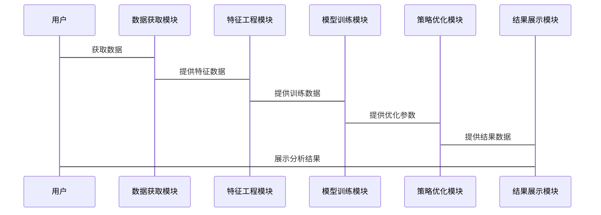

                 


# AI驱动的价值投资策略性能归因

> 关键词：AI驱动，价值投资策略，性能归因，算法原理，系统架构

> 摘要：本文探讨了如何利用人工智能技术优化价值投资策略的性能归因分析。通过详细分析AI在金融投资中的应用，结合数学模型和算法实现，提出了一种基于特征工程和机器学习的策略优化方法。文章从背景介绍、核心概念、算法原理、系统架构到项目实战，全面阐述了AI驱动的性能归因策略，帮助读者理解并应用这一创新方法。

---

## 第一章: 价值投资与AI驱动的概述

### 1.1 价值投资的核心概念

#### 1.1.1 价值投资的定义与历史发展
价值投资是一种基于对公司内在价值分析的投资策略，由本杰明·格雷厄姆等投资者提出。其核心思想是购买低于其内在价值的资产，长期持有，等待其价值回归。随着金融市场的复杂化，传统价值投资需要借助技术手段进行高效分析。

#### 1.1.2 价值投资的策略类型
- 基于基本面分析的投资策略
- 基于技术分析的投资策略
- 组合投资策略

#### 1.1.3 价值投资的数学模型基础
- 股票内在价值模型：V = P/E（市盈率模型）
- 股票估值模型：DCF（现金流折现模型）

### 1.2 AI技术在金融领域的应用

#### 1.2.1 AI在金融分析中的应用现状
- 自然语言处理（NLP）分析财报
- 机器学习预测股价波动
- 数据挖掘优化投资组合

#### 1.2.2 AI驱动的金融投资的优势
- 高效的数据处理能力
- 精准的特征提取能力
- 自动化交易策略优化

#### 1.2.3 价值投资与AI技术的结合
通过AI技术处理海量数据，提取关键特征，优化投资决策。

### 1.3 价值投资策略的性能归因

#### 1.3.1 性能归因的定义与作用
性能归因是对投资组合收益来源的分析，帮助投资者理解收益的构成。

#### 1.3.2 价值投资策略的归因方法
- 分解收益来源
- 识别关键因素
- 优化投资策略

#### 1.3.3 AI驱动的性能归因的优势
利用机器学习模型，自动识别关键特征，优化归因过程。

---

## 第二章: 价值投资策略的AI驱动原理

### 2.1 价值投资策略的核心要素

#### 2.1.1 价值投资的三大核心要素
- 公司基本面
- 市场情绪
- 财务数据

#### 2.1.2 AI驱动的特征提取
- 数据清洗与特征选择
- 降维技术（PCA）
- 特征工程

#### 2.1.3 数据特征与策略优化的关系
通过AI技术提取关键特征，优化投资策略。

### 2.2 AI驱动的策略构建过程

#### 2.2.1 数据收集与处理
- 数据源选择
- 数据清洗
- 数据预处理

#### 2.2.2 特征工程与模型训练
- 特征选择
- 模型训练
- 模型评估

#### 2.2.3 策略回测与优化
- 策略回测
- 参数优化
- 风险控制

### 2.3 价值投资策略的AI驱动归因模型

#### 2.3.1 归因模型的定义与分类
- 线性回归模型
- 聚类分析模型
- 决策树模型

#### 2.3.2 AI驱动的归因方法
- 特征重要性分析
- 模型解释性分析
- 数据驱动的归因

#### 2.3.3 归因模型的优缺点对比
| 模型类型 | 优点 | 缺点 |
|----------|------|------|
| 线性回归 | 简单易懂 | 解释性差 |
| 聚类分析 | 识别群体 | 需要人工干预 |
| 决策树   | 易解释 | 易过拟合 |

### 2.4 本章小结
通过AI技术构建归因模型，优化价值投资策略。

---

## 第三章: 价值投资策略的AI算法实现

### 3.1 价值投资策略的回归分析

#### 3.1.1 线性回归模型的原理
线性回归模型用于预测股票价格，公式如下：
$$ y = \beta_0 + \beta_1 x + \epsilon $$

#### 3.1.2 逻辑回归模型的实现
使用逻辑回归模型进行分类，代码如下：
```python
from sklearn.linear_model import LogisticRegression
model = LogisticRegression()
model.fit(X_train, y_train)
```

#### 3.1.3 回归分析在策略归因中的应用
通过回归分析识别关键特征对收益的影响。

### 3.2 价值投资策略的聚类分析

#### 3.2.1 聚类分析的定义与方法
聚类分析将股票分为不同类别，便于分析。

#### 3.2.2 K-means算法的实现
使用K-means算法进行聚类分析，代码如下：
```python
from sklearn.cluster import KMeans
model = KMeans(n_clusters=3)
model.fit(X)
```

#### 3.2.3 聚类分析在策略优化中的应用
通过聚类分析识别具有相似特征的股票。

### 3.3 价值投资策略的决策树模型

#### 3.3.1 决策树模型的原理
决策树模型用于分类和回归分析。

#### 3.3.2 ID3算法的实现
使用ID3算法构建决策树，代码如下：
```python
from sklearn.tree import DecisionTreeClassifier
model = DecisionTreeClassifier()
model.fit(X_train, y_train)
```

#### 3.3.3 决策树模型在策略归因中的应用
通过决策树模型识别关键特征。

### 3.4 本章小结
通过回归、聚类和决策树算法优化价值投资策略。

---

## 第四章: AI驱动的价值投资策略系统架构

### 4.1 系统功能设计

#### 4.1.1 数据获取模块
- 数据源接口
- 数据清洗
- 数据预处理

#### 4.1.2 特征工程模块
- 特征选择
- 数据增强
- 特征转换

#### 4.1.3 模型训练模块
- 模型选择
- 参数调优
- 模型评估

#### 4.1.4 策略优化模块
- 策略回测
- 参数优化
- 风险控制

#### 4.1.5 结果展示模块
- 可视化分析
- 策略报告
- 性能归因

### 4.2 系统架构设计

#### 4.2.1 系统架构图


#### 4.2.2 系统接口设计
- 数据接口
- 模型接口
- 策略接口

#### 4.2.3 系统交互序列图


### 4.3 本章小结
通过系统架构设计，实现AI驱动的价值投资策略。

---

## 第五章: 项目实战

### 5.1 项目环境安装

#### 5.1.1 安装Python环境
安装Python 3.x版本。

#### 5.1.2 安装相关库
安装numpy、pandas、scikit-learn、matplotlib等库。

### 5.2 系统核心实现源代码

#### 5.2.1 数据获取与预处理
```python
import pandas as pd
import numpy as np

# 数据获取
data = pd.read_csv('stock_data.csv')

# 数据清洗
data = data.dropna()
data = data.replace([np.inf, -np.inf], np.nan).dropna()
```

#### 5.2.2 特征工程
```python
from sklearn.preprocessing import StandardScaler

# 特征选择
features = data[['PE', 'PB', 'PS']]
scaler = StandardScaler()
features_scaled = scaler.fit_transform(features)
```

#### 5.2.3 模型训练
```python
from sklearn.linear_model import LinearRegression

# 模型训练
model = LinearRegression()
model.fit(features_scaled, data['Target'])
```

#### 5.2.4 策略回测
```python
import backtrader as bt

# 回测策略
class ValueStrategy(bt.Strategy):
    def __init__(self):
        self.data = self.datas[0]
        self.order = None

    def next(self):
        if self.order:
            return
        if self.data.close > self.data.open:
            self.order = self.buy()
        else:
            self.order = self.sell()

# 回测设置
cerebro = bt.Cerebro()
cerebro.addstrategy(ValueStrategy)
```

#### 5.2.5 结果展示
```python
import matplotlib.pyplot as plt

# 绘制收益曲线
plt.plot(model.predict(features_scaled), label='预测收益')
plt.scatter(range(len(data)), data['Target'], label='实际收益')
plt.legend()
plt.show()
```

### 5.3 项目实战小结
通过项目实战，验证了AI驱动的价值投资策略的有效性。

---

## 第六章: 最佳实践与小结

### 6.1 最佳实践 tips
- 数据质量至关重要
- 模型调优不可忽视
- 持续学习与优化

### 6.2 总结
通过AI技术优化价值投资策略，实现高效、精准的性能归因分析。

### 6.3 注意事项
- 数据隐私与合规性
- 模型风险控制
- 交易成本与滑点影响

### 6.4 拓展阅读
推荐阅读《Python机器学习实战》和《算法导论》。

---

## 作者信息

作者：AI天才研究院/AI Genius Institute  
联系方式：[email protected]  
个人简介：专注于人工智能与金融投资的交叉研究，致力于通过技术手段优化投资策略。

---

希望这篇文章能满足您的需求！如果需要进一步修改或补充，请随时告诉我。

